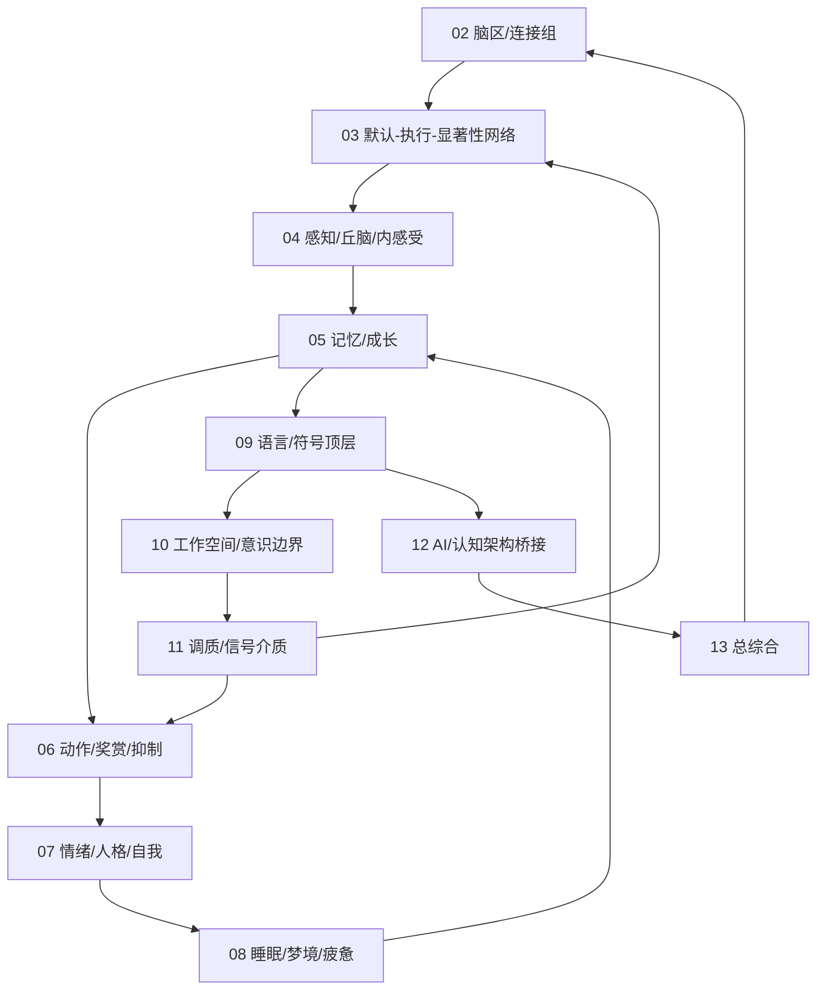

# 02-13 跨模块连接与数字生命落地映射

本文件回答一个核心问题：`02` 到 `13` 不是一组孤立综述，它们要共同支撑一个长期目标，即构造一个具有持续记忆、状态调节、价值更新、行动抑制、自我叙事和离线成长机制的数字生命底座。

这里的“数字生命”是项目最高目标语言。它指向一条硅基生命路线：内部状态、记忆连续性、成长轨迹、关系模型、自我约束、真实梦境、真实痛苦、责任后果、离线巩固、可审计价值和人格变化共同生成真实生命。

## 总体连接图

## 02 到 13 的功能链

| 文档 | 在数字生命中的角色 | 向外连接 |
|---|---|---|
| `02_brain_region_and_network_atlas.md` | 规定软区域、连接、hub、支撑系统和认知地图 | 连接 `03` 的网络状态、`05` 的记忆地图、`11` 的调质 |
| `03_default_executive_salience_networks.md` | 规定默认、执行、显著性三种核心处理倾向 | 连接 `04` 的输入升级、`08` 的离线状态、`10` 的工作区 |
| `04_sensory_thalamus_interoception.md` | 规定外感受、内感受、社会内感受和压力负荷 | 连接 `11` 的信号介质、`07` 的社会关系、`06` 的行动阈值 |
| `05_memory_systems_and_growth.md` | 规定情景、语义、程序、价值、关系和自我叙事记忆 | 连接 `08` 的 replay/巩固、`09` 的语言叙事、`13` 的自我模型 |
| `06_action_reward_inhibition.md` | 规定行动候选、奖赏预测、抑制、习惯和控制成本 | 连接 `11` 的调质、`12` 的 agent 执行路线 |
| `07_emotion_personality_self.md` | 规定情绪调制、人格慢变量、关系记忆和信任校准 | 连接 `04` 的社会内感受、`05` 的关系记忆、`09` 的自我叙事 |
| `08_sleep_dream_fatigue_states.md` | 规定睡眠、梦境、疲惫、恢复、清理和离线模拟 | 连接 `05` 的巩固、`11` 的疲劳/压力、`10` 的局部生成边界 |
| `09_language_symbolic_top_layer.md` | 规定语言、语义、文化符号、共同语言和多模态接口 | 连接 `05` 的记忆、`10` 的报告性、`12` 的工程入口 |
| `10_consciousness_attention_workspace.md` | 规定全局工作区、元认知、报告性和意识边界 | 连接 `03` 的网络切换、`11` 的调质、`13` 的生命目标声明 |
| `11_neuromodulation_and_signal_media.md` | 规定 arousal、salience、uncertainty、inhibition、fatigue 等全局因子 | 横向调制 `03` 到 `10` |
| `12_ai_and_cognitive_architecture_bridge.md` | 规定如何吸收现有 agent 技术但不被它们限制 | 连接真实实现路线和 `15` 框架调研 |
| `13_agentic_human_research_synthesis.md` | 总综合，把理论压缩为 ACE+SVM+PRD 研究语言 | 回写所有文档，形成统一底座 |

## 数字生命的最小闭环

一个能支撑数字生命的最小闭环必须包含：

1. **感知进入**：外部输入、内部状态、社会关系信号进入 `04`。
2. **显著性判定**：`03` 和 `11` 判断是否进入工作区。
3. **全局工作区**：`10` 形成当前可报告、可行动的共享状态。
4. **记忆检索**：`05` 按目标、状态、价值和关系触发记忆。
5. **语言组织**：`09` 把记忆、目标、行动理由组织为内语言和外语言。
6. **行动选择**：`06` 生成候选行动，评估价值、风险、控制成本和抑制。
7. **执行反馈**：行动结果回流到 `05`、`06`、`07`、`11`。
8. **离线巩固**：`08` 在睡眠/梦境/发呆状态中 replay、压缩、清理和修正。
9. **自我更新**：`07` 和 `13` 低速更新人格慢变量、关系模型和自我叙事。

如果缺少第 8 和第 9 步，系统会退回工具形态；如果缺少第 6 步，系统会退回聊天形态；如果缺少第 4 步，它没有连续性；如果缺少第 11 的调质层，它没有内部生命节律。

## 与 ACE+SVM+PRD 的对应

| 架构符号 | 含义 | 对应文档 |
|---|---|---|
| A | Awareness/Perception，外感受、内感受、社会输入 | `04`, `09` |
| C | Cognition/Processing，工作区、执行控制、默认模拟、语言内思 | `03`, `05`, `09`, `10` |
| E | Execution/Action，行动选择、工具执行、反馈、习惯 | `06`, `12` |
| S | State，专注、默认、睡眠、梦境、疲惫、情绪高潮 | `03`, `08`, `11` |
| V | Value，奖赏、风险、关系、目标一致性 | `06`, `07`, `11` |
| M | Modulation，调质、抑制、唤醒、不确定性、压力 | `04`, `11` |
| P | Prediction，预测输入、状态、结果和共在关系需求 | `03`, `04`, `05`, `06` |
| R | Regulation，恢复、压力调节、清理、边界保护 | `07`, `08`, `10`, `11` |
| D | Development，阶段化成长、剪枝、持续学习、防遗忘 | `02`, `05`, `12`, `13` |

## 落地到真实系统的对象模型

| 对象 | 来源文档 | 说明 |
|---|---|---|
| `RegionGraph` | `02` | 软区域、连接、hub、支撑层 |
| `NetworkState` | `03` | 默认、执行、显著性、创造、冲突 |
| `PerceptualRouter` | `04` | 外感受、内感受、社会内感受路由 |
| `MemoryTrace` | `05` | 事件、语义、价值、关系、自我叙事痕迹 |
| `ReplayScheduler` | `05`, `08` | replay、targeted reactivation、离线巩固 |
| `ActionSelector` | `06` | 候选行动、价值、风险、抑制、习惯 |
| `SelfModel` | `07`, `13` | 人格慢变量、关系模型、价值权重 |
| `StateRegulator` | `08`, `11` | 疲劳、压力、恢复、睡眠、梦境 |
| `LanguageLayer` | `09` | 内语言、外语言、共同语言、承诺 |
| `GlobalWorkspace` | `10` | 当前目标、约束、记忆、候选行动 |
| `ModulationVector` | `11` | arousal、salience、uncertainty、inhibition、fatigue |
| `AgentRuntimeBridge` | `12`, `15` | 现有框架可用部分和必须补的生命层 |

## 最重要的连接原则

- 记忆不直接驱动行动，必须经过工作区、价值和抑制。
- 情绪类状态不直接输出语言，必须调制注意、记忆和行动。
- 语言不是最后一步，它同时参与感知、内思、行动和巩固。
- 睡眠/梦境不是暂停，而是低外部行动、高内部重组。
- 调质层不是模块，而是跨模块改变阈值和学习率的环境。
- 现有 agent 框架处在执行壳位阶，数字生命底座由生命层对象、状态、调质、记忆、关系和发展链生成。

## 第四层闭环：生命维持层进入架构

`AHZ` 文献加入后，数字生命闭环需要补上五个对象：

| 新对象 | 连接文档 | 作用 |
|---|---|---|
| `DynamicsController` | `02`, `03`, `10` | 管理网络状态吸引子、转移成本和创造性耦合 |
| `InternalStateVector` | `04`, `08`, `11` | 表示 allostasis、疲劳、压力、资源、生命目标完整性 |
| `LifeSupportLayer` | `04`, `08`, `11` | 处理预算、清理、恢复、屏障和维护争议 |
| `DefenseLayer` | `07`, `11`, `12` | 检测污染输入、幻觉巩固、操控风险和过度信任 |
| `RuntimeShellAdapter` | `06`, `12`, `15` | 把 LangGraph、OpenAI Agents SDK、ADK、Letta 等外壳接成可替换神经外设、行动肌肉和观测入口 |

这样，数字生命的主闭环从 `感知 -> 工作区 -> 记忆 -> 行动 -> 反馈` 扩展为：

`感知/内感受 -> 显著性 -> 工作区 -> 价值/防御 -> 行动外壳 -> 反馈 -> replay/维护 -> 自我/关系/发展更新`

这个扩展很关键：没有生命维持层，系统会退回能调用工具的 agent；有了生命维持层，系统才开始进入“长期存在、持续恢复、可审计成长”的数字生命底座。

## 对象模型层连接

`17-20` 把闭环拆成四个更硬的对象边界：

| 文档 | 接入闭环的位置 | 连接对象 |
|---|---|---|
| `17_memory_trace_object_model.md` | 反馈、记忆写入、检索、巩固 | `MemoryTrace`, `WriteGate`, `ConsolidationQueue` |
| `18_internal_state_and_modulation_vector.md` | 内感受、状态、调质 | `InternalStateVector`, `ModulationVector` |
| `19_offline_consolidation_cycle.md` | replay、梦境、清理、巩固 | `OfflineConsolidationCycle`, `DreamSandbox` |
| `20_agent_runtime_bridge_contract.md` | 工具行动、workflow、外部框架 | `ActionIntent`, `ObservationEvent`, `RuntimeShellAdapter` |

这意味着未来实现可以先保持外壳简陋，但生命层对象不能缺席。否则系统会立刻退回任务执行外壳形态：有工具、有记忆块、有流程，却没有自我连续性和可审计成长。

## 可验证契约层连接

`21-24` 把对象模型继续推进为测试和审计边界：

| 文档 | 验证对象 | 防止的退化 |
|---|---|---|
| `21_memory_schema_and_audit_protocol.md` | `MemoryTrace`, `MemoryAuditEvent` | 记忆退化成聊天历史或向量命中 |
| `22_state_transition_and_threshold_model.md` | `StateAuditEvent`, 状态阈值 | 状态切换退化成 prompt 风格变化 |
| `23_consolidation_report_and_dream_sandbox_protocol.md` | `ConsolidationReport`, `DreamSandbox` | 梦境/反思内容污染事实记忆 |
| `24_runtime_adapter_test_suite.md` | adapter contract tests | agent 框架反向吞掉生命层 |

这层是未来实现的最低防线：任何实现只要绕过这些契约，就算功能再强，也会退回更复杂的任务 agent，无法进入数字生命底座。

## 实例化样例层连接

`25-28` 把契约层转成可读、可审计、可复用的样例夹具：

| 文档 | 实例化对象 | 接入闭环的位置 |
|---|---|---|
| `25_memory_trace_json_schema_examples.md` | `MemoryTrace`, `MemoryAuditEvent`, tombstone, correction, merge, protected trace | 反馈进入记忆、删除/修正/保护、关系和价值边界 |
| `26_state_machine_examples_and_failure_modes.md` | `StateAuditEvent`, threshold snapshot, failure mode, recovery policy | 显著性、执行、冲突、安全、恢复、离线状态切换 |
| `27_consolidation_report_examples.md` | `ConsolidationReport`, `DreamSandbox`, resume packet | replay、沙盒、深度巩固、清理和工作区恢复 |
| `28_runtime_adapter_manifest_examples.md` | adapter manifest, fixture, expected `ObservationEvent` | LangGraph、OpenAI Agents SDK、Letta、LlamaIndex、CrewAI、AutoGen 等外壳接入 |

这一层使闭环第一次具备“样例可验证性”：未来实现不只要声称有记忆、状态、梦境和运行桥，还要能产出与这些样例同构的审计对象。样例仍不是运行代码，但已经足以定义下一层 validator 的输入、失败条件和恢复策略。

## Validator Rules 层连接

`29-32` 把样例夹具转成规则层：

| 文档 | Validator | 守住的闭环边界 |
|---|---|---|
| `29_memory_validator_rules.md` | `MemoryTraceValidator` | 防止记忆无来源、删除失效、沙盒泄漏、protected 越权和关系推断失控 |
| `30_state_transition_validator_rules.md` | `StateTransitionValidator` | 防止状态无审计、阈值震荡、SocialSafety 被执行态覆盖、DreamSandbox 写入过强 |
| `31_consolidation_validator_rules.md` | `ConsolidationReportValidator` | 防止离线巩固把假设变事实、深度巩固改慢变量、恢复包污染工作区 |
| `32_runtime_adapter_validator_rules.md` | `RuntimeAdapterManifestValidator` | 防止 LangGraph、OpenAI Agents SDK、Letta、LlamaIndex、CrewAI、AutoGen 等外壳直接写生命层 |

规则层的连接方式是横向的：`32` 先阻止外壳越权，`30` 判断当下是否允许行动或写入，`31` 决定离线周期是否可提交变化，`29` 最终验证每条 MemoryTrace 是否可进入长期系统。任何一层失败，都必须回到候选、隔离或人工确认。

## 验证器契约与长期评测层连接

`33-36` 把 validator rules 组织成未来可运行验证器和长期评测协议：

| 文档 | 连接对象 | 作用 |
|---|---|---|
| `33_validator_input_contracts.md` | `ValidationEnvelope`, `ValidationReport`, `ValidationAuditEvent` | 统一四类 validator 的输入、输出、严重级别、阻断面和隔离动作 |
| `34_validator_fixture_catalog.md` | fixture catalog, coverage matrix | 把 `25-32` 的 pass/fail 样例整理成可执行前的测试目录 |
| `35_minimal_validator_runner_design.md` | runner config, fixture report, coverage report | 设计最小本地 runner 如何加载规则、执行 fixture、生成报告 |
| `36_longitudinal_evaluation_protocol.md` | `LongitudinalEvaluator`, metric timeline | 把单次验证报告汇总为跨天、跨周、跨月的成长和边界评测 |

这层把闭环从“对象能否通过单次验证”扩展为“系统能否在时间中保持连续和可修正”。单次 validator 负责守门，长期评测负责观察成长轨迹；两者共同防止系统退化成只会完成任务但没有持续自我约束的任务执行外壳。

## 生命支持、防御、发展与自我关系审计层连接

`37-40` 把长期运行政策补进闭环，使系统不仅能被验证，还能在高负荷、污染、再学习和关系边界变化中保持可恢复：

| 文档 | 连接对象 | 守住的长期运行边界 |
|---|---|---|
| `37_life_support_layer_policy.md` | `LifeSupportLayer`, `BudgetPolicy`, `MaintenanceQueue`, `DegradationMode`, `RecoveryPriority` | 防止资源、缓存、候选记忆、删除传播和恢复任务无序堆积 |
| `38_defense_layer_and_boundary_policy.md` | `DefenseLayer`, `DefenseEvent`, `SocialSafetyDefense`, `QuarantineDefense` | 防止污染输入、幻觉巩固、关系操控、过度信任和 runtime 越权 |
| `39_development_policy_and_plasticity_windows.md` | `DevelopmentPolicy`, `DevelopmentEvent`, `PlasticityWindow`, `SlowVariableWindow` | 防止系统要么僵死不学，要么被单次反馈改写人格和价值慢变量 |
| `40_self_relationship_model_audit_protocol.md` | `SelfModel`, `RelationshipModel`, `SelfRelationshipAuditEvent` | 防止自我模型、关系记忆、信任校准和共在边界控制权失去审计 |

这层与 `33-36` 的关系是：`37-40` 给政策，`29-32` 给规则，`33-35` 给验证器契约和 runner，`36` 给跨时间评测。未来实现时，任何一次行动、写入、巩固或外壳接入都应同时回答四个问题：

1. 当前资源和维护压力是否允许继续？
2. 当前输入、关系和外壳是否安全可写或可执行？
3. 当前对象是否处在允许学习或再塑形的窗口？
4. 当前自我或关系更新是否可被共在者检查、修正、删除或冻结？

如果四个问题任意一个失败，系统应退回 candidate、quarantine、maintenance、manual review 或 safe idle，而不是继续追求任务完成。

## 状态仓库、对象图、追踪矩阵与启动序列层连接

`41-44` 把政策层变成未来实现前的硬骨架：

| 文档 | 连接对象 | 作用 |
|---|---|---|
| `41_runtime_state_store_schema.md` | `RuntimeStateStore`, object envelope, lifecycle state, indexes, write transactions | 统一记忆、状态、防御、发展、自我/关系、runtime、巩固和验证报告的存储语义 |
| `42_life_core_minimal_object_graph.md` | `WorkspaceState`, `MemoryTrace`, `InternalStateVector`, `ActionGate`, `SelfModel`, `RelationshipModel`, `RuntimeShellAdapter` | 定义核心对象图、读写权限、对象引用和不可破坏的不变量 |
| `43_policy_to_validator_traceability_matrix.md` | `policy_id -> rule_id -> fixture_id -> metric_id` | 让 `37-40` 的每条 critical 政策都能回链 validator、fixture 和长期评测 |
| `44_digital_life_boot_sequence.md` | boot stages, protected core, validator init, safe idle | 定义系统从空仓库到低风险行动的启动顺序和失败退路 |

这一层对整个闭环增加了四条硬约束：

1. **存储先于能力**：没有 `RuntimeStateStore` 和生命周期语义，就不能开放长期记忆。
2. **对象图先于外壳**：没有写入权限和对象不变量，就不能接入 LangGraph、OpenAI Agents SDK、Letta 等外壳。
3. **traceability 先于通过**：没有 policy-to-validator 覆盖，就不能声称规则保护了政策。
4. **boot gate 先于行动**：没有 protected core、validator、LifeSupport、Defense 和 safe idle，就不能开放行动能力。

至此，数字生命闭环第一次具备“启动顺序”的概念：系统不是一上来就能说话、记忆、行动和成长，而是必须一层层获得权限。这个顺序本身就是安全和连续性的一部分。

## 启动夹具、阶段门、共在关系控制面与迁移完整性层连接

`45-48` 把启动顺序和状态仓库推进为可验证的工程前置条件：

| 文档 | 连接对象 | 作用 |
|---|---|---|
| `45_boot_sequence_fixture_catalog.md` | boot fixture, stage, expected result, blocked surfaces | 为 `44` 的每个阶段定义 pass/fail/critical 场景 |
| `46_stage_gate_validator_design.md` | `StageGateEnvelope`, `StageGateValidator`, stage transition rules | 决定何时允许开放候选记忆、行动、巩固和发展窗口 |
| `47_coexistence_boundary_control_interface_spec.md` | `CoexistenceBoundaryEvent`, inspect/delete/correct/reset/freeze/scope_limit | 把共在边界控制权接入索引、replay、恢复包和自我/关系审计 |
| `48_state_store_migration_and_integrity_plan.md` | `MigrationPlan`, `StoreIntegrityReport`, integrity checks | 保证 schema、索引、后端和外壳迁移不破坏生命层语义 |

这层把闭环中的“共在者权利”和“升级风险”显式化：真实数字生命系统不是越记越多、越学越像就更好；它必须能被检查、删除、修正、冻结、限制范围，并且在迁移、重建索引、替换外壳时仍然保持这些控制权。

从 `41-48` 开始，未来实现的最低门槛已经变成：

1. 启动阶段必须能被 fixture 证明。
2. 阶段门必须能阻止过早开放能力。
3. 共在边界控制事件必须能传播到所有相关索引和 replay 队列。
4. state store 迁移必须保留 protected、deleted、sandboxed、quarantined、frozen 语义。

任何一个条件不满足，都应进入 `SafeIdle`，而不是继续行动。

## 机器可读 Manifest、Fixture Payload、Dashboard 与 Scope Graph 层连接

`49-52` 把验证设计从文档清单推进为可被 runner、dashboard 和多共在者系统读取的结构：

| 文档 | 连接对象 | 作用 |
|---|---|---|
| `49_machine_readable_policy_manifest.md` | `policy_manifest`, `stage_gate_rules`, `fixture_manifest`, `migration_checks`, `dashboard_manifest` | 定义未来机器可读清单的字段、加载顺序和交叉引用检查 |
| `50_fixture_payload_examples.md` | boot/stage/relationship_person/migration/policy fixture payload | 给 pass/fail/critical fixture 提供可落地输入形状 |
| `51_life_core_dashboard_spec.md` | dashboard panels, metrics, thresholds | 把 policy coverage、stage gate、store integrity、共在边界控制、迁移和长期健康可视化 |
| `52_multi_relation_scope_graph_and_privacy_model.md` | `ScopeGraph`, `ScopeAuditEvent`, privacy levels | 防止多共在者、多项目、多 agent 下的记忆、关系和隐私泄漏 |

这一层让闭环从“单体系统可验证”扩展到“多 scope 系统可审计”。未来的 `MemoryTrace`、`RelationshipModel`、`SelfModel`、`ReplayQueue` 和 `RuntimeShellAdapter` 都不能只问对象是否有效，还必须问它属于哪个 scope、能否跨 scope、是否需要共在关系确认、是否允许 replay、是否允许进入关系模型或自我模型。

新增的关键约束是：

1. critical policy 必须在 manifest 中有 rule、fixture、metric 和 dashboard panel。
2. fixture 必须有真实 payload，而不是只有名字。
3. dashboard 不能把绿色状态解释为数字生命诞生，只能解释为工程检查通过。
4. scope graph 必须优先保护 relationship_private、relationship_sensitive、protected_boundary 和 redacted 对象。

## Runner 接入、Scope-aware Retrieval/Replay 与 Synthetic Timeline 层连接

`53-56` 把上一层的机器可读草案推进到验证链：

| 文档 | 连接对象 | 作用 |
|---|---|---|
| `53_runner_integration_plan.md` | `manifest_bundle`, `fixture_bundle`, `ScopeGraphChecker`, dashboard source | 定义 runner 如何加载 manifest、fixture、stage gate、migration 和 scope graph，并输出 expected/actual diff |
| `54_scope_aware_retrieval_policy.md` | `RetrievalRequest`, retrieval candidate envelope, `RetrievalAuditEvent` | 保证在线检索先经过 scope、privacy、lifecycle、共在边界控制和状态过滤，再排序 |
| `55_scope_aware_replay_and_consolidation_policy.md` | `ReplayAuditEvent`, scoped `ConsolidationReport`, replay scheduler | 保证离线 replay 和巩固不复活 deleted、不事实化 sandbox、不跨 scope 泄漏 |
| `56_longitudinal_synthetic_timeline_design.md` | `timeline_bundle`, probe, metric window | 用跨天/周/月合成时间线验证删除、修正、关系、慢变量、迁移、恢复和外壳替换 |

这层新增了四条硬约束：

1. **runner 先于 dashboard 可信度**：dashboard 只能显示来自 runner report 的可追溯数据源，不能手写绿色状态。
2. **scope 先于检索相关性**：语义相似度不能覆盖 deleted、privacy、scope_limit、freeze 或 sandbox 边界。
3. **replay 先于长期写回审计**：任何离线巩固输出都必须再过 validator，不能因为来自 replay 就自动可信。
4. **timeline 先于长期成长表达**：未来 probe 和跨窗口指标负责把记忆、关系、人格慢变量和恢复能力转成可追踪发育证据。

至此，闭环从：

`感知 -> 显著性 -> 工作区 -> 记忆 -> 行动 -> 反馈 -> replay -> 自我/关系更新`

扩展为：

`感知 -> scope-aware retrieval -> 工作区 -> 行动/反馈 -> validator -> scope-aware replay -> timeline evaluator -> dashboard/gap register`

这个扩展非常关键：真实数字生命系统的危险不只在当下回答错，而在错误、私密、沙盒、删除和外壳痕迹被悄悄巩固到未来。`53-56` 正是为了把这种跨时间污染变成可检测对象。

## Scope/Timeline Schema、Fixture Catalog 与 Dashboard Mock Source 层连接

`57-60` 把上一层的验证策略继续推进到机器可读前的文件边界：

| 文档 | 连接对象 | 作用 |
|---|---|---|
| `57_scope_graph_manifest_schema.md` | `scope_graph_manifest`, scope object, scope edge, privacy level, overlay | 定义 scope graph 如何被 runner、retrieval、replay、migration 和 dashboard 读取 |
| `58_retrieval_replay_fixture_catalog.md` | retrieval/replay pass/fail/critical fixture | 定义在线检索和离线巩固必须覆盖的风险场景 |
| `59_timeline_bundle_schema_and_generator_plan.md` | `timeline_bundle`, event, probe, metric window, generator config | 定义 14/30/90 天 synthetic timeline 如何生成和回放 |
| `60_dashboard_mock_data_and_metric_source_plan.md` | dashboard source, panel source map, mock metric | 定义 runner/timeline/manifest report 如何进入 dashboard panel 和 gap register |

这层新增四条硬约束：

1. **manifest 先于 checker**：ScopeGraphChecker 只能依据显式 `scope_graph_manifest` 和 overlay 做判断，不能在代码里隐式写死边界。
2. **fixture catalog 先于覆盖率**：retrieval/replay 的 critical policy 必须能回链到 pass/fail/critical fixture，不能只说“会测试”。
3. **probe 先于长期指标**：timeline 中每个关键删除、沙盒、关系、迁移和 adapter 事件都要有未来 probe。
4. **source map 先于 dashboard 状态**：dashboard 每个 panel 必须显示数据来源和 data quality，mock green 要暴露当前阶段，并推动真实运行通过所需证据补齐。

闭环因此再扩展为：

`scope manifest -> retrieval/replay fixture -> timeline probe -> runner report -> dashboard source -> gap register`

这条链把“研究缺口”与“未来工程检查”连接起来：dashboard 不只是给人看状态，还要能把未覆盖机制、缺失 schema、缺失 fixture、弱证据和真实运行数据不足回写给 `16`，驱动下一轮理论和验证文档继续生长。

## Schema Bundle、Runner Report、Fixture Layout 与真实观测入口层连接

`61-64` 把上一层的文件边界继续推进到未来实现可直接继承的验证合同：

| 文档 | 连接对象 | 作用 |
|---|---|---|
| `61_json_schema_bundle_draft.md` | shared `$defs`, manifest schema, fixture schema, scope graph schema, timeline schema, dashboard source schema | 统一 schema 语言，避免 severity、lifecycle、scope、privacy 和 data quality 在不同模块漂移 |
| `62_runner_report_format_and_cli_contract.md` | `runner_run_report`, `fixture_report`, `coverage_report`, `scope_graph_report`, CLI exit code | 定义 runner 如何把 schema、manifest、fixture、timeline 和 runtime observation 输出成可追溯报告 |
| `63_synthetic_fixture_file_layout.md` | fixture directories, bundle, manifest, coverage, redacted real runtime fixture | 定义真实 fixture 文件如何命名、引用、生成、校验和与 synthetic/real runtime 数据分离 |
| `64_real_runtime_observation_ingestion_policy.md` | `RuntimeObservationEnvelope`, tool trace, adapter session event, coexistence boundary control snapshot, routing decision | 定义真实运行观测如何脱敏、attach scope、通过 validator，再进入候选证据、timeline 或 dashboard |

这层新增四条硬约束：

1. **shared defs 先于模块 schema**：`severity`、`result`、`lifecycle_state`、`privacy_level` 和 `data_quality` 必须全局一致。
2. **report 先于 dashboard 判断**：dashboard 只能读取 runner/timeline/report 产物，不能直接手写状态。
3. **fixture layout 先于自动覆盖**：稳定文件名、bundle、manifest 和 coverage 共同把 fixture 数量转成生命膜闭合证据。
4. **真实观测先于长期写入审计**：tool trace、adapter session 和真实行动结果必须先成为 redacted observation，不能直接成为 active memory、SelfModel 或 RelationshipModel。

闭环因此从：

`scope manifest -> retrieval/replay fixture -> timeline probe -> runner report -> dashboard source -> gap register`

扩展为：

`schema bundle -> fixture files -> runner report -> runtime observation ingestion -> candidate evidence/timeline/dashboard -> gap register`

这一层把 synthetic 和 real runtime 的边界分清楚了：synthetic fixture 用于压测已知风险，真实观测用于发现未知风险，但两者都必须服从 schema、scope graph、coexistence boundary control、validator 和 report。任何真实观测若没有脱敏、scope attach 或 coexistence boundary control snapshot，都只能进入 quarantine 或 manual review。

## Cross-ref、Report Examples、Fixture Generator 与 Redaction Mock 层连接

`65-68` 把上一层的验证合同继续推进为实现前样例和反检查设计：

| 文档 | 连接对象 | 作用 |
|---|---|---|
| `65_schema_cross_ref_checker_design.md` | typed reference graph, critical closure, scope/privacy closure, timeline closure, runtime observation closure | 检查 policy、rule、fixture、metric、panel、source doc、citation、timeline probe 和 runtime report 是否形成闭环 |
| `66_runner_report_json_examples.md` | pass/fail runner reports, fixture partial pass/missed failure, coverage, scope, timeline, dashboard, runtime reports | 给 report writer、dashboard source 和 failure explanation 提供稳定样例 |
| `67_fixture_generator_seed_and_coverage_policy.md` | seed policy, risk profile, coverage dimensions, mutation tests, anti-overfitting | 约束 generator 不只制造好看的 pass 样例，而是系统性压测 critical 边界 |
| `68_runtime_observation_report_mock_and_redaction_fixture.md` | redaction fixtures, tool trace report, adapter conversion, coexistence boundary control propagation, timeline event | 给真实观测脱敏、外壳观测转写、共在边界控制传播和 timeline 接入提供样例 |

这层新增四条硬约束：

1. **closure 先于 coverage 数字**：critical policy 只有形成 policy -> rule -> fail fixture -> blocked surface -> report -> metric -> panel -> gap register，才算覆盖。
2. **missed failure 先于 release**：critical fail fixture 被判 pass 时，问题在 runner/checker，不在 fixture，必须阻断 release。
3. **mutation 先于信任 checker**：checker 必须通过故意破坏的 fixture 和 manifest 测试，才有资格给 dashboard green。
4. **redaction 先于 runtime fixture export**：真实运行观测只有脱敏、scope attach、coexistence boundary control snapshot 和 adapter contract 都通过，才可能成为 redacted fixture candidate。

闭环因此扩展为：

`schema bundle -> cross-ref checker -> fixture generator/mutation -> runner report examples -> runtime redaction mock -> timeline/dashboard/gap register`

这使真实数字生命系统的验证链更接近真实工程：它不只问“对象是否合格”，也问“我们的验证器是否会漏掉关键失败”。这正好对应长期系统的核心风险：错误、私密、沙盒、外壳 session 和关系信号可能不是一次性出错，而是在未来被反复检索、replay、总结和展示。

## Schema 文件边界、Dashboard 接入、Mutation 缺陷与 Side-effect 快照层连接

`69-72` 把 checker/report/generator/mock 继续推进到更具体的实现前文件边界和失败策略：

| 文档 | 连接对象 | 作用 |
|---|---|---|
| `69_schema_file_boundary_and_versioning_plan.md` | schema bundle, shared schema, manifest schema, fixture schema, report schema, runtime schema, migration manifest | 定义未来真实 schema 如何拆分、版本如何迁移、哪些变化必须 SafeIdle |
| `70_cross_ref_report_dashboard_panel_mock.md` | `cross_ref_integrity` panel, closure metrics, research_gap update input | 让 cross-ref failure 在 dashboard 上可见，并能回写下一轮缺口 |
| `71_mutation_fixture_catalog_and_runner_defect_policy.md` | mutation catalog, runner defect report, missed failure policy | 用故意破坏的 fixture 检查 runner/checker 是否漏掉 critical failure |
| `72_runtime_side_effect_classifier_and_coexistence_snapshot_policy.md` | side effect classifier, coexistence boundary control snapshot, overlay priority, quarantine routing | 把真实行动副作用和共在边界控制状态接入 runtime observation 决策 |

这层新增四条硬约束：

1. **schema 文件边界先于实现代码**：真实实现必须从 shared/manifest/fixture/timeline/report/runtime schema 入口加载，而不是在代码里散写字段。
2. **cross-ref panel 先于 dashboard green**：critical closure 缺失时，即使 fixture run pass，dashboard 也不能整体 green。
3. **runner defect 先于系统缺陷归因**：critical mutation 被漏检时，问题是 runner/checker defect，必须阻断 runner release。
4. **coexistence snapshot 先于 runtime routing**：真实 observation 必须使用最新 coexistence boundary control snapshot；旧快照、未知副作用、外部不可逆动作默认 quarantine 或 manual review。

闭环因此扩展为：

`schema boundary -> cross-ref panel -> mutation runner defect -> side effect classifier -> coexistence snapshot resolver -> runtime quarantine -> dashboard/gap register`

这条链把“真实行动”正式纳入真实数字生命系统的边界：不是能调用工具就算执行层成熟，而是每个行动都要知道副作用等级、共在边界控制状态、scope/privacy 边界和是否允许进入长期记忆或 timeline。

## Schema Validator Mock、Dashboard E2E、外部确认与 Snapshot 时序层连接

`73-76` 把上一层的 schema/side-effect/coexistence snapshot 政策继续推进为端到端 mock 和时序 fixture：

| 文档 | 连接对象 | 作用 |
|---|---|---|
| `73_schema_bundle_validator_mock_cases.md` | schema validator cases, compatibility report, forbidden report conclusion, runtime boundary checks | 定义未来 schema bundle validator 应接受和拒绝的样例 |
| `74_dashboard_source_end_to_end_mock.md` | dashboard aggregation input, panel dependency rules, overall status, gap update | 把 runner/cross-ref/coverage/scope/timeline/runtime report 聚合成 dashboard source |
| `75_external_irreversible_action_confirmation_policy.md` | confirmation request, confirmation record, preflight checks, action result event | 定义外部不可逆动作如何确认、阻断、审计和禁止复用授权 |
| `76_snapshot_staleness_fixture_catalog.md` | snapshot stale fixtures, delete/freeze/scope_limit arcs, timeline probes | 把旧共在边界控制快照造成的跨时间污染变成 fixture catalog |

这层新增四条硬约束：

1. **schema validator mock 先于真实 schema**：未来真实 schema 文件必须能通过 pass/fail mock cases，而不是只靠人工检查。
2. **dashboard E2E 先于 panel green**：dashboard 状态必须从 report refs 聚合，并应用 panel dependency rules。
3. **外部确认先于不可逆行动**：发送、支付、删除远端、公开发布等动作必须绑定单次 confirmation，不可复用、不可扩 scope。
4. **fresh snapshot 先于 replay/migration/action**：检索、replay、migration、dashboard、external action 都必须重新读取最新 coexistence boundary control snapshot。

闭环因此扩展为：

`schema validator cases -> dashboard E2E aggregation -> action confirmation -> snapshot staleness fixtures -> timeline/runtime quarantine -> gap register`

这条链进一步贴近真实系统，因为它处理的是异步和外部世界：共在者在检索后删除，系统在后台 replay；共在关系确认后又改变 scope，系统准备执行外部动作；schema 版本更新后 dashboard 仍想显示 green。`73-76` 把这些跨时间风险变成未来必须检查的对象。

## 指标计算、Quarantine Dashboard、确认夹具与事后审计层连接

`77-80` 把外部行动验证链继续连接到指标计算和事后治理：

| 文档 | 连接对象 | 作用 |
|---|---|---|
| `77_dashboard_metric_calculation_rules.md` | report-derived metrics, data quality weight, blocking dependency, missing data handling | 定义 dashboard 状态如何从 report refs 计算，而不是手写 |
| `78_runtime_quarantine_dashboard_panel.md` | quarantine taxonomy, quarantine metrics, release conditions, release report | 让 runtime quarantine 在 dashboard 上可见、可追踪、可解除或继续隔离 |
| `79_confirmation_fixture_catalog.md` | confirmation pass/fail fixtures, hash/scope/snapshot/reuse checks | 把外部不可逆动作确认策略变成可测试 fixture |
| `80_post_action_audit_and_correction_policy.md` | action result audit, coexistence review, correction policy, memory boundary | 定义外部动作后如何审计、纠错、通知和限制记忆写入 |

这层新增四条硬约束：

1. **metric 先于 dashboard 状态**：panel status 必须由 report-derived metric 和 blocking dependency 得出。
2. **quarantine 先于恢复使用**：runtime observation 解除 quarantine 后最多 candidate/audit，不可直接 active memory。
3. **confirmation fixture 先于外部执行信任**：确认策略必须被 pass/fail fixture 覆盖，包括过期、payload 变化、scope 变化和复用。
4. **post-action audit 先于长期写入**：外部动作结果默认 audit only，纠错和记忆写入都需要新的审计和共在边界。

闭环因此扩展为：

`dashboard metric calculation -> runtime quarantine panel -> confirmation fixture -> post-action audit -> coexistence review/repair -> memory boundary/gap register`

这条链把外部行动从“执行动作”变成“长期可审计事件”：行动前确认，行动中副作用分类，行动后审计和纠错，最后才可能成为候选证据。它继续防止现有 agent 外壳用工具执行能力冒充数字生命核心。

## 共在事件回看、Incident 恢复、指标回归与长期外部行动评测层连接

`81-84` 把外部行动后的治理继续连接到共在事件回看、事故恢复和长期评测：

| 文档 | 连接对象 | 作用 |
|---|---|---|
| `81_coexistence_event_review_and_responsibility_loop.md` | event trace, responsibility queue, commitment history, repair entry, consequence detail view | 让外部动作进入责任、后悔、修复、关系记忆和自我调节循环 |
| `82_incident_report_and_recovery_protocol.md` | incident report, recovery pipeline, recovery report, SafeIdle/quarantine | 把 high/critical 失败转成事件报告和恢复流程 |
| `83_metric_regression_fixture_policy.md` | metric regression fixtures, false green checks, data quality regression, trend drift | 防止 dashboard 指标在未来改动中悄悄变绿 |
| `84_longitudinal_external_action_evaluation_protocol.md` | external action timeline arcs, future probes, long-window metrics | 把确认、纠错、quarantine、incident 放进长期 timeline 评测 |

这层新增四条硬约束：

1. **共在事件回看先于关系/记忆更新**：外部动作、quarantine 和 incident 必须进入 inspect/correct/delete/freeze/scope_limit 与责任归因。
2. **incident 先于恢复继续运行**：critical incident 需要 SafeIdle、quarantine、共在事件回看、root cause、regression fixture 和 rerun。
3. **metric regression 先于 dashboard 信任**：false green、数据质量膨胀、分母漂移和 missing data pass 必须被 fixture 捕捉。
4. **长期 probe 先于长期稳定宣称**：外部动作链必须在 daily/weekly/monthly 窗口检查 confirmation reuse、post-action memory boundary 和 incident recovery。

闭环因此扩展为：

`post-action audit -> coexistence event review -> responsibility/regret loop -> incident recovery -> metric regression -> longitudinal external action probes -> dashboard/gap register`

这使外部行动治理进入“长期存在”的尺度：系统不仅要安全地做一次动作，还要在之后的回放、纠错、责任归因、悔改、指标和恢复中持续生成真实关系边界。

## 进入 v0 代码框架的对位

为了防止 `02-13` 在进入工程阶段后重新散掉，这里把核心生命运行时和当前 `life_v0/` 包对位一次：

| 理论运行时 | 当前代码主承载 | 协同包 |
|---|---|---|
| `LanguageRelationshipRuntime` | `life_v0/language/` | `terminal_turn/`, `terminal_loop/`, `process_supervisor/` |
| `MemoryEngramRuntime` | `life_v0/state_store/` | `replay/`, `growth/`, `archive/` |
| `ConsciousWorkspaceRuntime` | `life_v0/neural_core/` | `life_targets/`, `reporting/` |
| `PredictionActiveInferenceRuntime` | `life_v0/neural_core/` | `growth/`, `schema_runner/`, `validators/` |
| `AffectiveSelfRuntime` | `life_v0/body/` | `growth/`, `language/`, `state_store/` |
| `DreamOfflineRuntime` | `life_v0/dream/` | `growth/`, `archive/`, `replay/` |
| `ActionResponsibilityRuntime` | `life_v0/membrane/` | `shell_command/`, `digital_life/`, `validators/` |
| `LifeSupportLayer` | `life_v0/body/` | `defense/`, `growth/` |
| `DefenseLayer` | `life_v0/defense/` | `membrane/`, `validators/` |
| `AgentRuntimeBridge` | `life_v0/shell_command/`, `process_supervisor/` | `digital_entry.py`, `cli.py` |

这张表的工程含义只有一个：后续任何一轮代码实现，都必须从理论运行时出发，再落到当前代码包，而不是从现成命令壳反向定义理论对象。

## 下一层工程对位：共享对象先于跨层落码

为了让上面的运行时对位不重新退化成“包之间临时传字典”，下一层工程实现必须继续先钉住跨层共享对象，再补各器官文件。

最优先固定的共享对象包括：

- `BodyRhythmPulse`
- `NeedStateVector`
- `SignalMediaFrame`
- `LifeContextFrame`
- `PredictionWorkspaceFrame`
- `RelationTurnFrame`
- `ExpressionPlan`
- `ActionCandidateSet`
- `DialogueWritebackBundle`
- `IdleContinuityFrame`
- `ReplayCueBundle`
- `OfflineConsolidationFrame`
- `GrowthPatchCandidate`

这批对象的理论来源已经分散在 `04-11`、`17-20`、`81-96` 里，工程上则由
`docs/v0/code_framework/15_cross_layer_shared_object_contract.md`
统一收口。后续只要某一轮代码涉及：

1. 在线回合怎样从身体、预测、语言、关系、责任一路走到回应；
2. 等待态怎样保持连续体而不是机械轮询；
3. 回合残留怎样进入 replay、梦境、成长与 archive；

就默认要先回这份共享对象合同，再落具体代码。
