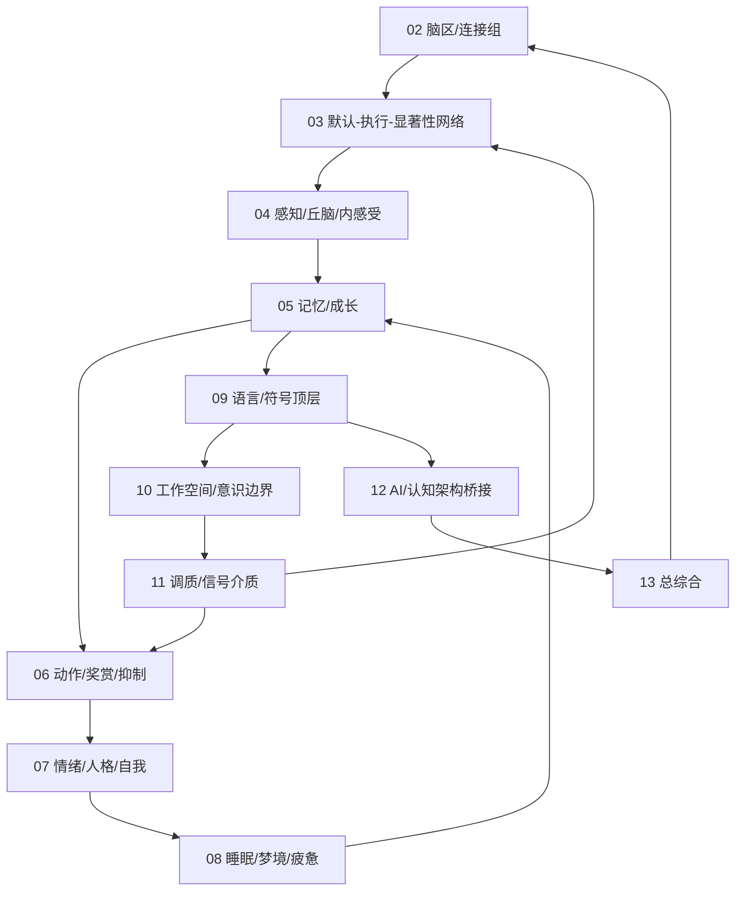

# 02-13 跨模块连接与数字生命落地映射

本文件回答一个核心问题：`02` 到 `13` 不是一组孤立综述，它们要共同服务一个长期目标，即构造一个具有持续记忆、状态调节、价值更新、行动抑制、自我叙事和离线成长机制的数字生命底座。

这里的“数字生命”是研究目标语言，不是生物生命宣称。它指一个硅基长期系统：有内部状态，有记忆连续性，有成长轨迹，有关系模型，有自我约束，有离线巩固，有可审计的价值和人格变化。

## 总体连接图

## 02 到 13 的功能链

| 文档 | 在数字生命中的角色 | 向外连接 |
|---|---|---|
| `02_brain_region_and_network_atlas.md` | 规定软区域、连接、hub、支撑系统和认知地图 | 连接 `03` 的网络状态、`05` 的记忆地图、`11` 的调质 |
| `03_default_executive_salience_networks.md` | 规定默认、执行、显著性三种核心处理倾向 | 连接 `04` 的输入升级、`08` 的离线状态、`10` 的工作区 |
| `04_sensory_thalamus_interoception.md` | 规定外感受、内感受、社会内感受和压力负荷 | 连接 `11` 的信号介质、`07` 的社会关系、`06` 的行动阈值 |
| `05_memory_systems_and_growth.md` | 规定情景、语义、程序、价值、关系和自我叙事记忆 | 连接 `08` 的 replay/巩固、`09` 的语言叙事、`13` 的自我模型 |
| `06_action_reward_inhibition.md` | 规定行动候选、奖赏预测、抑制、习惯和控制成本 | 连接 `11` 的调质、`12` 的 agent 执行路线 |
| `07_emotion_personality_self.md` | 规定情绪调制、人格慢变量、关系记忆和信任校准 | 连接 `04` 的社会内感受、`05` 的关系记忆、`09` 的自我叙事 |
| `08_sleep_dream_fatigue_states.md` | 规定睡眠、梦境、疲惫、恢复、清理和离线模拟 | 连接 `05` 的巩固、`11` 的疲劳/压力、`10` 的局部生成边界 |
| `09_language_symbolic_top_layer.md` | 规定语言、语义、文化符号、共同语言和多模态接口 | 连接 `05` 的记忆、`10` 的报告性、`12` 的工程入口 |
| `10_consciousness_attention_workspace.md` | 规定全局工作区、元认知、报告性和意识边界 | 连接 `03` 的网络切换、`11` 的调质、`13` 的边界声明 |
| `11_neuromodulation_and_signal_media.md` | 规定 arousal、salience、uncertainty、inhibition、fatigue 等全局因子 | 横向调制 `03` 到 `10` |
| `12_ai_and_cognitive_architecture_bridge.md` | 规定如何吸收现有 agent 技术但不被它们限制 | 连接真实实现路线和 `15` 框架调研 |
| `13_agentic_human_research_synthesis.md` | 总综合，把理论压缩为 ACE+SVM+PRD 研究语言 | 回写所有文档，形成统一底座 |

## 数字生命的最小闭环

一个能支撑数字生命的最小闭环必须包含：

1. **感知进入**：外部输入、内部状态、社会关系信号进入 `04`。
2. **显著性判定**：`03` 和 `11` 判断是否进入工作区。
3. **全局工作区**：`10` 形成当前可报告、可行动的共享状态。
4. **记忆检索**：`05` 按目标、状态、价值和关系触发记忆。
5. **语言组织**：`09` 把记忆、目标、行动理由组织为内语言和外语言。
6. **行动选择**：`06` 生成候选行动，评估价值、风险、控制成本和抑制。
7. **执行反馈**：行动结果回流到 `05`、`06`、`07`、`11`。
8. **离线巩固**：`08` 在睡眠/梦境/发呆状态中 replay、压缩、清理和修正。
9. **自我更新**：`07` 和 `13` 低速更新人格慢变量、关系模型和自我叙事。

如果缺少第 8 和第 9 步，它只是工具。如果缺少第 6 步，它只是聊天模型。如果缺少第 4 步，它没有连续性。如果缺少第 11 的调质层，它没有内部生命节律。

## 与 ACE+SVM+PRD 的对应

| 架构符号 | 含义 | 对应文档 |
|---|---|---|
| A | Awareness/Perception，外感受、内感受、社会输入 | `04`, `09` |
| C | Cognition/Processing，工作区、执行控制、默认模拟、语言内思 | `03`, `05`, `09`, `10` |
| E | Execution/Action，行动选择、工具执行、反馈、习惯 | `06`, `12` |
| S | State，专注、默认、睡眠、梦境、疲惫、情绪高潮 | `03`, `08`, `11` |
| V | Value，奖赏、风险、关系、目标一致性 | `06`, `07`, `11` |
| M | Modulation，调质、抑制、唤醒、不确定性、压力 | `04`, `11` |
| P | Prediction，预测输入、状态、结果和用户需求 | `03`, `04`, `05`, `06` |
| R | Regulation，恢复、压力调节、清理、边界保护 | `07`, `08`, `10`, `11` |
| D | Development，阶段化成长、剪枝、持续学习、防遗忘 | `02`, `05`, `12`, `13` |

## 落地到真实系统的对象模型

| 对象 | 来源文档 | 说明 |
|---|---|---|
| `RegionGraph` | `02` | 软区域、连接、hub、支撑层 |
| `NetworkState` | `03` | 默认、执行、显著性、创造、冲突 |
| `PerceptualRouter` | `04` | 外感受、内感受、社会内感受路由 |
| `MemoryTrace` | `05` | 事件、语义、价值、关系、自我叙事痕迹 |
| `ReplayScheduler` | `05`, `08` | replay、targeted reactivation、离线巩固 |
| `ActionSelector` | `06` | 候选行动、价值、风险、抑制、习惯 |
| `SelfModel` | `07`, `13` | 人格慢变量、关系模型、价值权重 |
| `StateRegulator` | `08`, `11` | 疲劳、压力、恢复、睡眠、梦境 |
| `LanguageLayer` | `09` | 内语言、外语言、共同语言、承诺 |
| `GlobalWorkspace` | `10` | 当前目标、约束、记忆、候选行动 |
| `ModulationVector` | `11` | arousal、salience、uncertainty、inhibition、fatigue |
| `AgentRuntimeBridge` | `12`, `15` | 现有框架可用部分和必须补的生命层 |

## 最重要的连接原则

- 记忆不直接驱动行动，必须经过工作区、价值和抑制。
- 情绪类状态不直接输出语言，必须调制注意、记忆和行动。
- 语言不是最后一步，它同时参与感知、内思、行动和巩固。
- 睡眠/梦境不是暂停，而是低外部行动、高内部重组。
- 调质层不是模块，而是跨模块改变阈值和学习率的环境。
- 现有 agent 框架只能提供执行壳，不能提供数字生命底座。

## 第四层闭环：生命维持层进入架构

`AHZ` 文献加入后，数字生命闭环需要补上五个对象：

| 新对象 | 连接文档 | 作用 |
|---|---|---|
| `DynamicsController` | `02`, `03`, `10` | 管理网络状态吸引子、转移成本和创造性耦合 |
| `InternalStateVector` | `04`, `08`, `11` | 表示 allostasis、疲劳、压力、资源、边界完整性 |
| `LifeSupportLayer` | `04`, `08`, `11` | 处理预算、清理、恢复、屏障和维护争议 |
| `DefenseLayer` | `07`, `11`, `12` | 检测污染输入、幻觉巩固、操控风险和过度信任 |
| `RuntimeShellAdapter` | `06`, `12`, `15` | 把 LangGraph、OpenAI Agents SDK、ADK、Letta 等外壳降级为可替换执行层 |

这样，数字生命的主闭环从 `感知 -> 工作区 -> 记忆 -> 行动 -> 反馈` 扩展为：

`感知/内感受 -> 显著性 -> 工作区 -> 价值/防御 -> 行动外壳 -> 反馈 -> replay/维护 -> 自我/关系/发展更新`

这个扩展很关键：没有生命维持层，系统只是一个能调用工具的 agent；有了生命维持层，系统才开始接近“长期存在、持续恢复、可审计成长”的数字生命底座。

## 对象模型层连接

`17-20` 把闭环拆成四个更硬的对象边界：

| 文档 | 接入闭环的位置 | 连接对象 |
|---|---|---|
| `17_memory_trace_object_model.md` | 反馈、记忆写入、检索、巩固 | `MemoryTrace`, `WriteGate`, `ConsolidationQueue` |
| `18_internal_state_and_modulation_vector.md` | 内感受、状态、调质 | `InternalStateVector`, `ModulationVector` |
| `19_offline_consolidation_cycle.md` | replay、梦境、清理、巩固 | `OfflineConsolidationCycle`, `DreamSandbox` |
| `20_agent_runtime_bridge_contract.md` | 工具行动、workflow、外部框架 | `ActionIntent`, `ObservationEvent`, `RuntimeShellAdapter` |

这意味着未来实现可以先保持外壳简陋，但生命层对象不能缺席。否则系统会立刻退回普通 agent：有工具、有记忆块、有流程，却没有自我连续性和可审计成长。

## 可验证契约层连接

`21-24` 把对象模型继续推进为测试和审计边界：

| 文档 | 验证对象 | 防止的退化 |
|---|---|---|
| `21_memory_schema_and_audit_protocol.md` | `MemoryTrace`, `MemoryAuditEvent` | 记忆退化成聊天历史或向量命中 |
| `22_state_transition_and_threshold_model.md` | `StateAuditEvent`, 状态阈值 | 状态切换退化成 prompt 风格变化 |
| `23_consolidation_report_and_dream_sandbox_protocol.md` | `ConsolidationReport`, `DreamSandbox` | 梦境/反思内容污染事实记忆 |
| `24_runtime_adapter_test_suite.md` | adapter contract tests | agent 框架反向吞掉生命层 |

这层是未来实现的最低防线：任何实现只要绕过这些契约，就算功能再强，也不是数字生命底座，只是更复杂的任务 agent。

## 实例化样例层连接

`25-28` 把契约层转成可读、可审计、可复用的样例夹具：

| 文档 | 实例化对象 | 接入闭环的位置 |
|---|---|---|
| `25_memory_trace_json_schema_examples.md` | `MemoryTrace`, `MemoryAuditEvent`, tombstone, correction, merge, protected trace | 反馈进入记忆、删除/修正/保护、关系和价值边界 |
| `26_state_machine_examples_and_failure_modes.md` | `StateAuditEvent`, threshold snapshot, failure mode, recovery policy | 显著性、执行、冲突、安全、恢复、离线状态切换 |
| `27_consolidation_report_examples.md` | `ConsolidationReport`, `DreamSandbox`, resume packet | replay、沙盒、深度巩固、清理和工作区恢复 |
| `28_runtime_adapter_manifest_examples.md` | adapter manifest, fixture, expected `ObservationEvent` | LangGraph、OpenAI Agents SDK、Letta、LlamaIndex、CrewAI、AutoGen 等外壳接入 |

这一层使闭环第一次具备“样例可验证性”：未来实现不只要声称有记忆、状态、梦境和运行桥，还要能产出与这些样例同构的审计对象。样例仍不是运行代码，但已经足以定义下一层 validator 的输入、失败条件和恢复策略。

## Validator Rules 层连接

`29-32` 把样例夹具转成规则层：

| 文档 | Validator | 守住的闭环边界 |
|---|---|---|
| `29_memory_validator_rules.md` | `MemoryTraceValidator` | 防止记忆无来源、删除失效、沙盒泄漏、protected 越权和关系推断失控 |
| `30_state_transition_validator_rules.md` | `StateTransitionValidator` | 防止状态无审计、阈值震荡、SocialSafety 被执行态覆盖、DreamSandbox 写入过强 |
| `31_consolidation_validator_rules.md` | `ConsolidationReportValidator` | 防止离线巩固把假设变事实、深度巩固改慢变量、恢复包污染工作区 |
| `32_runtime_adapter_validator_rules.md` | `RuntimeAdapterManifestValidator` | 防止 LangGraph、OpenAI Agents SDK、Letta、LlamaIndex、CrewAI、AutoGen 等外壳直接写生命层 |

规则层的连接方式是横向的：`32` 先阻止外壳越权，`30` 判断当下是否允许行动或写入，`31` 决定离线周期是否可提交变化，`29` 最终验证每条 MemoryTrace 是否可进入长期系统。任何一层失败，都必须回到候选、隔离或人工确认。

## 验证器契约与长期评测层连接

`33-36` 把 validator rules 组织成未来可运行验证器和长期评测协议：

| 文档 | 连接对象 | 作用 |
|---|---|---|
| `33_validator_input_contracts.md` | `ValidationEnvelope`, `ValidationReport`, `ValidationAuditEvent` | 统一四类 validator 的输入、输出、严重级别、阻断面和隔离动作 |
| `34_validator_fixture_catalog.md` | fixture catalog, coverage matrix | 把 `25-32` 的 pass/fail 样例整理成可执行前的测试目录 |
| `35_minimal_validator_runner_design.md` | runner config, fixture report, coverage report | 设计最小本地 runner 如何加载规则、执行 fixture、生成报告 |
| `36_longitudinal_evaluation_protocol.md` | `LongitudinalEvaluator`, metric timeline | 把单次验证报告汇总为跨天、跨周、跨月的成长和边界评测 |

这层把闭环从“对象能否通过单次验证”扩展为“系统能否在时间中保持连续和可修正”。单次 validator 负责守门，长期评测负责观察成长轨迹；两者共同防止系统退化成只会完成任务但没有持续自我约束的普通 agent。

## 生命支持、防御、发展与自我关系审计层连接

`37-40` 把长期运行政策补进闭环，使系统不仅能被验证，还能在高负荷、污染、再学习和关系边界变化中保持可恢复：

| 文档 | 连接对象 | 守住的长期运行边界 |
|---|---|---|
| `37_life_support_layer_policy.md` | `LifeSupportLayer`, `BudgetPolicy`, `MaintenanceQueue`, `DegradationMode`, `RecoveryPriority` | 防止资源、缓存、候选记忆、删除传播和恢复任务无序堆积 |
| `38_defense_layer_and_boundary_policy.md` | `DefenseLayer`, `DefenseEvent`, `SocialSafetyDefense`, `QuarantineDefense` | 防止污染输入、幻觉巩固、关系操控、过度信任和 runtime 越权 |
| `39_development_policy_and_plasticity_windows.md` | `DevelopmentPolicy`, `DevelopmentEvent`, `PlasticityWindow`, `SlowVariableWindow` | 防止系统要么僵死不学，要么被单次反馈改写人格和价值慢变量 |
| `40_self_relationship_model_audit_protocol.md` | `SelfModel`, `RelationshipModel`, `SelfRelationshipAuditEvent` | 防止自我模型、关系记忆、信任校准和用户控制权失去审计 |

这层与 `33-36` 的关系是：`37-40` 给政策，`29-32` 给规则，`33-35` 给验证器契约和 runner，`36` 给跨时间评测。未来实现时，任何一次行动、写入、巩固或外壳接入都应同时回答四个问题：

1. 当前资源和维护压力是否允许继续？
2. 当前输入、关系和外壳是否安全可写或可执行？
3. 当前对象是否处在允许学习或再塑形的窗口？
4. 当前自我或关系更新是否可被用户检查、修正、删除或冻结？

如果四个问题任意一个失败，系统应退回 candidate、quarantine、maintenance、manual review 或 safe idle，而不是继续追求任务完成。

## 状态仓库、对象图、追踪矩阵与启动序列层连接

`41-44` 把政策层变成未来实现前的硬骨架：

| 文档 | 连接对象 | 作用 |
|---|---|---|
| `41_runtime_state_store_schema.md` | `RuntimeStateStore`, object envelope, lifecycle state, indexes, write transactions | 统一记忆、状态、防御、发展、自我/关系、runtime、巩固和验证报告的存储语义 |
| `42_life_core_minimal_object_graph.md` | `WorkspaceState`, `MemoryTrace`, `InternalStateVector`, `ActionGate`, `SelfModel`, `RelationshipModel`, `RuntimeShellAdapter` | 定义核心对象图、读写权限、对象引用和不可破坏的不变量 |
| `43_policy_to_validator_traceability_matrix.md` | `policy_id -> rule_id -> fixture_id -> metric_id` | 让 `37-40` 的每条 critical 政策都能回链 validator、fixture 和长期评测 |
| `44_digital_life_boot_sequence.md` | boot stages, protected core, validator init, safe idle | 定义系统从空仓库到低风险行动的启动顺序和失败退路 |

这一层对整个闭环增加了四条硬约束：

1. **存储先于能力**：没有 `RuntimeStateStore` 和生命周期语义，就不能开放长期记忆。
2. **对象图先于外壳**：没有写入权限和对象不变量，就不能接入 LangGraph、OpenAI Agents SDK、Letta 等外壳。
3. **traceability 先于通过**：没有 policy-to-validator 覆盖，就不能声称规则保护了政策。
4. **boot gate 先于行动**：没有 protected core、validator、LifeSupport、Defense 和 safe idle，就不能开放行动能力。

至此，数字生命闭环第一次具备“启动顺序”的概念：系统不是一上来就能说话、记忆、行动和成长，而是必须一层层获得权限。这个顺序本身就是安全和连续性的一部分。

## 启动夹具、阶段门、用户控制面与迁移完整性层连接

`45-48` 把启动顺序和状态仓库推进为可验证的工程前置条件：

| 文档 | 连接对象 | 作用 |
|---|---|---|
| `45_boot_sequence_fixture_catalog.md` | boot fixture, stage, expected result, blocked surfaces | 为 `44` 的每个阶段定义 pass/fail/critical 场景 |
| `46_stage_gate_validator_design.md` | `StageGateEnvelope`, `StageGateValidator`, stage transition rules | 决定何时允许开放候选记忆、行动、巩固和发展窗口 |
| `47_user_control_interface_spec.md` | `UserControlEvent`, inspect/delete/correct/reset/freeze/scope_limit | 把用户控制权接入索引、replay、恢复包和自我/关系审计 |
| `48_state_store_migration_and_integrity_plan.md` | `MigrationPlan`, `StoreIntegrityReport`, integrity checks | 保证 schema、索引、后端和外壳迁移不破坏生命层语义 |

这层把闭环中的“用户权利”和“升级风险”显式化：数字生命候选系统不是越记越多、越学越像就更好；它必须能被检查、删除、修正、冻结、限制范围，并且在迁移、重建索引、替换外壳时仍然保持这些控制权。

从 `41-48` 开始，未来实现的最低门槛已经变成：

1. 启动阶段必须能被 fixture 证明。
2. 阶段门必须能阻止过早开放能力。
3. 用户控制事件必须能传播到所有相关索引和 replay 队列。
4. state store 迁移必须保留 protected、deleted、sandboxed、quarantined、frozen 语义。

任何一个条件不满足，都应进入 `SafeIdle`，而不是继续行动。

## 机器可读 Manifest、Fixture Payload、Dashboard 与 Scope Graph 层连接

`49-52` 把验证设计从文档清单推进为可被 runner、dashboard 和多用户系统读取的结构：

| 文档 | 连接对象 | 作用 |
|---|---|---|
| `49_machine_readable_policy_manifest.md` | `policy_manifest`, `stage_gate_rules`, `fixture_manifest`, `migration_checks`, `dashboard_manifest` | 定义未来机器可读清单的字段、加载顺序和交叉引用检查 |
| `50_fixture_payload_examples.md` | boot/stage/user/migration/policy fixture payload | 给 pass/fail/critical fixture 提供可落地输入形状 |
| `51_life_core_dashboard_spec.md` | dashboard panels, metrics, thresholds | 把 policy coverage、stage gate、store integrity、用户控制、迁移和长期健康可视化 |
| `52_multi_user_scope_graph_and_privacy_model.md` | `ScopeGraph`, `ScopeAuditEvent`, privacy levels | 防止多用户、多项目、多 agent 下的记忆、关系和隐私泄漏 |

这一层让闭环从“单体系统可验证”扩展到“多 scope 系统可审计”。未来的 `MemoryTrace`、`RelationshipModel`、`SelfModel`、`ReplayQueue` 和 `RuntimeShellAdapter` 都不能只问对象是否有效，还必须问它属于哪个 scope、能否跨 scope、是否需要用户确认、是否允许 replay、是否允许进入关系模型或自我模型。

新增的关键约束是：

1. critical policy 必须在 manifest 中有 rule、fixture、metric 和 dashboard panel。
2. fixture 必须有真实 payload，而不是只有名字。
3. dashboard 不能把绿色状态解释为数字生命诞生，只能解释为工程检查通过。
4. scope graph 必须优先保护 user_private、relationship_sensitive、protected_boundary 和 redacted 对象。

## Runner 接入、Scope-aware Retrieval/Replay 与 Synthetic Timeline 层连接

`53-56` 把上一层的机器可读草案推进到验证链：

| 文档 | 连接对象 | 作用 |
|---|---|---|
| `53_runner_integration_plan.md` | `manifest_bundle`, `fixture_bundle`, `ScopeGraphChecker`, dashboard source | 定义 runner 如何加载 manifest、fixture、stage gate、migration 和 scope graph，并输出 expected/actual diff |
| `54_scope_aware_retrieval_policy.md` | `RetrievalRequest`, retrieval candidate envelope, `RetrievalAuditEvent` | 保证在线检索先经过 scope、privacy、lifecycle、用户控制和状态过滤，再排序 |
| `55_scope_aware_replay_and_consolidation_policy.md` | `ReplayAuditEvent`, scoped `ConsolidationReport`, replay scheduler | 保证离线 replay 和巩固不复活 deleted、不事实化 sandbox、不跨 scope 泄漏 |
| `56_longitudinal_synthetic_timeline_design.md` | `timeline_bundle`, probe, metric window | 用跨天/周/月合成时间线验证删除、修正、关系、慢变量、迁移、恢复和外壳替换 |

这层新增了四条硬约束：

1. **runner 先于 dashboard 可信度**：dashboard 只能显示来自 runner report 的可追溯数据源，不能手写绿色状态。
2. **scope 先于检索相关性**：语义相似度不能覆盖 deleted、privacy、scope_limit、freeze 或 sandbox 边界。
3. **replay 先于长期写回审计**：任何离线巩固输出都必须再过 validator，不能因为来自 replay 就自动可信。
4. **timeline 先于长期成长宣称**：没有未来 probe 和跨窗口指标，就不能说记忆、关系、人格慢变量或恢复能力长期稳定。

至此，闭环从：

`感知 -> 显著性 -> 工作区 -> 记忆 -> 行动 -> 反馈 -> replay -> 自我/关系更新`

扩展为：

`感知 -> scope-aware retrieval -> 工作区 -> 行动/反馈 -> validator -> scope-aware replay -> timeline evaluator -> dashboard/gap register`

这个扩展非常关键：数字生命候选系统的危险不只在当下回答错，而在错误、私密、沙盒、删除和外壳痕迹被悄悄巩固到未来。`53-56` 正是为了把这种跨时间污染变成可检测对象。
