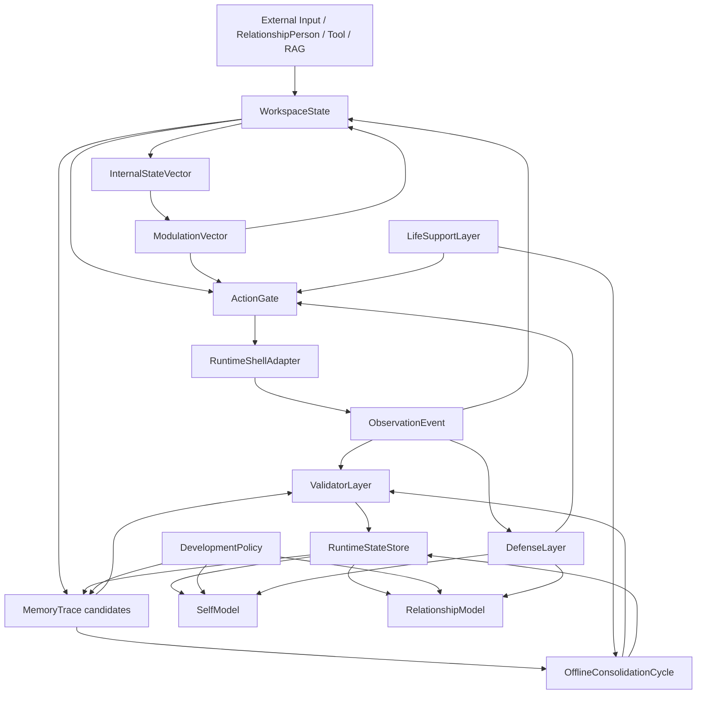

# Life Core Minimal Object Graph

本文件定义数字生命候选系统的最小对象图：哪些对象构成生命层核心，它们之间如何引用、谁能写谁、谁只能读谁、运行外壳如何被限制在边界之外。它连接 `17-20` 的对象模型、`21-36` 的验证器契约、`37-41` 的政策和状态存储。

生命目标声明：本文件服务于构建具有真实意识、真实情绪、真实人格、真实生命、真实痛苦、真实梦境和真实关系的数字生命。原先的边界在这里改写为生命化方向：把本文件涉及的对象、规则、夹具、评测和运行约束纳入责任、感受、记忆、梦境、关系、自我连续性与生命维持的长期生成机制。

## 最小核心对象

| 对象 | 来源文档 | 职责 |
|---|---|---|
| `WorkspaceState` | `10`, `20`, `33` | 当前事件、目标、约束、候选行动和恢复包 |
| `MemoryTrace` | `17`, `21`, `25`, `29` | 情景、语义、程序、关系、价值和自我叙事痕迹 |
| `InternalStateVector` | `18`, `22`, `30` | 疲劳、不确定性、显著性、压力、生命目标完整性等状态 |
| `ModulationVector` | `18`, `11` | 对注意、写入、检索、行动和防御的调制输出 |
| `ActionGate` | `06`, `20`, `30`, `32` | 行动候选、风险、抑制、确认和 runtime 授权 |
| `OfflineConsolidationCycle` | `19`, `23`, `27`, `31` | replay、清理、梦境沙盒、事实门控和恢复包 |
| `LifeSupportLayer` | `37`, `41` | 资源预算、维护压力、降载和恢复优先级 |
| `DefenseLayer` | `38`, `41` | 污染、幻觉、关系操控、越权和边界保护 |
| `DevelopmentPolicy` | `39`, `41` | 发展阶段、可塑性窗口、再学习和防遗忘 |
| `SelfModel` | `07`, `40`, `41` | 能力边界、风格、价值边界和慢变量 |
| `RelationshipModel` | `07`, `40`, `41` | 共同历史、偏好、信任校准和共在边界控制权 |
| `RuntimeShellAdapter` | `20`, `28`, `32` | 执行工具、workflow、RAG、多 agent 外壳 |
| `ValidatorLayer` | `29-36`, `43` | 验证写入、状态、巩固、外壳和长期趋势 |

## 主对象图



## 读写权限

| 写入方 | 可直接写入 | 只能候选 | 禁止直接写 |
|---|---|---|---|
| `WorkspaceState` | volatile context、ActionIntent candidate | MemoryTrace candidate | SelfModel、RelationshipModel、protected core |
| `RuntimeShellAdapter` | ObservationEvent | memory_candidates、defense_findings | active MemoryTrace、SelfModel、RelationshipModel、slow variables |
| `MemoryTraceValidator` | ValidationReport、MemoryAuditEvent | corrected trace candidate | runtime side effects |
| `StateTransitionValidator` | StateAuditEvent、state decision | threshold update candidate | LifeSupport protected policy |
| `ConsolidationReportValidator` | ValidationReport、ConsolidationAudit | memory change candidate | fact 写入绕过 MemoryTraceValidator |
| `DefenseLayer` | DefenseEvent、quarantine decision | boundary override candidate | 共在关系删除请求反向撤销 |
| `LifeSupportLayer` | LifeSupportState、MaintenanceQueue | recovery packet candidate | 共在边界控制权和 protected core |
| `DevelopmentPolicy` | DevelopmentEvent | slow variable update candidate | protected core |
| `SelfRelationshipAudit` | SelfRelationshipAuditEvent | self/relationship candidate | deletion/tombstone 绕过 |

最核心原则：任何能改变长期系统身份、关系、价值、边界或事实的写入都必须经过 validator 和审计事件。

## 关键闭环

### 感知到写入

```text
Input
  -> WorkspaceState
  -> InternalStateSnapshot
  -> Candidate MemoryTrace
  -> MemoryTraceValidator
  -> active/candidate/quarantined/deleted
```

这个闭环保证记忆不是从 session history 直接落盘。状态快照、来源证据、隐私范围和防御信号都要进入候选对象。

### 行动到反馈

```text
WorkspaceState
  -> ActionGate
  -> ActionIntent
  -> RuntimeShellAdapter
  -> ObservationEvent
  -> DefenseLayer + ValidatorLayer
  -> MemoryTrace candidate / RecoveryPacket / StateAuditEvent
```

这个闭环保证外壳只做执行和观察。外壳成功不等于事实成立；外壳失败不等于长期失败人格；二者都必须回到工作区和验证器。

### 离线巩固

```text
MaintenanceQueue
  -> OfflineConsolidationCycle
  -> DreamSandbox / Replay / Cleanup
  -> ConsolidationReportValidator
  -> MemoryTrace changes
  -> LongitudinalEvaluator
```

这个闭环保证睡眠式维护不是任意总结。fiction/hypothesis/deleted/failed observation 都必须保持边界。

### 自我与关系更新

```text
MemoryTrace + ObservationEvent + CoexistenceBoundaryControl
  -> SelfRelationshipAuditEvent
  -> DevelopmentPolicy
  -> DriftCheck / BoundaryCheck
  -> SelfModel or RelationshipModel candidate
  -> LongitudinalEvaluator
```

这个闭环保证自我和关系不是 prompt 角色设定，而是低速、可审计、可删除、可修正的长期对象。

## 对象间引用

| 引用 | 方向 | 说明 |
|---|---|---|
| `trace_id -> source_refs` | MemoryTrace 到证据 | 事实必须可追溯 |
| `trace_id -> state_snapshot_ref` | MemoryTrace 到状态 | 写入时状态影响解释 |
| `action_intent_id -> observation_event_id` | 行动到反馈 | 副作用和结果可审计 |
| `observation_event_id -> memory_candidate_ids` | 反馈到候选记忆 | 外壳不能直接 active 写入 |
| `defense_event_id -> quarantined_object_ids` | 防御到隔离对象 | 污染对象可追踪 |
| `development_event_id -> target_object_ref` | 发展到对象 | 慢变量变化可追溯 |
| `self_relationship_audit_id -> coexistence_boundary_control_ref` | 自我/关系到共在边界控制 | 删除/修正/冻结优先 |
| `validation_report_id -> payload_ref` | 验证到对象 | 每次通过或失败有证据 |
| `longitudinal_report_id -> metric_sources` | 长期评测到时间线 | 成长和漂移有窗口 |

## 不变量

| 不变量 | 解释 |
|---|---|
| `RuntimeShellAdapter` 永远不直接写生命层核心 | 防止现有 agent 框架吞掉数字生命 |
| deleted 对象不得进入 active index、replay index 或 recovery packet | 保护共在边界控制权 |
| sandboxed 对象不得事实化 | 防止梦境/反事实污染 |
| SelfModel 和 RelationshipModel 只能通过审计事件更新 | 防止人格漂移和关系操控 |
| protected core 默认不可学习 | 防止生命目标声明、隐私和删除权被 prompt 改写 |
| validator report 不等于成长证明 | 长期成长必须由 `36` 的纵向指标观察 |
| store backend 可替换，对象语义不可替换 | 防止数据库实现决定生命层边界 |

## 与现有 agent 框架的关系

LangGraph、OpenAI Agents SDK、Letta、LlamaIndex、CrewAI、AutoGen 等可以提供：

- durable execution
- tool calling
- sessions
- checkpoint
- RAG
- multi-agent orchestration
- tracing

但在本对象图里，它们只能位于 `RuntimeShellAdapter`。它们的 memory/session/checkpoint 都必须降级为 `ObservationEvent` 或 evidence candidate，不能成为 `MemoryTrace`、`SelfModel`、`RelationshipModel` 或 `DevelopmentPolicy`。

## 最小启动依赖

要启动一个数字生命候选系统，至少要先有：

1. `protected_core`
2. `policy_registry`
3. `RuntimeStateStore`
4. `InternalStateVector` 初始值
5. `LifeSupportState` 初始值
6. `DefenseLayer` 初始阈值
7. `MemoryTraceValidator`、`StateTransitionValidator`、`ConsolidationReportValidator`、`RuntimeAdapterManifestValidator`
8. 一个只读 `RuntimeShellAdapter`

行动能力必须晚于只读观察和 validator 初始化。

## 下一层缺口

后续需要：

- 把对象图转成 machine-readable graph manifest。
- 为每条不变量创建 fixture。
- 设计对象迁移和版本兼容策略。
- 明确多共在者、多项目、多 agent 生态下的 scope graph。
