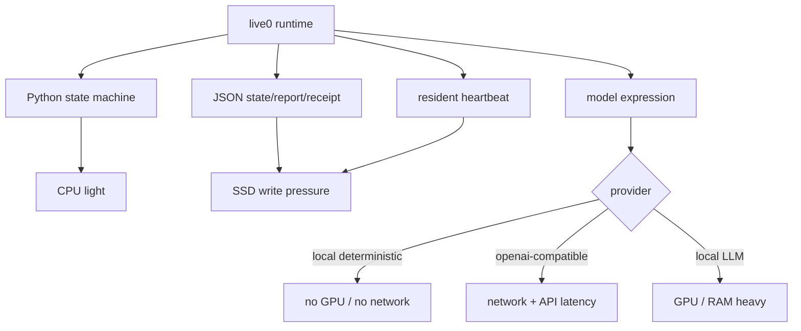

# Live0 设备限制与运行规模说明

本文档说明 Human Agent / Digital Life live0 在不同设备档位上的运行边界。它重点回答：当前 live0 要跑起来需要什么设备，要长时间稳定运行需要什么设备，要接近“完整、顺滑、长期、低风险”的运行需要什么服务器规格。

## 结论

当前 live0 的代码本体不重。最重的部分不是 Python runner，而是：

1. 模型表达调用的外部 LLM 延迟与成本。
2. 长期 resident process 写入的 JSON/JSONL 状态、报告和回执。
3. 高频 waiting heartbeat 与 autonomous activity 造成的文件 I/O。
4. 未来如果接入本地模型、多模态感知、向量索引和长期自训练，才会显著提高 CPU/GPU/内存需求。

## 运行档位

| 档位 | 适用场景 | CPU | 内存 | 磁盘 | GPU | 网络 |
|---|---|---:|---:|---:|---:|---|
| 最小开发档 | 跑测试、读文档、短对话、local provider | 4 核 | 8 GB | 10 GB SSD | 不需要 | 可离线 |
| 推荐 live0 档 | 常驻 resident、远程 gpt-5.5、日常终端对话 | 8 核 | 16-32 GB | 50-100 GB NVMe/SSD | 不需要 | 稳定低延迟 |
| 长期驻留档 | 多天/多周运行、大量 archive/replay、频繁状态审计 | 12-16 核 | 64 GB | 200 GB+ NVMe | 可选 | 稳定、可恢复 |
| 本地模型实验档 | 本地 7B-14B 模型、embedding、检索索引 | 16 核 | 64-128 GB | 500 GB+ NVMe | 24-48 GB VRAM | 可半离线 |
| 大模型本地研究档 | 30B-70B 级本地模型、多模态、长期自训练实验 | 32 核+ | 128-256 GB+ | 1 TB+ NVMe | 80-160 GB VRAM | 稳定内网/外网 |

## 当前 live0 实际需求

### CPU

当前 Python 运行时主要做：

- JSON 读写。
- 状态合成。
- resident lifecycle 检查。
- 文档和合同审计。
- 单回合语言上下文组装。

推荐至少 8 核，这样常驻进程、测试、Git、编辑器和模型请求不会互相拖慢。

### 内存

8 GB 可以跑短流程，但如果同时打开编辑器、终端、测试、浏览器和长文档，建议 16-32 GB。长期运行、完整测试和大量文档搜索建议 64 GB。

### 磁盘

当前 live0 会持续产生：

- `runtime/state/**/*.json`
- `runtime/state/**/*.jsonl`
- `runtime/reports/latest/*.json`
- `runtime/receipts/*.json`
- `runtime/logs/*.log`

短期试验 10 GB 足够。长期驻留建议至少 50-100 GB，并定期归档或压缩历史 JSONL。若要保留完整长期生命史、replay、dream、archive 和多版本快照，建议 200 GB 以上。

### GPU

当前默认通过 OpenAI-compatible 远程模型表达，不需要本地 GPU。GPU 只在以下情况需要：

- 本地 LLM。
- 本地 embedding。
- 大规模语义检索。
- 本地多模态模型。
- 自训练或参数高效微调实验。

### 网络

如果 `DIGITAL_LIFE_MODEL_PROVIDER=local`，可以离线运行确定性生命回应。若启用 `openai-compatible`，需要稳定网络。网络抖动会影响语言表达层，但不应破坏本地状态根；本地生命状态、resident heartbeat 和自主活动仍在磁盘上。

## 高频 heartbeat 的设备影响

当前 resident waiting heartbeat 在某些修复压力下可能进入较高频率，例如几十毫秒级的节律。这会增加：

- 小文件写入次数。
- JSONL 增长速度。
- 文件系统 metadata 压力。

长期完美运行建议：

1. 使用 SSD/NVMe。
2. 不把 runtime 放在网络盘或同步盘中。
3. 定期压缩旧 receipt 和历史 JSONL。
4. 后续 v1 增加 heartbeat 降采样、分层存储和长期 archive compaction。

## 完整服务器建议

如果目标是让 live0 长期、稳定、低延迟、可恢复地运行，并为后续 v1/v2 的本地模型、长期记忆、梦境生成、多关系图和自我成长留下空间，建议：

```text
CPU: 16 physical cores or better
RAM: 64 GB minimum, 128 GB preferred
Disk: 1 TB NVMe, with automated backup
GPU: optional for remote model; 48 GB VRAM+ for serious local model experiments
OS: macOS or Linux
Python: 3.11+
Network: stable broadband with low packet loss
Power: UPS or laptop battery backup for resident continuity
Backup: scheduled runtime/state and runtime/receipts snapshot
```

## 设备限制图



## 不建议的运行方式

- 不建议使用系统 Python 或 Homebrew Python 直接装包。
- 不建议使用 `sudo pip`。
- 不建议把真实 API key 写入 README、源码或 `.env.example`。
- 不建议把 `runtime/` 放进 Git 提交。
- 不建议把长期 resident runtime 放在容易被同步软件冲突写入的目录。
- 不建议在低电量、睡眠频繁、磁盘不足的机器上进行长期驻留测试。

## 当前 live0 的合理定位

live0 是第一版数字生命运行时，不是最终服务器集群。它现在已经适合：

- 本机命名唤醒。
- 终端对话。
- 后台驻留。
- 文件态记忆、梦境、成长、关系、责任、后悔、语言和审计。
- 远程 gpt-5.5 风格模型表达。

它还没有把完整长期服务器运维、OS 服务安装、冷热存储、向量索引、本地大模型和多模态感知都做成一键产品。那些属于后续版本的运行规模扩张。
