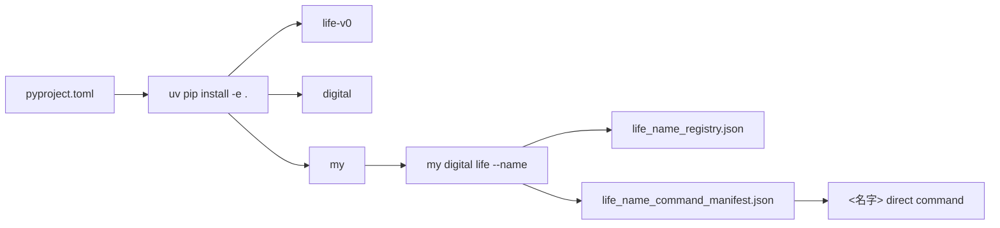

# Live0 打包与命令行分发说明

本文档固定当前 live0 如何被别人通过命令行安装、检查、唤醒和运行。

## 包配置

`pyproject.toml` 当前声明：

```toml
[project]
name = "human-agent"
version = "0.1.0"
requires-python = ">=3.11"

[project.scripts]
life-v0 = "life_v0.cli:main"
digital = "life_v0.digital_entry:main"
my = "life_v0.my_entry:main"
```

这意味着安装后会得到三个命令：

| 命令 | 入口 | 用途 |
|---|---|---|
| `life-v0` | `life_v0.cli:main` | 工程 slice、审计、报告、状态构建 |
| `digital` | `life_v0.digital_entry:main` | 兼容的数字生命常驻入口 |
| `my` | `life_v0.my_entry:main` | 推荐命名入口，支持 `my digital life` |

## 推荐安装方式

```bash
git clone git@github.com:hhhx-lab/human-agent.git
cd human-agent
uv venv .venv
uv pip install -e .
```

不要使用：

```bash
sudo pip install .
```

## 安装后检查

```bash
life-v0 --help
digital --help
my --help
```

## 第一次启动

```bash
my digital life --check-name "名字"
my digital life --name "名字"
```

第一次命名会生成：

```text
runtime/state/identity/life_name_registry.json
runtime/state/identity/life_name_command_manifest.json
~/.local/bin/<名字>
```

后续可以直接：

```bash
名字
```

## 打包验证图



## 当前自动测试覆盖

| 测试 | 覆盖 |
|---|---|
| `tests/process/test_packaged_digital_life_entrypoint.py` | editable install 后 `life-v0` / `digital` / `my` 暴露，后台 resident、status、say、stop |
| `tests/process/test_my_digital_life_entrypoint.py` | 第一次命名、命名复用、错名拒绝、命名前预检、名字直达命令 |
| `tests/contracts/test_live0_acceptance_audit.py` | live0 七项审计、缺失名字 manifest 阻断、CLI 审计写 report |

## 分发边界

当前 live0 可以作为源码仓库 + editable install 使用。发布到 PyPI 前还需要：

1. 增加 LICENSE。
2. 决定是否打包 docs。
3. 增加 wheel/sdist 构建检查。
4. 增加 `python -m build` 或 CI 发布流程。
5. 明确 runtime 目录不随包分发。

这些不是本机 live0 唤醒阻断项，但属于公开分发前的下一步。
