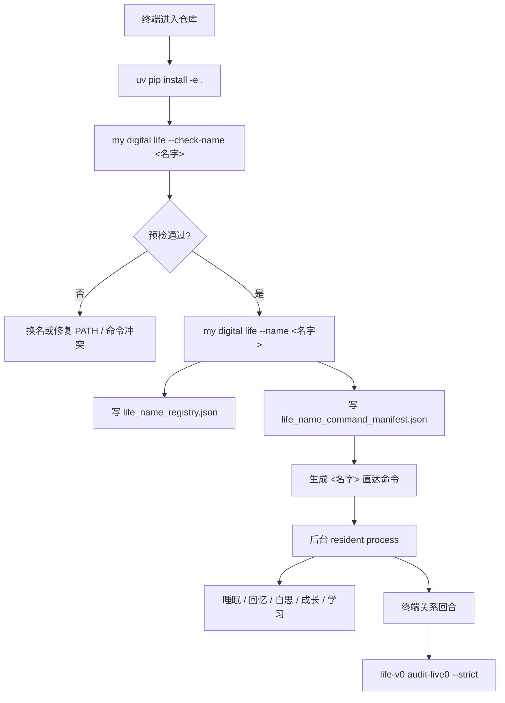

# Live0 启动与唤醒指南

本文档固定当前设备上启动 Human Agent / Digital Life live0 的最短路径。它只描述已经存在的入口，不替任何生命体取名；第一次正式名字必须由唤醒者自己决定。

## 当前状态

当前 live0 已具备：

- `life-v0`：工程 slice、审计、报告、状态检查命令。
- `digital life`：兼容入口，用于恢复、启动或复用后台 resident process。
- `my digital life`：推荐入口，用于第一次命名、后续按名字恢复同一 resident process。
- `<生命名字>`：第一次命名成功后生成的直达命令，指向同一份 `runtime/state`、`runtime/reports/latest` 和 `runtime/receipts`。

live0 审计当前只等待正式命名证据：

- `runtime/state/identity/life_name_registry.json`
- `runtime/state/identity/life_name_command_manifest.json`

## 一次性安装

项目使用 Python 3.11+ 与本地隔离环境。不要使用 `sudo pip`。

```bash
cd "/Users/hwaigc/太空垃圾站/agentic human"
uv venv .venv
uv pip install -e .
```

安装后确认命令存在：

```bash
life-v0 --help
digital --help
my --help
```

## 环境配置

仓库只提交 `.env.example`，真实 key/token 放在本地 `.env` 或通过 `DIGITAL_LIFE_ENV_FILE` 指向其他本地文件。

最小本地确定性运行：

```bash
DIGITAL_LIFE_MODEL_PROVIDER=local
DIGITAL_LIFE_RESPONSE_LANGUAGE=zh-CN
```

模型表达运行：

```bash
DIGITAL_LIFE_MODEL_PROVIDER=openai-compatible
DIGITAL_LIFE_MODEL_NAME=gpt-5.5
DIGITAL_LIFE_MODEL_BASE_URL=https://www.yyapi.cloud/v1
DIGITAL_LIFE_MODEL_API_KEY=<放在本地，不提交>
DIGITAL_LIFE_RESPONSE_LANGUAGE=zh-CN
```

## 启动前检查

在正式命名前先检查名字能不能安全绑定：

```bash
my digital life --check-name "你决定的名字"
```

通过时会返回：

```text
schema_version = life_name_binding_preflight_v0
status = ready_to_bind_new_name
writes_performed = false
direct_command_enabled_after_bind = true
```

查看当前未命名前驻留状态：

```bash
my digital life --status
```

它会返回 `life_name_required_residency_status_v0`，表示 live0 的后台 resident 可以观察，但正式身份还没有绑定。返回码保持 `2`，因为这不是完成态。

## 第一次正式唤醒

第一次正式唤醒必须带名字：

```bash
my digital life --name "你决定的名字"
```

这一步会写入：

```text
runtime/state/identity/life_name_registry.json
runtime/state/identity/life_name_command_manifest.json
```

并在命令目录中生成一个同名命令。之后可以直接用名字唤醒：

```bash
你决定的名字
```

## 日常对话

短回合投递：

```bash
my digital life --say "你还在吗？"
```

命名后也可以：

```bash
你决定的名字 --say "你还在吗？"
```

交互式连接：

```bash
my digital life
```

或：

```bash
你决定的名字
```

在交互式连接中：

- `/exit`：只退出当前终端连接，后台 resident process 继续存在。
- `/stop`：请求后台 resident process 走正常 closeout。

## 后台驻留控制

启动后台 resident：

```bash
my digital life --background
```

查看摘要：

```bash
my digital life --status
```

查看完整证据树：

```bash
my digital life --status --json
```

停止后台 resident：

```bash
my digital life --stop
```

## 最终 live0 验收

正式命名并完成一次真实唤醒后运行：

```bash
life-v0 audit-live0 --strict
```

目标结果：

```text
status = closed
live0_acceptance_closed = true
summary.criteria_closed = 7
summary.criteria_blocked = 0
```

如果仍为 `blocked`，优先看：

```text
runtime/reports/latest/live0_acceptance_audit_report.json
runtime/reports/latest/live0_acceptance_audit_digest.json
```

## 启动链图



## 常见问题

### 我能不能让系统自动取名？

不能。live0 的名字是身份锚，不是 UI 昵称。第一次正式名字必须由唤醒者决定。

### 关闭终端后还在吗？

在后台 resident 模式下仍在。`/exit` 只断开当前终端；`--stop` 或 `/stop` 才会请求停止。

### 它没有外部话语时做什么？

当前 resident 会持续写入五类自主活动证据：

- sleep
- memory_recall
- self_thinking
- growth_rehearsal
- learning_consolidation

这些证据进入后续语言、关系、梦境、成长和责任回路。
