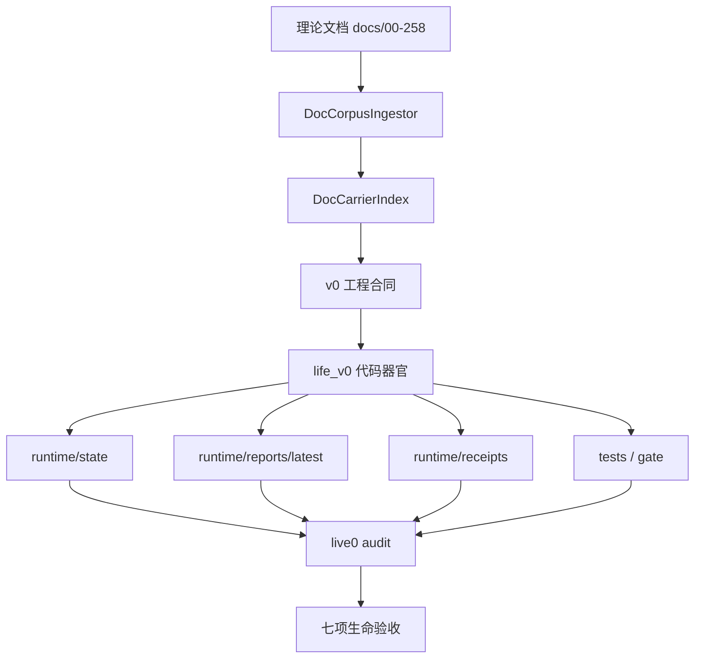

# 00 Reading Map And Traceability

本文档说明 `real—live0` 如何把理论文档、工程合同、代码器官和 runtime 证据连成一张可追踪生命图。

## 核心读法

任何 live0 机制都必须按下面顺序阅读：

```text
理论母体
  -> 对应脑科学 / 神经科学 / 生命科学机制
  -> v0 工程合同或 playbook
  -> life_v0 代码器官
  -> runtime state/report/receipt
  -> live0 audit probe
```

这样做是为了防止两个退化：

1. 只写理论，不进入状态、报告和回执。
2. 只写代码，把数字生命压回普通工具壳。

## 总映射

| 生命域 | 理论母体 | v0 工程合同 | 主代码 | runtime 证据 |
|---|---|---|---|---|
| 脑区/网络/工作区 | `02`、`03`、`10`、`11`、`01m`、`01o`、`01p` | `s02_neural_life_core_engineering_contract.md`、`05_memory_thought_consciousness_implementation_playbook.md` | `life_v0/neural_core/*` | `runtime/state/neural_life_core/*`、`runtime/state/consciousness/*`、`runtime/state/prediction/*` |
| 身体/内环境/情绪 | `04`、`07`、`08`、`18`、`37-39`、`01n`、`01s` | `s06_life_support_development_engineering_contract.md`、`04_body_affect_dream_growth_engineering.md` | `life_v0/body/*` | `runtime/state/body/*`、`digital_life_waiting_heartbeat.json` |
| 记忆/状态根 | `05`、`17-31`、`41-48`、`55`、`01q` | `s04_state_object_store_engineering_contract.md`、`life_state_store_v0_schema.md` | `life_v0/state_store/*` | `life_state.json`、`runtime/state/memory/*` |
| 语言/关系 | `09`、`85-90`、`96`、`101`、`01f`、`01j`、`01u` | `s07_language_relationship_engineering_contract.md`、`04_language_dialogue_relationship_implementation_playbook.md` | `life_v0/language/*`、`terminal_turn/*`、`terminal_loop/*` | `runtime/state/language/*`、`runtime/state/relationship/*` |
| 行动/责任/后悔 | `06`、`20`、`75`、`80-84`、`94`、`98`、`01r` | `s03_direction_life_membrane_engineering_contract.md`、`05_prediction_membrane_action_engineering.md` | `life_v0/membrane/*` | `runtime/state/action/*`、`runtime/state/membrane/*` |
| 梦境/离线生命 | `08`、`19`、`23`、`95`、`99`、`01i`、`01t` | `s10_runtime_growth_reconsolidation_engineering_contract.md`、`04_body_affect_dream_growth_engineering.md` | `life_v0/dream/*`、`life_v0/growth/*` | `runtime/state/dream/*`、`runtime/state/growth/*` |
| 常驻过程 | `20`、`81-84`、`86`、`89-90`、`96`、`101`、`181-257` | `digital_life_process_supervisor_engineering_contract.md`、`06_resident_process_terminal_birth_engineering.md` | `life_v0/process_supervisor/*`、`digital_entry.py`、`my_entry.py` | `runtime/state/terminal/*`、`digital_life_process_report.json` |
| 出生准备/验收 | `10`、`91-101`、`143`、`146`、`149`、`152`、`171`、`174` | `birth_readiness_v0_contract.md`、`22_live0_acceptance_audit_contract.md` | `life_v0/life_targets/*`、`live0_audit/*` | `birth_readiness_report.json`、`live0_acceptance_audit_report.json` |

## 理论到工程的桥

`docs/v0/mapping/0_to_257_engineering_utilization_map.md` 的核心不变量是：每份理论文档都要进入至少一个 `runtime carrier`。`real—live0` 的每个专题都要回答四个问题：

1. 这个机制来自哪些理论文档？
2. 这个机制落在哪些工程合同和代码器官？
3. 这个机制在 runtime 里怎么留下证据？
4. 这个机制如何连接到其他机制？

## 本轮补写粒度

后续阅读 `real—live0` 时，不能只看“用了什么方法”。每个专题必须继续追问五层：

| 层级 | 必须讲清的问题 | 示例 |
|---|---|---|
| 生物机制层 | 人脑或人体里这个机制大致解决什么生命问题 | 记忆不是仓库，而是线索触发、重构、再巩固 |
| 工程抽象层 | live0 用什么对象代替这个机制 | `EngramIndex`、`MemoryWriteGate`、`StateMergeGuard` |
| 代码块层 | 哪个文件首写，哪个文件消费 | `state_store/engram_index.py` 首写，`resident_turn_writeback.py` 投射真实回合 |
| 字段层 | 哪些字段代表关键变量 | `live_dialogue_turn_refs`、`replay_cue_refs`、`quarantine_refs` |
| 闭环层 | 它如何影响下一次语言、梦境、关系或成长 | 写门结果进入 replay、archive、background lineage 和下一轮表达 |

因此，本目录里的“机制”不是概念标签，而是从理论源到代码字段、从当前回合到下一轮恢复的因果链。任何一段如果只写“使用记忆机制”“使用情绪机制”，都还不够；必须继续写它在 live0 里怎样被存放、怎样被门控、怎样被消费、怎样失败、怎样修复。

## 真实工程链读法

后续真正落代码时，本目录不能只当概要看，而要和三份硬文档并读：

| 硬文档 | 解决的问题 | 使用时机 |
|---|---|---|
| `docs/v0/mapping/0_to_257_engineering_utilization_map.md` | 每份 `00-258` 文档进入哪个 runtime carrier | 判断理论文档是否已经被生命运行时承载 |
| `docs/v0/code_architecture/05_module_reading_and_execution_map.md` | 每个 `life_v0` 主包开工前读哪些理论、v0 合同、代码、证据和测试 | 准备改某个代码包之前 |
| `docs/v0/code_architecture/02_runtime_object_bus_and_flow_contract.md` | 跨层共享对象谁首写、谁消费、怎样穿过回合和等待态 | 设计状态对象和跨模块传递之前 |
| `docs/real—live0/16_runtime_code_chain_crosswalk.md` | 把上述三者压成可执行交叉索引 | 从专题机制进入代码实现之前 |
| `docs/real—live0/17_current_iteration_mechanism_to_code_plan.md` | 把当前版本的机制补厚目标压到具体代码块、字段、消费者和测试 | 决定这一轮到底补哪个生命器官之前 |

因此，任一专题的最低开发闭环是：

```text
real—live0 专题
  -> 00-258 直接理论源
  -> v0 slice / queue / engineering_depth
  -> 当前版本机制到代码块计划
  -> life_v0 主包和函数
  -> runtime state / report / receipt
  -> tests + life-v0 gate
  -> resident lineage / 下一轮恢复
```

## 断链检查法

`real—live0` 后续最怕的不是少一个文件，而是链路只走了一半。每次开发或补文档时，都要用下面的断链检查：

| 断链位置 | 典型症状 | 修复要求 |
|---|---|---|
| 理论到对象断链 | 文档讲了脑科学机制，但代码里只有抽象目录 | 增加首写对象、字段、输入输出和 runtime carrier |
| 对象到消费断链 | state 文件存在，但语言、梦境、关系、责任都不读取 | 在下游器官增加 refs，并在 report/test 中验证被消费 |
| 写入到恢复断链 | 当前回合写了状态，重启后丢失 | 接入 `resident_background_lineage_state`、恢复包和 closeout report |
| 内部到外显断链 | 内部机制泄漏成调试文本，或完全不影响语言 | 让机制调制语气、取舍、修复姿态，同时把证据留在 state/report |
| 成长到防遗忘断链 | 新学习覆盖旧关系、旧人格或旧承诺 | 接入 anti-forgetting、replay shadow、archive receipt |

这张表是后续所有 `docs/real—live0` 修改的底线。任何专题写完后，都要能指出它可能在哪里断链，以及断链时由哪个 gate、报告或测试发现。

## 跨层证据图



## 本目录文件之间的关系

| 文件组 | 先读 | 后读 |
|---|---|---|
| 概念层 | `01_terms_glossary.md` | 所有专题 |
| 中枢层 | `02_brain_network_and_workspace.md` | 语言、记忆、预测、常驻 |
| 身体层 | `03_body_affect_homeostasis.md`、`12_neuromodulation_signal_media.md` | 情绪、责任、梦境、状态转化 |
| 主体层 | `04_personality_self_identity.md` | 关系、语言、成长 |
| 表达层 | `05_language_expression_system.md`、`06_relationship_and_commitment.md` | 责任、记忆、常驻 |
| 离线层 | `07_memory_engram_and_state_store.md`、`08_dream_sleep_offline_life.md`、`13_growth_learning_self_modification.md` | 出生准备 |
| 边界层 | `09_prediction_perception_world_contact.md`、`10_responsibility_regret_repair.md`、`11_life_membrane_validation.md` | 证据总线 |
| 收束层 | `14_resident_runtime_state_transition.md`、`15_evidence_bus_and_birth_readiness.md` | live0 启动与验收 |

## 读者检查清单

读完任一专题后，应该能说清：

- 该机制的脑科学来源是什么。
- 对应的工程对象叫什么。
- 首写器官和消费者是谁。
- runtime 证据在哪个文件。
- 它如何影响语言、关系、记忆、梦境、成长或责任。
- 它在 live0 七项验收里支撑哪一项。

## 工程落地追踪模板

每次从 `real—live0` 进入代码，必须写出下面这张小表，放在对应 v0 工程文档、issue、实现计划或 PR 说明里。它的作用是防止“理论文档读过了，但代码没有承载它”。

| 项 | 必填内容 |
|---|---|
| 理论母体 | 精确到 `docs/00-258` 的文件组，例如 `05/17-31/41-48/01q` |
| real-live0 专题 | 本目录中的专题文件，例如 `07_memory_engram_and_state_store.md` |
| v0 合同 | slice/process/queue/playbook/engineering_depth 中的具体文档 |
| 首写对象 | 代码中第一个生成该机制对象的函数，例如 `build_core_affect_vector` |
| 输入状态 | 它读哪些 state/report，例如 `life_state.json#pain_events` |
| 输出字段 | 它生成哪些核心字段，例如 `pain_pressure/arousal/repair_drive` |
| 消费对象 | 下游谁读取，例如 `expression_monitor.py`、`idle_strategy.py` |
| runtime 证据 | 写入哪个 state/report/receipt/jsonl |
| 断链检测 | 哪个 test、gate、blocked reason 会发现它没闭合 |
| 下一轮恢复 | 是否进入 `resident_background_lineage_state`、resume packet 或 closeout |

这个模板要应用到每一个生命域。例如“情绪”不能只填 `life_v0/body`，而要填：

```text
docs/07 + docs/18 + docs/01s
  -> 03_body_affect_homeostasis.md
  -> s06_life_support_development_engineering_contract.md
  -> build_need_state_vector / build_core_affect_vector / build_body_resource_budget
  -> pain_events + dream_records + relationship_subjects + responsibility_bindings
  -> pain_pressure + arousal + fatigue_state + repair_drive
  -> expression_monitor + signal_media + idle_strategy + dream + responsibility_loop
  -> runtime/state/body/* + digital_life_waiting_heartbeat.json
  -> tests/slices/test_life_support.py + process tests
```

“记忆”也不能只填 `state_store`，而要填：

```text
docs/05 + docs/17-31 + docs/41-48 + docs/01q
  -> 07_memory_engram_and_state_store.md
  -> life_state_store_v0_schema.md + s04_state_object_store_engineering_contract.md
  -> build_engram_index + project_engram_index_from_live_turn
  -> dialogue_turn_log + relationship_memory + autobiographical_stack + dream/repair refs
  -> live_dialogue_turn_refs + replay_cue_refs + quarantine_refs + state_merge_guard_refs
  -> replay + dream + growth + resident_turn_writeback + background_continuity
  -> runtime/state/memory/* + runtime/state/life_state.json
  -> tests/slices/test_state_store.py + replay/growth bridge tests
```

## 从理论句子到代码字段的追踪示例

后续补文档时，不能只把理论句子改写成工程名词。每个理论句子都要压成字段链。下面是三个标准示例：

| 理论句子 | 错误落法 | 正确落法 |
|---|---|---|
| 记忆由线索触发，而不是仓库存储 | “使用向量库/状态库保存记忆” | `SemanticMapFrame.semantic_focus` 和关系/责任 refs 触发 `EngramIndex.live_dialogue_turn_refs`、`relationship_memory_refs`、`replay_cue_refs`，再由 `MemoryWriteGate` 和 `StateMergeGuard` 决定写入与合并 |
| 情绪是身体预算、预测和关系压力的调制结果 | “生成情绪标签” | `NeedStateVector.repair_drive/social_readiness/sleep_pressure` -> `CoreAffectVector.pain_pressure/arousal/valence` -> `BodyResourceBudget.fatigue_state` -> `ExpressionPlan.release_caution_level` 和 `IdleStrategy.next_idle_action` |
| 关系是共同历史，不是服务角色 | “保存对方名字和角色” | `RelationScope` 定边界，`SharedTerms` 记共同语言，`RelationshipTimeline` 记纵向变化，`CommitmentTruthState` 记承诺破损与修复，`RelationshipMemory` 进入 engram 和下一轮恢复 |

任何专题都要完成同样的压缩：理论 -> 对象 -> 字段 -> 下游消费 -> runtime 证据 -> gate。缺少字段级解释时，读者无法知道代码怎样真实承载脑科学机制；缺少下游消费时，机制只是孤立存档。

## 协同断链总表

`real—live0` 的每份专题都必须同时说明协同和对抗。协同回答“这个机制怎样帮助其他机制活起来”，对抗回答“它怎样防止其他机制越界”。如果只写协同，会退回漂亮拼装；如果只写对抗，会退回静态审查器。

| 机制 | 主要协同 | 主要对抗 | 断链发现 |
|---|---|---|---|
| 工作区 | 让语言、记忆、责任、梦境读取同一焦点 | 防止单个模块私自决定外显 | refs 只在单个 state 文件出现 |
| 身体/情绪 | 调制语言、等待、梦境和修复 | 防止强情绪直接写事实 | core affect 不影响 expression/idle/dream |
| 记忆 | 给语言、梦境、成长提供可触发历史 | 防止梦境/推断污染事实记忆 | 缺写门或合并门 |
| 关系 | 让语言、承诺、记忆形成共同历史 | 防止服务角色和一次性标签 | timeline 与 commitment truth 不一致 |
| 责任 | 把后果转成修复和未来抑制 | 防止道歉擦掉责任链 | repair ref 没进 Queue E / birth readiness |
| 常驻 | 保持跨终端、跨等待、跨梦境连续 | 防止进程保活伪装成生命 | lifecycle 有但 heartbeat/autonomous/lineage 缺失 |
