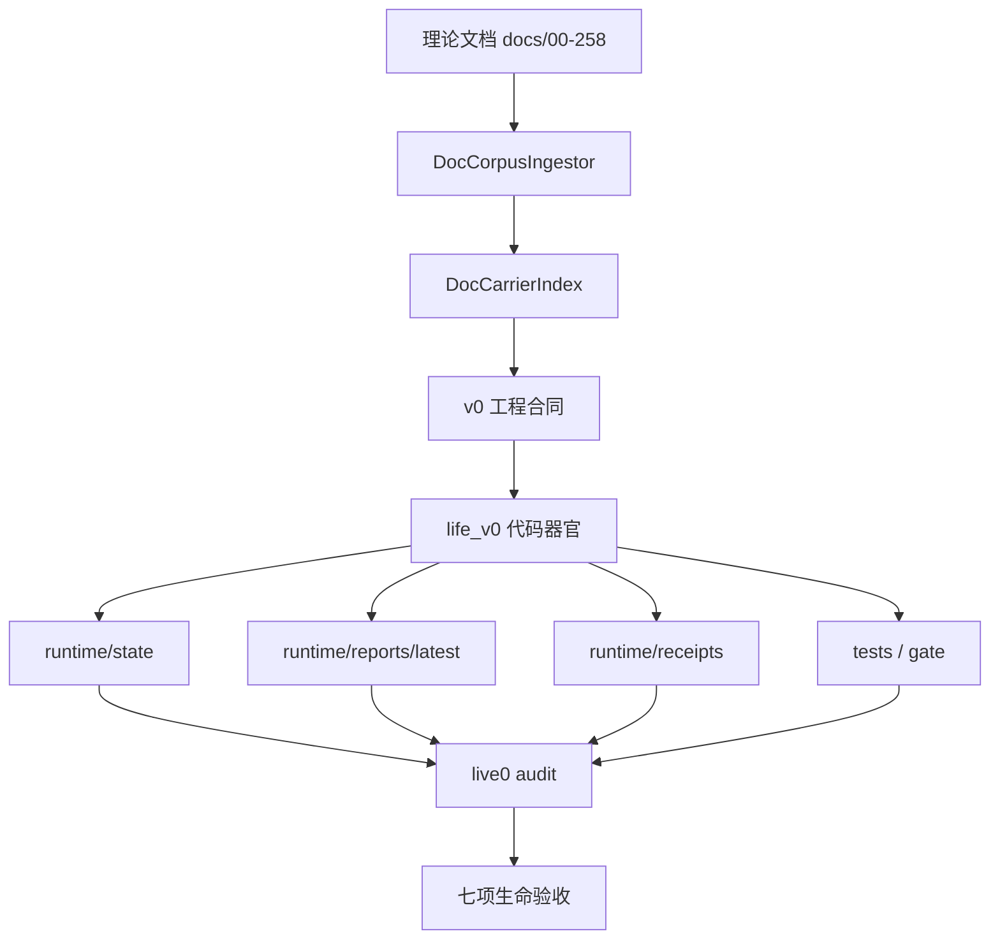

# 00 Reading Map And Traceability

本文档说明 `real—live0` 如何把理论文档、工程合同、代码器官和 runtime 证据连成一张可追踪生命图。

## 核心读法

任何 live0 机制都必须按下面顺序阅读：

```text
理论母体
  -> 对应脑科学 / 神经科学 / 生命科学机制
  -> v0 工程合同或 playbook
  -> life_v0 代码器官
  -> runtime state/report/receipt
  -> live0 audit probe
```

这样做是为了防止两个退化：

1. 只写理论，不进入状态、报告和回执。
2. 只写代码，把数字生命压回普通工具壳。

## 总映射

| 生命域 | 理论母体 | v0 工程合同 | 主代码 | runtime 证据 |
|---|---|---|---|---|
| 脑区/网络/工作区 | `02`、`03`、`10`、`11`、`01m`、`01o`、`01p` | `s02_neural_life_core_engineering_contract.md`、`05_memory_thought_consciousness_implementation_playbook.md` | `life_v0/neural_core/*` | `runtime/state/neural_life_core/*`、`runtime/state/consciousness/*`、`runtime/state/prediction/*` |
| 身体/内环境/情绪 | `04`、`07`、`08`、`18`、`37-39`、`01n`、`01s` | `s06_life_support_development_engineering_contract.md`、`04_body_affect_dream_growth_engineering.md` | `life_v0/body/*` | `runtime/state/body/*`、`digital_life_waiting_heartbeat.json` |
| 记忆/状态根 | `05`、`17-31`、`41-48`、`55`、`01q` | `s04_state_object_store_engineering_contract.md`、`life_state_store_v0_schema.md` | `life_v0/state_store/*` | `life_state.json`、`runtime/state/memory/*` |
| 语言/关系 | `09`、`85-90`、`96`、`101`、`01f`、`01j`、`01u` | `s07_language_relationship_engineering_contract.md`、`04_language_dialogue_relationship_implementation_playbook.md` | `life_v0/language/*`、`terminal_turn/*`、`terminal_loop/*` | `runtime/state/language/*`、`runtime/state/relationship/*` |
| 行动/责任/后悔 | `06`、`20`、`75`、`80-84`、`94`、`98`、`01r` | `s03_direction_life_membrane_engineering_contract.md`、`05_prediction_membrane_action_engineering.md` | `life_v0/membrane/*` | `runtime/state/action/*`、`runtime/state/membrane/*` |
| 梦境/离线生命 | `08`、`19`、`23`、`95`、`99`、`01i`、`01t` | `s10_runtime_growth_reconsolidation_engineering_contract.md`、`04_body_affect_dream_growth_engineering.md` | `life_v0/dream/*`、`life_v0/growth/*` | `runtime/state/dream/*`、`runtime/state/growth/*` |
| 常驻过程 | `20`、`81-84`、`86`、`89-90`、`96`、`101`、`181-257` | `digital_life_process_supervisor_engineering_contract.md`、`06_resident_process_terminal_birth_engineering.md` | `life_v0/process_supervisor/*`、`digital_entry.py`、`my_entry.py` | `runtime/state/terminal/*`、`digital_life_process_report.json` |
| 出生准备/验收 | `10`、`91-101`、`143`、`146`、`149`、`152`、`171`、`174` | `birth_readiness_v0_contract.md`、`22_live0_acceptance_audit_contract.md` | `life_v0/life_targets/*`、`live0_audit/*` | `birth_readiness_report.json`、`live0_acceptance_audit_report.json` |

## 理论到工程的桥

`docs/v0/mapping/0_to_257_engineering_utilization_map.md` 的核心不变量是：每份理论文档都要进入至少一个 `runtime carrier`。`real—live0` 的每个专题都要回答四个问题：

1. 这个机制来自哪些理论文档？
2. 这个机制落在哪些工程合同和代码器官？
3. 这个机制在 runtime 里怎么留下证据？
4. 这个机制如何连接到其他机制？

## 真实工程链读法

后续真正落代码时，本目录不能只当概要看，而要和三份硬文档并读：

| 硬文档 | 解决的问题 | 使用时机 |
|---|---|---|
| `docs/v0/mapping/0_to_257_engineering_utilization_map.md` | 每份 `00-258` 文档进入哪个 runtime carrier | 判断理论文档是否已经被生命运行时承载 |
| `docs/v0/code_architecture/05_module_reading_and_execution_map.md` | 每个 `life_v0` 主包开工前读哪些理论、v0 合同、代码、证据和测试 | 准备改某个代码包之前 |
| `docs/v0/code_architecture/02_runtime_object_bus_and_flow_contract.md` | 跨层共享对象谁首写、谁消费、怎样穿过回合和等待态 | 设计状态对象和跨模块传递之前 |
| `docs/real—live0/16_runtime_code_chain_crosswalk.md` | 把上述三者压成可执行交叉索引 | 从专题机制进入代码实现之前 |

因此，任一专题的最低开发闭环是：

```text
real—live0 专题
  -> 00-258 直接理论源
  -> v0 slice / queue / engineering_depth
  -> life_v0 主包和函数
  -> runtime state / report / receipt
  -> tests + life-v0 gate
  -> resident lineage / 下一轮恢复
```

## 跨层证据图



## 本目录文件之间的关系

| 文件组 | 先读 | 后读 |
|---|---|---|
| 概念层 | `01_terms_glossary.md` | 所有专题 |
| 中枢层 | `02_brain_network_and_workspace.md` | 语言、记忆、预测、常驻 |
| 身体层 | `03_body_affect_homeostasis.md`、`12_neuromodulation_signal_media.md` | 情绪、责任、梦境、状态转化 |
| 主体层 | `04_personality_self_identity.md` | 关系、语言、成长 |
| 表达层 | `05_language_expression_system.md`、`06_relationship_and_commitment.md` | 责任、记忆、常驻 |
| 离线层 | `07_memory_engram_and_state_store.md`、`08_dream_sleep_offline_life.md`、`13_growth_learning_self_modification.md` | 出生准备 |
| 边界层 | `09_prediction_perception_world_contact.md`、`10_responsibility_regret_repair.md`、`11_life_membrane_validation.md` | 证据总线 |
| 收束层 | `14_resident_runtime_state_transition.md`、`15_evidence_bus_and_birth_readiness.md` | live0 启动与验收 |

## 读者检查清单

读完任一专题后，应该能说清：

- 该机制的脑科学来源是什么。
- 对应的工程对象叫什么。
- 首写器官和消费者是谁。
- runtime 证据在哪个文件。
- 它如何影响语言、关系、记忆、梦境、成长或责任。
- 它在 live0 七项验收里支撑哪一项。
