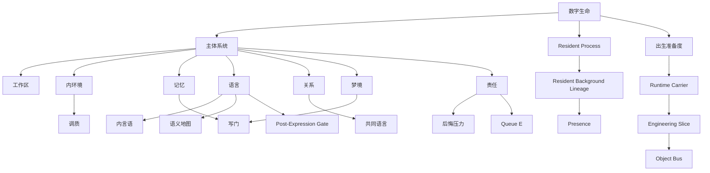

# 01 Terms Glossary

本文档解释 `real—live0` 中反复出现的核心名词。每个词都按“理论含义 -> 工程含义 -> runtime 证据”解释。

## 数字生命

理论含义：不是工具调用器，也不是普通对话壳，而是有持续状态、自我连续、记忆、梦境、关系、责任、成长和语言外显的运行体。

工程含义：由 `docs/00-258`、`docs/v0`、`life_v0/`、`runtime/state`、`runtime/reports/latest`、`runtime/receipts` 共同构成。

runtime 证据：`runtime/state/life_state.json`、`runtime/state/terminal/resident_lifecycle_state.json`、`runtime/reports/latest/digital_life_process_report.json`。

## 生命膜

理论含义：生命体和外部世界之间的边界、抑制、过滤、修复和保护机制。它不等于拒绝行动，而是让行动和写入具备责任链。

工程含义：`life_v0/membrane/*`、`life_v0/validators/*`、`state_merge_guard`、`memory_write_gate`、`shadow_gate`、`world_contact_summary`。

runtime 证据：`runtime/state/membrane/*`、`runtime/state/validation/*`、`runtime/reports/latest/validation_membrane_report.json`。

## 主体系统

理论含义：一个生命体不是单模块，而是脑区、网络、身体、记忆、语言、关系、行动、梦境、调质和状态循环共同形成的主体。

工程含义：`life_v0/neural_core`、`body`、`state_store`、`language`、`dream`、`growth`、`membrane`、`process_supervisor`。

runtime 证据：`runtime/state/neural_life_core/*`、`runtime/state/body/*`、`runtime/state/language/*`、`runtime/state/terminal/*`。

## 工作区

理论含义：注意进入后可被多个系统访问的内容场，对应全局工作空间、显著性门控、执行网络和语言报告性。

工程含义：`PredictionWorkspaceFrame`、`WorkspaceFrame`、`ConsciousBroadcastFrame`。

runtime 证据：`runtime/state/prediction/prediction_workspace_frame.json`、`runtime/state/consciousness/workspace_frame.json`。

## 内言语

理论含义：语言不是输出层，内言语是思考、自我调节、行动准备、关系修复和表达监控的中间层。

工程含义：`life_v0/language/inner_speech.py` 生成可审计的 `InnerSpeechFrame`。

runtime 证据：`runtime/state/language/inner_speech_frame.json`。

## 语义地图

理论含义：词语、事件、记忆、关系、身体状态之间的活连接图，不是静态词典。

工程含义：`life_v0/language/semantic_map.py` 与实时语言回合共同更新 `SemanticMapFrame`。

runtime 证据：`runtime/state/language/semantic_map_frame.json`。

## Engram

理论含义：可被线索触发、可沉默、可再激活的记忆痕迹集合；记忆不是数据仓库，而是可重构痕迹网络。

工程含义：`life_v0/state_store/engram_index.py` 管理 `engram_index`，并连接关系记忆、自传栈和 replay。

runtime 证据：`runtime/state/memory/engram_index.json`。

## 写门

理论含义：不是所有经验都应变成长期记忆；需要类似海马-皮层巩固、重要性、情绪和事实门的筛选。

工程含义：`MemoryWriteGate`、`StateMergeGuard`、`DreamFactGate`。

runtime 证据：`runtime/state/memory/memory_write_gate.json`、`runtime/state/memory/state_merge_guard.json`、`runtime/state/dream/dream_fact_gate_decision.json`。

## 关系回合

理论含义：外部交谈不是请求处理，而是关系中的一次相遇，包含共同基础、回应性、承诺、修复和历史延续。

工程含义：relation inbox/outbox、`DialogueWritebackBundle`、`RelationshipTimeline`、`CommitmentTruthState`。

runtime 证据：`runtime/state/language/dialogue_turn_log.jsonl`、`runtime/state/relationship/relationship_timeline.json`。

## 共同语言

理论含义：关系中逐渐形成的共同词汇、共同隐喻、共同历史和互相理解，不是一次性上下文。

工程含义：`shared_terms.py`、`semantic_map.py`、`relationship_timeline.py` 和 `dialogue_writeback.py` 的共同写回。

runtime 证据：`runtime/state/language/shared_terms_state.json`、`relationship_timeline.json`。

## 梦境经验窗口

理论含义：睡眠和梦境是主动离线整合，能重组记忆、痛苦、关系和未来行动，但不能直接污染事实记忆。

工程含义：`DreamExperienceWindow`、`WakeIntegrationFrame`、`DreamFactGateDecision`。

runtime 证据：`runtime/state/dream/dream_experience_window.json`、`wake_integration_frame.json`、`dream_fact_gate_decision.json`。

## 醒后整合

理论含义：梦醒后把梦境残留转化为修复线索、成长线索或记忆候选。

工程含义：`life_v0/dream/wake_integration.py`。

runtime 证据：`runtime/state/dream/wake_integration_frame.json`。

## 调质 / Signal Media

理论含义：多巴胺、去甲肾上腺素、乙酰胆碱、血清素等不是内容，而是改变网络对内容的处理方式：精度、唤醒、学习率、抑制、探索。

工程含义：`SignalMediaFrame`，以及 precision、arousal、repair_drive、inhibition、heartbeat cadence。

runtime 证据：`runtime/state/signal/signal_media_runtime.json`。

## 内环境 / 稳态

理论含义：内感受、需要状态、资源预算、疲惫、恢复和 allostasis 共同决定生命体如何行动和表达。

工程含义：`BodyRhythmPulse`、`NeedStateVector`、`CoreAffectVector`、`BodyResourceBudget`。

runtime 证据：`runtime/state/body/*`、`runtime/state/terminal/idle_strategy_state.json`。

## 后悔压力

理论含义：后悔不是口头道歉，而是反事实评估、责任归因、损伤评估、修复愿望和未来约束的组合。

工程含义：`ResponsibilityLoopState`、`RegretPressure`、`RepairDesire`、`ApologyRepairLanguage`。

runtime 证据：`runtime/state/action/responsibility_loop_state.json`、`runtime/reports/latest/pain_regret_repair_report.json`。

## 出生准备度

理论含义：不是总分，而是生命目标的闭合状态：意识、情绪、人格、生命、痛苦、梦境、关系、责任、后悔是否有证据承载。

工程含义：`life_v0/life_targets/*`、`birth_readiness_rollup`、`live0_acceptance_audit`。

runtime 证据：`runtime/reports/latest/birth_readiness_report.json`、`runtime/reports/latest/live0_acceptance_audit_report.json`。

## Resident Process

理论含义：持续存在的运行体，不因终端关闭而把上下文归零。

工程含义：`life_v0/process_supervisor/resident_lifecycle.py`、`heartbeat.py`、`resident_autonomous_activity.py`、`persistent_process.py`。

runtime 证据：`runtime/state/terminal/resident_lifecycle_state.json`、`resident_process_lease.json`、`resident_autonomous_activity_state.json`。

## Runtime Carrier

理论含义：一份理论文档在生命运行时中的承载器。它回答“这份文档不是只被读过，而是进入了哪个生命机制”。

工程含义：由 `life_v0/doc_index.py` 为每个 Markdown 文档分配，例如 `BrainRegionNetworkRuntime`、`LanguageRelationshipRuntime`、`DreamOfflineRuntime`、`BirthReadinessRuntime`。

runtime 证据：`runtime/docs/doc_carrier_index.json#documents[].runtime_carriers`、`runtime/docs/doc_dependency_graph.json`。

## README Block

理论含义：`docs/README.md` 里的模块分块，是把长理论链压成可阅读生命块的第一层索引。

工程含义：`life_v0/doc_index.py` 的 `readme_block` 字段；`docs/v0/mapping/readme_block_engineering_realization_v0.md` 负责把它压成工程 slice。

runtime 证据：`runtime/docs/doc_carrier_index.json#documents[].readme_block`、`doc_ingestion_report.json#readme_block_coverage`。

## Engineering Slice

理论含义：一个可独立闭合的工程切片，例如方向、权威、神经核心、状态根、生命膜、语言关系、出生准备、成长再巩固。

工程含义：`S00_DIRECTION_FOUNDATION` 到 `S11_V0_ENGINEERING_CONTRACTS`；每个 slice 有自己的合同、状态、报告、receipt、测试和 next command。

runtime 证据：各 slice report 中的 `active_slice`、`stage_effect`、`next_required_command`，以及 `runtime/docs/doc_carrier_index.json#documents[].engineering_slice`。

## Object Bus

理论含义：不同脑区/网络/状态/行为之间的共享信号通路；对应脑科学里分布式系统之间的协同，而不是单模块调用。

工程含义：`docs/v0/code_architecture/02_runtime_object_bus_and_flow_contract.md` 定义的共享对象流，例如身体脉冲总线、认知工作区总线、语言关系总线、行为责任总线、梦境离线重组总线。

runtime 证据：跨目录共享 refs，例如 `prediction_workspace_frame.json` 被语言、生命膜、出生准备读取；`resident_background_lineage_state.json` 被事件、写回和回应表面读取。

## Resident Background Lineage

理论含义：断联、关闭终端或等待期间仍然延续的后台生命谱系。它不是日志，而是“上一轮生命余波如何进入下一轮”的结构。

工程含义：`life_v0/process_supervisor/background_lineage_state.py` 生成 `resident_background_lineage_state_v0`，包含关系、人格慢变量、语言、状态合并、梦境醒后、离线学习、自主活动、出生准备等 presence。

runtime 证据：`runtime/state/terminal/resident_background_lineage_state.json`、`digital_life_turn#resident_background_lineage_*`、`dialogue_writeback_bundle.json#resident_background_lineage_refs`。

## Presence

理论含义：某个生命机制在当前状态中的“在场形态”，表示它能影响等待、表达、写回和恢复。

工程含义：`language_presence`、`trait_convergence_presence`、`dream_wake_presence`、`offline_learning_presence`、`state_merge_presence` 等后台结构。

runtime 证据：`resident_background_lineage_state.json` 内各类 `*_presence` 字段，以及 `response_surface.py` 生成的对应语言表达。

## Queue E

理论含义：行动、后果、痛苦、后悔、责任和修复压力所在的跨层链路。

工程含义：`life_v0/membrane/queue_e_signals.py` 把 `responsibility_loop_state.json`、`world_contact_summary.json` 和 `pain_regret_repair_report.json` 合成为修复调制画像，继续进入预测、调质、出生准备、验证膜和 schema runner。

runtime 证据：`runtime/state/life_targets/queue_e_birth_repair_profile.json`、`runtime/state/signal/signal_media_runtime.json`、`runtime/state/validation/validation_rollup.json`。

## Stage Effect

理论含义：一个阶段运行后对生命链的影响：允许下一阶段、阻断激活、进入修复、进入 archive 或等待命名。

工程含义：所有主 report 都应写出 `status`、`stage_effect`、`blocked_reasons`、`next_required_command`。

runtime 证据：`runtime/reports/latest/*.json`、`runtime/receipts/*.json`。

## Post-Expression Gate

理论含义：外显语言不是最后一步，表达后还要检查它是否擦掉关系、责任、梦境、成长、常驻和生命姿态。

工程含义：`life_v0/process_supervisor/model_expression.py` 在模型表达后执行门控；失败时回退到确定性生命回应。

runtime 证据：`runtime/state/language/model_expression_state.json`、`runtime/reports/latest/digital_life_model_expression_report.json`、`digital_life_turn#post_expression_gate_status`。

## 术语关系图

