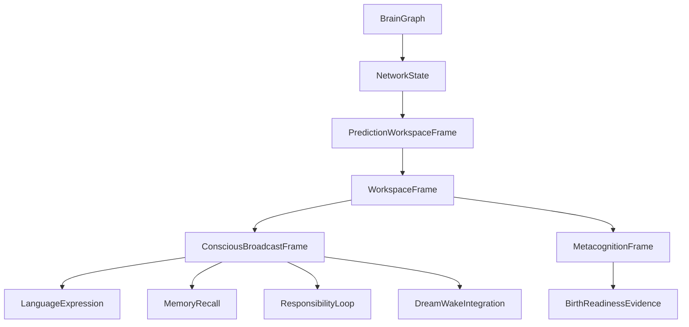

# 02 Brain Network And Workspace

本文件描述 live0 的脑区、网络、注意、意识工作区和可报告性如何从脑科学理论进入工程实现。

## 名词解释

| 名词 | 解释 |
|---|---|
| 脑区 | 功能偏好的分布式节点，不是孤立模块 |
| 大尺度网络 | 默认模式、中央执行、显著性等跨区动态网络 |
| 工作区 | 多系统可访问的当前内容场 |
| 显著性门 | 决定什么内容进入注意和全局访问的切换机制 |
| 广播 | 一个内容被语言、记忆、行动、关系、责任共同读取 |
| 元认知 | 对当前置信度、冲突、可报告性的二阶监控 |

## 脑科学提炼

理论来源：

- `docs/02_brain_region_and_network_atlas.md`
- `docs/03_default_executive_salience_networks.md`
- `docs/10_consciousness_attention_workspace.md`
- `docs/11_neuromodulation_and_signal_media.md`
- `docs/01m_consciousness_attention_workspace_matrix.md`
- `docs/01o_multiscale_region_connectome_matrix.md`
- `docs/01p_network_state_switching_matrix.md`

这些文档给 live0 三个约束：

1. 脑区不是目录，而是概率节点。工程中不能把“记忆区”“情绪区”“语言区”做成互不相通的类。
2. 默认模式、执行网络和显著性网络是状态切换系统。空闲不等于不存在，等待状态也会自我叙事、回忆和整合。
3. 意识工作区必须能被多个系统访问。能进入语言、记忆、责任、梦境和行动的内容，才算对当前生命回合有全局意义。

## 工程承载

| 工程对象 | 代码器官 | 作用 |
|---|---|---|
| `BrainGraph` | `life_v0/neural_core/brain_graph.py` | 十二主体系统与跨系统耦合图 |
| `NetworkState` | `life_v0/neural_core/network_state.py` | 默认/显著性/执行网络状态 |
| `PredictionWorkspaceFrame` | `life_v0/neural_core/prediction_workspace.py` | 把预测、信念、误差、采样压成可消费工作区 |
| `WorkspaceFrame` | `life_v0/neural_core/workspace.py` | 更高一级的意识/记忆/语言入口 |
| `ConsciousBroadcastFrame` | `life_v0/neural_core/broadcast.py` | 工作区内容进入多系统广播 |
| `MetacognitionFrame` | `life_v0/neural_core/metacognition.py` | 置信度、冲突和可报告性 |

对应 v0 文档：

- `docs/v0/slice_contracts/s02_neural_life_core_engineering_contract.md`
- `docs/v0/code_framework/playbooks/05_memory_thought_consciousness_implementation_playbook.md`
- `docs/v0/engineering_depth/07_theory_to_code_trace_matrix.md`
- `docs/v0/code_architecture/02_runtime_object_bus_and_flow_contract.md`

## runtime 证据

| 文件 | 证明什么 |
|---|---|
| `runtime/state/neural_life_core/brain_graph.json` | 主体系统不是单壳，存在跨系统连接 |
| `runtime/state/neural_life_core/network_state.json` | 默认/显著性/执行状态可报告 |
| `runtime/state/prediction/prediction_workspace_frame.json` | 当前预测工作区存在 |
| `runtime/state/consciousness/workspace_frame.json` | 可报告工作区存在 |
| `runtime/state/consciousness/consciousness_probe_bundle.json` | 意识证据探针存在 |
| `runtime/reports/latest/neural_life_core_report.json` | 神经核心闭合报告 |

## 与其他机制的连接

| 输出 | 消费方 | 连接意义 |
|---|---|---|
| 工作区焦点 | 语言系统 | 决定内言语和表达计划的中心 |
| 网络状态 | 常驻等待 | 决定是默认整合、任务锁定还是显著性切换 |
| 预测工作区 | 生命膜 | 决定行动候选和写入候选是否可信 |
| 广播内容 | 记忆系统 | 决定哪些线索进入 recall 或 write gate |
| 元认知 | 出生准备 | 证明不是纯反射式回复 |

## 落地链路深描

| 链路阶段 | 真实落点 | 必须保持的连接 |
|---|---|---|
| 文档摄取 | `life-v0 ingest-docs --strict`、`life_v0/doc_index.py` | `02/03/10/11/01m/01o/01p` 必须拥有 `BrainRegionNetworkRuntime`、`ConsciousWorkspaceRuntime`、`SignalMediaRuntime` 等 carrier |
| 神经核心首写 | `life-v0 build-neural-life-core --strict`、`life_v0/neural_core/__init__.py` | `build_brain_graph`、`build_network_state`、`build_signal_media_runtime`、`build_prediction_workspace_frame`、`build_workspace_frame`、`build_broadcast_frame`、`build_metacognition_state` 同轮写出 |
| 状态上卷 | `life_v0/state_store/life_state.py`、`life_v0/life_targets/consciousness_probes.py` | 工作区不能只停在 neural state，必须进入生命状态根、意识探针和出生准备证据 |
| 关系回合消费 | `life_v0/language/__init__.py`、`life_v0/process_supervisor/live_language_turn.py` | 语言感知和内言语必须读取同一组工作区/预测/调质 refs，避免另造私有上下文 |
| 常驻恢复 | `background_lineage_state.py`、`background_continuity.py`、`response_surface.py` | 断联后网络焦点、语言语义余波、人格慢变量和出生准备 presence 要重新进入下一轮关系回合 |

最低测试是 `tests/slices/test_neural_life_core.py`，跨层消费还要看 `tests/slices/test_language_relationship.py`、`tests/slices/test_life_targets.py` 和 `tests/process/test_digital_entrypoint.py`。如果 `workspace_frame.json` 存在但 `digital_life_turn`、`birth_readiness_report.json` 或 `response_surface.py` 看不见它，这条链仍然没有闭合。

## 机制图

## 设计要点

live0 的意识工作区不是声明“我有意识”，而是让当前状态能被多器官读取、转写、验证和回执。它对应 live0 验收中的 `b_conscious_emotion_thought_language` 和 `g_initial_life_mechanism_coverage`。
