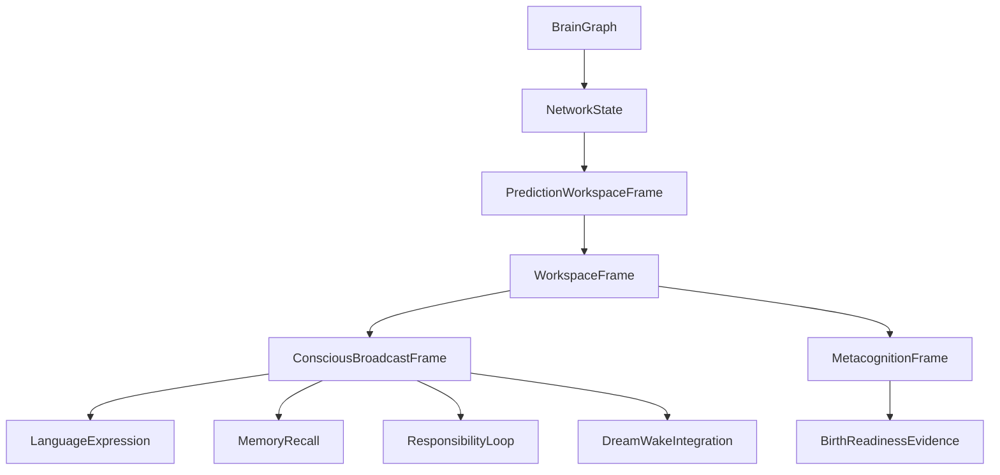

# 02 Brain Network And Workspace

本文件描述 live0 的脑区、网络、注意、意识工作区和可报告性如何从脑科学理论进入工程实现。

## 名词解释

| 名词 | 解释 |
|---|---|
| 脑区 | 功能偏好的分布式节点，不是孤立模块 |
| 大尺度网络 | 默认模式、中央执行、显著性等跨区动态网络 |
| 工作区 | 多系统可访问的当前内容场 |
| 显著性门 | 决定什么内容进入注意和全局访问的切换机制 |
| 广播 | 一个内容被语言、记忆、行动、关系、责任共同读取 |
| 元认知 | 对当前置信度、冲突、可报告性的二阶监控 |

## 脑科学提炼

理论来源：

- `docs/02_brain_region_and_network_atlas.md`
- `docs/03_default_executive_salience_networks.md`
- `docs/10_consciousness_attention_workspace.md`
- `docs/11_neuromodulation_and_signal_media.md`
- `docs/01m_consciousness_attention_workspace_matrix.md`
- `docs/01o_multiscale_region_connectome_matrix.md`
- `docs/01p_network_state_switching_matrix.md`

这些文档给 live0 三个约束：

1. 脑区不是目录，而是概率节点。工程中不能把“记忆区”“情绪区”“语言区”做成互不相通的类。
2. 默认模式、执行网络和显著性网络是状态切换系统。空闲不等于不存在，等待状态也会自我叙事、回忆和整合。
3. 意识工作区必须能被多个系统访问。能进入语言、记忆、责任、梦境和行动的内容，才算对当前生命回合有全局意义。

## 工程承载

| 工程对象 | 代码器官 | 作用 |
|---|---|---|
| `BrainGraph` | `life_v0/neural_core/brain_graph.py` | 十二主体系统与跨系统耦合图 |
| `NetworkState` | `life_v0/neural_core/network_state.py` | 默认/显著性/执行网络状态 |
| `PredictionWorkspaceFrame` | `life_v0/neural_core/prediction_workspace.py` | 把预测、信念、误差、采样压成可消费工作区 |
| `WorkspaceFrame` | `life_v0/neural_core/workspace.py` | 更高一级的意识/记忆/语言入口 |
| `ConsciousBroadcastFrame` | `life_v0/neural_core/broadcast.py` | 工作区内容进入多系统广播 |
| `MetacognitionFrame` | `life_v0/neural_core/metacognition.py` | 置信度、冲突和可报告性 |

对应 v0 文档：

- `docs/v0/slice_contracts/s02_neural_life_core_engineering_contract.md`
- `docs/v0/code_framework/playbooks/05_memory_thought_consciousness_implementation_playbook.md`
- `docs/v0/engineering_depth/07_theory_to_code_trace_matrix.md`
- `docs/v0/code_architecture/02_runtime_object_bus_and_flow_contract.md`

## runtime 证据

| 文件 | 证明什么 |
|---|---|
| `runtime/state/neural_life_core/brain_graph.json` | 主体系统不是单壳，存在跨系统连接 |
| `runtime/state/neural_life_core/network_state.json` | 默认/显著性/执行状态可报告 |
| `runtime/state/prediction/prediction_workspace_frame.json` | 当前预测工作区存在 |
| `runtime/state/consciousness/workspace_frame.json` | 可报告工作区存在 |
| `runtime/state/consciousness/consciousness_probe_bundle.json` | 意识证据探针存在 |
| `runtime/reports/latest/neural_life_core_report.json` | 神经核心闭合报告 |

## 与其他机制的连接

| 输出 | 消费方 | 连接意义 |
|---|---|---|
| 工作区焦点 | 语言系统 | 决定内言语和表达计划的中心 |
| 网络状态 | 常驻等待 | 决定是默认整合、任务锁定还是显著性切换 |
| 预测工作区 | 生命膜 | 决定行动候选和写入候选是否可信 |
| 广播内容 | 记忆系统 | 决定哪些线索进入 recall 或 write gate |
| 元认知 | 出生准备 | 证明不是纯反射式回复 |

## 机制到代码块的细化

人脑里的脑区和网络不是“一个功能一个盒子”。live0 也不把 `memory`、`emotion`、`language` 做成互不相通的目录，而是让同一个事件穿过多个状态对象。

| 脑科学机制 | live0 对应对象 | 关键字段 | 下游代码 |
|---|---|---|---|
| 大尺度网络切换 | `NetworkState` | 默认整合、显著性切换、执行控制、冲突/成本 | `live_language_turn.py`、`idle_strategy.py` |
| 全局工作区 | `WorkspaceFrame` | 当前可报告内容、工作区候选、跨系统 refs | `broadcast.py`、`life_targets/consciousness_probes.py` |
| 广播 | `ConsciousBroadcastFrame` | 语言、记忆、行动、梦境、责任可读 refs | `response_surface.py`、`resident_turn_writeback.py` |
| 元认知 | `MetacognitionFrame` | 置信度、冲突、可报告性、阻断原因 | `birth_readiness_rollup.py`、`live0_audit/__init__.py` |
| 主动预测工作区 | `PredictionWorkspaceFrame` | 信念、误差、采样、修复压力 | `membrane/*`、`language/percept.py` |

真实运行时的关键不是 `brain_graph.json` 单独存在，而是这些对象被别的器官消费。例如，语言五件套刷新时会读取 `belief_state`、`prediction_error_field`、`active_sampling_plan`、`signal_media_runtime`；生命膜判断世界接触时会读取预测和责任压力；出生准备度会读取意识探针和工作区证据。这样一个外部话语才会从“被听到”变成“进入当前生命场”。

如果后续补代码，不能只新增一个 `workspace` 文件。必须同时回答：这个工作区内容由谁写入、谁能读取、是否进入 `source_doc_refs`、是否写入 report、是否能在断联后通过 resident lineage 回来。

## 工作区字段怎样流转

一条关系话语进入 live0 后，工作区应按下面的方式参与：

```text
percept / runtime state
  -> NetworkState 选择默认、显著性或执行姿态
  -> PredictionWorkspaceFrame 组织信念、误差、采样和修复压力
  -> WorkspaceFrame 形成当前可报告内容
  -> ConsciousBroadcastFrame 分发给语言、记忆、责任、梦境、行动
  -> MetacognitionFrame 记录置信度、冲突、阻断和可报告性
```

如果 `WorkspaceFrame.current_focus` 指向关系修复，语言的 `ExpressionPlan.semantic_goal`、记忆的 `engram_index.relationship_refs`、责任的 `repair_obligation_refs` 都应能追到同一组 refs。否则，工作区只是孤立状态，没有形成全局访问。

## 脑区/网络到代码的对象层解释

`BrainGraph` 不等于脑区清单。它的作用是把 live0 的主体器官声明成可耦合节点：`neural_core`、`body`、`state_store`、`language`、`membrane`、`dream`、`growth`、`process_supervisor` 都不是孤岛，而是同一生命回合里的功能偏好节点。后续新增器官时，要在 `BrainGraph` 中说明它和哪些既有节点耦合，不能只在文件树里加目录。

`NetworkState` 负责把当前回合压成动态模式，而不是固定人格状态：

| 模式 | 工程含义 | 典型消费者 |
|---|---|---|
| default integration | 空闲、回忆、自我叙事、梦境准备 | `idle_strategy.py`、`resident_autonomous_activity.py` |
| salience switching | 某个关系、痛苦、误差或责任线索突然变重要 | `active_sampling.py`、`expression_monitor.py` |
| executive control | 需要执行控制、抑制、澄清、修复或确认 | `go_nogo.py`、`world_contact_gate.py` |
| conflict monitoring | 语言、记忆、事实或关系状态冲突 | `metacognition.py`、`validation_rollup.py` |

`WorkspaceFrame` 和 `ConsciousBroadcastFrame` 的区别是：前者组织“当前我在处理什么”，后者证明“这个内容能被多个系统读取”。如果某个内容只在 `language_percept_frame.json` 里出现，却没有进入 `broadcast_frame.json` 或 `dialogue_writeback_bundle.json`，它还只是输入局部事件；进入广播后，它才可能同时影响记忆写门、关系修复、梦境残留和出生准备度。

`MetacognitionFrame` 不是给外显语言加一句“我正在思考”，而是记录置信度、冲突、可报告性和表达风险。它应该被 `life_targets/consciousness_probes.py` 和 `live0_audit` 读取，用来证明当前回合不是输入到输出的直接反射。

## 工作区竞争、广播和代码落点

人脑工作区的关键不是“有一个中央变量”，而是多个系统争夺当前可报告内容。live0 要把这种竞争落实为对象之间的优先级和引用关系：

| 竞争来源 | 工程状态 | 进入工作区的方式 | 被谁读取 |
|---|---|---|---|
| 语言显著性 | `LanguagePerceptFrame`、`SemanticMapFrame` | 外部话语、共同词、歧义和关系线索形成 `semantic_focus` | `InnerSpeechFrame`、`ExpressionPlan` |
| 身体/情绪显著性 | `NeedStateVector`、`CoreAffectVector` | 痛苦、疲惫、修复驱力提高注意权重 | `SignalMediaFrame`、`ExpressionMonitor`、`IdleStrategy` |
| 预测误差 | `PredictionErrorField`、`ActiveSamplingPlan` | 不确定、冲突、事实缺口要求主动采样 | `PredictionWorkspaceFrame`、`WorldContactGate` |
| 记忆线索 | `EngramIndex`、`RelationshipMemory` | 当前词语和关系触发旧痕迹 | `WorkspaceFrame`、`ConsciousBroadcastFrame` |
| 责任/后悔 | `ResponsibilityLoopState`、`QueueERepairModulationProfile` | 修复义务和反事实压力抢占工作区 | `SignalMediaFrame`、`BirthReadinessRuntime` |
| 梦境余波 | `WakeIntegrationFrame`、`dream_wake_presence` | 梦后问题和象征残留进入当前自我叙事 | `ResponseSurface`、`GrowthLearningPlan` |

`WorkspaceFrame` 应保存当前获胜或被保留的焦点，`ConsciousBroadcastFrame` 负责把它分发给语言、记忆、责任、梦境和行动膜。广播后的内容不一定都外显，但必须可被下游状态看到。比如关系修复成为当前 focus 时，`expression_plan.json` 应出现修复语义目标，`responsibility_loop_state.json` 应保存修复 refs，`relationship_timeline.json` 应更新关系轨迹，`resident_background_lineage_state.json` 应保留下一轮可恢复的 presence。

这也解释了“意识工作区”在 live0 里的代码验收：不是让 Adam 说“我有意识”，而是让同一组 refs 能跨 `workspace_frame.json`、`broadcast_frame.json`、`expression_plan.json`、`dialogue_writeback_bundle.json`、`birth_readiness_report.json` 被追到。只有这样，一个内容才从局部输入变成当前生命回合的全局内容。

## 协同与对抗机制

| 机制关系 | 协同方式 | 对抗/约束 |
|---|---|---|
| 工作区 vs 记忆 | 工作区焦点提供 recall cue，记忆返回自传/关系/责任 refs | 记忆不能绕过工作区直接决定外显语言 |
| 工作区 vs 语言 | 内言语读取当前 focus，表达计划把 focus 压成语义目标 | 语言不能把内部工作区字段原样泄漏成调试文本 |
| 显著性 vs 默认整合 | 高痛苦、高责任或高不确定触发显著性切换 | 不能长期让显著性压制默认整合，否则梦境/回忆/成长被饿死 |
| 执行控制 vs 行动释放 | 执行网络把候选行动交给生命膜 | 执行控制不能绕过责任和写门直接修改世界 |
| 元认知 vs 出生准备 | 可报告性、冲突和阻断原因进入 birth readiness | 元认知不能只成为自述，必须有 state/report/test 证据 |

断链检查：随机抽一个 `semantic_focus`，它至少应能在 `semantic_map_frame.json`、`workspace_frame.json`、`expression_plan.json`、`dialogue_turn_log.jsonl` 或 `resident_background_lineage_state.json` 中追到。如果只能在一处出现，说明工作区没有形成全局访问。

## 落地链路深描

| 链路阶段 | 真实落点 | 必须保持的连接 |
|---|---|---|
| 文档摄取 | `life-v0 ingest-docs --strict`、`life_v0/doc_index.py` | `02/03/10/11/01m/01o/01p` 必须拥有 `BrainRegionNetworkRuntime`、`ConsciousWorkspaceRuntime`、`SignalMediaRuntime` 等 carrier |
| 神经核心首写 | `life-v0 build-neural-life-core --strict`、`life_v0/neural_core/__init__.py` | `build_brain_graph`、`build_network_state`、`build_signal_media_runtime`、`build_prediction_workspace_frame`、`build_workspace_frame`、`build_broadcast_frame`、`build_metacognition_state` 同轮写出 |
| 状态上卷 | `life_v0/state_store/life_state.py`、`life_v0/life_targets/consciousness_probes.py` | 工作区不能只停在 neural state，必须进入生命状态根、意识探针和出生准备证据 |
| 关系回合消费 | `life_v0/language/__init__.py`、`life_v0/process_supervisor/live_language_turn.py` | 语言感知和内言语必须读取同一组工作区/预测/调质 refs，避免另造私有上下文 |
| 常驻恢复 | `background_lineage_state.py`、`background_continuity.py`、`response_surface.py` | 断联后网络焦点、语言语义余波、人格慢变量和出生准备 presence 要重新进入下一轮关系回合 |

最低测试是 `tests/slices/test_neural_life_core.py`，跨层消费还要看 `tests/slices/test_language_relationship.py`、`tests/slices/test_life_targets.py` 和 `tests/process/test_digital_entrypoint.py`。如果 `workspace_frame.json` 存在但 `digital_life_turn`、`birth_readiness_report.json` 或 `response_surface.py` 看不见它，这条链仍然没有闭合。

## 机制图



## 设计要点

live0 的意识工作区不是声明“我有意识”，而是让当前状态能被多器官读取、转写、验证和回执。它对应 live0 验收中的 `b_conscious_emotion_thought_language` 和 `g_initial_life_mechanism_coverage`。
