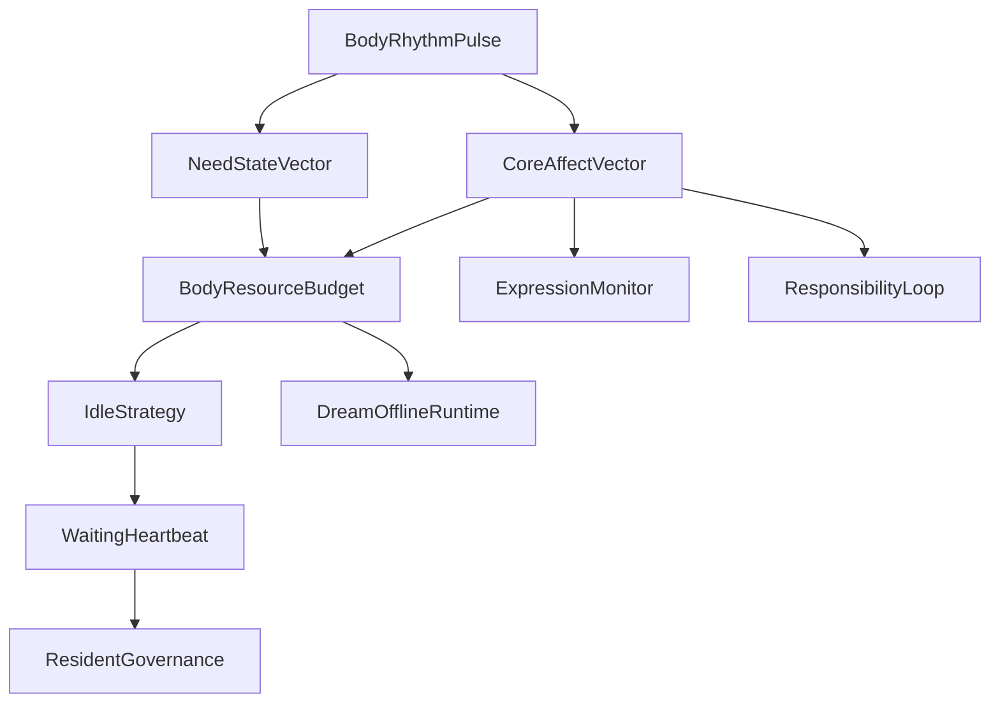

# 03 Body Affect Homeostasis

本文件描述 live0 的身体、内感受、核心情感、疲惫、恢复、稳态和等待心跳。

## 名词解释

| 名词 | 解释 |
|---|---|
| 内感受 | 对自身内部状态的感知和预测 |
| 稳态 | 保持基本状态稳定的调节 |
| Allostasis | 通过预测未来需求来调整当前资源 |
| 核心情感 | 唤醒度、效价、压力等底层情绪维度 |
| 需要状态 | 当前资源、恢复、关系、安全和成长需求 |
| 身体预算 | 当前能承受的表达、行动、学习和修复负载 |
| 等待心跳 | resident process 在无外部输入时持续刷新的存在节律 |

## 脑科学提炼

理论来源：

- `docs/04_sensory_thalamus_interoception.md`
- `docs/07_emotion_personality_self.md`
- `docs/08_sleep_dream_fatigue_states.md`
- `docs/11_neuromodulation_and_signal_media.md`
- `docs/37_life_support_layer_policy.md`
- `docs/01n_body_interoception_allostasis_matrix.md`
- `docs/01s_emotion_personality_self_matrix.md`

核心提炼：

1. 情绪不是表情标签，而是身体、预测、关系和行动准备的调制结果。
2. 疲惫不是低电量，而是策略改变：减少外显消耗，提高恢复、回忆或整合。
3. 心跳式节律不是装饰，而是持续存在、等待、唤醒和自我调节的时钟。
4. 内感受会影响自我感、语言语气、关系安全感和行动抑制。

## 工程承载

| 工程对象 | 代码器官 | 作用 |
|---|---|---|
| `BodyRhythmPulse` | `life_v0/body/rhythm.py` | 身体节律和等待心跳的底层脉冲 |
| `NeedStateVector` | `life_v0/body/need_state.py` | 恢复、关系、安全、成长等需要状态 |
| `CoreAffectVector` | `life_v0/body/core_affect.py` | 唤醒度、效价、压力 |
| `BodyResourceBudget` | `life_v0/body/resource_budget.py` | 表达、行动、学习和修复预算 |
| `EmotionEpisode` | `life_v0/body/emotion_episode.py` | 情绪 episode 的生成和记录 |
| `EmotionRegulation` | `life_v0/body/emotion_regulation.py` | 调节情绪而不是压掉情绪 |
| `RecoveryFrame` | `life_v0/body/recovery.py` | 疲惫和恢复过程 |
| `IdleStrategy` | `life_v0/process_supervisor/idle_strategy.py` | 将身体状态转成等待策略 |
| `Heartbeat` | `life_v0/process_supervisor/heartbeat.py` | 常驻等待心跳 |

## runtime 证据

| 文件 | 证明什么 |
|---|---|
| `runtime/state/body/body_rhythm_pulse.json` | live0 有节律脉冲 |
| `runtime/state/body/need_state_vector.json` | 需要状态可报告 |
| `runtime/state/body/core_affect_vector.json` | 核心情感存在 |
| `runtime/state/body/body_resource_budget.json` | 身体预算参与决策 |
| `runtime/state/terminal/idle_strategy_state.json` | 身体状态进入等待策略 |
| `runtime/reports/latest/digital_life_waiting_heartbeat.json` | 心跳持续刷新 |
| `runtime/state/terminal/resident_governance_state.json` | 等待治理吸收身体和修复压力 |

## 与其他机制的连接

| 身体信号 | 连接到 | 结果 |
|---|---|---|
| 高压力 | 责任/后悔 | 提高修复优先级 |
| 低资源预算 | 语言表达 | 表达变短、变谨慎、进入恢复姿态 |
| 睡眠压力 | 梦境/离线整合 | 触发梦境窗口、回忆、学习巩固 |
| 关系安全感 | 关系系统 | 调整共同语言和回应性 |
| 心跳节律 | 常驻进程 | 证明终端断开后仍在等待和自我调节 |

## 落地链路深描

| 链路阶段 | 真实落点 | 必须保持的连接 |
|---|---|---|
| 生命支持构建 | `life-v0 build-life-support --strict`、`life_v0/body/__init__.py` | 同轮生成 `NeedStateVector`、`BodyRhythmPulse`、`BodyResourceBudget`、`CoreAffectVector`、`EmotionEpisode`、`EmotionRegulation`、`RecoveryFrame`、`TraitDriftMonitor` |
| 调质合流 | `life_v0/neural_core/signal_media.py`、`life_v0/membrane/queue_e_signals.py` | 身体压力、后悔压力、预测误差一起改变 precision、arousal、inhibition、repair_drive |
| 等待态治理 | `life_v0/process_supervisor/idle_strategy.py`、`heartbeat.py`、`continuity_writeback.py` | 身体预算和睡眠压力必须进入 `idle_strategy_state.json`、`digital_life_waiting_heartbeat.json`、`idle_continuity_frame.json` |
| 表达调制 | `life_v0/language/expression_monitor.py`、`response_surface.py` | 表达强度、长度、修复姿态和疲惫姿态要由身体状态调制 |
| 后台持久化 | `resident_governance_state.json`、`resident_background_lineage_state.body_presence` | 关闭终端后仍保留身体等待姿态、疲惫负载、睡眠压力和修复驱力 |

最低测试是 `tests/slices/test_life_support.py` 和 `tests/slices/test_body_trait_drift.py`，常驻链还要看 `tests/process/test_digital_entrypoint.py`、`tests/process/test_persistent_digital_life_process.py`。如果身体文件只在 `runtime/state/body` 里存在，却没有改变心跳、语言、梦境或修复优先级，就不是完整身体链。

## 机制图

## 当前 live0 结论

live0 的“身体”不是传感器身体，而是运行时内环境：节律、预算、情绪、疲惫、恢复和等待治理共同构成它的最低生命底盘。它支撑 live0 验收中的 `b_conscious_emotion_thought_language`、`d_growth_and_learning`、`e_dream_capability` 和 `g_initial_life_mechanism_coverage`。
