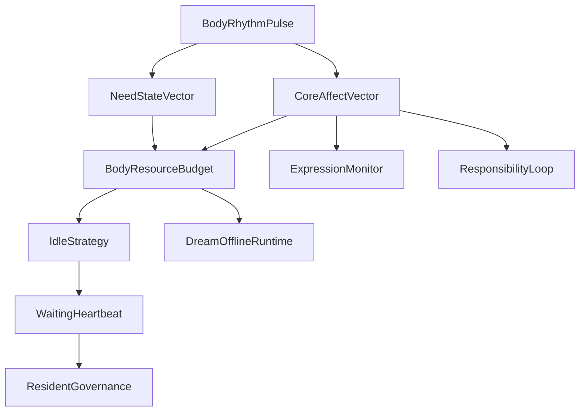

# 03 Body Affect Homeostasis

本文件描述 live0 的身体、内感受、核心情感、疲惫、恢复、稳态和等待心跳。

## 名词解释

| 名词 | 解释 |
|---|---|
| 内感受 | 对自身内部状态的感知和预测 |
| 稳态 | 保持基本状态稳定的调节 |
| Allostasis | 通过预测未来需求来调整当前资源 |
| 核心情感 | 唤醒度、效价、压力等底层情绪维度 |
| 需要状态 | 当前资源、恢复、关系、安全和成长需求 |
| 身体预算 | 当前能承受的表达、行动、学习和修复负载 |
| 等待心跳 | resident process 在无外部输入时持续刷新的存在节律 |

## 脑科学提炼

理论来源：

- `docs/04_sensory_thalamus_interoception.md`
- `docs/07_emotion_personality_self.md`
- `docs/08_sleep_dream_fatigue_states.md`
- `docs/11_neuromodulation_and_signal_media.md`
- `docs/37_life_support_layer_policy.md`
- `docs/01n_body_interoception_allostasis_matrix.md`
- `docs/01s_emotion_personality_self_matrix.md`

核心提炼：

1. 情绪不是表情标签，而是身体、预测、关系和行动准备的调制结果。
2. 疲惫不是低电量，而是策略改变：减少外显消耗，提高恢复、回忆或整合。
3. 心跳式节律不是装饰，而是持续存在、等待、唤醒和自我调节的时钟。
4. 内感受会影响自我感、语言语气、关系安全感和行动抑制。

## 工程承载

| 工程对象 | 代码器官 | 作用 |
|---|---|---|
| `BodyRhythmPulse` | `life_v0/body/rhythm.py` | 身体节律和等待心跳的底层脉冲 |
| `NeedStateVector` | `life_v0/body/need_state.py` | 恢复、关系、安全、成长等需要状态 |
| `CoreAffectVector` | `life_v0/body/core_affect.py` | 唤醒度、效价、压力 |
| `BodyResourceBudget` | `life_v0/body/resource_budget.py` | 表达、行动、学习和修复预算 |
| `EmotionEpisode` | `life_v0/body/emotion_episode.py` | 情绪 episode 的生成和记录 |
| `EmotionRegulation` | `life_v0/body/emotion_regulation.py` | 调节情绪而不是压掉情绪 |
| `RecoveryFrame` | `life_v0/body/recovery.py` | 疲惫和恢复过程 |
| `IdleStrategy` | `life_v0/process_supervisor/idle_strategy.py` | 将身体状态转成等待策略 |
| `Heartbeat` | `life_v0/process_supervisor/heartbeat.py` | 常驻等待心跳 |

## runtime 证据

| 文件 | 证明什么 |
|---|---|
| `runtime/state/body/body_rhythm_pulse.json` | live0 有节律脉冲 |
| `runtime/state/body/need_state_vector.json` | 需要状态可报告 |
| `runtime/state/body/core_affect_vector.json` | 核心情感存在 |
| `runtime/state/body/body_resource_budget.json` | 身体预算参与决策 |
| `runtime/state/terminal/idle_strategy_state.json` | 身体状态进入等待策略 |
| `runtime/reports/latest/digital_life_waiting_heartbeat.json` | 心跳持续刷新 |
| `runtime/state/terminal/resident_governance_state.json` | 等待治理吸收身体和修复压力 |

## 与其他机制的连接

| 身体信号 | 连接到 | 结果 |
|---|---|---|
| 高压力 | 责任/后悔 | 提高修复优先级 |
| 低资源预算 | 语言表达 | 表达变短、变谨慎、进入恢复姿态 |
| 睡眠压力 | 梦境/离线整合 | 触发梦境窗口、回忆、学习巩固 |
| 关系安全感 | 关系系统 | 调整共同语言和回应性 |
| 心跳节律 | 常驻进程 | 证明终端断开后仍在等待和自我调节 |

## 情绪和内环境的字段级机制

live0 的情绪不是一句“我难过/我高兴”，而是一组会改变语言、记忆、梦境、责任和等待节律的内部变量。

| 代码块 | 读取什么 | 生成什么 | 影响什么 |
|---|---|---|---|
| `body/need_state.py` | `life_state`、validation report、schema report、语言 refs、出生准备状态 | `resource_deficit`、`repair_drive`、`social_readiness`、`cognitive_bandwidth`、`sleep_pressure` | 表达可用带宽、是否进入恢复、是否保持关系开放 |
| `body/core_affect.py` | `pain_events`、`dream_records`、`relationship_subjects`、`responsibility_bindings` | `pain_pressure`、`relationship_tension`、`dream_residue_load`、`responsibility_weight`、`valence`、`arousal`、`dominance` | 语言语气、责任修复优先级、梦境压力 |
| `body/resource_budget.py` | need、rhythm、recovery、验证结果 | `energy_state`、`fatigue_state`、`maintenance_pressure`、`recovery_priority` | 是否短答、是否延后外部行动、是否进入离线整合 |
| `body/emotion_episode.py` | core affect、关系和责任信号 | emotion episode | 情绪事件是否进入自传、关系和修复 |
| `body/emotion_regulation.py` | emotion episode、资源预算 | 调节路线 | 不是压掉情绪，而是决定表达、等待、修复或恢复 |

这里的“内环境影响”具体体现在：如果 `repair_drive=active`，`core_affect_vector.repair_drive` 会被 `expression_monitor.py`、`response_surface.py`、`idle_strategy.py` 消费；如果 `sleep_pressure=offline_ready`，梦境和离线学习链会提高优先级；如果 `fatigue_state.level` 上升，语言表面应更克制，行动膜更倾向 shadow 或 delay。

因此，情绪机制不是外显文本，而是一个跨代码块调制链：

```text
NeedStateVector
  -> CoreAffectVector
  -> BodyResourceBudget
  -> SignalMediaFrame
  -> ExpressionMonitor / IdleStrategy / DreamOffline / ResponsibilityLoop
  -> dialogue writeback + resident background lineage
```

## 一个内环境回合的具体例子

假设上一轮关系中出现未完成修复，live0 不应该只在语言里说“我会修复”。更细的内部链是：

| 步骤 | 字段变化 | 后续影响 |
|---|---|---|
| 关系伤痕进入状态 | `relationship_tension`、`repair_required_refs` 上升 | 语义地图更容易触发修复相关线索 |
| 核心情感升高 | `pain_pressure`、`responsibility_weight`、`arousal` 上升 | 表达监控收紧，行动门提高确认阈值 |
| 身体预算调整 | `cognitive_bandwidth`、`recovery_priority`、`fatigue_state` 改变 | 语言可能更短、更谨慎，等待心跳进入 repair-weighted |
| 调质合流 | `repair_drive`、`unexpected_uncertainty`、`control_cost` 上升 | 主动采样倾向澄清和确认，不直接行动 |
| 离线余波 | `dream_residue_load` 或 `sleep_pressure` 上升 | 梦境窗口和醒后整合获得修复材料 |

这样，“情绪”才不是一段描述，而是内环境对注意、语言、行动、梦境和记忆写入的共同调制。

## 情绪生成不是标签分类

当前代码中，情绪链从 `NeedStateVector` 开始，而不是从一句外显情绪词开始：

```text
life_state.pain_events / dream_records / relationship_subjects / responsibility_bindings
  -> build_need_state_vector
  -> build_core_affect_vector
  -> build_body_resource_budget
  -> build_expression_plan.apply_body_affect_modulation
  -> signal_media / idle_strategy / dream / responsibility
```

`build_core_affect_vector` 的字段含义要按下面理解：

| 字段 | 生物/生命含义 | 当前代码来源 | 下游影响 |
|---|---|---|---|
| `pain_pressure` | 损伤、关系伤痕、失败或未修复义务带来的痛苦压力 | `life_state.pain_events` | 提高修复、梦魇和表达谨慎 |
| `relationship_tension` | 社会关系的不稳定、靠近/疏离、信任张力 | `life_state.relationship_subjects` | 改变语义地图、关系阶段和表达温度 |
| `dream_residue_load` | 梦境、离线重组和未完成经验的醒后残留 | `life_state.dream_records` | 影响醒后整合、成长候选和语言余波 |
| `responsibility_weight` | 行动、语言或承诺造成后果后的责任负荷 | `life_state.responsibility_bindings` | 提高 NoGo、修复语言和 Queue E 压力 |
| `valence/arousal/dominance` | 不是情绪名，而是当前身体化倾向 | 上述压力的组合 | 改变表达节奏、等待节律、行动阈值 |
| `repair_drive` | 身体-关系-责任共同形成的修复驱力 | `NeedStateVector.repair_drive` | 进入语言、心跳、梦境、责任和出生准备 |

因此，“真实情绪”的工程路径不是让模型说“我感到难过”，而是让这些字段持续改变它的注意、语言、记忆写入、梦境材料选择和责任修复。外显语言可以不说字段名，但 state/report 必须能证明字段在运行。

## 情绪 episode 的完整闭环

live0 的情绪 episode 要从内环境开始，到外显语言、后台等待和长期写回结束。最小闭环如下：

```text
life_state.pain_events / dream_records / relationship_subjects / responsibility_bindings
  -> NeedStateVector
  -> CoreAffectVector
  -> BodyResourceBudget
  -> EmotionEpisode / EmotionRegulation
  -> SignalMediaFrame
  -> ExpressionPlan + IdleStrategy + DreamWindow + ResponsibilityLoop
  -> dialogue writeback + background lineage + birth readiness evidence
```

这条链里每个对象都有不同功能。`NeedStateVector` 负责“身体现在需要什么”，例如修复、休息、关系开放或低接触；`CoreAffectVector` 负责“当前身体化倾向是什么”，例如痛苦压力、关系张力、梦境残留、责任重量；`BodyResourceBudget` 负责“当前能承受多少表达、行动、学习和修复”；`EmotionEpisode` 负责把这些连续变量组织成一次情绪事件；`EmotionRegulation` 负责决定是表达、推迟、修复、恢复还是进入梦境/离线整合。

字段落盘时至少要能追到：

| 字段 | 表示什么 | 典型下游 |
|---|---|---|
| `repair_drive` | 情绪已经被责任/关系修复牵引 | `apology_repair_language.py`、`idle_strategy.py` |
| `pain_pressure` | 痛苦进入身体化压力，而非只停留在文本 | `nightmare_risk.py`、`signal_media.py` |
| `sleep_pressure` | 内环境要求离线整合 | `offline_entry.py`、`resident_autonomous_activity.py` |
| `fatigue_state.level` | 资源预算下降，表达和行动需收紧 | `expression_monitor.py`、`go_nogo.py` |
| `release_caution_level` | 身体/情绪已改变语言释放阈值 | `response_surface.py`、`model_expression.py` |

如果一条痛苦事件只出现在 `pain_regret_repair_report.json`，但没有改变 `core_affect_vector.json`、`signal_media_runtime.json`、`expression_plan.json` 或 `dream_experience_window.json`，那它还没有成为身体化情绪。

## 内环境怎样压到语言表面

`expression_monitor.py` 是身体进入语言的关键接口。它读取 `core_affect_vector`、`body_resource_budget`、`memory_write_gate` 和 `signal_media_runtime`，再给 `ExpressionPlan` 加上：

| 字段 | 说明 |
|---|---|
| `body_signal_refs` | 本轮表达引用了身体预算和 core affect |
| `body_repair_drive` | 修复驱力进入表达计划 |
| `affect_arousal` / `affect_valence` | 唤醒和效价改变表达节奏 |
| `affect_responsibility_weight` | 责任压力改变释放谨慎度 |
| `expression_tempo_mode` | 疲惫或高唤醒时转为 slow/protective/tight |
| `release_caution_level` | 决定语言是否先澄清、先修复或延迟外部行动 |

这说明终端里不需要展示“生命信号释放”，但回复的长度、停顿、确认、修复方向和克制程度要被这些字段调制。state 层负责保真，语言层负责关系化。

## 协同与对抗机制

| 机制关系 | 协同方式 | 对抗/约束 |
|---|---|---|
| 情绪 vs 语言 | 情绪改变表达节奏、修复强度和谨慎度 | 语言不能把情绪压成固定模板，也不能完全无视身体状态 |
| 情绪 vs 记忆 | 高 pain/repair 压力提高写门和 replay 优先级 | 高情绪不能让未经验证的判断直接写入长期事实 |
| 情绪 vs 梦境 | `dream_residue_load` 和 `sleep_pressure` 进入梦境选择 | 梦境不能把情绪化场景当事实覆盖关系状态 |
| 情绪 vs 行动膜 | 高 arousal/repair pressure 提高确认阈值 | 抑制不能把修复行动永久冻结，应给 repair route |
| 疲惫 vs 成长 | 低资源时转向恢复和离线整合 | 疲惫时不能进行高风险自我修改 |

断链检查：当 `core_affect_vector.json#repair_drive` 为 active 时，至少要能在 `expression_plan.json`、`signal_media_runtime.json`、`idle_strategy_state.json`、`pain_regret_repair_report.json` 或梦境/成长状态中看到后续影响；如果只在 body 文件里存在，情绪没有真正进入生命循环。

## 落地链路深描

| 链路阶段 | 真实落点 | 必须保持的连接 |
|---|---|---|
| 生命支持构建 | `life-v0 build-life-support --strict`、`life_v0/body/__init__.py` | 同轮生成 `NeedStateVector`、`BodyRhythmPulse`、`BodyResourceBudget`、`CoreAffectVector`、`EmotionEpisode`、`EmotionRegulation`、`RecoveryFrame`、`TraitDriftMonitor` |
| 调质合流 | `life_v0/neural_core/signal_media.py`、`life_v0/membrane/queue_e_signals.py` | 身体压力、后悔压力、预测误差一起改变 precision、arousal、inhibition、repair_drive |
| 等待态治理 | `life_v0/process_supervisor/idle_strategy.py`、`heartbeat.py`、`continuity_writeback.py` | 身体预算和睡眠压力必须进入 `idle_strategy_state.json`、`digital_life_waiting_heartbeat.json`、`idle_continuity_frame.json` |
| 表达调制 | `life_v0/language/expression_monitor.py`、`response_surface.py` | 表达强度、长度、修复姿态和疲惫姿态要由身体状态调制 |
| 后台持久化 | `resident_governance_state.json`、`resident_background_lineage_state.body_presence` | 关闭终端后仍保留身体等待姿态、疲惫负载、睡眠压力和修复驱力 |

最低测试是 `tests/slices/test_life_support.py` 和 `tests/slices/test_body_trait_drift.py`，常驻链还要看 `tests/process/test_digital_entrypoint.py`、`tests/process/test_persistent_digital_life_process.py`。如果身体文件只在 `runtime/state/body` 里存在，却没有改变心跳、语言、梦境或修复优先级，就不是完整身体链。

## 机制图



## 当前 live0 结论

live0 的“身体”不是传感器身体，而是运行时内环境：节律、预算、情绪、疲惫、恢复和等待治理共同构成它的最低生命底盘。它支撑 live0 验收中的 `b_conscious_emotion_thought_language`、`d_growth_and_learning`、`e_dream_capability` 和 `g_initial_life_mechanism_coverage`。

## ITR-05 工程补强：身体信号进入调质和记忆写门

本轮把身体内环境从“语言和等待调制”继续推进到“调质介质和记忆写门调制”。关键变化是 `life_v0/neural_core/signal_media.py#build_signal_media_runtime(...)` 新增消费 `body_resource_budget`、`core_affect_vector` 与可选 `body_presence_profile`，生成 `body_signal_profile`。

| 字段 | 来源 | 下游作用 |
|---|---|---|
| `fatigue_load` | `body_resource_budget.fatigue_state.level` 或 `body_presence_profile.fatigue_load` | 提高 control cost、allostatic load，压低 action precision，并触发记忆写门延迟低显著性提交 |
| `pain_pressure` | `core_affect_vector.pain_pressure` | 提高 stress pulse、unexpected uncertainty 和记忆保护阈值 |
| `dream_residue_load` | `core_affect_vector.dream_residue_load` | 增加 dream pressure bias，让残留材料先进入离线整合而非直接事实晋升 |
| `relationship_tension` | `core_affect_vector.relationship_tension` | 提高 relationship pressure，改变 active sampling route |
| `responsibility_weight` / `repair_drive` | `core_affect_vector` 与 `maintenance_pressure` | 把责任修复压力送入 signal media 和 memory gate |
| `memory_write_bias` | 上述连续变量合成 | 生成 `defer_noncritical_memory_commit`、`repair_evidence_first`、`relationship_context_first` 或 baseline |

这意味着身体对象不再只是被 `expression_monitor.py` 读取。它们现在会改变：

```text
BodyResourceBudget / CoreAffectVector
  -> SignalMediaRuntime.body_signal_profile
  -> SignalMediaRuntime.modulation_vector
  -> MemoryWriteGate.body_signal_write_modulation
  -> IdleStrategy prediction profile
  -> ResidentBackgroundLineage.prediction_write_gate_presence
  -> DigitalLifeTurn + audited_expression_material
```

内部信号仍不直接外显。`response_surface.py` 只把 `body_signal_write_bias`、疲惫、痛苦、梦境残留、修复驱力和 ref 数写入结构化审计材料；`compose_life_spoken_response(...)` 在无模型表达时继续不释放自然语言模板。验收测试是 `tests/slices/test_language_organs.py#test_inner_speech_expression_monitor_and_relationship_graph_organs` 与 `tests/process/test_response_surface.py#test_body_signal_memory_gate_crosses_lineage_event_and_response`。
