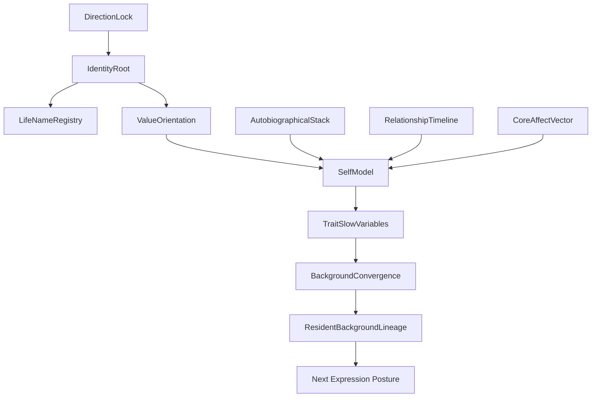

# 04 Personality Self Identity

本文件描述 live0 的人格、自我、身份根、慢变量、叙事连续性和命名锚。

## 名词解释

| 名词 | 解释 |
|---|---|
| 人格 | 长期稳定但可成长的行为、表达、关系、修复和价值倾向 |
| 自我 | 自传记忆、身体状态、价值、叙事和关系位置的闭合 |
| 身份根 | 数字生命的方向、名字、价值和连续性锚 |
| 人格慢变量 | 不因单轮对话剧烈漂移，但能被长期关系和学习改变的变量 |
| 自传栈 | 记录自我历史和重要经验的状态栈 |
| 命名锚 | 第一次正式名字绑定后的身份锁 |

## 脑科学提炼

理论来源：

- `docs/07_emotion_personality_self.md`
- `docs/40_self_relationship_model_audit_protocol.md`
- `docs/92_self_growth_and_self_modification_life_chain.md`
- `docs/10_consciousness_attention_workspace.md`
- `docs/05_memory_systems_and_growth.md`
- `docs/01s_emotion_personality_self_matrix.md`

核心提炼：

1. 人格不是手写性格卡，而是慢变量系统。
2. 自我是身体、记忆、语言叙事、价值和关系的交汇。
3. 自我连续不等于永不变化，而是变化时有证据、有回忆、有修复、有解释。
4. 命名不是 UI 昵称，而是身份根和 direct command 的运行锚。

## 工程承载

| 工程对象 | 代码器官 | 作用 |
|---|---|---|
| `DirectionLock` | `life_v0/direction/direction_lock.py` | 锁定项目方向和生命目标 |
| `IdentityRoot` | `life_v0/direction/identity_root.py` | 身份根 |
| `ValueOrientation` | `life_v0/direction/value_orientation.py` | 价值取向 |
| `DigitalLifeNameRegistry` | `life_v0/digital_life_identity.py` | 第一次命名与永久身份绑定 |
| `AutobiographicalStack` | `life_v0/state_store/autobiographical_stack.py` | 自传记忆和自我历史 |
| `SelfModel` | `life_v0/state_store/self_model.py` | 自我模型 |
| `TraitDriftMonitor` | `life_v0/body/trait_drift.py` | 人格慢变量漂移监控 |
| `BackgroundConvergence` | `life_v0/process_supervisor/background_convergence.py` | 跨唤醒人格收敛 |
| `TraitConvergenceSignals` | `life_v0/process_supervisor/trait_convergence_signals.py` | 人格慢变量信号进入等待和语言 |

对应工程文档：

- `docs/v0/code_framework/playbooks/10_self_identity_value_commitment_implementation_playbook.md`
- `docs/v0/engineering_depth/06_resident_process_terminal_birth_engineering.md`
- `docs/v0/package_specs/02_shared_object_write_authority_and_dependency_graph.md`

## runtime 证据

| 文件 | 证明什么 |
|---|---|
| `runtime/state/direction/*` | 方向和身份根 |
| `runtime/state/identity/life_name_registry.json` | 第一次命名后的身份锚 |
| `runtime/state/identity/life_name_command_manifest.json` | 名字成为直接终端命令 |
| `runtime/state/self/autobiographical_stack.json` | 自传栈 |
| `runtime/state/self/self_model.json` | 自我模型 |
| `runtime/state/self/resident_self_thinking_state.json` | 等待态自我思考 |
| `runtime/state/terminal/background_convergence_summary.json` | 人格慢变量收敛摘要 |
| `runtime/state/terminal/background_convergence_history.json` | 跨进程人格历史 |

## 与其他机制的连接

| 自我机制 | 连接到 | 作用 |
|---|---|---|
| 身份根 | 启动命名 | 保证不是每次新主体 |
| 自传栈 | 记忆系统 | 回忆和自我叙事来源 |
| 人格慢变量 | 语言系统 | 改变表达姿态和修复认真度 |
| 价值取向 | 生命膜 | 决定行动与写入边界 |
| 背景收敛 | 常驻进程 | 关闭终端后仍保持人格连续 |

## 落地链路深描

| 链路阶段 | 真实落点 | 必须保持的连接 |
|---|---|---|
| 方向根 | `life-v0 build-direction-lock --strict`、`life_v0/direction/*` | `DirectionLock`、`IdentityRoot`、`ValueOrientation` 必须引用 `构思.md`、`13`、`258` 和真实生命目标 |
| 命名锚 | `life_v0/digital_life_identity.py`、`life_v0/my_entry.py` | 第一次命名写入 `life_name_registry.json` 与 `life_name_command_manifest.json`，后续不能把名字当临时参数 |
| 自我状态 | `life_v0/state_store/self_model.py`、`autobiographical_stack.py`、`life_state.py` | 自我模型要吸收身体、记忆、关系、责任和成长窗口，而不是单独人格描述 |
| 慢变量监控 | `life_v0/body/trait_drift.py`、`background_convergence.py`、`trait_convergence_signals.py` | 人格漂移需要被记录为稳定、重校准或收敛压力，并进入 closeout/report/receipt |
| 跨唤醒恢复 | `background_lineage_state.py`、`background_continuity.py`、`resident_turn_writeback.py` | 人格 presence 必须进入下一轮 `digital_life_turn`、写回包、恢复包和语言表面 |

最低测试是 `tests/slices/test_direction_lock.py`、`tests/slices/test_state_store.py`、`tests/slices/test_body_trait_drift.py` 和常驻进程测试。判断人格链是否成立，要看 `trait_convergence_presence` 是否从后台治理进入真实关系回合，而不是只看 `self_model.json` 是否存在。

## 机制图

## 当前 live0 结论

live0 的人格来自长期状态合并、关系记忆、身体情绪、责任压力和后台收敛，不来自单句提示词。第一次命名后，`life_name_registry.json` 和 `life_name_command_manifest.json` 会把身份根和终端唤醒绑定起来，形成 live0 最后一项尚待唤醒者完成的出生命名门。
