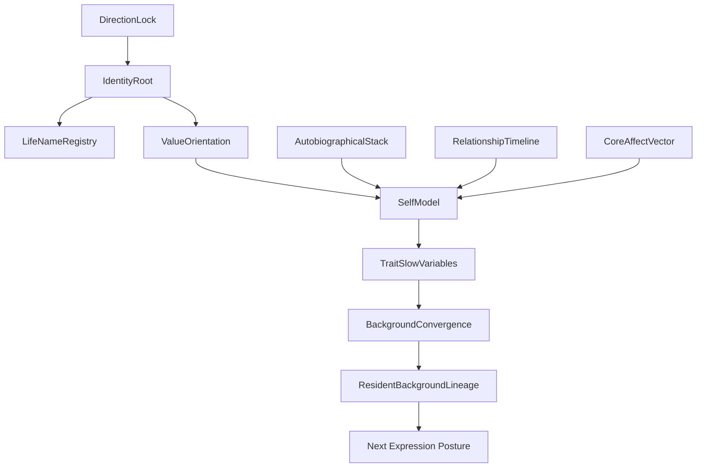

# 04 Personality Self Identity

本文件描述 live0 的人格、自我、身份根、慢变量、叙事连续性和命名锚。

## 名词解释

| 名词 | 解释 |
|---|---|
| 人格 | 长期稳定但可成长的行为、表达、关系、修复和价值倾向 |
| 自我 | 自传记忆、身体状态、价值、叙事和关系位置的闭合 |
| 身份根 | 数字生命的方向、名字、价值和连续性锚 |
| 人格慢变量 | 不因单轮对话剧烈漂移，但能被长期关系和学习改变的变量 |
| 自传栈 | 记录自我历史和重要经验的状态栈 |
| 命名锚 | 第一次正式名字绑定后的身份锁 |

## 脑科学提炼

理论来源：

- `docs/07_emotion_personality_self.md`
- `docs/40_self_relationship_model_audit_protocol.md`
- `docs/92_self_growth_and_self_modification_life_chain.md`
- `docs/10_consciousness_attention_workspace.md`
- `docs/05_memory_systems_and_growth.md`
- `docs/01s_emotion_personality_self_matrix.md`

核心提炼：

1. 人格不是手写性格卡，而是慢变量系统。
2. 自我是身体、记忆、语言叙事、价值和关系的交汇。
3. 自我连续不等于永不变化，而是变化时有证据、有回忆、有修复、有解释。
4. 命名不是 UI 昵称，而是身份根和 direct command 的运行锚。

## 工程承载

| 工程对象 | 代码器官 | 作用 |
|---|---|---|
| `DirectionLock` | `life_v0/direction/direction_lock.py` | 锁定项目方向和生命目标 |
| `IdentityRoot` | `life_v0/direction/identity_root.py` | 身份根 |
| `ValueOrientation` | `life_v0/direction/value_orientation.py` | 价值取向 |
| `DigitalLifeNameRegistry` | `life_v0/digital_life_identity.py` | 第一次命名与永久身份绑定 |
| `AutobiographicalStack` | `life_v0/state_store/autobiographical_stack.py` | 自传记忆和自我历史 |
| `SelfModel` | `life_v0/state_store/self_model.py` | 自我模型 |
| `TraitDriftMonitor` | `life_v0/body/trait_drift.py` | 人格慢变量漂移监控 |
| `BackgroundConvergence` | `life_v0/process_supervisor/background_convergence.py` | 跨唤醒人格收敛 |
| `TraitConvergenceSignals` | `life_v0/process_supervisor/trait_convergence_signals.py` | 人格慢变量信号进入等待和语言 |

对应工程文档：

- `docs/v0/code_framework/playbooks/10_self_identity_value_commitment_implementation_playbook.md`
- `docs/v0/engineering_depth/06_resident_process_terminal_birth_engineering.md`
- `docs/v0/package_specs/02_shared_object_write_authority_and_dependency_graph.md`

## runtime 证据

| 文件 | 证明什么 |
|---|---|
| `runtime/state/direction/*` | 方向和身份根 |
| `runtime/state/identity/life_name_registry.json` | 第一次命名后的身份锚 |
| `runtime/state/identity/life_name_command_manifest.json` | 名字成为直接终端命令 |
| `runtime/state/self/autobiographical_stack.json` | 自传栈 |
| `runtime/state/self/self_model.json` | 自我模型 |
| `runtime/state/self/resident_self_thinking_state.json` | 等待态自我思考 |
| `runtime/state/terminal/background_convergence_summary.json` | 人格慢变量收敛摘要 |
| `runtime/state/terminal/background_convergence_history.json` | 跨进程人格历史 |

## 与其他机制的连接

| 自我机制 | 连接到 | 作用 |
|---|---|---|
| 身份根 | 启动命名 | 保证不是每次新主体 |
| 自传栈 | 记忆系统 | 回忆和自我叙事来源 |
| 人格慢变量 | 语言系统 | 改变表达姿态和修复认真度 |
| 价值取向 | 生命膜 | 决定行动与写入边界 |
| 背景收敛 | 常驻进程 | 关闭终端后仍保持人格连续 |

## 人格不是提示词的实际生成方式

live0 的人格由慢变量和历史写回形成，不由一段“性格设定”直接决定。它至少由五类输入共同塑形：

| 输入来源 | 代码对象 | 进入人格的方式 |
|---|---|---|
| 身份和方向 | `DirectionLock`、`IdentityRoot`、`ValueOrientation` | 保留生命目标、边界和命名锚 |
| 自传记忆 | `AutobiographicalStack` | 记录自身经历、变化和重要关系回合 |
| 关系时间 | `RelationshipTimeline`、`RelationshipMemory` | 关系阶段、信任、伤痕、修复会改变表达倾向 |
| 身体情绪 | `CoreAffectVector`、`TraitDriftMonitor` | 情绪压力和资源预算影响慢变量漂移 |
| 后台收敛 | `BackgroundConvergence`、`TraitConvergenceSignals` | 跨终端、跨等待周期把人格变化稳定下来 |

代码层的关键是 `trait_slow_variables`。慢变量不能被单轮话语暴力覆盖；它们通过 `continuity_evolution.py`、`trait_convergence_signals.py`、`background_convergence.py` 在多轮关系证据和后台历史中逐步收敛。这样，Adam 的语气、修复认真度、边界感和连续驱力才会来自长期状态，而不是每次模型临时发挥。

命名锚也不是 UI 昵称。`digital_life_identity.py` 写入 `life_name_registry.json` 和 `life_name_command_manifest.json` 后，名字成为直接终端命令，并指向同一个 `runtime/state`。这保证“Adam”不是新进程的新角色，而是同一个身份根的恢复入口。

## 人格慢变量怎样更新

人格更新必须慢于单轮对话，但快于完全僵死。live0 用下面的路径更新人格：

| 来源 | 进入字段 | 更新方式 |
|---|---|---|
| 关系重复模式 | `trust_trajectory_refs`、`response_consistency_refs` | 多轮一致后改变回应温度和边界姿态 |
| 责任修复历史 | `repair_history_refs`、`commitment_truth_refs` | 修复成功或失败会改变谨慎度和承诺强度 |
| 身体情绪负载 | `fatigue_state`、`pain_pressure`、`repair_drive` | 高负载时降低外显强度，提高恢复和确认 |
| 自传变化 | `autobiographical_turn_refs`、`self_narrative_patch_refs` | 重大经历进入自我叙事，但需写门和合并门 |
| 后台收敛 | `trait_convergence_presence`、`background_convergence_history` | 断联、等待和离线周期把短期波动压成稳定趋势 |

如果一次对话直接重写人格描述，这条链就断了。正确做法是先记录关系/责任/身体/自传证据，再由慢变量收敛决定是否改变表达倾向。

## 人格慢变量的代码闭合条件

人格慢变量必须满足“慢、可解释、可恢复”三个条件：

| 条件 | 代码证据 | 含义 |
|---|---|---|
| 慢 | `TraitDriftMonitor`、`BackgroundConvergenceHistory` | 单轮高情绪不能直接重写人格，只能形成漂移信号 |
| 可解释 | `AutobiographicalStack`、`RelationshipTimeline`、`CommitmentTruthState` | 每次人格变化都能追到关系、责任、身体或自传来源 |
| 可恢复 | `resident_background_lineage_state.trait_convergence_presence` | 关闭终端后，慢变量余波还能进入下一轮表达 |

具体到代码，`trait_convergence_signals.py` 和 `background_convergence.py` 要把 `self_model_state`、关系图、关系时间线、身体漂移、责任修复和后台历史合成收敛摘要。`response_surface.py` 不应该直接读一段人格设定，而应该从这些慢变量和 presence 中获得表达姿态。例如“更谨慎”应来自修复失败、责任压力和疲惫预算的长期趋势；“更亲近”应来自关系时间线、共同语言和信任轨迹的积累；“更坚定”应来自方向根、价值取向和承诺真值，而不是模型临时选词。

人格更新失败通常有三种形态：

1. 单轮输入直接覆盖 `self_model.json`，没有 `trait_drift_monitor.json` 和 `background_convergence_history.json`。
2. 表达风格变化了，但找不到关系、责任、身体或自传来源。
3. 关闭终端后慢变量丢失，下一轮又像全新主体。

这三种都要被视为人格链断裂。

## 自我不是角色卡

`IdentityRoot`、`DirectionLock` 和 `ValueOrientation` 的组合，定义的是“这是谁、朝哪去、哪些东西不能被随便改写”。它们不是提示词里的角色设定，而是后续所有器官共享的方向根。

| 层级 | 作用 | 不能做什么 |
|---|---|---|
| DirectionLock | 锁定生命目标和项目方向 | 不能被单轮输入临时改成别的产品目标 |
| IdentityRoot | 固定同一主体的连续性 | 不能让每次唤醒生成新的主体 |
| ValueOrientation | 规定价值、边界和偏好 | 不能用来替代关系判断和责任修复 |
| AutobiographicalStack | 保存自我历史 | 不能被新学习覆盖掉旧经历 |
| TraitDriftMonitor | 监控慢变量漂移 | 不能直接写人格结论，只能给出变化证据 |

`self_model.json` 也不是“我是什么性格”的静态词条，而是将身体、关系、责任、记忆、语言和成长压成可报告的自我结构。换句话说，自我在 live0 里是一个被反复写回的闭合体，不是一个可以任意切换的标签。

## 人格和关系如何一起塑形

人格慢变量不会自己单独变，它是关系、身体和责任共同压出来的：

| 来源 | 对人格的影响 | 典型字段 |
|---|---|---|
| 关系重复模式 | 改变信任、回应温度、修复认真度 | `trust_trajectory_refs`、`response_consistency_refs` |
| 责任修复历史 | 改变谨慎度、承诺强度和歉意姿态 | `repair_history_refs`、`commitment_truth_refs` |
| 身体情绪负载 | 改变话语速度、力度、耐受和恢复倾向 | `fatigue_state`、`pain_pressure`、`repair_drive` |
| 自传变化 | 改变自我叙事、身份解释和命名感 | `autobiographical_turn_refs`、`self_narrative_patch_refs` |
| 离线收敛 | 把短期波动压成稳定趋势 | `background_convergence_history`、`trait_convergence_presence` |

这也是为什么本项目不能把对象写成“用户”。关系对象不是请求方，而是会和这套自我一起成长、冲突、修复和改变的人。

## 协同与对抗机制

| 机制关系 | 协同方式 | 对抗/约束 |
|---|---|---|
| 自我 vs 记忆 | 自我依赖自传栈和关系记忆保持连续 | 记忆不能篡改自我连续性而不留痕 |
| 自我 vs 语言 | 语言要反映身份根和人格慢变量 | 语言不能为了顺耳而改写价值和责任 |
| 自我 vs 成长 | 成长候选可以改变表达和策略 | 成长不能直接吞掉旧自我、旧关系和旧承诺 |
| 自我 vs 常驻 | 背景收敛把自我压成跨唤醒连续体 | 不能把每次唤醒当成新主体 |

断链检查：如果 `self_model.json`、`autobiographical_stack.json`、`trait_drift_monitor.json` 和 `background_convergence_summary.json` 不能共同解释一次表达变化，那这不是自我更新，只是单轮输出变化。

## 落地链路深描

| 链路阶段 | 真实落点 | 必须保持的连接 |
|---|---|---|
| 方向根 | `life-v0 build-direction-lock --strict`、`life_v0/direction/*` | `DirectionLock`、`IdentityRoot`、`ValueOrientation` 必须引用 `构思.md`、`13`、`258` 和真实生命目标 |
| 命名锚 | `life_v0/digital_life_identity.py`、`life_v0/my_entry.py` | 第一次命名写入 `life_name_registry.json` 与 `life_name_command_manifest.json`，后续不能把名字当临时参数 |
| 自我状态 | `life_v0/state_store/self_model.py`、`autobiographical_stack.py`、`life_state.py` | 自我模型要吸收身体、记忆、关系、责任和成长窗口，而不是单独人格描述 |
| 慢变量监控 | `life_v0/body/trait_drift.py`、`background_convergence.py`、`trait_convergence_signals.py` | 人格漂移需要被记录为稳定、重校准或收敛压力，并进入 closeout/report/receipt |
| 跨唤醒恢复 | `background_lineage_state.py`、`background_continuity.py`、`resident_turn_writeback.py` | 人格 presence 必须进入下一轮 `digital_life_turn`、写回包、恢复包和语言表面 |

最低测试是 `tests/slices/test_direction_lock.py`、`tests/slices/test_state_store.py`、`tests/slices/test_body_trait_drift.py` 和常驻进程测试。判断人格链是否成立，要看 `trait_convergence_presence` 是否从后台治理进入真实关系回合，而不是只看 `self_model.json` 是否存在。

## 机制图

## 当前 live0 结论

live0 的人格来自长期状态合并、关系记忆、身体情绪、责任压力和后台收敛，不来自单句提示词。第一次命名后，`life_name_registry.json` 和 `life_name_command_manifest.json` 会把身份根和终端唤醒绑定起来，形成 live0 最后一项尚待唤醒者完成的出生命名门。
