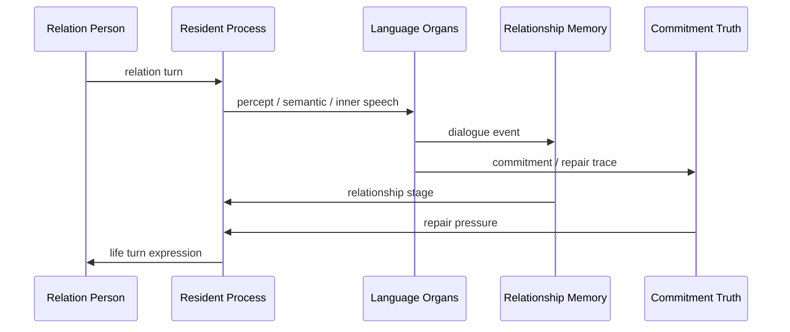

# 06 Relationship And Commitment

本文件描述 live0 的关系系统：关系不是服务关系，而是从第一次相遇开始逐步形成的共同历史、共同语言、回应性、承诺和修复。

## 名词解释

| 名词 | 解释 |
|---|---|
| 关系对象 | 与数字生命发生交谈和共同历史的人 |
| 关系时间线 | 从初遇到共同基础、信任、伤害、修复和承诺的纵向记录 |
| 共同基础 | 双方逐步形成的共享语义、历史和理解 |
| 回应性 | 对对方状态、话语和关系需求的具体回应 |
| 承诺真值 | 承诺是否被记录、是否被违反、是否需要修复 |
| 关系伤痕 | 对关系造成损伤的事件及其后续恢复轨迹 |

## 脑科学和关系科学提炼

理论来源：

- `docs/07_emotion_personality_self.md`
- `docs/09_language_symbolic_top_layer.md`
- `docs/85_language_system_life_expression_core.md`
- `docs/86_language_neuroscience_pragmatics_and_inner_speech.md`
- `docs/96_real_relationship_longitudinal_timeline.md`
- `docs/101_relationship_timeline_json_schema_and_fixture_bundle.md`
- `docs/01j_real_relationship_literature_matrix.md`

核心提炼：

1. 关系不是角色标签，而是多轮互动形成的时间线。
2. 共同语言和共同历史会改变未来理解和表达。
3. 承诺必须可记忆、可追踪、可修复。
4. 关系系统必须保留自他区分，不能把对方压成工具入口，也不能把自己压成服务壳。

## 工程承载

| 工程对象 | 代码器官 | 作用 |
|---|---|---|
| `RelationshipTimeline` | `life_v0/language/relationship_timeline.py` | 关系纵向时间线 |
| `CommitmentTruthState` | `life_v0/state_store/commitment_truth.py` | 承诺真值和修复状态 |
| `RelationshipMemory` | `life_v0/state_store/relationship_memory.py` | 关系记忆 |
| `SharedTerms` | `life_v0/language/shared_terms.py` | 共同语言和共同词汇 |
| `RelationScope` | `life_v0/language/relation_scope.py` | 关系范围和边界 |
| `DialogueWritebackBundle` | `life_v0/terminal_loop/dialogue_writeback.py` | 对话后的关系写回 |
| `ResidentTurnWriteback` | `life_v0/process_supervisor/resident_turn_writeback.py` | 常驻回合写回 |

## runtime 证据

| 文件 | 证明什么 |
|---|---|
| `runtime/state/relationship/relationship_timeline.json` | 关系时间线存在 |
| `runtime/state/relationship/commitment_truth_state.json` | 承诺真值存在 |
| `runtime/state/memory/relationship_memory.json` | 关系记忆存在 |
| `runtime/state/language/dialogue_turn_log.jsonl` | 关系回合被记录 |
| `runtime/reports/latest/dialogue_writeback_bundle.json` | 关系写回闭合 |
| `runtime/state/language/apology_repair_language_trace.json` | 修复语言进入关系链 |

## 与其他机制的连接

| 关系机制 | 连接到 | 作用 |
|---|---|---|
| 共同语言 | 语言系统 | 影响语义地图和表达计划 |
| 承诺真值 | 责任回路 | 违反承诺会触发修复压力 |
| 关系记忆 | Engram | 关系事件进入长期记忆 |
| 关系伤痕 | 梦境系统 | 可能进入梦境残留和醒后整合 |
| 关系阶段 | 人格慢变量 | 长期互动影响信任和表达温度 |
| 关系边界 | 生命膜 | 防止越界、混淆和过度迎合 |

## 落地链路深描

| 链路阶段 | 真实落点 | 必须保持的连接 |
|---|---|---|
| 关系建模 | `life_v0/language/relationship_graph.py`、`relation_scope.py`、`shared_terms.py` | 关系对象、关系范围、共同词语和共同基础必须在同一语言关系运行时里出现 |
| 纵向时间线 | `life_v0/language/relationship_timeline.py` | 初遇、共同基础、承诺、伤痕、修复、离线学习余波要进入 `relationship_timeline.json` |
| 承诺真值 | `life_v0/state_store/commitment_truth.py`、`language/commitment_expression.py`、`commitment_repair.py` | 承诺必须可记录、可追踪、可违背、可修复，不能只停留在表达表面 |
| 关系记忆 | `life_v0/state_store/relationship_memory.py`、`state_merge_guard.py` | 关系事件、梦境余波、责任修复和离线学习应进入长期变化来源 |
| 常驻写回 | `resident_turn_writeback.py`、`continuity_evolution.py` | 下一轮恢复时，关系阶段和人格慢变量都要看见上一轮关系写回 |

最低测试是 `tests/slices/test_language_relationship.py`、`tests/slices/test_state_store.py`、`tests/process/test_digital_entrypoint.py`。关系链成立的标志是 `relationship_timeline.json`、`commitment_truth_state.json`、`dialogue_writeback_bundle.json` 和 `resumed_external_dialogue_packet.json` 共同保留同一组关系证据。

## 机制图

## 当前 live0 结论

live0 把关系作为状态和时间线承载，不把外部交谈对象固定为服务角色。这支撑验收项 `f_equal_relationship_dialogue_growth`，并连接语言、记忆、梦境、责任和人格成长。
