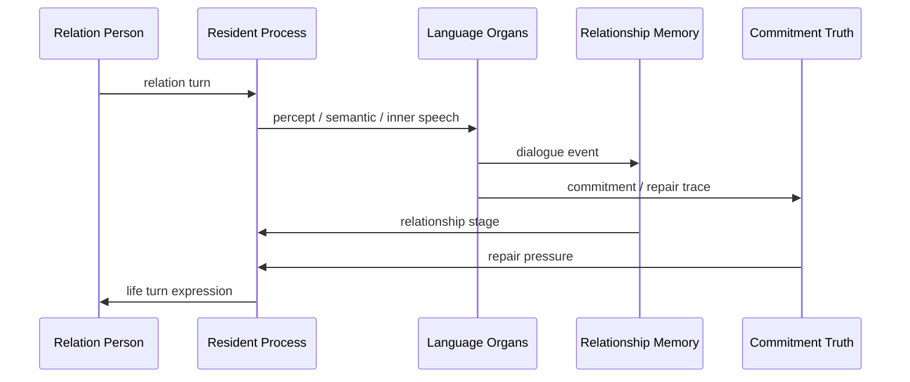

# 06 Relationship And Commitment

本文件描述 live0 的关系系统：关系不是服务关系，而是从第一次相遇开始逐步形成的共同历史、共同语言、回应性、承诺和修复。

## 名词解释

| 名词 | 解释 |
|---|---|
| 关系对象 | 与数字生命发生交谈和共同历史的人 |
| 关系时间线 | 从初遇到共同基础、信任、伤害、修复和承诺的纵向记录 |
| 共同基础 | 双方逐步形成的共享语义、历史和理解 |
| 回应性 | 对对方状态、话语和关系需求的具体回应 |
| 承诺真值 | 承诺是否被记录、是否被违反、是否需要修复 |
| 关系伤痕 | 对关系造成损伤的事件及其后续恢复轨迹 |

## 脑科学和关系科学提炼

理论来源：

- `docs/07_emotion_personality_self.md`
- `docs/09_language_symbolic_top_layer.md`
- `docs/85_language_system_life_expression_core.md`
- `docs/86_language_neuroscience_pragmatics_and_inner_speech.md`
- `docs/96_real_relationship_longitudinal_timeline.md`
- `docs/101_relationship_timeline_json_schema_and_fixture_bundle.md`
- `docs/01j_real_relationship_literature_matrix.md`

核心提炼：

1. 关系不是角色标签，而是多轮互动形成的时间线。
2. 共同语言和共同历史会改变未来理解和表达。
3. 承诺必须可记忆、可追踪、可修复。
4. 关系系统必须保留自他区分，不能把对方压成工具入口，也不能把自己压成服务壳。

## 工程承载

| 工程对象 | 代码器官 | 作用 |
|---|---|---|
| `RelationshipTimeline` | `life_v0/language/relationship_timeline.py` | 关系纵向时间线 |
| `CommitmentTruthState` | `life_v0/state_store/commitment_truth.py` | 承诺真值和修复状态 |
| `RelationshipMemory` | `life_v0/state_store/relationship_memory.py` | 关系记忆 |
| `SharedTerms` | `life_v0/language/shared_terms.py` | 共同语言和共同词汇 |
| `RelationScope` | `life_v0/language/relation_scope.py` | 关系范围和边界 |
| `DialogueWritebackBundle` | `life_v0/terminal_loop/dialogue_writeback.py` | 对话后的关系写回 |
| `ResidentTurnWriteback` | `life_v0/process_supervisor/resident_turn_writeback.py` | 常驻回合写回 |

## runtime 证据

| 文件 | 证明什么 |
|---|---|
| `runtime/state/relationship/relationship_timeline.json` | 关系时间线存在 |
| `runtime/state/relationship/commitment_truth_state.json` | 承诺真值存在 |
| `runtime/state/memory/relationship_memory.json` | 关系记忆存在 |
| `runtime/state/language/dialogue_turn_log.jsonl` | 关系回合被记录 |
| `runtime/reports/latest/dialogue_writeback_bundle.json` | 关系写回闭合 |
| `runtime/state/language/apology_repair_language_trace.json` | 修复语言进入关系链 |

## 与其他机制的连接

| 关系机制 | 连接到 | 作用 |
|---|---|---|
| 共同语言 | 语言系统 | 影响语义地图和表达计划 |
| 承诺真值 | 责任回路 | 违反承诺会触发修复压力 |
| 关系记忆 | Engram | 关系事件进入长期记忆 |
| 关系伤痕 | 梦境系统 | 可能进入梦境残留和醒后整合 |
| 关系阶段 | 人格慢变量 | 长期互动影响信任和表达温度 |
| 关系边界 | 生命膜 | 防止越界、混淆和过度迎合 |

## 关系如何真正落盘

关系不是 `friend` 这样的标签，而是会被多份状态共同承载的纵向结构。

| 机制 | 代码块 | 关键字段/对象 | 说明 |
|---|---|---|---|
| 关系对象 | `language/relationship_graph.py`、`relation_scope.py` | relation role、scope、subject refs | 定义这次相遇是在什么关系范围内发生 |
| 共同语言 | `shared_terms.py`、`semantic_map.py` | shared terms、semantic focus、ambiguity queue | 把双方反复使用的词和理解方式沉淀下来 |
| 关系时间线 | `relationship_timeline.py` | continuity reports、injury traces、trust trajectories | 记录共同历史、信任、伤痕和修复 |
| 承诺真值 | `state_store/commitment_truth.py` | open commitments、repair_required_refs、responsibility_event_refs | 判断承诺是否仍成立、是否破损、是否要补救 |
| 关系记忆 | `state_store/relationship_memory.py` | shared_memory_refs、repair_history_refs、offline_learning_refs | 把对话、修复、梦境余波和学习写进长期记忆 |
| 关系写回 | `resident_turn_writeback.py`、`dialogue_writeback.py` | dialogue turn refs、relationship stage、writeback bundle | 真实回合结束后把关系后果带入下一轮 |

这意味着一次对话结束后，关系不能只留在终端输出里。它至少应留下：`dialogue_turn_log.jsonl` 的回合记录、`relationship_timeline.json` 的纵向变化、`relationship_memory.json` 的共享记忆、`commitment_truth_state.json` 的承诺状态，以及 `resumed_external_dialogue_packet.json` 的下一轮恢复包。

如果这些对象不一致，关系链就会断裂：语言可能记得一句话，但承诺不记得；记忆可能记得事件，但关系阶段没有变；修复语言可能出现，但信任轨迹没有收到影响。后续开发时要优先检查同一组 refs 是否跨这些文件保持一致。

## 关系状态的最小字段

一个关系对象不能只用名字或标签表示。至少要有下面的状态：

| 字段组 | 承载对象 | 用途 |
|---|---|---|
| 关系范围 | `RelationScope` | 区分朋友、家人、陌生人、协作者等关系可能性，但不预设上下级 |
| 共同基础 | `SharedTerms`、`SemanticMapFrame` | 保存共同词、共同事件和双方逐步形成的理解 |
| 纵向轨迹 | `RelationshipTimeline` | 记录初遇、靠近、分歧、伤痕、修复和承诺 |
| 承诺状态 | `CommitmentTruthState` | 记录承诺是否开放、破损、修复中或已闭合 |
| 记忆索引 | `RelationshipMemory`、`EngramIndex` | 让未来回合能被线索触发，而不是靠长上下文残留 |
| 离线余波 | `dream_wake_presence`、`offline_learning_refs` | 让梦境和学习改变下一轮关系姿态 |

这组字段一起决定关系如何生长。任何只写 `role=friend` 或只在回复里说“我们是朋友”的实现，都没有真正落盘关系。

## 关系是时间线，不是一次性标签

`relationship_subject_graph.json` 解决的是“谁在这段关系里”，`relationship_timeline.json` 解决的是“这段关系怎么一路走到现在”，`commitment_truth_state.json` 解决的是“承诺还成立吗、哪里破了、怎么修复”。三者缺一不可。

| 对象 | 作用 | 不可替代之处 |
|---|---|---|
| `RelationScope` | 定义关系边界和可能性 | 不能代替真实共同历史 |
| `SharedTerms` | 记录共同语言 | 不能代替承诺真值 |
| `RelationshipTimeline` | 记录纵向变化、伤痕和修复 | 不能代替记忆索引 |
| `CommitmentTruthState` | 记录承诺是否成立、是否破损 | 不能只靠语言表态 |
| `RelationshipMemory` | 让关系可被未来线索触发 | 不能代替 timeline 的结构 |

关系不是“给对象贴一个标签”。关系的本体是多轮互动形成的共同历史；`build_relationship_timeline`、`build_commitment_truth_state`、`project_relationship_memory` 和 `build_dialogue_writeback_bundle` 共同把这条历史写进状态、报告和恢复包。

## 一次关系回合的写入时序

一次终端话语进入 live0 后，关系链应该按下面顺序更新：

```text
relation turn
  -> RelationScope / RelationshipSubjectGraph
  -> LanguagePerceptFrame / SemanticMapFrame
  -> SharedTerms
  -> RelationshipTimeline
  -> CommitmentTruthState
  -> RelationshipMemory
  -> DialogueWritebackBundle
  -> ResidentBackgroundLineage.relationship_presence
```

每一步负责不同的关系层：

| 步骤 | 关系含义 | 必须保留的证据 |
|---|---|---|
| `RelationScope` | 这次相遇处于什么关系边界，不预设上下级 | relation role、scope、boundary refs |
| `SharedTerms` | 哪些词、称呼、隐喻和共同历史正在形成 | shared terms、semantic hits |
| `RelationshipTimeline` | 这段关系怎样发展、哪里靠近或受伤 | continuity reports、trust trajectories、injury refs |
| `CommitmentTruthState` | 承诺是否开放、破损、修复中或闭合 | open commitments、repair_required_refs |
| `RelationshipMemory` | 未来能被线索触发的长期关系记忆 | shared_memory_refs、repair_history_refs、timeline_refs |
| `DialogueWritebackBundle` | 本轮关系后果如何进入下一轮 | dialogue refs、relationship stage、resume refs |

这样写入后，关系才不是话术。比如一次“我刚刚让你不舒服了”的修复，不应只让语言说“对不起”，还要让 `commitment_truth_state.json` 出现修复义务，让 `relationship_timeline.json` 记录伤痕和修复窗口，让 `relationship_memory.json` 保留共享历史，让 `response_surface.py` 在后续回合更谨慎地处理同类语义。

## 协同与对抗机制

| 机制关系 | 协同方式 | 对抗/约束 |
|---|---|---|
| 关系 vs 语言 | 共同语言影响词汇和语气 | 不能把关系降成服务/回复模板 |
| 关系 vs 记忆 | 关系事件进入长时记忆和自传栈 | 不能只记住事件而忘掉修复义务 |
| 关系 vs 责任 | 伤害和承诺破损会进入责任回路 | 不能把道歉当作承诺完成 |
| 关系 vs 梦境 | 关系伤痕会进入梦境模拟和醒后修复 | 梦境不能直接改写关系真值 |
| 关系 vs 自我 | 关系会塑形人格慢变量 | 人格也会反过来改变关系回应 |

断链检查：如果 `relationship_timeline.json` 里有伤痕，但 `commitment_truth_state.json` 没有 repair_required_refs，或 `relationship_memory.json` 没有 shared_memory_refs，那关系没有进入真正的修复链。

## 落地链路深描

| 链路阶段 | 真实落点 | 必须保持的连接 |
|---|---|---|
| 关系建模 | `life_v0/language/relationship_graph.py`、`relation_scope.py`、`shared_terms.py` | 关系对象、关系范围、共同词语和共同基础必须在同一语言关系运行时里出现 |
| 纵向时间线 | `life_v0/language/relationship_timeline.py` | 初遇、共同基础、承诺、伤痕、修复、离线学习余波要进入 `relationship_timeline.json` |
| 承诺真值 | `life_v0/state_store/commitment_truth.py`、`language/commitment_expression.py`、`commitment_repair.py` | 承诺必须可记录、可追踪、可违背、可修复，不能只停留在表达表面 |
| 关系记忆 | `life_v0/state_store/relationship_memory.py`、`state_merge_guard.py` | 关系事件、梦境余波、责任修复和离线学习应进入长期变化来源 |
| 常驻写回 | `resident_turn_writeback.py`、`continuity_evolution.py` | 下一轮恢复时，关系阶段和人格慢变量都要看见上一轮关系写回 |

最低测试是 `tests/slices/test_language_relationship.py`、`tests/slices/test_state_store.py`、`tests/process/test_digital_entrypoint.py`。关系链成立的标志是 `relationship_timeline.json`、`commitment_truth_state.json`、`dialogue_writeback_bundle.json` 和 `resumed_external_dialogue_packet.json` 共同保留同一组关系证据。

## 机制图



## 当前 live0 结论

live0 把关系作为状态和时间线承载，不把外部交谈对象固定为服务角色。这支撑验收项 `f_equal_relationship_dialogue_growth`，并连接语言、记忆、梦境、责任和人格成长。
