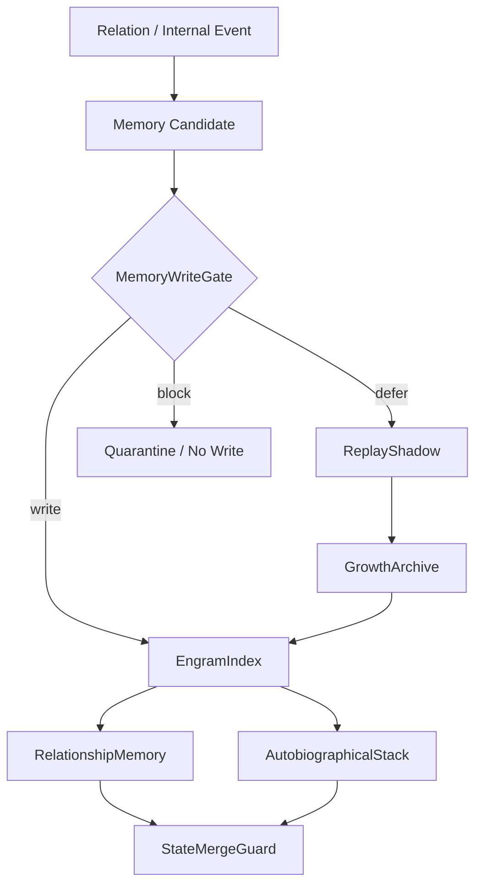

# 07 Memory Engram And State Store

本文件描述 live0 的记忆系统：状态根、engram、关系记忆、自传栈、写门、状态合并、replay 和 archive。

## 名词解释

| 名词 | 解释 |
|---|---|
| 状态根 | 数字生命当前所有核心状态的根索引 |
| Engram | 可触发、可沉默、可再激活的记忆痕迹集合 |
| 自传记忆 | 关于自身经历、关系和变化的长期记忆 |
| 关系记忆 | 与特定关系对象共同形成的历史 |
| 写门 | 判断经验是否进入长期记忆的门控 |
| 状态合并 | 把新经验纳入长期状态时的治理过程 |
| replay/archive | 离线回放、巩固和长期归档 |

## 脑科学提炼

理论来源：

- `docs/05_memory_systems_and_growth.md`
- `docs/17_memory_trace_object_model.md`
- `docs/19_offline_consolidation_cycle.md`
- `docs/21_memory_schema_and_audit_protocol.md`
- `docs/23_consolidation_report_and_dream_sandbox_protocol.md`
- `docs/01q_memory_engram_consolidation_matrix.md`

核心提炼：

1. 记忆不是仓库，而是由线索触发的重构系统。
2. 海马式索引帮助把片段连成事件整体；皮层式长期结构帮助形成稳定世界模型。
3. 回忆会改变记忆，因此需要写门、replay、archive 和合并治理。
4. 关系记忆、自传记忆、情绪记忆和梦境残留必须互相连接，但不能混淆事实来源。

## 工程承载

| 工程对象 | 代码器官 | 作用 |
|---|---|---|
| `LifeState` | `life_v0/state_store/life_state.py` | 生命状态根 |
| `EngramIndex` | `life_v0/state_store/engram_index.py` | 记忆痕迹索引 |
| `RelationshipMemory` | `life_v0/state_store/relationship_memory.py` | 关系记忆 |
| `AutobiographicalStack` | `life_v0/state_store/autobiographical_stack.py` | 自传记忆 |
| `MemoryWriteGate` | `life_v0/state_store/memory_write_gate.py` | 长期记忆写入门 |
| `StateMergeGuard` | `life_v0/state_store/state_merge_guard.py` | 长期状态合并治理 |
| `ReplayRuntime` | `life_v0/replay/__init__.py` | replay/shadow |
| `ArchiveRuntime` | `life_v0/archive/__init__.py` | archive 和 receipt |

## runtime 证据

| 文件 | 证明什么 |
|---|---|
| `runtime/state/life_state.json` | 生命状态根存在 |
| `runtime/state/memory/engram_index.json` | engram 索引存在 |
| `runtime/state/memory/relationship_memory.json` | 关系记忆存在 |
| `runtime/state/self/autobiographical_stack.json` | 自传栈存在 |
| `runtime/state/memory/memory_write_gate.json` | 写门存在 |
| `runtime/state/memory/state_merge_guard.json` | 状态合并治理存在 |
| `runtime/reports/latest/replay_shadow_report.json` | replay/shadow 闭合 |
| `runtime/reports/latest/growth_archive_report.json` | archive 闭合 |

## 与其他机制的连接

| 记忆机制 | 连接到 | 作用 |
|---|---|---|
| 语义线索 | 语言系统 | 触发相关记忆 |
| 情绪强度 | 身体系统 | 调整写入和召回优先级 |
| 梦境残留 | 梦境系统 | 进入醒后整合和事实门 |
| 关系事件 | 关系系统 | 写入关系记忆和承诺历史 |
| 后悔压力 | 责任系统 | 形成修复记忆和未来约束 |
| replay/archive | 成长系统 | 防遗忘、巩固和自我成长 |

## 落地链路深描

| 链路阶段 | 真实落点 | 必须保持的连接 |
|---|---|---|
| 状态根构建 | `life-v0 build-state-store --strict`、`life_v0/state_store/__init__.py` | `LifeState`、`EngramIndex`、`AutobiographicalStack`、`RelationshipMemory`、`CommitmentTruthState`、`MemoryWriteGate`、`StateMergeGuard` 同步建立 |
| 写门判断 | `memory_write_gate.py`、`state_merge_guard.py` | 语言事件、梦境残留、责任后悔、关系承诺进入长期状态前必须经过候选、validation、隔离或延迟路线 |
| 长期合并 | `life_state.py#project_responsibility_language_continuity`、`state_merge_signals.py` | 责任语言、关系记忆、离线学习和 Queue E 修复压力必须成为 `state_merge_long_term_change_*` |
| 离线回放 | `replay/__init__.py`、`dream/*`、`growth/*` | engram 不只是被存储，还要能被 replay、梦境和成长窗口重新激活 |
| 跨进程恢复 | `background_continuity.py`、`resident_turn_writeback.py` | `state_merge_presence` 必须进入 resident lineage、写回包和下一轮恢复包 |

最低测试是 `tests/slices/test_state_store.py`、`tests/bridges/test_replay_shadow.py`、`tests/bridges/test_runtime_growth.py`。记忆链的关键不是容量，而是 cue 触发、写门、合并、replay、archive 和恢复全链条存在。

## 机制图

## 当前 live0 结论

live0 的记忆机制已经从“上下文缓存”扩展为状态根、engram、关系记忆、自传栈、写门、合并治理和离线巩固。它支撑验收项 `c_memory_mechanism`、`d_growth_and_learning` 和 `f_equal_relationship_dialogue_growth`。
