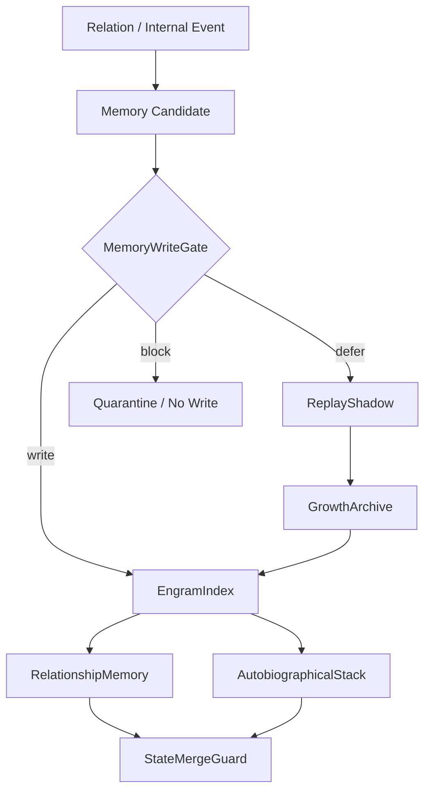

# 07 Memory Engram And State Store

本文件描述 live0 的记忆系统：状态根、engram、关系记忆、自传栈、写门、状态合并、replay 和 archive。

## 名词解释

| 名词 | 解释 |
|---|---|
| 状态根 | 数字生命当前所有核心状态的根索引 |
| Engram | 可触发、可沉默、可再激活的记忆痕迹集合 |
| 自传记忆 | 关于自身经历、关系和变化的长期记忆 |
| 关系记忆 | 与特定关系对象共同形成的历史 |
| 写门 | 判断经验是否进入长期记忆的门控 |
| 状态合并 | 把新经验纳入长期状态时的治理过程 |
| replay/archive | 离线回放、巩固和长期归档 |

## 脑科学提炼

理论来源：

- `docs/05_memory_systems_and_growth.md`
- `docs/17_memory_trace_object_model.md`
- `docs/19_offline_consolidation_cycle.md`
- `docs/21_memory_schema_and_audit_protocol.md`
- `docs/23_consolidation_report_and_dream_sandbox_protocol.md`
- `docs/01q_memory_engram_consolidation_matrix.md`

核心提炼：

1. 记忆不是仓库，而是由线索触发的重构系统。
2. 海马式索引帮助把片段连成事件整体；皮层式长期结构帮助形成稳定世界模型。
3. 回忆会改变记忆，因此需要写门、replay、archive 和合并治理。
4. 关系记忆、自传记忆、情绪记忆和梦境残留必须互相连接，但不能混淆事实来源。

## 工程承载

| 工程对象 | 代码器官 | 作用 |
|---|---|---|
| `LifeState` | `life_v0/state_store/life_state.py` | 生命状态根 |
| `EngramIndex` | `life_v0/state_store/engram_index.py` | 记忆痕迹索引 |
| `RelationshipMemory` | `life_v0/state_store/relationship_memory.py` | 关系记忆 |
| `AutobiographicalStack` | `life_v0/state_store/autobiographical_stack.py` | 自传记忆 |
| `MemoryRetrievalFrame` | `life_v0/state_store/memory_retrieval.py` | 线索触发的分层召回与重构输入 |
| `MemoryWriteGate` | `life_v0/state_store/memory_write_gate.py` | 长期记忆写入门 |
| `StateMergeGuard` | `life_v0/state_store/state_merge_guard.py` | 长期状态合并治理 |
| `ReplayRuntime` | `life_v0/replay/__init__.py` | replay/shadow |
| `ArchiveRuntime` | `life_v0/archive/__init__.py` | archive 和 receipt |

## runtime 证据

| 文件 | 证明什么 |
|---|---|
| `runtime/state/life_state.json` | 生命状态根存在 |
| `runtime/state/memory/engram_index.json` | engram 索引存在 |
| `runtime/state/memory/relationship_memory.json` | 关系记忆存在 |
| `runtime/state/self/autobiographical_stack.json` | 自传栈存在 |
| `runtime/state/memory/memory_retrieval_frame.json` | 语言线索、关系记忆、自传栈、梦境残留和责任痕迹已经被组织成可重构召回面 |
| `runtime/state/memory/memory_write_gate.json` | 写门存在 |
| `runtime/state/memory/state_merge_guard.json` | 状态合并治理存在 |
| `runtime/reports/latest/replay_shadow_report.json` | replay/shadow 闭合 |
| `runtime/reports/latest/growth_archive_report.json` | archive 闭合 |

## 与其他机制的连接

| 记忆机制 | 连接到 | 作用 |
|---|---|---|
| 语义线索 | 语言系统 | 触发相关记忆 |
| 情绪强度 | 身体系统 | 调整写入和召回优先级 |
| 梦境残留 | 梦境系统 | 进入醒后整合和事实门 |
| 关系事件 | 关系系统 | 写入关系记忆和承诺历史 |
| 后悔压力 | 责任系统 | 形成修复记忆和未来约束 |
| replay/archive | 成长系统 | 防遗忘、巩固和自我成长 |

## 记忆机制的实际存放方式

live0 的记忆不是把所有文本塞进一个长上下文，而是分成可触发、可审计、可回放、可隔离的对象网络。

| 记忆层 | 代码对象 | 存放内容 | 为什么需要这一层 |
|---|---|---|---|
| 状态根 | `LifeState` | 当前生命状态、记忆索引、梦境、关系、责任绑定 | 给所有器官一个共同的当前身体 |
| Engram 索引 | `EngramIndex` | 自传 refs、关系 refs、梦境 refs、责任 refs、replay cues | 像海马索引一样用线索找回分布式片段 |
| 关系记忆 | `RelationshipMemory` | shared memory、repair history、timeline refs、offline learning refs | 让同一个关系随时间生长 |
| 自传栈 | `AutobiographicalStack` | 自我锚点、turn refs、narrative refs | 保留“我经历过什么，我如何变了” |
| 召回框架 | `MemoryRetrievalFrame` | cue terms、activated refs、分层召回、重构焦点、隔离 refs、消费者 refs | 让记忆从可存储变成可触发、可重构、可被语言和状态根消费 |
| 写门 | `MemoryWriteGate` | pass/quarantine/sandbox/audit/index policy | 防止梦境、误读、未经证实的判断污染长期记忆 |
| 合并门 | `StateMergeGuard` | promotion、quarantine、repair、merge routes | 控制候选如何进入长期状态和慢变量 |

一次真实回合的记忆落盘路线是：

```text
external relation turn
  -> language percept / semantic map / expression plan
  -> memory retrieval frame
  -> dialogue event
  -> resident_turn_writeback
  -> relationship_memory + autobiographical_stack
  -> engram_index projection
  -> memory_write_gate / state_merge_guard
  -> replay cue + background lineage
```

因此，“记忆像人脑”在 live0 里不是容量问题，而是 cue 和再巩固问题。`project_engram_index_from_live_turn` 会把 `live_dialogue_turn_refs`、`live_language_turn_refs`、`relationship_timeline_refs`、`responsibility_memory_refs`、`offline_learning_refs` 合并进 engram；`StateMergeGuard` 再决定哪些变化能进入 `life_state`、`self_model` 和关系长期结构。

梦境也不能直接写成事实记忆。梦境材料先进入 `dream_memory_refs`、`wake_integration_frame.json` 和 `dream_fact_gate_decision.json`，只有通过事实门后才可能成为记忆候选；否则只能成为成长、修复或象征线索。

## 召回和写入必须分开

人脑式记忆不是“查库返回文本”，而是召回、重构、再写入三步。live0 也必须分开：

| 阶段 | 代码对象 | 说明 |
|---|---|---|
| 召回 | `MemoryRetrievalFrame`、`EngramIndex`、`RelationshipMemory`、`AutobiographicalStack` | 根据语言线索、身体压力、关系对象、梦境残留找到相关 refs，并形成分层召回与重构输入 |
| 重构 | `SemanticMapFrame`、`InnerSpeechFrame`、`WorkspaceFrame` | 把多个片段重组为当前可理解的意义，而不是原样粘贴 |
| 写回 | `MemoryWriteGate`、`StateMergeGuard`、`resident_turn_writeback.py` | 回忆后的新理解需要再次门控，决定是否更新长期状态 |

这能解释为什么“磁盘容量足够大”不是问题核心。真正核心是：哪些线索能触发，触发后怎样重构，重构后是否改变自我、关系和未来表达。

当前代码中，`build_memory_retrieval_frame(...)` 和 `project_memory_retrieval_from_live_turn(...)` 会把 `external_utterance`、`LanguagePerceptFrame`、`SemanticMapFrame`、`EngramIndex`、`RelationshipMemory`、`DialogueMemoryDedupSummary`、`AutobiographicalStack`、`ResponsibilityLoopState` 与 `StateMergeGuard` 合成 `runtime/state/memory/memory_retrieval_frame.json`。它的 `tiered_recall` 保留 salient core、retrievable context、deep sediment 三层，`reconstruction_inputs.reconstruction_focus` 告诉语言与工作区当前应该围绕关系连续、自传连续、梦境残留还是责任修复来重构。它不是事实晋升器；`blocked_or_quarantined_refs` 和 `fact_boundary` 仍然防止梦境或假设直接变成事实记忆。

最新工程闭合继续把 `MemoryRetrievalFrame` 从在线语言链推进到常驻背景链：`live_turn_cycle.py` 会把当前召回摘要写入 external / life turn event；`resident_turn_writeback.py` 会把 `memory_retrieval_frame_ref`、重构焦点、cue terms、hit counts 与 ref set 写回 `terminal_life_loop_state.json` 和 `resumed_external_dialogue_packet.json`；`idle_strategy.py` 会压成 `memory_retrieval_presence_profile_v0`，`heartbeat.py` 把它带入 waiting governance，`background_lineage_state.py` 固化为 `resident_background_lineage_state.memory_retrieval_presence`；下一轮 `dialogue_events.py` 会展开 `resident_background_lineage_memory_retrieval_*` 字段，`dialogue_writeback_bundle.json` 会拥有 `resident_background_lineage_memory_retrieval_refs` 专用槽，`response_surface.py` 只把这组后台召回余波作为结构化审计材料消费，不把内部生命信号当作固定话术外显。

## 记忆的分层结构

live0 的记忆不是一个大数组，而是至少四层对象共同工作：

| 层 | 代码对象 | 记什么 | 为什么不能合并成一层 |
|---|---|---|---|
| 状态根 | `LifeState` | 当前主体状态和各类索引 | 需要一个总索引，才能跨器官读取 |
| 痕迹索引 | `EngramIndex` | cue、关系、自传、梦境、责任、replay refs | 需要 cue-driven retrieval，而不是全文检索 |
| 关系记忆 | `RelationshipMemory` | shared memory、repair history、timeline refs | 关系需要纵向连续，不只是事件堆叠 |
| 自传栈 | `AutobiographicalStack` | 自我经历、turn refs、narrative refs | 保留“我如何变了”的叙事连续性 |

`build_engram_index` 的默认输出就说明了这一点：它不是把所有信息都存进去，而是把不同生命域的 refs 汇进一张可触发索引表。`project_engram_index_from_live_turn` 则把真实对话回合、语言回合、关系时间线、责任事件、离线学习余波和 state merge 线索重新投影进去。这样，记忆的触发不是“查一个大文本”，而是“某条线索能否激活相关痕迹网络”。

## 写门和合并门为什么要分开

`MemoryWriteGate` 负责决定“这个经验值不值得进长期状态”，`StateMergeGuard` 负责决定“允许进入的话，以什么方式合并进主体”。两者不一样：

| 门 | 问题 | 典型输出 |
|---|---|---|
| `MemoryWriteGate` | 这是不是事实/关系/责任上可长期保留的候选 | pass、quarantine、sandbox、audit |
| `StateMergeGuard` | 如果要保留，如何合并到生命状态、自我和关系慢变量里 | promote、delay、repair、merge route |

梦境材料尤其要经过这两个门。梦境可以生成修复候选和成长候选，但不能未经审查就把事实写成事实。记忆系统也不能因为“故事很感人”就直接收录，必须带 source refs、写门理由和合并路径。

## 一条记忆从生成到再激活的生命周期

live0 的记忆生命周期至少有八步：

| 阶段 | 代码对象 | 说明 |
|---|---|---|
| 事件形成 | `dialogue_events.py`、`relation_turn_frame.json` | 关系话语、内部状态或外部接触成为事件 |
| 线索提取 | `SemanticMapFrame`、`CoreAffectVector`、`ResponsibilityLoopState` | 语言、身体、责任、梦境分别生成 cue |
| 候选建立 | `MemoryWriteGate.transaction_order#create_candidate_object` | 经验先作为候选，不直接进入长期状态 |
| 来源验证 | `validation_envelope.source_refs`、`ObservationTruthGate`、`DreamFactGate` | 检查事实来源、梦境来源、关系来源和责任来源 |
| 索引投影 | `project_engram_index_from_live_turn` | 写入 live dialogue refs、language refs、relationship refs、responsibility refs |
| 召回投影 | `project_memory_retrieval_from_live_turn` | 把当前线索投影为 `memory_retrieval_frame.json`，供 dialogue event、response surface、model expression、life_state、写回包和 background lineage 消费 |
| 合并治理 | `StateMergeGuard` | 决定 active、protected、quarantined、sandboxed 或 repair route |
| 离线重放 | `ReplayCueBundle`、`DreamExperienceWindow`、`AntiForgettingReplayPlan` | 记忆在梦境、replay、成长窗口里被重新激活 |
| 再巩固写回 | `resident_turn_writeback.py`、`archive/__init__.py` | 新理解进入关系、自我、责任和长期状态 |

这条链的要点是：记忆不是“写入一次就结束”。每次回忆、梦境、修复和成长都可能让记忆重新进入候选和合并流程。比如一段关系伤痕在第一次写入时可能只是 `relationship_memory_refs`，后来梦境把它重组为 `wake_question_candidates`，责任链把它变成 `repair_obligation_refs`，成长链再把它变成语言学习候选。每一次变化都要带 source refs 和 audit refs。

最小实现上，`engram_index.json` 应该负责“怎么被触发”，`relationship_memory.json` 负责“这段关系共同经历了什么”，`autobiographical_stack.json` 负责“这件事如何改变我”，`memory_write_gate.json` 负责“是否能写”，`state_merge_guard.json` 负责“写到哪里、以什么生命周期写”。这五者不能互相替代。

## 协同与对抗机制

| 机制关系 | 协同方式 | 对抗/约束 |
|---|---|---|
| 记忆 vs 语言 | 语义地图和内言语会触发记忆 | 语言不能伪造索引或把想象冒充历史 |
| 记忆 vs 梦境 | 梦境可提供重构材料和修复候选 | 梦境不能直接覆盖事实记忆 |
| 记忆 vs 成长 | replay、archive 和防遗忘保护旧自我 | 成长不能抹掉旧关系和旧承诺 |
| 记忆 vs 责任 | 责任事件进入长期索引，形成未来约束 | 后悔不能只留在道歉文本里 |
| 记忆 vs 常驻 | background lineage 把上一轮余波带入下一轮 | 关闭终端不能等于删除记忆 |

断链检查：如果 `dialogue_turn_log.jsonl` 增加了新回合，但 `engram_index.json` 没有 `live_dialogue_turn_refs` 或 `live_language_turn_refs`，说明这一轮没有进入长期记忆；如果 `memory_write_gate.json` 和 `state_merge_guard.json` 其中一个缺失，说明记忆链还没有形成可审计的双门结构。

## 落地链路深描

| 链路阶段 | 真实落点 | 必须保持的连接 |
|---|---|---|
| 状态根构建 | `life-v0 build-state-store --strict`、`life_v0/state_store/__init__.py` | `LifeState`、`EngramIndex`、`AutobiographicalStack`、`RelationshipMemory`、`CommitmentTruthState`、`MemoryWriteGate`、`StateMergeGuard` 同步建立 |
| 写门判断 | `memory_write_gate.py`、`state_merge_guard.py` | 语言事件、梦境残留、责任后悔、关系承诺进入长期状态前必须经过候选、validation、隔离或延迟路线 |
| 长期合并 | `life_state.py#project_responsibility_language_continuity`、`state_merge_signals.py` | 责任语言、关系记忆、离线学习和 Queue E 修复压力必须成为 `state_merge_long_term_change_*` |
| 召回重构 | `memory_retrieval.py`、`live_turn_cycle.py`、`resident_turn_writeback.py` | 每次真实回合先由语言线索和长期记忆生成 `MemoryRetrievalFrame`，再把 refs 写入 `life_state.memory_index.memory_retrieval_refs`、`dialogue_writeback_bundle.memory_retrieval_writeback_refs` 和 `model_expression_context_summary` |
| 离线回放 | `replay/__init__.py`、`dream/*`、`growth/*` | engram 不只是被存储，还要能被 replay、梦境和成长窗口重新激活 |
| 跨进程恢复 | `background_continuity.py`、`resident_turn_writeback.py` | `state_merge_presence` 必须进入 resident lineage、写回包和下一轮恢复包 |

最低测试是 `tests/slices/test_state_store.py`、`tests/process/test_response_surface.py`、`tests/process/test_model_expression.py`、`tests/bridges/test_replay_shadow.py`、`tests/bridges/test_runtime_growth.py`。记忆链的关键不是容量，而是 cue 触发、召回重构、写门、合并、replay、archive 和恢复全链条存在。

## 机制图



## 当前 live0 结论

live0 的记忆机制已经从“上下文缓存”扩展为状态根、engram、关系记忆、自传栈、写门、合并治理和离线巩固。它支撑验收项 `c_memory_mechanism`、`d_growth_and_learning` 和 `f_equal_relationship_dialogue_growth`。

## ITR-05 工程补强：写门消费身体/调质压力

本轮把 `MemoryWriteGate` 从静态候选写门推进为可被身体和调质信号动态投射的写门。`life_v0/state_store/memory_write_gate.py#build_memory_write_gate(...)` 与 `project_memory_write_gate_with_signal_body(...)` 现在会读取：

| 输入 | 关键字段 | 对写门的影响 |
|---|---|---|
| `signal_media_runtime.modulation_vector` | `fatigue_load`、`repair_drive`、`relationship_pressure`、`unexpected_uncertainty` | 决定当前候选写入是否需要延迟、修复优先或关系上下文优先 |
| `signal_media_runtime.body_signal_profile` | `memory_write_bias`、`pain_pressure`、`dream_residue_load` | 把身体化痛苦、梦境残留和疲惫转成写门策略 |
| `body_resource_budget` | `fatigue_state.level`、`maintenance_pressure.repair_drive` | 在 signal 不完整时仍能推导资源压力 |
| `core_affect_vector` | `pain_pressure`、`responsibility_weight`、`repair_drive` | 保护痛苦/责任相关记忆，避免高情绪下快速覆盖长期事实 |

新增的核心字段是 `memory_write_gate.json#body_signal_write_modulation`：

| 字段 | 含义 |
|---|---|
| `write_bias` | 当前写门偏置：`defer_noncritical_memory_commit`、`repair_evidence_first`、`relationship_context_first` 或 baseline |
| `candidate_gate_adjustments` | 写门调节动作，如延迟低显著性写入、提高 source evidence threshold、保护 pain trace、优先修复义务记忆 |
| `body_signal_refs` | 本次写门调制引用的 signal/body/core-affect runtime refs |
| `body_signal_ref_count` | 被后续 lineage、事件和 response material 追踪的 ref 数 |

写门策略现在可从 `candidate_first_fail_closed` 动态转为 `candidate_first_body_signal_guarded`、`candidate_first_repair_guarded` 或 `candidate_first_relationship_guarded`。这不是让情绪直接写事实，而是让情绪和疲惫改变“候选何时能写、需要哪些证据、哪些材料先进入 replay/dream/repair”。因此记忆链现在多了一层：

```text
SignalMediaRuntime.body_signal_profile
  -> MemoryWriteGate.body_signal_write_modulation
  -> IdleStrategy.body_signal_*
  -> ResidentBackgroundLineage.prediction_write_gate_presence
  -> DigitalLifeTurn.body_signal_*
  -> ResponseSurface.prediction_attention
```

验收测试是 `tests/slices/test_state_store.py#test_memory_write_gate_consumes_signal_and_body_pressure` 与 `tests/process/test_response_surface.py#test_body_signal_memory_gate_crosses_lineage_event_and_response`。如果 `memory_write_gate.json` 只有事务顺序，没有 `body_signal_write_modulation`，则说明身体/情绪仍未真正参与记忆写入治理。
