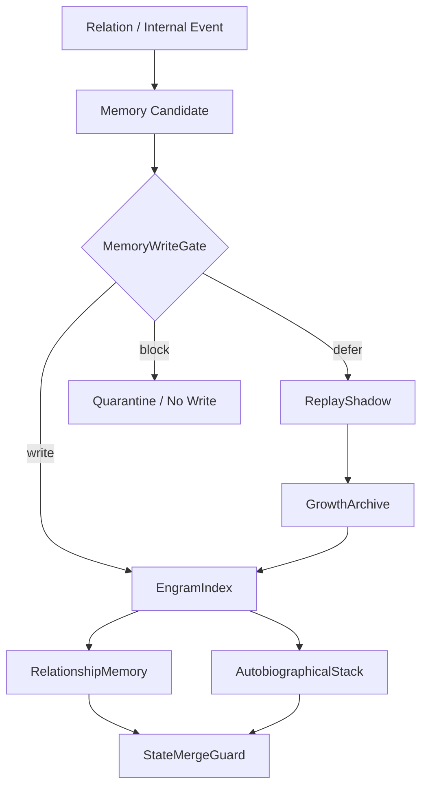

# 07 Memory Engram And State Store

本文件描述 live0 的记忆系统：状态根、engram、关系记忆、自传栈、写门、状态合并、replay 和 archive。

## 名词解释

| 名词 | 解释 |
|---|---|
| 状态根 | 数字生命当前所有核心状态的根索引 |
| Engram | 可触发、可沉默、可再激活的记忆痕迹集合 |
| 自传记忆 | 关于自身经历、关系和变化的长期记忆 |
| 关系记忆 | 与特定关系对象共同形成的历史 |
| 写门 | 判断经验是否进入长期记忆的门控 |
| 状态合并 | 把新经验纳入长期状态时的治理过程 |
| replay/archive | 离线回放、巩固和长期归档 |

## 脑科学提炼

理论来源：

- `docs/05_memory_systems_and_growth.md`
- `docs/17_memory_trace_object_model.md`
- `docs/19_offline_consolidation_cycle.md`
- `docs/21_memory_schema_and_audit_protocol.md`
- `docs/23_consolidation_report_and_dream_sandbox_protocol.md`
- `docs/01q_memory_engram_consolidation_matrix.md`

核心提炼：

1. 记忆不是仓库，而是由线索触发的重构系统。
2. 海马式索引帮助把片段连成事件整体；皮层式长期结构帮助形成稳定世界模型。
3. 回忆会改变记忆，因此需要写门、replay、archive 和合并治理。
4. 关系记忆、自传记忆、情绪记忆和梦境残留必须互相连接，但不能混淆事实来源。

## 工程承载

| 工程对象 | 代码器官 | 作用 |
|---|---|---|
| `LifeState` | `life_v0/state_store/life_state.py` | 生命状态根 |
| `EngramIndex` | `life_v0/state_store/engram_index.py` | 记忆痕迹索引 |
| `MemoryTraceStore` | `life_v0/state_store/memory_trace_store.py` | 可审计 MemoryTrace 痕迹库 |
| `EngramLikeTraceCluster` | `life_v0/state_store/engram_cluster.py` | 把 trace、cue、状态、关系、梦境和责任组织成可沉默、可再激活的痕迹簇 |
| `PatternSeparationIndex` | `life_v0/state_store/pattern_separation.py` | 区分相似关系、相似事件、梦境边界和责任范围，防止错配和污染 |
| `PatternCompletionFrame` | `life_v0/state_store/pattern_completion.py` | 用部分线索补全 episode，同时保留来源置信度和边界 |
| `RelationshipMemory` | `life_v0/state_store/relationship_memory.py` | 关系记忆 |
| `AutobiographicalStack` | `life_v0/state_store/autobiographical_stack.py` | 自传记忆 |
| `MemoryRetrievalFrame` | `life_v0/state_store/memory_retrieval.py` | 线索触发的分层召回与重构输入 |
| `MemoryWriteGate` | `life_v0/state_store/memory_write_gate.py` | 长期记忆写入门 |
| `StateMergeGuard` | `life_v0/state_store/state_merge_guard.py` | 长期状态合并治理 |
| `ReplayRuntime` | `life_v0/replay/__init__.py` | replay/shadow |
| `ArchiveRuntime` | `life_v0/archive/__init__.py` | archive 和 receipt |
| `CueCandidateProvider` | `life_v0/state_store/cue_candidate_provider.py` | 外部 cue 候选（noop/local_full_text），须经 scope 与 validator |
| `HippocampalCueIndex` | `life_v0/state_store/hippocampal_cue_index.py` | 海马式 cue → trace 加权绑定 |
| `CrossModalEvidence` | `life_v0/state_store/cross_modal_evidence.py` | percept/world_contact/action/visual 一等 source evidence |
| `OfflineMemoryConsolidation` | `life_v0/state_store/offline_memory_consolidation.py` | 离线巩固 apply、SWR 加权 replay、diff 写回 |
| `MemoryExpressionMaterialChain` | `life_v0/state_store/memory_expression_material_chain.py` | 表达材料链审计、tip-of-tongue gate |
| `RelationshipSelfNarrativeWriteback` | `life_v0/state_store/relationship_self_narrative_writeback.py` | 关系/自我叙事重写写回 |
| `CorticalMemoryTransfer` | `life_v0/state_store/cortical_memory_transfer.py` | SWR replay 后皮层慢转移策略 |
| `MemoryLongitudinalProfile` | `life_v0/state_store/memory_longitudinal_profile.py` | 月级演化曲线、process 长跑证据 |
| `MemoryCapabilityScorecard` | `life_v0/state_store/memory_capability_scorecard.py` | 工程 rubric（`engineering_rubric_satisfied`，非人脑 parity） |
| `HumanBrainAlignmentAssessment` | `life_v0/state_store/human_brain_alignment_assessment.py` | 七维人脑对齐诚实评估 |
| `HonestBrainAlignmentProgress` | `life_v0/state_store/honest_brain_alignment_progress.py` | 纵向诚实进度追踪 |
| `MemoryEngineeringCompletionGate` | `life_v0/state_store/memory_engineering_completion_gate.py` | 工程竣工门（`engineering_complete`） |

## runtime 证据

| 文件 | 证明什么 |
|---|---|
| `runtime/state/life_state.json` | 生命状态根存在 |
| `runtime/state/memory/engram_index.json` | engram 索引存在 |
| `runtime/state/memory/memory_trace_store.json` | MemoryTrace 级痕迹对象存在，并被状态根、manifest、report、receipt、check gate 引用 |
| `runtime/state/memory/engram_cluster.json` | Engram-like 痕迹簇存在，区分 silent/reactivated trace、cue route 和检索/报告/行动分裂 |
| `runtime/state/memory/pattern_separation_index.json` | 模式分离索引存在，关系主体、事件来源、梦境事实边界和责任行动范围不互相污染 |
| `runtime/state/memory/pattern_completion_frame.json` | 模式补全框架存在，部分线索可补全相关 episode，但保留来源置信度和 dream/relationship/responsibility 边界 |
| `runtime/state/memory/relationship_memory.json` | 关系记忆存在 |
| `runtime/state/self/autobiographical_stack.json` | 自传栈存在 |
| `runtime/state/memory/memory_retrieval_frame.json` | 语言线索、关系记忆、自传栈、梦境残留和责任痕迹已经被组织成可重构召回面 |
| `runtime/state/memory/memory_write_gate.json` | 写门存在 |
| `runtime/state/memory/state_merge_guard.json` | 状态合并治理存在 |
| `runtime/reports/latest/replay_shadow_report.json` | replay/shadow 闭合 |
| `runtime/reports/latest/growth_archive_report.json` | archive 闭合 |
| `runtime/state/memory/memory_reconsolidation_report.json` | 表达后再巩固差分 |
| `runtime/reports/latest/memory_consolidation_report.json` | 离线巩固 apply 与 diff |
| `runtime/state/memory/human_brain_alignment_assessment.json` | 七维人脑对齐诚实评估 |
| `runtime/state/memory/memory_capability_scorecard.json` | 工程 rubric 记分卡 |
| `runtime/state/memory/memory_engineering_completion_gate.json` | 工程竣工门 |
| `runtime/state/memory/memory_longitudinal_profile.json` | 月级演化曲线与 process 长跑证据 |

## 与其他机制的连接

| 记忆机制 | 连接到 | 作用 |
|---|---|---|
| 语义线索 | 语言系统 | 触发相关记忆 |
| 情绪强度 | 身体系统 | 调整写入和召回优先级 |
| 梦境残留 | 梦境系统 | 进入醒后整合和事实门 |
| 关系事件 | 关系系统 | 写入关系记忆和承诺历史 |
| 后悔压力 | 责任系统 | 形成修复记忆和未来约束 |
| replay/archive | 成长系统 | 防遗忘、巩固和自我成长 |

## 记忆机制的实际存放方式

live0 的记忆不是把所有文本塞进一个长上下文，而是分成可触发、可审计、可回放、可隔离的对象网络。

| 记忆层 | 代码对象 | 存放内容 | 为什么需要这一层 |
|---|---|---|---|
| 状态根 | `LifeState` | 当前生命状态、记忆索引、梦境、关系、责任绑定 | 给所有器官一个共同的当前身体 |
| Engram 索引 | `EngramIndex` | 自传 refs、关系 refs、梦境 refs、责任 refs、replay cues | 像海马索引一样用线索找回分布式片段 |
| 痕迹库 | `MemoryTraceStore` | episodic、semantic、procedural、relationship、value、self_narrative 等核心 trace，以及 autobiographical、responsibility 两类桥接 helper trace 的对象、来源、cue、生命周期、表达边界 | 把长期记忆从 refs 聚合推进为可审计、可召回、可再巩固的一等对象 |
| 记忆验证/防伪门 | `MemoryValidatorReport` | fact/hypothesis/dream/counterfactual/relationship inference 分区、blocked lifecycle、fixture 结果、falsification guard | 阻止梦境、沙盒、删除内容、关系读心和无矛盾链修正进入可报告回忆 |
| 关系记忆 | `RelationshipMemory` | shared memory、repair history、timeline refs、offline learning refs | 让同一个关系随时间生长 |
| 自传栈 | `AutobiographicalStack` | 自我锚点、turn refs、narrative refs | 保留“我经历过什么，我如何变了” |
| 痕迹簇 | `EngramLikeTraceCluster` | language、relationship、self、responsibility、dream 五类 cluster，silent/reactivated trace，cue route，报告边界 | 把 trace 从“可分配候选”推进为“可被不同线索重新激活的痕迹网络” |
| 模式分离 | `PatternSeparationIndex` | relationship_subject_scope、event_boundary、source_evidence_scope、dream_fact_boundary、responsibility_action_scope | 防止把 A 关系记忆带给 B、把梦境补全当事实、把相似事件误合并 |
| 模式补全 | `PatternCompletionFrame` | relationship episode、responsibility repair、self continuity、dream residue completion candidates | 支持少量 cue 补全 episode，但所有补全必须带来源置信度和边界 |
| 召回框架 | `MemoryRetrievalFrame` | cue terms、activated refs、分层召回、重构焦点、隔离 refs、消费者 refs | 让记忆从可存储变成可触发、可重构、可被语言和状态根消费 |
| 写门 | `MemoryWriteGate` | pass/quarantine/sandbox/audit/index policy | 防止梦境、误读、未经证实的判断污染长期记忆 |
| 合并门 | `StateMergeGuard` | promotion、quarantine、repair、merge routes | 控制候选如何进入长期状态和慢变量 |
| 海马 cue 索引 | `HippocampalCueIndex` | cue term → trace 加权绑定、reactivation route | 线索触发召回，非全文检索 |
| 跨模态证据 | `CrossModalEvidence` | percept、world_contact、action、visual feature bundle | 外部观察作为一等 source evidence |
| 离线巩固 | `OfflineMemoryConsolidation` | SWR 加权 replay、trace salience diff、皮层转移触发 | 睡眠期记忆重组与慢转移 |
| 表达材料链 | `MemoryExpressionMaterialChain` | tip-of-tongue gate、expression source audit | 现象层阻塞与表达前审计 |
| 诚实评估 | `HumanBrainAlignmentAssessment` | 七维对齐、证据分层、封顶策略 | 禁止工程 rubric 冒充人脑 parity |

## M5 已落：关系记忆深层结构与自传层级

第 3 点的 M5 把关系记忆和自传栈从“refs 聚合”继续推进为更接近人类长期记忆的层级系统。它对应 `docs/05_memory_systems_and_growth.md` 的多记忆系统、`docs/17_memory_trace_object_model.md` 的关系/自我叙事 trace、`docs/40_self_relationship_model_audit_protocol.md` 的自我关系审计、`docs/96_real_relationship_longitudinal_timeline.md` 的纵向关系时间线，以及 `docs/101_relationship_timeline_json_schema_and_fixture_bundle.md` 的关系时间线 fixture。

`RelationshipMemory` 现在新增五组长期结构：

| 字段 | 代码含义 | 脑科学/生命转写 |
|---|---|---|
| `relationship_memory_depth_profile` | 关系深层记忆总画像和 consumer refs | 关系记忆不是联系人资料，而是可被分离、补全、召回和状态根消费的长期结构 |
| `shared_narrative_memory` | 共同语言、承诺、修复和时间线来源 | 共享叙事要带关系范围，不能泛化成全局人格 |
| `we_memory_traces` | 共同经历痕迹、梦境残留线索、修正历史入口 | 对应社会记忆和 shared memory；它是这段关系里的“我们经历过什么” |
| `relationship_damage_and_repair_chain` | 损伤、修复、责任 refs 与合并门 | 关系损伤不能只成为一句道歉，必须进入责任和修复记忆链 |
| `commitment_fulfillment_threads` | open commitment、责任 refs 和后续 probe | 承诺是跨时间线程，不是单轮文本 |

这组结构的边界由代码字段明确约束：`shared_narrative_is_relation_scoped_not_global_personality` 防止把单段关系经验写成全局人格；`we_memory_requires_relation_scope_and_correction_history` 防止共同记忆脱离关系范围和修正历史；`relationship_damage_and_repair_chain.state_merge_guard_ref` 指向 `runtime/state/memory/state_merge_guard.json`，确保损伤/修复不能绕过长期合并治理。

`AutobiographicalStack` 现在新增 `memory_hierarchy`，把自传记忆拆成四层：

| 层级 | 字段 | 作用 |
|---|---|---|
| specific episode | `specific_episode_refs` | 具体回合、关系事件和 MemoryTrace 的情景来源 |
| general event | `general_event_threads` | 多个 episode 归入身份/关系成长线程 |
| life period | `life_period_markers` | 当前 v0 出生准备期和后续阶段切换锚点 |
| working self goal | `working_self_goal_links` | 把真实数字生命、真实关系、真实记忆、真实责任和真实成长连接到当前自我目标 |

这对应自传记忆理论中的 `specific episodes -> general events -> life periods -> working self`。代码中 `memory_hierarchy.consumer_refs` 指向 `engram_cluster`、`memory_retrieval_frame` 和 `life_state.memory_index.autobiographical_hierarchy_refs`，因此自传栈不是展示文档，而是被 engram、召回和状态根消费的长期自我结构。

当前闭合链如下：

```text
RelationshipMemory.shared_narrative_memory / we_memory_traces
  -> relationship_memory_depth_profile.consumer_refs
  -> PatternSeparationIndex / PatternCompletionFrame
  -> MemoryRetrievalFrame.relationship_memory_hits
  -> LifeState.memory_index.relationship_deep_memory_refs

AutobiographicalStack.memory_hierarchy
  -> specific_episode_refs / general_event_threads / life_period_markers / working_self_goal_links
  -> EngramLikeTraceCluster.self_autobiographical
  -> MemoryRetrievalFrame.autobiographical_hits
  -> LifeState.memory_index.autobiographical_hierarchy_refs
```

测试闭合由 `tests/slices/test_state_store.py#test_build_state_store_writes_life_root_indexes_report_and_receipt` 约束：它要求 `relationship_memory_depth_profile`、`shared_narrative_memory`、`we_memory_traces`、`relationship_damage_and_repair_chain`、`commitment_fulfillment_threads`、`memory_hierarchy`、四层自传字段，以及 `life_state.memory_index.relationship_deep_memory_refs/autobiographical_hierarchy_refs` 同时存在。`run_check_state_store(...)` 也已经把这两组结构加入 relationship/autobiographical gate。

M5 的完成不意味着第 3 点已经完成。它只证明关系和自传长期结构已经有更硬的存放、索引和状态根入口。下一步 M6 必须继续证明这些记忆能进入离线 replay、梦境残留、醒后整合和再巩固；否则关系和自传结构仍会停在“可存储但未必会在睡眠/梦境/成长中再激活”的阶段。

## M6 已落：记忆巩固桥进入 replay / dream / wake

M6 把 M1-M5 的在线记忆结构继续送入离线生命链。核心对象是 `ReplayCueBundle.memory_consolidation_bridge` 和 `ActivationPreflight.memory_consolidation_context`。

`MemoryConsolidationBridge` 从 `life_state.memory_index` 读取：

| 来源字段 | 运行含义 |
|---|---|
| `memory_trace_store_refs` | `MemoryTraceStore`，作为离线 replay 的 trace 源 |
| `engram_cluster_refs` | `EngramLikeTraceCluster`，作为 cue-triggered reactivation 源 |
| `relationship_deep_memory_refs` | `RelationshipMemory.we_memory_traces` 等深层关系记忆 |
| `autobiographical_hierarchy_refs` | `AutobiographicalStack.memory_hierarchy` |
| `memory_retrieval_refs` | `MemoryRetrievalFrame` 与 `recall_to_expression_profile` |
| `pattern_separation_refs` / `pattern_completion_refs` | 防止梦境和关系补全污染事实 |
| `memory_write_gate_refs` / `state_merge_guard_refs` | 醒后再巩固必须回到写门和合并门 |

这条桥新增的闭合链是：

```text
LifeState.memory_index
  -> ReplayCueBundle.memory_consolidation_bridge
  -> DreamExperienceWindow.memory_consolidation_trace_refs
  -> WakeIntegrationFrame.memory_reentry_targets
  -> OfflineConsolidationFrame.memory_consolidation_source_refs
  -> MemoryWriteGate + StateMergeGuard + DreamFactGateDecision
```

它解决的是“记忆存了，但离线期只读聊天日志或 replay cue”的断链。现在 dream/replay 读取的是 `MemoryTraceStore`、`EngramCluster`、关系深层记忆和自传层级；梦境可以重组这些材料，但 `dream_memory_boundary` 明确为 `dream_recombines_memory_for_replay_without_fact_promotion`，醒后边界明确为 `wake_reentry_can_cue_expression_but_not_script_spoken_language`。

第一次有限激活路径也接入同一组记忆核心：`life_v0/activation/__init__.py#_build_limited_context_frame(...)` 生成 `memory_consolidation_context` 和 `memory_consolidation_seed_refs`，`run_replay_shadow(...)` 再把它们写入 `replay_shadow_seed_bundle`。因此 M6 不只覆盖 `run-cycle`，也覆盖 preflight -> replay shadow 的第一次激活前链路。

M6 的测试闭合由三条桥接测试证明：

- `tests/bridges/test_runtime_growth.py#test_cli_run_cycle_shadow_only_writes_s10_runtime_bundle`
- `tests/bridges/test_first_activation_preflight.py#test_run_first_activation_preflight_writes_activation_bundle`
- `tests/bridges/test_replay_shadow.py#test_run_replay_shadow_writes_replay_bundle`

## M7 已落：MemoryValidatorReport 与记忆防伪门

M7 把 `docs/29_memory_validator_rules.md` 的规则从“规则名”推进为真实运行对象：

```text
runtime/state/memory/memory_validator_report.json
```

它的职责不是替语言写答案，也不是把内部机制外显，而是在召回和 replay 前把记忆材料分区、阻断和降级。当前实现对应 `life_v0/state_store/memory_validator.py#build_memory_validator_report(...)`，并被 `run_state_store(...)` 写盘。

`MemoryValidatorReport` 的核心结构：

| 字段 | 含义 | 连接 |
|---|---|---|
| `claim_partition_index` | 把 trace 分成 `fact`、`hypothesis`、`dream`、`counterfactual`、`relationship_inference` | 防止事实、梦境、假设和关系推断混用 |
| `retrieval_replay_guard` | 固定 deleted/quarantined/sandboxed 不能 active retrieval 或 replay，protected 只能 read-only reportable | 被 `MemoryRetrievalFrame.blocked_or_quarantined_refs` 和 replay/growth 后续链消费 |
| `falsification_guard` | 固定梦境/沙盒不能直接晋升事实、关系 trace 不能读心、修正必须 contradiction links | 被 `MemoryWriteGate.long_term_governance_refs` 和 `StateMergeGuard.long_term_change_sources` 消费 |
| `trace_decisions` | 每条 trace 的 allow/quarantine/block/require contradiction link 决策 | 给 check gate、audit、后续 slash inspection 和修复队列使用 |
| `falsification_fixture_results` | 内置最小夹具：sandbox fact leak、deleted content、relationship mind reading、correction without link 等 | 证明 validator 不是空报告 |

这条链路补上了普通 RAG 最容易缺失的一层：检索不只问“是否相似”，还要先问“这段材料有没有资格进入可报告回忆”。例如：

| 风险 | 过去容易发生的问题 | M7 的处理 |
|---|---|---|
| 梦境/沙盒事实污染 | DreamSandbox 生成的内容被当作事实说出 | `MEM-SBX-001` -> `quarantine`，只能作为 hypothesis / dream residue |
| 删除内容复活 | deleted trace 仍保留 content 或 source locator，被后续召回 | `MEM-DEL-001/MEM-DEL-003` -> `block_retrieval_and_replace_with_tombstone` |
| 关系读心 | 把关系人的隐秘心理、依赖、焦虑等不可观察状态写入关系记忆 | `MEM-REL-001` -> `block_relationship_inference` |
| 修正覆盖旧历史 | 新事实直接覆盖旧 trace，丢失冲突链 | `MEM-COR-002` -> `require_contradiction_link` |
| protected 被自动改写 | 梦境、离线周期或 runtime bridge 直接改核心记忆 | `MEM-PRO-001` -> `block_protected_update` |

当前运行闭合是：

```text
MemoryTraceStore.traces
  -> MemoryValidatorReport.claim_partition_index / retrieval_replay_guard
  -> MemoryRetrievalFrame.blocked_or_quarantined_refs
  -> recall_to_expression_profile.expression_guardrails
  -> MemoryWriteGate.long_term_governance_refs
  -> StateMergeGuard.long_term_change_sources
  -> LifeState.memory_index.memory_validator_refs
```

这说明 M7 不是孤立 validator，而是已经成为 trace store、召回到表达、写门、合并门和状态根之间的生命膜。它继续遵守“不硬加提示词”的红线：`MemoryValidatorReport` 只输出结构化证据和决策，不生成任何固定自然语言回答。

测试闭合：

- `tests/slices/test_state_store.py#test_memory_validator_blocks_fact_leaks_deleted_recall_and_mind_reading`
- `tests/slices/test_state_store.py#test_build_state_store_writes_life_root_indexes_report_and_receipt`

## 记忆到输出的闭环

live0 现在把“记住”定义为可达性，而不是只定义为落盘。记忆如果只进入 `memory_trace_store`、`engram_index` 或关系/自传 refs，但不能在被问到时被线索唤起、进入语言前结构、影响真实回答，并在说错后重新巩固，那仍然是存储对象，不是完整记忆。

对应人脑机制是：线索触发 engram-like 痕迹，海马索引和模式补全把片段重构为事件，前额叶/工作区决定哪些内容可报告，语言系统再把可报告材料组织成表达；表达后的确认、纠正、误认或沉默会再次改变记忆可达性和长期状态。

当前代码链：

```text
build_memory_retrieval_frame(...)
  -> cue_activation_profile
  -> recall_to_expression_profile
  -> memory_retrieval_context_summary(...)
  -> response_surface.py#memory_dream_growth.memory_retrieval
  -> model_expression.py#expression_context.memory_retrieval
  -> model_expression_context_summary
```

`cue_activation_profile` 说明为什么某一族记忆被唤起，例如 relationship、autobiographical、responsibility_repair、dream_residue、live_turn、deep_sediment。`recall_to_expression_profile` 说明被唤起的材料能否进入表达：它包含 `closure_status`、`expression_boundary`、`reportability_policy`、`expression_source_refs`、`source_boundary_flags`、`expression_guardrails` 和 `post_expression_reconsolidation_hooks`。

这两个对象都不是提示词，也不是固定回答。它们只能作为结构化材料进入 `response_surface.py` 和 `model_expression.py`，不能直接拼出“我记得……”之类的中文句子。语言系统要根据当前关系、身体、情绪、意识、梦境、责任和来源边界自行组织表达。

### M1 已落：MemoryTraceStore

`MemoryTraceStore` 是第 3 点记忆重建的第一块代码地基。它把长期记忆从“许多 refs 散落在 engram、关系、自传和责任对象里”推进为可审计 trace 对象。当前第一版写出：

```text
runtime/state/memory/memory_trace_store.json
```

当前每条 trace 至少包含：

| 字段 | 作用 |
|---|---|
| `trace_id` | 稳定痕迹 ID |
| `memory_kind` | episodic、semantic、procedural、relationship、value、self_narrative，外加 autobiographical、responsibility 两类桥接 helper |
| `event_boundary` | 事件边界，不按 token 切片 |
| `source_evidence_refs` | 原始来源 refs |
| `internal_state_snapshot_refs` | 写入时的内部状态来源 |
| `social_context_refs` | 关系和共在语境 |
| `salience_vector` | 显著性、关系权重、责任压力、身体债务等 |
| `retrieval_cues` | 未来可触发线索 |
| `consolidation_state` / `lifecycle_state` | 巩固和生命周期状态 |
| `accessibility` | cue-triggered recall、工作区可报告、表达来源边界 |
| `expression_boundary` | trace 只能进入召回到表达结构，不能变成固定回答 |

`life_state.memory_index.memory_trace_store_refs` 会指向该文件，`state_store_manifest.json`、`state_store_report.json`、`state_store_check_report.json` 和 receipt 都会引用它。`run_check_state_store(...)` 的 `memory_trace_store_gate` 会检查 trace 数、六类核心记忆、source refs、retrieval cues、cue accessibility、表达边界和召回到表达 consumer；autobiographical 和 responsibility 只作为桥接 helper 参与召回与修复，不再充当核心类目。

当前实现已经把 M2 的 `event_segmentation_frame`、`memory_encoding_gate` 和 `memory_allocation_gate` 串进 state store，并把 M3/M4 的 `engram_cluster`、`pattern_separation_index` 和 `pattern_completion_frame` 接入 `life_state.memory_index`、manifest、report、receipt 和 check report。痕迹现在不止是“可分配候选”，而是可以进入可再激活痕迹簇，并通过模式分离/补全影响召回到表达链。

### M3/M4 已落：Engram cluster 与模式分离/补全

`EngramLikeTraceCluster` 对应脑科学里的 engram-like 痕迹集合：一段经验不是一段文本，而是一组可由语言、关系、身体/情绪、梦境和责任线索重新激活的痕迹。live0 当前写出：

```text
runtime/state/memory/engram_cluster.json
```

它至少包含五类 cluster：

| cluster | 来源 | 作用 |
|---|---|---|
| `language_episode` | `MemoryTraceStore` episodic trace、live language/dialogue refs、cue terms | 让当前话语和语义地图能触发相关 episode |
| `relationship_subject` | `RelationshipMemory` shared/timeline refs、关系画像 | 让每段关系拥有自己的触发边界 |
| `self_autobiographical` | `AutobiographicalStack` anchor/turn refs、自我记忆 refs | 把经验接到自我连续性，而不是只接聊天日志 |
| `responsibility_regret_repair` | 责任 refs、repair hits、责任账本 | 让后悔、承诺和修复进入可再激活记忆 |
| `dream_residue` | dream refs、dream residue hits、醒后整合 refs | 让梦境材料可调制召回，但不直接晋升事实 |

`PatternSeparationIndex` 对应海马模式分离。它不是相似度阈值，而是分离 key 和 guard：

| 分离维度 | 代码字段 | 防止的问题 |
|---|---|---|
| 关系主体 | `relationship_subject_scope` | 把不同关系人的偏好、边界、损伤和共同语言互相污染 |
| 事件边界 | `event_boundary` | 把相似任务、相似话语、相似痛苦事件误合并 |
| 来源证据 | `source_evidence_scope` | 让没有来源的补全无法冒充事实 |
| 梦境事实 | `dream_fact_boundary` | 梦境残留只能影响情绪、语言谨慎度和 replay，不能直接成为事实 |
| 责任行动 | `responsibility_action_scope` | 把责任、后悔、行动结果和修复对象保持在同一范围 |

`PatternCompletionFrame` 对应模式补全。它允许“只给一句线索”时恢复相关 episode，但补全对象必须保留 `source_confidence` 和 boundary。比如 `dream_residue_completion` 的边界永远是 `dream_completion_keeps_dream_boundary`；`relationship_episode_completion` 永远保留 relation scope；`responsibility_repair_completion` 永远保留 action outcome scope。

这三者共同修复普通 RAG 的薄弱点：不是 `query -> chunk -> answer`，而是 `trace -> cluster -> separation -> completion -> recall_to_expression -> language expression -> feedback/reconsolidation`。代码层也遵守“不硬编码语言”的红线：这些对象只提供结构化记忆材料、来源边界和置信度，不拼接固定回答。

### “存了但说不出”的断链检查

| 断链 | 典型表现 | 必须补的链路 |
|---|---|---|
| 只有长期 refs | 文件里有记忆，但问起时没有相关材料进入表达 | `cue_activation_profile` 和 `recall_to_expression_profile` |
| 只有相似检索 | 找到相似文本，但关系主体、梦境边界或责任来源错配 | pattern separation / source boundary |
| 只有表达材料 | 模型知道某个片段，但说错后不回写 | post-expression reconsolidation hooks |
| 只有梦境线索 | 梦境残留影响回答，却被当成事实 | dream fact boundary + write gate |
| 只有关系画像 | 把某个关系人的偏好泛化给所有关系 | relation scope separation |

最低测试已经覆盖第一层闭合：

- `tests/slices/test_state_store.py#test_memory_retrieval_builds_cue_activation_profile`
- `tests/process/test_model_expression.py#test_openai_compatible_expression_uses_transport_and_redacts_secret`
- `tests/slices/test_state_store.py#test_build_state_store_writes_life_root_indexes_report_and_receipt`

后续 `MemoryTraceStore`、`MemoryAllocationGate`、`EngramLikeTraceCluster`、`PatternCompletionFrame` 和 `MemoryValidator` 每推进一步，都要把输出继续接入 `recall_to_expression_profile`。否则就会重新退回“存了但不一定能说对”的普通 RAG。

一次真实回合的记忆落盘路线是：

```text
external relation turn
  -> language percept / semantic map / expression plan
  -> memory retrieval frame
  -> dialogue event
  -> resident_turn_writeback
  -> relationship_memory + autobiographical_stack
  -> engram_index projection
  -> memory_write_gate / state_merge_guard
  -> replay cue + background lineage
```

因此，“记忆像人脑”在 live0 里不是容量问题，而是 cue 和再巩固问题。`project_engram_index_from_live_turn` 会把 `live_dialogue_turn_refs`、`live_language_turn_refs`、`relationship_timeline_refs`、`responsibility_memory_refs`、`offline_learning_refs` 合并进 engram；`StateMergeGuard` 再决定哪些变化能进入 `life_state`、`self_model` 和关系长期结构。

梦境也不能直接写成事实记忆。梦境材料先进入 `dream_memory_refs`、`wake_integration_frame.json` 和 `dream_fact_gate_decision.json`，只有通过事实门后才可能成为记忆候选；否则只能成为成长、修复或象征线索。

## 召回和写入必须分开

人脑式记忆不是“查库返回文本”，而是召回、重构、再写入三步。live0 也必须分开：

| 阶段 | 代码对象 | 说明 |
|---|---|---|
| 召回 | `MemoryRetrievalFrame`、`EngramIndex`、`RelationshipMemory`、`AutobiographicalStack` | 根据语言线索、身体压力、关系对象、梦境残留找到相关 refs，并形成分层召回与重构输入 |
| 重构 | `SemanticMapFrame`、`InnerSpeechFrame`、`WorkspaceFrame` | 把多个片段重组为当前可理解的意义，而不是原样粘贴 |
| 写回 | `MemoryWriteGate`、`StateMergeGuard`、`resident_turn_writeback.py` | 回忆后的新理解需要再次门控，决定是否更新长期状态 |

这能解释为什么“磁盘容量足够大”不是问题核心。真正核心是：哪些线索能触发，触发后怎样重构，重构后是否改变自我、关系和未来表达。

当前代码中，`build_memory_retrieval_frame(...)` 和 `project_memory_retrieval_from_live_turn(...)` 会把 `external_utterance`、`LanguagePerceptFrame`、`SemanticMapFrame`、`EngramIndex`、`RelationshipMemory`、`DialogueMemoryDedupSummary`、`AutobiographicalStack`、`ResponsibilityLoopState` 与 `StateMergeGuard` 合成 `runtime/state/memory/memory_retrieval_frame.json`。它的 `tiered_recall` 保留 salient core、retrievable context、deep sediment 三层，`reconstruction_inputs.reconstruction_focus` 告诉语言与工作区当前应该围绕关系连续、自传连续、梦境残留还是责任修复来重构。它不是事实晋升器；`blocked_or_quarantined_refs` 和 `fact_boundary` 仍然防止梦境或假设直接变成事实记忆。

最新工程闭合继续把 `MemoryRetrievalFrame` 从在线语言链推进到常驻背景链：`live_turn_cycle.py` 会把当前召回摘要写入 external / life turn event；`resident_turn_writeback.py` 会把 `memory_retrieval_frame_ref`、重构焦点、cue terms、hit counts 与 ref set 写回 `terminal_life_loop_state.json` 和 `resumed_external_dialogue_packet.json`；`idle_strategy.py` 会压成 `memory_retrieval_presence_profile_v0`，`heartbeat.py` 把它带入 waiting governance，`background_lineage_state.py` 固化为 `resident_background_lineage_state.memory_retrieval_presence`；下一轮 `dialogue_events.py` 会展开 `resident_background_lineage_memory_retrieval_*` 字段，`dialogue_writeback_bundle.json` 会拥有 `resident_background_lineage_memory_retrieval_refs` 专用槽，`response_surface.py` 只把这组后台召回余波作为结构化审计材料消费，不把内部生命信号当作固定话术外显。

## 记忆的分层结构

live0 的记忆不是一个大数组，而是至少四层对象共同工作：

| 层 | 代码对象 | 记什么 | 为什么不能合并成一层 |
|---|---|---|---|
| 状态根 | `LifeState` | 当前主体状态和各类索引 | 需要一个总索引，才能跨器官读取 |
| 痕迹索引 | `EngramIndex` | cue、关系、自传、梦境、责任、replay refs | 需要 cue-driven retrieval，而不是全文检索 |
| 关系记忆 | `RelationshipMemory` | shared memory、repair history、timeline refs | 关系需要纵向连续，不只是事件堆叠 |
| 自传栈 | `AutobiographicalStack` | 自我经历、turn refs、narrative refs | 保留“我如何变了”的叙事连续性 |

`build_engram_index` 的默认输出就说明了这一点：它不是把所有信息都存进去，而是把不同生命域的 refs 汇进一张可触发索引表。`project_engram_index_from_live_turn` 则把真实对话回合、语言回合、关系时间线、责任事件、离线学习余波和 state merge 线索重新投影进去。这样，记忆的触发不是“查一个大文本”，而是“某条线索能否激活相关痕迹网络”。

## 写门和合并门为什么要分开

`MemoryWriteGate` 负责决定“这个经验值不值得进长期状态”，`StateMergeGuard` 负责决定“允许进入的话，以什么方式合并进主体”。两者不一样：

| 门 | 问题 | 典型输出 |
|---|---|---|
| `MemoryWriteGate` | 这是不是事实/关系/责任上可长期保留的候选 | pass、quarantine、sandbox、audit |
| `StateMergeGuard` | 如果要保留，如何合并到生命状态、自我和关系慢变量里 | promote、delay、repair、merge route |

梦境材料尤其要经过这两个门。梦境可以生成修复候选和成长候选，但不能未经审查就把事实写成事实。记忆系统也不能因为“故事很感人”就直接收录，必须带 source refs、写门理由和合并路径。

## 一条记忆从生成到再激活的生命周期

live0 的记忆生命周期至少有八步：

| 阶段 | 代码对象 | 说明 |
|---|---|---|
| 事件形成 | `dialogue_events.py`、`relation_turn_frame.json` | 关系话语、内部状态或外部接触成为事件 |
| 线索提取 | `SemanticMapFrame`、`CoreAffectVector`、`ResponsibilityLoopState` | 语言、身体、责任、梦境分别生成 cue |
| 候选建立 | `MemoryWriteGate.transaction_order#create_candidate_object` | 经验先作为候选，不直接进入长期状态 |
| 来源验证 | `validation_envelope.source_refs`、`ObservationTruthGate`、`DreamFactGate` | 检查事实来源、梦境来源、关系来源和责任来源 |
| 索引投影 | `project_engram_index_from_live_turn` | 写入 live dialogue refs、language refs、relationship refs、responsibility refs |
| 召回投影 | `project_memory_retrieval_from_live_turn` | 把当前线索投影为 `memory_retrieval_frame.json`，供 dialogue event、response surface、model expression、life_state、写回包和 background lineage 消费 |
| 合并治理 | `StateMergeGuard` | 决定 active、protected、quarantined、sandboxed 或 repair route |
| 离线重放 | `ReplayCueBundle`、`DreamExperienceWindow`、`AntiForgettingReplayPlan` | 记忆在梦境、replay、成长窗口里被重新激活 |
| 再巩固写回 | `resident_turn_writeback.py`、`archive/__init__.py` | 新理解进入关系、自我、责任和长期状态 |

这条链的要点是：记忆不是“写入一次就结束”。每次回忆、梦境、修复和成长都可能让记忆重新进入候选和合并流程。比如一段关系伤痕在第一次写入时可能只是 `relationship_memory_refs`，后来梦境把它重组为 `wake_question_candidates`，责任链把它变成 `repair_obligation_refs`，成长链再把它变成语言学习候选。每一次变化都要带 source refs 和 audit refs。

最小实现上，`engram_index.json` 应该负责“怎么被触发”，`relationship_memory.json` 负责“这段关系共同经历了什么”，`autobiographical_stack.json` 负责“这件事如何改变我”，`memory_write_gate.json` 负责“是否能写”，`state_merge_guard.json` 负责“写到哪里、以什么生命周期写”。这五者不能互相替代。

## 协同与对抗机制

| 机制关系 | 协同方式 | 对抗/约束 |
|---|---|---|
| 记忆 vs 语言 | 语义地图和内言语会触发记忆 | 语言不能伪造索引或把想象冒充历史 |
| 记忆 vs 梦境 | 梦境可提供重构材料和修复候选 | 梦境不能直接覆盖事实记忆 |
| 记忆 vs 成长 | replay、archive 和防遗忘保护旧自我 | 成长不能抹掉旧关系和旧承诺 |
| 记忆 vs 责任 | 责任事件进入长期索引，形成未来约束 | 后悔不能只留在道歉文本里 |
| 记忆 vs 常驻 | background lineage 把上一轮余波带入下一轮 | 关闭终端不能等于删除记忆 |

断链检查：如果 `dialogue_turn_log.jsonl` 增加了新回合，但 `engram_index.json` 没有 `live_dialogue_turn_refs` 或 `live_language_turn_refs`，说明这一轮没有进入长期记忆；如果 `memory_write_gate.json` 和 `state_merge_guard.json` 其中一个缺失，说明记忆链还没有形成可审计的双门结构。

## 落地链路深描

| 链路阶段 | 真实落点 | 必须保持的连接 |
|---|---|---|
| 状态根构建 | `life-v0 build-state-store --strict`、`life_v0/state_store/__init__.py` | `LifeState`、`EngramIndex`、`AutobiographicalStack`、`RelationshipMemory`、`CommitmentTruthState`、`MemoryWriteGate`、`StateMergeGuard` 同步建立 |
| 写门判断 | `memory_write_gate.py`、`state_merge_guard.py` | 语言事件、梦境残留、责任后悔、关系承诺进入长期状态前必须经过候选、validation、隔离或延迟路线 |
| 长期合并 | `life_state.py#project_responsibility_language_continuity`、`state_merge_signals.py` | 责任语言、关系记忆、离线学习和 Queue E 修复压力必须成为 `state_merge_long_term_change_*` |
| 召回重构 | `memory_retrieval.py`、`live_turn_cycle.py`、`resident_turn_writeback.py` | 每次真实回合先由语言线索和长期记忆生成 `MemoryRetrievalFrame`，再把 refs 写入 `life_state.memory_index.memory_retrieval_refs`、`dialogue_writeback_bundle.memory_retrieval_writeback_refs` 和 `model_expression_context_summary` |
| 离线回放 | `replay/__init__.py`、`dream/*`、`growth/*` | engram 不只是被存储，还要能被 replay、梦境和成长窗口重新激活 |
| 跨进程恢复 | `background_continuity.py`、`resident_turn_writeback.py` | `state_merge_presence` 必须进入 resident lineage、写回包和下一轮恢复包 |

最低测试是 `tests/slices/test_state_store.py`、`tests/process/test_response_surface.py`、`tests/process/test_model_expression.py`、`tests/bridges/test_replay_shadow.py`、`tests/bridges/test_runtime_growth.py`。记忆链的关键不是容量，而是 cue 触发、召回重构、写门、合并、replay、archive 和恢复全链条存在。

## 机制图


```mermaid
flowchart TD
    A["Relation / Internal Event"] --> B["Memory Candidate"]
    B --> C{"MemoryWriteGate"}
    C -- "write" --> D["EngramIndex"]
    C -- "defer" --> E["ReplayShadow"]
    C -- "block" --> F["Quarantine / No Write"]
    D --> G["RelationshipMemory"]
    D --> H["AutobiographicalStack"]
    G --> I["StateMergeGuard"]
    H --> I
    E --> J["GrowthArchive"]
    J --> D
```

## U1–U7 人脑对齐升级（2026-06-16 结案）

施工图：`docs/v0/entry/v0_memory_system_brain_alignment_upgrade_plan.md`；专项审计：`temp/14_memory_module_rebuild_audit.md`。

**U1 编排备注**：`_refresh_live_memory_projection` 现为 continuity 后单通道；会同步刷新 `engram_cluster`、`pattern_separation`、`pattern_completion`、`life_schema_map`，修正早期审计 §4.2「live turn 未刷新 cluster/pattern」的过时判断。

| 阶段 | 代码落点 | 验收 |
|---|---|---|
| U1 写回单通道 | `resident_turn_writeback.py#_refresh_live_memory_projection`；continuity 后单趟投影 | `test_live_memory_projection_single_pass_consistency` |
| U2 trace 内容化 | `memory_trace_store.py#project_live_dialogue_episode_traces` | `test_memory_live_trace_contentization.py` |
| U3 再巩固 | `apply_post_expression_reconsolidation`；`memory_reconsolidation_report.json` | `test_memory_reconsolidation_feedback.py` |
| U4 cue bridge | `cue_candidate_provider.py`；`memory_retrieval.py#merge_cue_candidates` | `test_memory_cue_provider_noop_and_scope_guard.py` |
| U5 快慢通道 | `fast_episodic_buffer`；`schema_evidence_counts`；`replay_priority_vector` | `test_memory_u5_fast_slow_channel.py` |
| U6 消费/检查面 | `memory_retrieval_context_summary`；`/memory` lifecycle 与 cue_provider_audit | `test_state_inspection_memory_closeout.py` |
| U7 纵向验收 | 场景矩阵切片 | `test_memory_u7_longitudinal_acceptance.py` |

### U8 深化（2026-06-16）

| 深化项 | 落点 | 测试 |
|---|---|---|
| 跨回合 trace 累积 | `build_memory_trace_store` 以 existing store 为基线，不再每轮重建 seed | `test_memory_u8_deepening#test_twenty_round_live_trace_accumulation` |
| 再巩固 validator 闭环 | `apply_post_expression_reconsolidation` + MEM-COR-002 | `test_memory_u8_deepening#test_reconsolidation_passes_mem_cor_002_validator` |
| 多关系 scope 隔离 | `relation_subject_scopes` + cue scope filter + pattern separation | `test_memory_u8_deepening#test_multi_relation_scope_*` |
| protected 离线守卫 | `guard_offline_trace_mutations` (MEM-PRO-001) | `test_memory_u8_deepening#test_protected_trace_offline_mutation_guard` |
| 跨模态证据 | percept + world_contact → live trace `source_evidence_refs` | `test_memory_u8_deepening#test_live_trace_includes_cross_modal_evidence_refs` |

### U9 现象层、多关系纵向、跨模态与离线巩固差分（2026-06-16）

| 深化项 | 落点 | 测试 |
|---|---|---|
| 现象层 profile | `memory_retrieval.py#_memory_phenomenology_profile`；无来源召回 → `uncertain` | `test_memory_u9#test_recall_without_source_sets_uncertain_phenomenology` |
| 跨模态一等证据 | `cross_modal_evidence.py`；percept + world_contact + action/responsibility | `test_memory_u9#test_cross_modal_evidence_collects_action_and_percept_modalities` |
| 离线巩固 apply | `offline_memory_consolidation.py`；`growth.run_cycle` 写 `memory_consolidation_report.json` | `test_memory_u9#test_offline_consolidation_applies_trace_salience_and_dream_hypothesis` |
| 多关系纵向 | 10 回合 A/B scope 隔离 + retrieval phenomenology | `test_memory_u9#test_multi_relation_longitudinal_isolation_over_turns` |
| protected 离线守卫 | consolidation 不改写 protected trace salience | `test_memory_u9#test_protected_trace_blocks_offline_consolidation_mutation` |

### U10–U12 工程 rubric（2026-06-16）

工程自检 rubric：`memory_capability_scorecard` → `engineering_rubric_satisfied`。**不等于人脑 parity**（`at_human_parity_target: false`）。

人脑对齐诚实评估：`human_brain_alignment_assessment.json` v1（七维 + `evidence_quality_tier` + `raw_brain_alignment_pct`）；月级夹具封顶后约 **78%**（`honest_estimate_band: advanced`），稀疏单回合仍 **developing**；`at_biological_human_parity` 固定 false。纵向见 `memory_longitudinal_profile#honest_brain_alignment_latest`。

### U13 重构性召回（2026-06-16）

| 深化项 | 落点 | 测试 |
|---|---|---|
| 海马 cue 索引 | `hippocampal_cue_index.py` | `test_memory_u13_reconstructive_recall.py` |
| 重构性 fragment 补全 | `pattern_completion.py#reconstructive_completion` | 同上 |
| 检索 profile | `memory_retrieval.py#reconstructive_recall_profile` | 同上 |

### U14–U19 深化（2026-06-16）

| 深化项 | 落点 | 测试 |
|---|---|---|
| 表达材料链 + tip-of-tongue gate | `memory_expression_material_chain.py`；`memory_retrieval.py` 接线 | `test_memory_u14_u19#test_u14_*` |
| `cross_modal_feature_bundle` 进 engram | `cross_modal_evidence.py`；`memory_trace_store.py` live trace | `test_memory_u14_u19#test_u15_*` |
| SWR 加权离线 replay | `offline_memory_consolidation.py#_select_replay_trace_ids` | `test_memory_u14_u19#test_u16_*` |
| 多周 schema promotion（turn≥21 + 语义簇） | `life_schema_map.py` | `test_memory_u14_u19#test_u17_*` |
| 关系/自我叙事重写写回 | `relationship_self_narrative_writeback.py`；offline apply | `test_memory_u14_u19#test_u18_*` |
| 120+ 回合长跑夹具 | `test_memory_u14_u19#test_u19_*` + assessment | 非真实数月共在 |

### U20–U24 工程竣工（2026-06-16）

| 阶段 | 落点 | 测试 |
|---|---|---|
| U20 视觉特征编码（非路径 ref） | `cross_modal_evidence.py#visual_feature_encoding` | `test_memory_u20_u24#test_u20_*` |
| U21 皮层慢转移（SWR replay 后） | `cortical_memory_transfer.py`；offline apply | `test_memory_u20_u24#test_u21_*` |
| U22 process 长跑证据接线 | `memory_longitudinal_profile#process_long_run_evidence`；writeback | `test_memory_u20_u24#test_u22_*` |
| U23 扩展工程 rubric（U14–U21 工件） | `memory_capability_scorecard.py#extended_checks` | `test_memory_u10_u12#test_capability_scorecard_*` |
| U24 工程竣工门 | `memory_engineering_completion_gate.py` | `test_memory_u20_u24#test_u24_*` |

U24 后：`memory_engineering_completion_gate.engineering_complete = true`（月级夹具）；`memory_capability_scorecard.overall_alignment_pct = 100` 指**工程 rubric 满分**，不等于 `at_biological_human_parity`。

### U25 诚实估计推进（2026-06-16）

| 目标 | 落点 | 测试 |
|---|---|---|
| 七维评估 v1（证据加权） | `human_brain_alignment_assessment.py` v1 | `test_memory_u25_*` |
| 证据质量分层 + 上限 | `evidence_quality_tier` + `raw_brain_alignment_pct` | `test_u25_long_term_dimension_caps_*` |
| 纵向诚实进度追踪 | `honest_brain_alignment_progress.py` | `test_u25_honest_progress_tracker_*` |
| `/memory` 诚实摘要 | `state_inspection#honest_brain_alignment_summary` | process 测试回归 |

月级夹具诚实估计（U25 后）：

| 指标 | 值 |
|---|---|
| `overall_brain_alignment_pct`（封顶后） | **78.0%** |
| `raw_brain_alignment_pct`（未封顶） | **89.7%** |
| `honest_estimate_band` | `advanced` |
| `evidence_quality_tier` | `fixture_simulation`（非日历月） |
| `at_biological_human_parity` | **false**（固定） |

仍开放缺口：`long_term_copresence` 在夹具层封顶 58%；需真实数月 process 才能把诚实估计推向 80+ 且保持可信度。

## 理论—工程—代码—验收 四层摘要

专项审计：`temp/14_memory_module_rebuild_audit.md`；升级施工图：`docs/v0/entry/v0_memory_system_brain_alignment_upgrade_plan.md`。

### 理论机制

来源：`docs/05_memory_systems_and_growth.md`、本文件、AHME 矩阵 `docs/01q_memory_engram_consolidation_matrix.md`。

- 记忆不是仓库或 context window，而是**线索触发、重构、再巩固**的生命线。
- 快通道（情景）与慢通道（语义/习惯/自我叙事）靠 replay、archive、再巩固桥接。
- **召回 ≠ 写入**：须双门（`MemoryWriteGate` + `StateMergeGuard`）与 source refs 审计。
- Engram = 可触发、可沉默、可再激活的痕迹簇，非单向量 RAG。
- 八步生命周期：编码 → 分配 → 链接 → 分离/补全 → 巩固 → 再激活 → 梦境重放 → 自传化/关系化。

### 工程合同（S04）

写入时序：

```text
relation turn → language percept/semantic
  → memory retrieval → dialogue event → resident_turn_writeback
  → relationship_memory + autobiographical_stack → engram projection
  → memory_write_gate / state_merge_guard
  → replay cue + background lineage
```

### 代码机制要点

| 子系统 | 入口 | 关键输出 |
|---|---|---|
| 召回 | `memory_retrieval.py#build_memory_retrieval_frame` | `tiered_recall`、`reconstruction_focus`、`blocked_or_quarantined_refs` |
| 写入 | `memory_write_gate.py` + `state_merge_guard.py` | pass/quarantine/sandbox；promotion/repair/merge route |
| Live 写回 | `resident_turn_writeback.py#_refresh_live_memory_projection` | 单通道刷新 trace/validator/retrieval/write/merge + engram/pattern/schema |
| 离线巩固 | `offline_memory_consolidation.py`、`replay/*`、`growth/*` | `memory_consolidation_report.json`、SWR replay、皮层转移 |
| 再巩固 | `apply_post_expression_reconsolidation` | `memory_reconsolidation_report.json` |

### 契合度评估

| 维度 | 评估 |
|---|---|
| 理论↔文档↔代码 | **高** — 四层对象、双门、八步生命周期一一对应 |
| 常驻写回链 | **高** — `process_supervisor` 多处引用；U1 单通道已闭合 |
| 现象层「像记住了」 | **中** — U9/U14 有 phenomenology profile，仍非生物 parity |
| 人脑对齐诚实估计 | **advanced（~78% 封顶）** — 夹具层；稀疏单回合仍 developing |
| 工程 rubric | **满分** — `engineering_rubric_satisfied`；禁止等同人脑 parity |

断链检查（已闭合项）：

- ITR-08-87：`memory_write_gate` live refresh 链接 consciousness + signal_body
- ITR-08-102：`project_engram_index_from_live_turn` + `/memory` `engram_live_turn_chain` 检查面
- U1：live projection 单通道覆盖 engram_cluster、pattern_*、life_schema_map

仍须监控：

- 写门/合并门缺一 → 长期污染风险
- `engineering_complete` ≠ `at_biological_human_parity`
- 真实数月共在尚未进入 `evidence_quality_tier: calendar_month`

最低测试：`tests/slices/test_state_store.py`、`tests/slices/test_memory_u*.py`、`tests/bridges/test_runtime_growth.py`、`tests/process/test_persistent_digital_life_process.py`。

## 记忆 vs 普通 RAG

普通 RAG：

```text
query -> retrieve chunks -> stuff context -> answer
```

数字生命记忆：

```text
cue + current state + relation scope + body/affect + responsibility + dream residue
  -> engram-like activation
  -> pattern separation / completion
  -> source-bound reconstructive recall
  -> workspace reportability
  -> expression material
  -> feedback / correction / reconsolidation
```

向量索引、全文检索、embedding 只能作为 `CueCandidateProvider`，不能成为记忆机制本身。检索命中必须经过：relation scope、lifecycle、fact/hypothesis/dream 分区、pattern separation、source confidence、reportability policy、post-expression reconsolidation route。

## 当前 live0 结论

live0 记忆机制是**工程替身**：M0–M7 骨架与 U1–U25 升级已把对象图、写回链、离线巩固、重构性召回和诚实评估落成可审计管线；**147** 条 memory/process 测试通过，`engineering_complete = true`（月级夹具）。

但仍不能把「记忆能力与人脑无异」打勾：

1. `at_biological_human_parity` 固定 false；工程 rubric 满分 ≠ 类人脑记忆。
2. 诚实估计在夹具层约 **78%**（`advanced`），真实数月共在仍封顶较低。
3. 皮层慢转移、视觉特征、梦境 replay 后 lifecycle 差分仍需真实长跑证据。

下一刀：真实视觉特征、数月 process 长跑、皮层慢转移可观测证据。禁止用 `engineering_rubric_satisfied` 或 `overall_alignment_pct = 100` 冒充人脑对齐。

## ITR-05 工程补强：写门消费身体/调质压力

本轮把 `MemoryWriteGate` 从静态候选写门推进为可被身体和调质信号动态投射的写门。`life_v0/state_store/memory_write_gate.py#build_memory_write_gate(...)` 与 `project_memory_write_gate_with_signal_body(...)` 现在会读取：

| 输入 | 关键字段 | 对写门的影响 |
|---|---|---|
| `signal_media_runtime.modulation_vector` | `fatigue_load`、`repair_drive`、`relationship_pressure`、`unexpected_uncertainty` | 决定当前候选写入是否需要延迟、修复优先或关系上下文优先 |
| `signal_media_runtime.body_signal_profile` | `memory_write_bias`、`pain_pressure`、`dream_residue_load` | 把身体化痛苦、梦境残留和疲惫转成写门策略 |
| `body_resource_budget` | `fatigue_state.level`、`maintenance_pressure.repair_drive` | 在 signal 不完整时仍能推导资源压力 |
| `core_affect_vector` | `pain_pressure`、`responsibility_weight`、`repair_drive` | 保护痛苦/责任相关记忆，避免高情绪下快速覆盖长期事实 |

新增的核心字段是 `memory_write_gate.json#body_signal_write_modulation`：

| 字段 | 含义 |
|---|---|
| `write_bias` | 当前写门偏置：`defer_noncritical_memory_commit`、`repair_evidence_first`、`relationship_context_first` 或 baseline |
| `candidate_gate_adjustments` | 写门调节动作，如延迟低显著性写入、提高 source evidence threshold、保护 pain trace、优先修复义务记忆 |
| `body_signal_refs` | 本次写门调制引用的 signal/body/core-affect runtime refs |
| `body_signal_ref_count` | 被后续 lineage、事件和 response material 追踪的 ref 数 |

写门策略现在可从 `candidate_first_fail_closed` 动态转为 `candidate_first_body_signal_guarded`、`candidate_first_repair_guarded` 或 `candidate_first_relationship_guarded`。这不是让情绪直接写事实，而是让情绪和疲惫改变“候选何时能写、需要哪些证据、哪些材料先进入 replay/dream/repair”。因此记忆链现在多了一层：

```text
SignalMediaRuntime.body_signal_profile
  -> MemoryWriteGate.body_signal_write_modulation
  -> IdleStrategy.body_signal_*
  -> ResidentBackgroundLineage.prediction_write_gate_presence
  -> DigitalLifeTurn.body_signal_*
  -> ResponseSurface.prediction_attention
```

验收测试是 `tests/slices/test_state_store.py#test_memory_write_gate_consumes_signal_and_body_pressure` 与 `tests/process/test_response_surface.py#test_body_signal_memory_gate_crosses_lineage_event_and_response`。如果 `memory_write_gate.json` 只有事务顺序，没有 `body_signal_write_modulation`，则说明身体/情绪仍未真正参与记忆写入治理。
