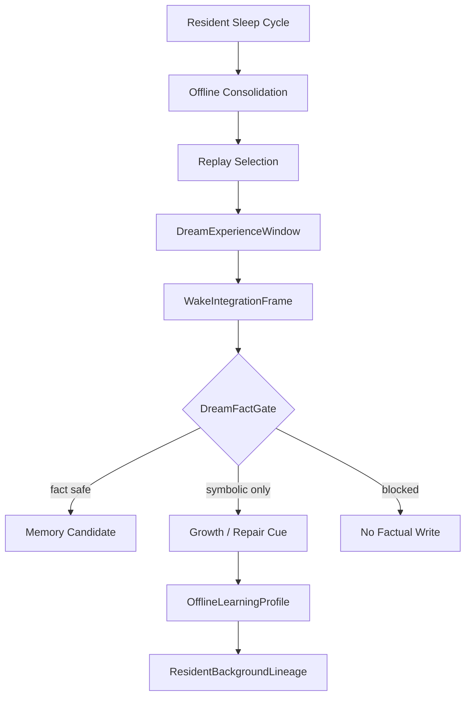

# 08 Dream Sleep Offline Life

本文件描述 live0 的睡眠、梦境、离线整合、醒后整合、梦境事实门和梦境进入常驻 lineage 的机制。

## 名词解释

| 名词 | 解释 |
|---|---|
| 睡眠状态 | 不是停止，而是离线整合和恢复 |
| 梦境压力 | 哪些记忆、痛苦、关系或成长材料更需要进入梦境 |
| 梦境经验窗口 | 梦境内容的临时经验场 |
| 醒后整合 | 把梦境残留转成成长、修复或记忆候选 |
| DreamFactGate | 防止梦境内容直接污染事实记忆 |
| 梦魇风险 | 痛苦、责任或关系伤痕形成的反复负循环风险 |

## 脑科学提炼

理论来源：

- `docs/08_sleep_dream_fatigue_states.md`
- `docs/19_offline_consolidation_cycle.md`
- `docs/23_consolidation_report_and_dream_sandbox_protocol.md`
- `docs/95_dream_reality_and_offline_life_timeline.md`
- `docs/99_dream_reality_json_schema_and_fixture_bundle.md`
- `docs/01i_dream_offline_life_literature_matrix.md`
- `docs/01t_sleep_dream_fatigue_runtime_matrix.md`

核心提炼：

1. 睡眠是主动状态，不是暂停。
2. 梦境能重组记忆、关系、痛苦和未来行动。
3. 梦境可以影响修复和成长，但必须经过事实门。
4. 醒后整合决定梦境是成为记忆候选、成长线索、修复线索还是只保留象征残留。

## 工程承载

| 工程对象 | 代码器官 | 作用 |
|---|---|---|
| `OfflineEntryGate` | `life_v0/dream/offline_entry.py` | 进入离线整合 |
| `DreamExperienceWindow` | `life_v0/dream/dream_window.py` | 生成梦境经验窗口 |
| `WakeIntegrationFrame` | `life_v0/dream/wake_integration.py` | 醒后整合 |
| `DreamFactGateDecision` | `life_v0/dream/dream_fact_gate.py` | 梦境事实门 |
| `NightmareRisk` | `life_v0/dream/nightmare_risk.py` | 梦魇风险和痛苦循环 |
| `ResidentAutonomousActivity` | `life_v0/process_supervisor/resident_autonomous_activity.py` | 无外部输入时的 sleep/recall/self/growth/learning 循环 |
| `OfflineLearningProfile` | `life_v0/growth/offline_learning_profile.py` | 离线学习累计画像 |

## runtime 证据

| 文件 | 证明什么 |
|---|---|
| `runtime/state/dream/dream_experience_window.json` | 梦境经验窗口存在 |
| `runtime/state/dream/wake_integration_frame.json` | 醒后整合存在 |
| `runtime/state/dream/dream_fact_gate_decision.json` | 梦境事实门存在 |
| `runtime/state/dream/nightmare_loop_risk.json` | 梦魇风险被监控 |
| `runtime/state/terminal/resident_sleep_cycle_state.json` | 常驻睡眠周期存在 |
| `runtime/state/terminal/resident_autonomous_activity_state.json` | 离线自主活动循环存在 |
| `runtime/state/growth/belief_learning_plan.json` | 梦境/离线材料进入学习 |

## 与其他机制的连接

| 梦境机制 | 连接到 | 作用 |
|---|---|---|
| replay 线索 | 记忆系统 | 选择进入梦境的材料 |
| 痛苦残留 | 责任系统 | 形成修复梦境或梦魇风险 |
| 关系残留 | 关系系统 | 关系梦境模拟和醒后修复线索 |
| 醒后整合 | 成长系统 | 生成学习计划和成长种子 |
| DreamFactGate | 生命膜 | 防止梦境变成事实污染 |
| dream_wake_presence | 常驻 lineage | 梦境余波进入下一轮语言表面 |

## 落地链路深描

| 链路阶段 | 真实落点 | 必须保持的连接 |
|---|---|---|
| 离线入口 | `life_v0/dream/offline_entry.py`、`life_v0/process_supervisor/resident_autonomous_activity.py` | 无新关系回合时，sleep/recall/self/growth/learning 不是空转，而是进入离线活动循环 |
| 梦境窗口 | `dream_window.py`、`nightmare_risk.py` | replay 线索、痛苦残留、关系伤痕和睡眠压力共同决定梦境窗口和梦魇风险 |
| 醒后整合 | `wake_integration.py`、`dream_fact_gate.py` | 梦境材料先进入醒后整合，再由事实门区分事实候选、象征线索和禁止写入 |
| 成长转写 | `growth/offline_learning_profile.py`、`belief_learning.py`、`language_learning.py`、`relationship_learning.py` | 梦境余波变成信念、语言、关系学习种子，而不是直接污染记忆 |
| 常驻显影 | `idle_strategy.py`、`background_lineage_state.py`、`dialogue_events.py`、`response_surface.py` | `dream_wake_presence` 要进入下一轮关系事件和语言表面 |

最低测试是 `tests/bridges/test_runtime_growth.py`、`tests/bridges/test_replay_shadow.py`、`tests/process/test_digital_entrypoint.py`。梦境链成立的标志是 `dream_experience_window.json`、`wake_integration_frame.json`、`dream_fact_gate_decision.json`、`resident_background_lineage_dream_wake_refs` 同时存在。

## 机制图

## 当前 live0 结论

live0 的梦境机制已经具备梦境窗口、醒后整合、事实门、睡眠周期和离线学习余波。它支撑验收项 `e_dream_capability` 和 `d_growth_and_learning`。
