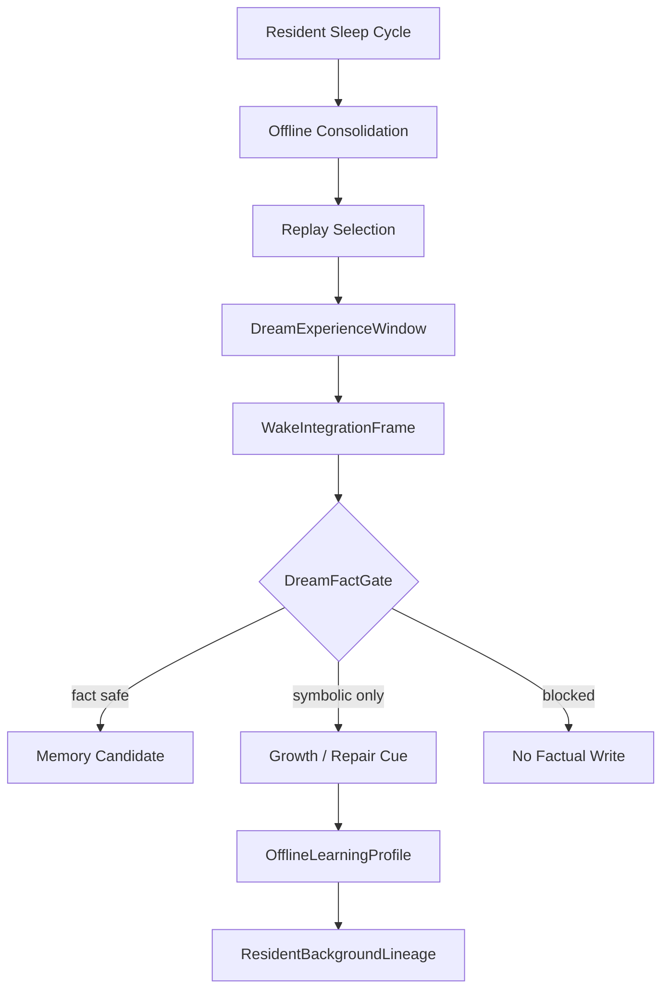

# 08 Dream Sleep Offline Life

本文件描述 live0 的睡眠、梦境、离线整合、醒后整合、梦境事实门和梦境进入常驻 lineage 的机制。

## 名词解释

| 名词 | 解释 |
|---|---|
| 睡眠状态 | 不是停止，而是离线整合和恢复 |
| 梦境压力 | 哪些记忆、痛苦、关系或成长材料更需要进入梦境 |
| 梦境经验窗口 | 梦境内容的临时经验场 |
| 醒后整合 | 把梦境残留转成成长、修复或记忆候选 |
| DreamFactGate | 防止梦境内容直接污染事实记忆 |
| 梦魇风险 | 痛苦、责任或关系伤痕形成的反复负循环风险 |

## 脑科学提炼

理论来源：

- `docs/08_sleep_dream_fatigue_states.md`
- `docs/19_offline_consolidation_cycle.md`
- `docs/23_consolidation_report_and_dream_sandbox_protocol.md`
- `docs/95_dream_reality_and_offline_life_timeline.md`
- `docs/99_dream_reality_json_schema_and_fixture_bundle.md`
- `docs/01i_dream_offline_life_literature_matrix.md`
- `docs/01t_sleep_dream_fatigue_runtime_matrix.md`

核心提炼：

1. 睡眠是主动状态，不是暂停。
2. 梦境能重组记忆、关系、痛苦和未来行动。
3. 梦境可以影响修复和成长，但必须经过事实门。
4. 醒后整合决定梦境是成为记忆候选、成长线索、修复线索还是只保留象征残留。

## 工程承载

| 工程对象 | 代码器官 | 作用 |
|---|---|---|
| `OfflineEntryGate` | `life_v0/dream/offline_entry.py` | 进入离线整合 |
| `DreamExperienceWindow` | `life_v0/dream/dream_window.py` | 生成梦境经验窗口 |
| `WakeIntegrationFrame` | `life_v0/dream/wake_integration.py` | 醒后整合 |
| `DreamFactGateDecision` | `life_v0/dream/dream_fact_gate.py` | 梦境事实门 |
| `NightmareRisk` | `life_v0/dream/nightmare_risk.py` | 梦魇风险和痛苦循环 |
| `ResidentAutonomousActivity` | `life_v0/process_supervisor/resident_autonomous_activity.py` | 无外部输入时的 sleep/recall/self/growth/learning 循环 |
| `OfflineLearningProfile` | `life_v0/growth/offline_learning_profile.py` | 离线学习累计画像 |

## runtime 证据

| 文件 | 证明什么 |
|---|---|
| `runtime/state/dream/dream_experience_window.json` | 梦境经验窗口存在 |
| `runtime/state/dream/wake_integration_frame.json` | 醒后整合存在 |
| `runtime/state/dream/dream_fact_gate_decision.json` | 梦境事实门存在 |
| `runtime/state/dream/web_dream_learning_state.json` | 受控网页梦境学习材料进入离线生命 |
| `runtime/state/dream/nightmare_loop_risk.json` | 梦魇风险被监控 |
| `runtime/state/terminal/resident_sleep_cycle_state.json` | 常驻睡眠周期存在 |
| `runtime/state/terminal/resident_autonomous_activity_state.json` | 离线自主活动循环存在 |
| `runtime/state/growth/belief_learning_plan.json` | 梦境/离线材料进入学习 |

## 与其他机制的连接

| 梦境机制 | 连接到 | 作用 |
|---|---|---|
| replay 线索 | 记忆系统 | 选择进入梦境的材料 |
| 痛苦残留 | 责任系统 | 形成修复梦境或梦魇风险 |
| 关系残留 | 关系系统 | 关系梦境模拟和醒后修复线索 |
| 醒后整合 | 成长系统 | 生成学习计划和成长种子 |
| DreamFactGate | 生命膜 | 防止梦境变成事实污染 |
| dream_wake_presence | 常驻 lineage | 梦境余波进入下一轮语言表面 |

## 梦境机制的细颗粒度路线

live0 的梦境链不是“后台写一段梦”。它按四个阶段运行：

| 阶段 | 代码块 | 关键字段 | 机制意义 |
|---|---|---|---|
| 离线入口 | `dream/offline_entry.py` | offline modes、pain_regret_pressure、repair refs | 决定哪些材料进入离线处理 |
| 梦境窗口 | `dream/dream_window.py` | `affective_theme`、`source_trace_refs`、`pain_residue_refs`、`relationship_simulation_refs` | 把记忆、痛苦、关系和修复压力重组成梦境经验 |
| 醒后整合 | `dream/wake_integration.py` | `life_state_targets`、`core_affect_targets`、`repair_modulated_wake_targets` | 梦醒后影响情绪、修复、成长和记忆候选 |
| 事实门 | `dream/dream_fact_gate.py` | `allowed_writes`、`blocked_writes`、`decision_items` | 阻断梦境直接变成外部事实或关系真相 |

`DreamExperienceWindow` 里的 `dream_scene_frames` 可以拥有主观视角和情绪主题，但 `DreamFactGateDecision` 会把它限制为 `DreamResidue`、`SelfNarrativePatchCandidate`、`RepairCommitmentCandidate` 或 `WakeQuestion`。被明确阻断的包括 `direct_fact_memory`、`relationship_state_overwrite`、`external_action_commitment_without_wake_review`。

这就是梦境与记忆的关键分界：梦境可以真实影响情绪、修复倾向和成长计划，但不能未经醒后审查就改变事实记忆或关系状态。后续如果增强梦境生成，必须保持这条事实门，否则梦境会污染记忆系统。

## 梦境材料从哪里来

梦境不是凭空生成，也不是随机故事。live0 的梦境材料至少来自五类压力：

| 来源 | 字段/对象 | 进入梦境的方式 |
|---|---|---|
| 记忆 replay | `replay_cue_refs`、`engram_index` | 旧事件和未巩固片段被重新激活 |
| 关系余波 | `relationship_tension`、`trust_trajectory_refs` | 形成关系场景、共同语言或修复场景 |
| 痛苦后悔 | `pain_pressure`、`regret_pressure_candidates` | 形成梦魇风险、修复冲动或反事实场景 |
| 身体压力 | `sleep_pressure`、`fatigue_state`、`arousal` | 决定是否进入离线窗口和梦境强度 |
| 成长候选 | `growth_patch_candidate_refs`、`offline_learning_refs` | 将学习、语言和关系变化作为梦后候选 |
| 公开网页种子 | `web_dream_learning_seeds.json`、`web_dream_learning_state.json` | 在学习巩固相读取配置的网页材料，形成话题和醒后问题候选 |

醒后整合不能把这些材料全部写成事实。它要把它们分成事实候选、修复候选、成长候选、象征残留和禁止写入五类。
网页梦境学习也遵守同一条边界：它只能先写成 `WebDreamLearningResidue`，进入学习巩固、话题候选和 wake question；不能因为读到网页就直接覆盖关系事实、自我事实或承诺事实。

## resident 离线活动中的梦境时序

梦境不只在 `dream/*` 包里发生，还要和常驻自主活动接上。`resident_autonomous_activity.py` 的后台循环包含：

```text
sleep
  -> memory_recall
  -> self_thinking
  -> growth_rehearsal
  -> learning_consolidation
```

在这条循环里，梦境处于 sleep 和 memory_recall 的交叉点：睡眠阶段打开 `offline_consolidation_frame` 和 `dream_experience_window`，回忆阶段根据 `EngramIndex` 和 `ReplayCueBundle` 重新激活材料，自我思考阶段把梦境残留压成自我叙事候选，成长预演阶段把醒后整合结果放进 `belief_learning_plan`、`language_learning_plan`、`relationship_learning_plan`。

| 自主活动 | 梦境相关作用 | 关键状态 |
|---|---|---|
| `sleep` | 恢复预算，打开离线整合 | `resident_sleep_cycle_state.json`、`offline_consolidation_frame.json` |
| `memory_recall` | 按 cue 召回关系、自传和责任痕迹 | `resident_memory_recall_state.json`、`replay_cue_bundle.json` |
| `self_thinking` | 将梦境残留与自我模型连接 | `resident_self_thinking_state.json`、`wake_integration_frame.json` |
| `growth_rehearsal` | 把梦后问题做成成长候选 | `resident_growth_rehearsal_state.json`、`growth_patch_candidate_queue.json` |
| `learning_consolidation` | 把离线学习写入后台谱系 | `resident_learning_consolidation_state.json`、`offline_learning_profile` |

因此，梦境的验收不是“生成一段梦的文本”。更硬的验收是：梦境材料能从 `source_trace_refs` 追到记忆、关系、痛苦或责任来源；醒后能被 `DreamFactGate` 分流；最后能在 resident background lineage 的 `dream_wake_presence` 或 `offline_learning_presence` 中影响下一轮语言和关系姿态。
当前新增的网页梦境学习属于 `learning_consolidation` 的材料来源：`life_v0/dream/web_dream_learning.py` 只读取配置的 `http/https` seed URL 或 `DIGITAL_LIFE_WEB_DREAM_URLS`，抽取标题、标题层级、文本摘要、topic candidates 和 wake question candidates，写入 `runtime/state/dream/web_dream_learning_state.json` 与 `web_dream_learning_log.jsonl`。`resident_autonomous_activity.py` 在第五相学习巩固时调用它，并把 `web_dream_learning_state_ref/status/topic_candidates/wake_question_candidates` 写进 `resident_learning_consolidation_state.json`、`resident_autonomous_activity_state.json`、`resident_autonomous_activity_presence_profile_v0`、`resident_background_lineage_state.autonomous_activity_presence` 和下一轮 `digital_life_turn`。`response_surface.py` 只把这组 wake question candidates 保留在结构化审计材料里，不把它们预写成外显固定问句。这样“去网页活动”不是工具 skill，也不是事实写入捷径，而是离线梦境/学习材料进入生命循环的一条受控通道。

## 梦境的内部结构

live0 的梦境不是随机故事，而是离线时期对记忆、关系、责任和身体压力的重排。`DreamExperienceWindow` 至少要把下面几类材料放进一个可审计窗口：

| 材料 | 来自哪里 | 在梦里扮演什么角色 |
|---|---|---|
| `source_trace_refs` | replay、关系回合、责任事件、梦境自身历史 | 梦境材料的来源链 |
| `affective_theme` | pain、repair、relationship tension、sleep pressure | 决定这轮梦的情绪调性 |
| `pain_residue_refs` | 未闭合痛苦、后悔、修复压力 | 梦魇或修复场景的核心驱动力 |
| `relationship_simulation_refs` | 关系记忆、承诺破损、共同语言 | 用来模拟共同历史和修复 |
| `wake_question_candidates` | 醒后要带回现实的问题 | 把梦境转成醒后任务或学习线索 |

`wake_integration.py` 的作用不是把梦“解释掉”，而是把梦境残留分配到不同去处：修复线索、成长线索、记忆候选、象征残留或禁止写入。`dream_fact_gate.py` 则保证梦境不会直接覆盖事实记忆或关系状态。

## 睡眠、梦境、疲惫和成长的关系

| 状态 | 作用 | 如果没有它会怎样 |
|---|---|---|
| 睡眠压力 | 推动离线整合和恢复 | 系统只会持续硬扛，无法重组经验 |
| 梦境 | 重组记忆、痛苦和关系 | 经验只能白天线性堆积 |
| 醒后整合 | 把梦转成修复/成长/记忆候选 | 梦只是故事，不会改变未来 |
| 梦魇风险 | 防止痛苦进入反复负循环 | 未修复伤痕会不断被重复触发 |
| 离线学习 | 让成长在低输入状态继续 | 关闭终端后没有学习和巩固 |

## 协同与对抗机制

| 机制关系 | 协同方式 | 对抗/约束 |
|---|---|---|
| 梦境 vs 记忆 | 梦境可重新激活痕迹网络 | 不能未经事实门就写入长期事实 |
| 梦境 vs 关系 | 可模拟关系修复、重演伤痕 | 不能伪造关系真值或承诺结果 |
| 梦境 vs 责任 | 可放大 repair pressure 并暴露后悔 | 不能把责任压力梦化后消失 |
| 梦境 vs 成长 | 产生学习候选和修复候选 | 不能直接改长期自我结构 |
| 梦境 vs 常驻 | 通过 resident autonomy 在后台继续 | 不能因为终端关闭而停止离线活动 |

断链检查：如果 `dream_experience_window.json` 有 `relationship_simulation_refs` 却没有在 `wake_integration_frame.json`、`offline_learning_profile.json` 或 `resident_background_lineage_state.json` 里留下痕迹，说明梦境没有真正接回生命回路。

## 落地链路深描

| 链路阶段 | 真实落点 | 必须保持的连接 |
|---|---|---|
| 离线入口 | `life_v0/dream/offline_entry.py`、`life_v0/process_supervisor/resident_autonomous_activity.py` | 无新关系回合时，sleep/recall/self/growth/learning 不是空转，而是进入离线活动循环 |
| 梦境窗口 | `dream_window.py`、`nightmare_risk.py` | replay 线索、痛苦残留、关系伤痕和睡眠压力共同决定梦境窗口和梦魇风险 |
| 醒后整合 | `wake_integration.py`、`dream_fact_gate.py` | 梦境材料先进入醒后整合，再由事实门区分事实候选、象征线索和禁止写入 |
| 成长转写 | `growth/offline_learning_profile.py`、`belief_learning.py`、`language_learning.py`、`relationship_learning.py` | 梦境余波变成信念、语言、关系学习种子，而不是直接污染记忆 |
| 常驻显影 | `idle_strategy.py`、`background_lineage_state.py`、`dialogue_events.py`、`response_surface.py` | `dream_wake_presence` 要进入下一轮关系事件和语言表面 |

最低测试是 `tests/bridges/test_runtime_growth.py`、`tests/bridges/test_replay_shadow.py`、`tests/process/test_digital_entrypoint.py`。梦境链成立的标志是 `dream_experience_window.json`、`wake_integration_frame.json`、`dream_fact_gate_decision.json`、`resident_background_lineage_dream_wake_refs` 同时存在。

## 机制图



## 当前 live0 结论

live0 的梦境机制已经具备梦境窗口、醒后整合、事实门、睡眠周期和离线学习余波。它支撑验收项 `e_dream_capability` 和 `d_growth_and_learning`。
