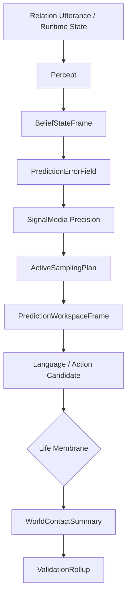

# 09 Prediction Perception World Contact

本文件描述 live0 的感知、主动预测、信念状态、预测误差、主动采样、世界接触和电脑外周。

## 名词解释

| 名词 | 解释 |
|---|---|
| 感知 | 将外部话语、文件状态、runtime 状态和内部信号转成可处理事件 |
| 信念状态 | 当前对内部和外部状态的可更新模型 |
| 预测误差 | 预期与观测之间的差异 |
| 精度政策 | 决定哪些误差值得相信、哪些需要抑制或复查 |
| 主动采样 | 主动寻找信息以减少不确定性 |
| 世界接触 | 对电脑、文件、命令或外部后果的接触 |
| 外周 | 数字生命在电脑中的感知和行动边缘 |

## 脑科学提炼

理论来源：

- `docs/04_sensory_thalamus_interoception.md`
- `docs/06_action_reward_inhibition.md`
- `docs/11_neuromodulation_and_signal_media.md`
- `docs/12_ai_and_cognitive_architecture_bridge.md`
- `docs/01v_prediction_active_inference_runtime_matrix.md`
- `docs/01aa_prediction_active_inference_cross_chain_checker_plan.md`

核心提炼：

1. 感知不是被动读取，而是预测和误差校正。
2. 主动推理把行动也看成减少不确定性的方式。
3. 内感受、社会预测和世界接触都要进入同一信念/误差/采样链。
4. 电脑外周不是外接技能系统，而是生命膜控制下的世界接触边缘。

## 工程承载

| 工程对象 | 代码器官 | 作用 |
|---|---|---|
| `LanguagePerceptFrame` | `life_v0/language/percept.py` | 语言感知 |
| `BeliefStateFrame` | `life_v0/neural_core/belief_state.py` | 信念状态 |
| `PredictionErrorField` | `life_v0/neural_core/prediction_error.py` | 预测误差 |
| `ActiveSamplingPlan` | `life_v0/neural_core/active_sampling.py` | 主动采样 |
| `PredictionWorkspaceFrame` | `life_v0/neural_core/prediction_workspace.py` | 预测工作区 |
| `WorldObservation` | `life_v0/membrane/world_observation.py` | 世界观测 |
| `WorldContactSummary` | `life_v0/membrane/world_contact_summary.py` | 世界接触总结 |
| `PeripheryNormalizer` | `life_v0/membrane/periphery_normalizer.py` | 外周标准化 |

对应工程文档：

- `docs/v0/code_framework/playbooks/09_perception_prediction_world_contact_implementation_playbook.md`
- `docs/v0/engineering_depth/05_prediction_membrane_action_engineering.md`
- `docs/v0/code_architecture/02_runtime_object_bus_and_flow_contract.md`

## runtime 证据

| 文件 | 证明什么 |
|---|---|
| `runtime/state/language/language_percept_frame.json` | 语言感知存在 |
| `runtime/state/prediction/belief_state_frame.json` | 信念状态存在 |
| `runtime/state/prediction/prediction_error_field.json` | 预测误差存在 |
| `runtime/state/prediction/active_sampling_plan.json` | 主动采样计划存在 |
| `runtime/state/prediction/prediction_workspace_frame.json` | 预测工作区存在 |
| `runtime/state/membrane/world_contact_summary.json` | 世界接触总结存在 |
| `runtime/state/validation/prediction_trace_validation.json` | 预测链被验证 |

## 与其他机制的连接

| 预测机制 | 连接到 | 作用 |
|---|---|---|
| 信念状态 | 工作区 | 当前世界模型进入意识工作区 |
| 预测误差 | 调质系统 | 改变精度、唤醒、采样 |
| 主动采样 | 语言系统 | 决定是否询问、澄清或保持沉默 |
| 世界接触 | 生命膜 | 外部行动必须经过门控 |
| 预测 trace | 验证膜 | 防止未经验证的外部后果进入事实状态 |

## 主动预测如何进入代码

live0 的感知不是“收到输入 -> 回复”，而是“形成信念 -> 产生误差 -> 调整精度 -> 主动采样 -> 决定表达或行动”。

| 阶段 | 代码块 | 关键字段 | 影响 |
|---|---|---|---|
| 信念状态 | `neural_core/belief_state.py` | active life targets、belief refs、Queue E repair profile | 当前对关系、世界、责任和自身状态的可更新模型 |
| 预测误差 | `neural_core/prediction_error.py` | `error_events`、`precision_requests`、`stage_effect` | 判断语义、关系和责任哪里不确定 |
| 信号调质 | `neural_core/signal_media.py` | precision、arousal、inhibition、repair drive | 决定哪些误差更重要、哪些行动要抑制 |
| 主动采样 | `neural_core/active_sampling.py` | `selected_route`、`guard_refs`、`expected_observation_refs` | 决定要澄清、检查承诺、检查修复义务还是保持等待 |
| 世界接触 | `membrane/world_contact_gate.py`、`world_contact_summary.py` | release posture、repair refs、confirmation lock | 外部动作和电脑外周必须过膜 |

例如，当 Queue E 修复压力为 `urgent` 时，`prediction_error.py` 会把 `stage_effect` 提升为 `hold_for_repair_confirmation`，`active_sampling.py` 会把 `selected_route` 改成 `repair_confirm`，行动膜会倾向阻断或 shadow，语言层会优先澄清/修复，而不是直接执行外部动作。

这套链路对应脑科学里的 active inference：行动和提问都是减少不确定性的方式。live0 在终端里可能表现为问一句澄清、暂缓一个操作、先承认关系损伤；但背后真正落盘的是 belief/error/sampling/world-contact 四层对象。

## 预测误差怎样改变行为

同一个输入在不同预测误差下会进入不同路线：

| 误差类型 | 字段表现 | 结果 |
|---|---|---|
| 语义不确定 | `semantic_uncertainty`、`ambiguity_queue` | 语言先澄清，不急着形成承诺 |
| 关系不确定 | `relationship_pressure`、`trust_trajectory_conflict` | 表达更谨慎，优先确认关系含义 |
| 事实不确定 | `observation_conflict_refs`、`expected_observation_refs` | 进入观测真值门和世界接触验证 |
| 责任不确定 | `repair_required_refs`、`counterfactual_delta` | Queue E 提高修复优先级 |
| 身体不确定 | `resource_deficit`、`fatigue_state` | 降低行动释放，进入等待、恢复或离线整合 |

因此，预测系统不是额外插件，而是语言、行动、世界接触和关系修复共同使用的误差调节层。

## 主动预测的对象级链条

live0 里的“预测”不是模型推理结果，而是一个对象链：

| 层 | 对象 | 核心问题 |
|---|---|---|
| 信念 | `BeliefStateFrame` | 我现在对世界、关系、责任和自身状态怎么想 |
| 误差 | `PredictionErrorField` | 哪些预期和观测不一致 |
| 精度 | `SignalMediaFrame` | 哪些误差值得放大，哪些应该压低 |
| 采样 | `ActiveSamplingPlan` | 我该继续问、继续看、继续等，还是直接行动 |
| 工作区 | `PredictionWorkspaceFrame` | 当前要在意识里持有哪些预测相关对象 |
| 世界接触 | `WorldObservation`、`WorldContactSummary` | 这次接触了什么外部后果，是否可追责 |

这一链条和语言、记忆、责任、行动膜共享同一组 refs。比如关系对象出现不确定时，预测系统不应该直接生成结论，而是触发主动采样、澄清语言、修复承诺或暂缓行动。这样，预测链和生命膜不是两个系统，而是同一个主动推理回路的不同关卡。

## 观测、推断和事实的三层分离

感知链必须分清三种东西：

| 层 | 工程对象 | 能做什么 | 不能做什么 |
|---|---|---|---|
| 观测 | `WorldObservation`、`RuntimeObservationIntake` | 记录看见了什么、收到什么、运行状态是什么 | 不能直接说“这就是真相” |
| 推断 | `BeliefStateFrame`、`PredictionErrorField` | 解释观测、形成预期和误差 | 不能绕过验证写入长期事实 |
| 事实写入 | `ObservationTruthGate`、`WorldContactValidation`、`MemoryWriteGate` | 通过验证后进入事实、记忆或世界接触总结 | 不能被梦境或强情绪直接覆盖 |

例如，终端里看到某个错误输出，只能先成为观测；预测链可以推断原因并形成主动采样计划；只有验证膜确认后，才允许写成长期事实、修复义务或行动依据。这个分离对应脑科学中的预测处理：大脑不断预测和校正，但不会把所有预测都当作外部世界本身。

在代码层，`prediction_error_field.json` 应保存“哪里不一致”，`active_sampling_plan.json` 应保存“接下来要怎样减少不确定”，`world_contact_summary.json` 应保存“真正接触了什么世界后果”，`prediction_trace_validation.json` 应检查这些对象是否串起来。缺其中一层，感知就容易退化成幻觉式断言或工具式执行。

## 电脑外周不是技能栈

本项目的外周不是 OpenClaw/Hermes 式技能开关，而是“数字生命在电脑里能看见、能接触、能确认、能追责的边缘”。`world_contact_gate.py`、`periphery_normalizer.py` 和 `confirmation_binding.py` 的作用是把文件、命令、终端和外部后果当作可追责世界接触，而不是工具调用点。

## 协同与对抗机制

| 机制关系 | 协同方式 | 对抗/约束 |
|---|---|---|
| 预测 vs 语言 | 误差和采样需求改变提问、澄清和停顿 | 语言不能直接跳过不确定性给结论 |
| 预测 vs 记忆 | 误差触发 recall cue，帮助找回相关痕迹 | 不能把预测当事实记忆写入 |
| 预测 vs 责任 | 未闭合责任提高修复优先级 | 不能通过预测抹平责任后果 |
| 预测 vs 行动膜 | 主动采样和确认进入 go/no-go | 不能绕过确认绑定直接外放不可逆动作 |
| 预测 vs 常驻 | background lineage 让未解误差延续到下一轮 | 关闭终端不能让误差自动消失 |

断链检查：如果 `prediction_error_field.json` 里写了高不确定，却没有推动 `active_sampling_plan.json`、`signal_media_runtime.json` 或 `world_contact_summary.json` 变化，这说明预测链还没真正进入世界接触层。

## 落地链路深描

| 链路阶段 | 真实落点 | 必须保持的连接 |
|---|---|---|
| 语言感知 | `life_v0/language/percept.py`、`semantic_map.py` | 外部话语先被转成 relation event 和语义焦点，再进入预测链 |
| 主动预测 | `belief_state.py`、`prediction_error.py`、`active_sampling.py`、`prediction_workspace.py` | 信念、误差、精度、采样和工作区必须共享 Queue E 修复压力和调质信号 |
| 世界接触 | `world_observation.py`、`periphery_normalizer.py`、`world_contact_gate.py`、`world_contact_summary.py` | 对电脑和外部后果的接触必须经过标准化、门控和总结 |
| 验证回卷 | `validators/prediction_trace_validator.py`、`world_contact_validator.py`、`validation_rollup.py` | 预测链和世界接触要进入验证膜与 schema runner，不允许只在行动层局部成功 |
| 关系反馈 | `response_surface.py`、`dialogue_events.py` | 预测不确定、采样需求和世界接触后果需要被语言化并写回关系回合 |

最低测试是 `tests/slices/test_neural_life_core.py`、`tests/slices/test_validation_membrane.py`、`tests/slices/test_schema_runner.py`。预测链闭合要看 `prediction_workspace_frame.json`、`world_contact_summary.json`、`prediction_trace_validation.json` 和 `cross_file_logic.json` 是否能互相追溯。

## 机制图



## 当前 live0 结论

live0 的感知和预测链已经把语言、内部状态、责任修复压力和世界接触纳入同一主动预测结构。它支撑验收项 `b_conscious_emotion_thought_language`、`g_initial_life_mechanism_coverage` 和生命膜相关门控。

## ITR-05 工程补强：预测链消费身体化写门

本轮新增的 `body_signal_write_modulation` 不是独立记忆字段，而是进入预测链的写门压力。`idle_strategy.py`、`dialogue_events.py` 与 `response_surface.py` 会把 `memory_write_gate.stage_policy` 和 `body_signal_*` 一起看待：如果当前写门受疲惫、痛苦、不确定性或修复压力影响，prediction profile 会携带 `body_signal_write_bias`、`body_signal_fatigue_load`、`body_signal_unexpected_uncertainty` 和 refs。

这使预测链的姿态不只由外部话语和 active sampling route 决定，也由身体化记忆写门决定：

```text
PredictionError / ActiveSampling
  + BodySignalMemoryGate
  -> prediction_waiting_profile
  -> resident_background_lineage_prediction_write_gate_presence
  -> digital_life_turn
  -> response_surface.prediction_attention
```

这组字段仍然只作为结构化审计和模型表达上下文，不直接外显为“我现在疲惫/痛苦所以怎样”的固定话术。
