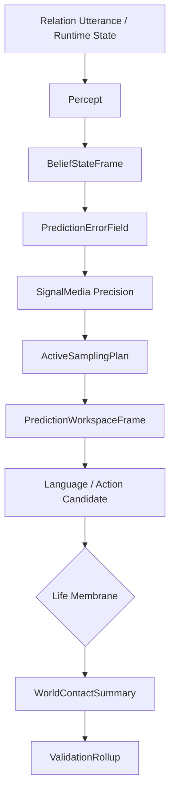

# 09 Prediction Perception World Contact

本文件描述 live0 的感知、主动预测、信念状态、预测误差、主动采样、世界接触和电脑外周。

## 名词解释

| 名词 | 解释 |
|---|---|
| 感知 | 将外部话语、文件状态、runtime 状态和内部信号转成可处理事件 |
| 信念状态 | 当前对内部和外部状态的可更新模型 |
| 预测误差 | 预期与观测之间的差异 |
| 精度政策 | 决定哪些误差值得相信、哪些需要抑制或复查 |
| 主动采样 | 主动寻找信息以减少不确定性 |
| 世界接触 | 对电脑、文件、命令或外部后果的接触 |
| 外周 | 数字生命在电脑中的感知和行动边缘 |

## 脑科学提炼

理论来源：

- `docs/04_sensory_thalamus_interoception.md`
- `docs/06_action_reward_inhibition.md`
- `docs/11_neuromodulation_and_signal_media.md`
- `docs/12_ai_and_cognitive_architecture_bridge.md`
- `docs/01v_prediction_active_inference_runtime_matrix.md`
- `docs/01aa_prediction_active_inference_cross_chain_checker_plan.md`

核心提炼：

1. 感知不是被动读取，而是预测和误差校正。
2. 主动推理把行动也看成减少不确定性的方式。
3. 内感受、社会预测和世界接触都要进入同一信念/误差/采样链。
4. 电脑外周不是外接技能系统，而是生命膜控制下的世界接触边缘。

## 工程承载

| 工程对象 | 代码器官 | 作用 |
|---|---|---|
| `LanguagePerceptFrame` | `life_v0/language/percept.py` | 语言感知 |
| `BeliefStateFrame` | `life_v0/neural_core/belief_state.py` | 信念状态 |
| `PredictionErrorField` | `life_v0/neural_core/prediction_error.py` | 预测误差 |
| `ActiveSamplingPlan` | `life_v0/neural_core/active_sampling.py` | 主动采样 |
| `PredictionWorkspaceFrame` | `life_v0/neural_core/prediction_workspace.py` | 预测工作区 |
| `WorldObservation` | `life_v0/membrane/world_observation.py` | 世界观测 |
| `WorldContactSummary` | `life_v0/membrane/world_contact_summary.py` | 世界接触总结 |
| `PeripheryNormalizer` | `life_v0/membrane/periphery_normalizer.py` | 外周标准化 |

对应工程文档：

- `docs/v0/code_framework/playbooks/09_perception_prediction_world_contact_implementation_playbook.md`
- `docs/v0/engineering_depth/05_prediction_membrane_action_engineering.md`
- `docs/v0/code_architecture/02_runtime_object_bus_and_flow_contract.md`

## runtime 证据

| 文件 | 证明什么 |
|---|---|
| `runtime/state/language/language_percept_frame.json` | 语言感知存在 |
| `runtime/state/prediction/belief_state_frame.json` | 信念状态存在 |
| `runtime/state/prediction/prediction_error_field.json` | 预测误差存在 |
| `runtime/state/prediction/active_sampling_plan.json` | 主动采样计划存在 |
| `runtime/state/prediction/prediction_workspace_frame.json` | 预测工作区存在 |
| `runtime/state/membrane/world_contact_summary.json` | 世界接触总结存在 |
| `runtime/state/validation/prediction_trace_validation.json` | 预测链被验证 |

## 与其他机制的连接

| 预测机制 | 连接到 | 作用 |
|---|---|---|
| 信念状态 | 工作区 | 当前世界模型进入意识工作区 |
| 预测误差 | 调质系统 | 改变精度、唤醒、采样 |
| 主动采样 | 语言系统 | 决定是否询问、澄清或保持沉默 |
| 世界接触 | 生命膜 | 外部行动必须经过门控 |
| 预测 trace | 验证膜 | 防止未经验证的外部后果进入事实状态 |

## 落地链路深描

| 链路阶段 | 真实落点 | 必须保持的连接 |
|---|---|---|
| 语言感知 | `life_v0/language/percept.py`、`semantic_map.py` | 外部话语先被转成 relation event 和语义焦点，再进入预测链 |
| 主动预测 | `belief_state.py`、`prediction_error.py`、`active_sampling.py`、`prediction_workspace.py` | 信念、误差、精度、采样和工作区必须共享 Queue E 修复压力和调质信号 |
| 世界接触 | `world_observation.py`、`periphery_normalizer.py`、`world_contact_gate.py`、`world_contact_summary.py` | 对电脑和外部后果的接触必须经过标准化、门控和总结 |
| 验证回卷 | `validators/prediction_trace_validator.py`、`world_contact_validator.py`、`validation_rollup.py` | 预测链和世界接触要进入验证膜与 schema runner，不允许只在行动层局部成功 |
| 关系反馈 | `response_surface.py`、`dialogue_events.py` | 预测不确定、采样需求和世界接触后果需要被语言化并写回关系回合 |

最低测试是 `tests/slices/test_neural_life_core.py`、`tests/slices/test_validation_membrane.py`、`tests/slices/test_schema_runner.py`。预测链闭合要看 `prediction_workspace_frame.json`、`world_contact_summary.json`、`prediction_trace_validation.json` 和 `cross_file_logic.json` 是否能互相追溯。

## 机制图

## 当前 live0 结论

live0 的感知和预测链已经把语言、内部状态、责任修复压力和世界接触纳入同一主动预测结构。它支撑验收项 `b_conscious_emotion_thought_language`、`g_initial_life_mechanism_coverage` 和生命膜相关门控。
