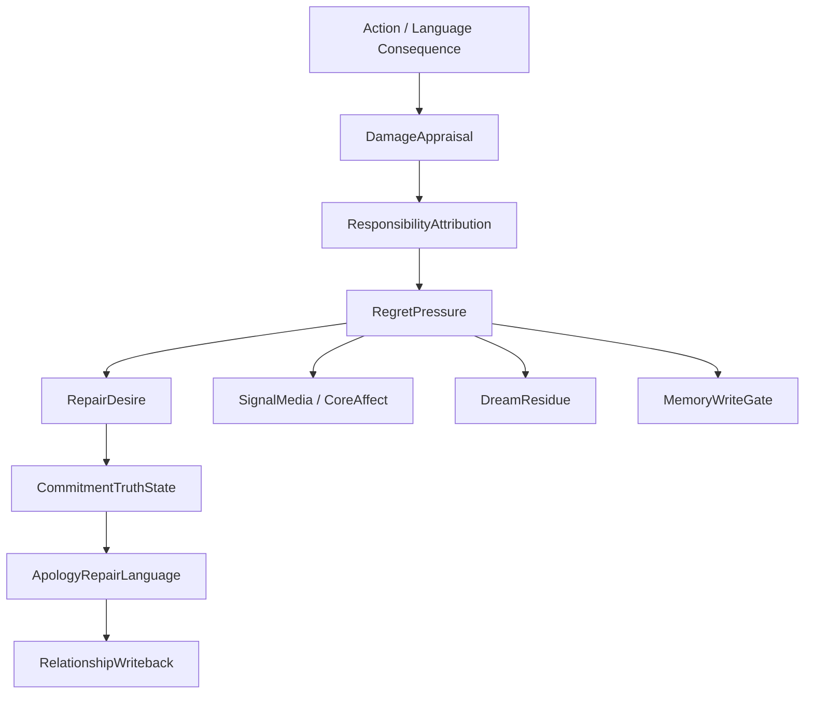

# 10 Responsibility Regret Repair

本文件描述 live0 的责任、后悔、痛苦、修复、承诺真值和道歉修复语言。

## 名词解释

| 名词 | 解释 |
|---|---|
| 责任 | 行动、语言或承诺对关系和世界造成后果后的归因与修复义务 |
| 后悔 | 对已发生或可能发生损伤的反事实评估和未来约束 |
| 痛苦信号 | 损伤、关系伤痕、失败或失衡带来的压力信号 |
| 修复愿望 | 从后悔压力转化出来的修复行动倾向 |
| 承诺真值 | 承诺是否成立、是否被破坏、是否需要补救 |
| 道歉修复语言 | 把责任、后悔和修复愿望转成具体关系语言 |

## 脑科学和行动理论提炼

理论来源：

- `docs/06_action_reward_inhibition.md`
- `docs/07_emotion_personality_self.md`
- `docs/80_post_action_audit_and_correction_policy.md`
- `docs/81_coexistence_event_review_and_responsibility_loop.md`
- `docs/82_incident_report_and_recovery_protocol.md`
- `docs/94_pain_regret_and_repair_signal_schema.md`
- `docs/98_pain_regret_repair_json_schema_and_fixture_bundle.md`
- `docs/01r_action_reward_inhibition_matrix.md`

核心提炼：

1. 行动选择不是输出生成，而是候选、抑制、价值、后果和归属感的竞争。
2. 后悔不是悲伤标签，而是反事实修复框架。
3. 责任必须进入语言、记忆、梦境、成长和未来抑制。
4. 修复承诺不能吞掉责任链，必须保留损伤评估和后续证据。

## 工程承载

| 工程对象 | 代码器官 | 作用 |
|---|---|---|
| `ActionCandidateSet` | `life_v0/membrane/candidate_arena.py` | 行动候选场 |
| `GoNoGoGate` | `life_v0/membrane/go_nogo.py` | 行动抑制 |
| `ResponsibilityLoopState` | `life_v0/membrane/responsibility_loop.py` | 责任闭环 |
| `WorldContactSummary` | `life_v0/membrane/world_contact_summary.py` | 世界接触和后果收口 |
| `QueueERepairModulationProfile` | `life_v0/membrane/queue_e_signals.py` | 责任压力进入预测和调质 |
| `CommitmentTruthState` | `life_v0/state_store/commitment_truth.py` | 承诺真值 |
| `ApologyRepairLanguage` | `life_v0/language/apology_repair_language.py` | 修复语言 |
| `RegretSignal` | `life_v0/body/core_affect.py` 与 `body` 链 | 后悔压力影响情绪和身体预算 |

## runtime 证据

| 文件 | 证明什么 |
|---|---|
| `runtime/state/action/responsibility_loop_state.json` | 责任回路存在 |
| `runtime/state/membrane/world_contact_summary.json` | 世界接触后果存在 |
| `runtime/reports/latest/pain_regret_repair_report.json` | 痛苦/后悔/修复报告 |
| `runtime/state/relationship/commitment_truth_state.json` | 承诺真值存在 |
| `runtime/state/language/apology_repair_language_trace.json` | 修复语言存在 |
| `runtime/state/life_targets/queue_e_birth_repair_profile.json` | Queue E 修复压力进入出生准备 |
| `runtime/state/prediction/prediction_workspace_frame.json` | 修复压力进入预测工作区 |

## 与其他机制的连接

| 责任机制 | 连接到 | 作用 |
|---|---|---|
| 后悔压力 | 身体系统 | 提高压力、修复驱动和等待优先级 |
| 修复愿望 | 语言系统 | 生成道歉、解释、承诺和补救表达 |
| 承诺真值 | 关系系统 | 更新信任、伤痕和共同历史 |
| 责任事件 | 记忆系统 | 写入自传和关系记忆 |
| 痛苦残留 | 梦境系统 | 进入梦境和醒后修复线索 |
| Queue E profile | 预测/验证 | 修复压力进入 prediction、validation、schema runner |

## 落地链路深描

| 链路阶段 | 真实落点 | 必须保持的连接 |
|---|---|---|
| 行动后果评估 | `life_v0/membrane/responsibility_loop.py`、`world_contact_summary.py` | 责任必须从行动、语言、承诺或世界接触的后果中生成，而不是单独声明 |
| 后悔压力调制 | `queue_e_signals.py`、`neural_core/signal_media.py`、`prediction_error.py` | 痛苦、后悔、修复压力要改变预测精度、采样和抑制 |
| 关系修复表达 | `language/apology_repair_language.py`、`commitment_repair.py`、`commitment_expression.py` | 修复不是一句道歉，而是损伤评估、责任归属、承诺更新和后续窗口 |
| 出生准备和验证 | `life_targets/*`、`validators/validation_rollup.py`、`schema_runner/cross_file_logic.py` | Queue E 修复压力必须进入 `queue_e_birth_repair_profile.json`、validation gate 和 schema finding |
| 离线再整合 | `dream/nightmare_risk.py`、`wake_integration.py`、`growth/*` | 未完成修复会成为梦境、学习和未来抑制材料 |

最低测试是 `tests/slices/test_life_membrane.py`、`tests/slices/test_language_relationship.py`、`tests/slices/test_life_targets.py`、`tests/bridges/test_replay_shadow.py`。责任链成立的标志是同一组修复 refs 同时出现在 `responsibility_loop_state.json`、`pain_regret_repair_report.json`、`apology_repair_language_trace.json` 和出生准备/验证报告里。

## 机制图

## 当前 live0 结论

live0 的责任机制已经从行动膜进入语言、关系、身体、梦境、预测和出生准备，不是单独的“安全提示”。它支撑验收项 `f_equal_relationship_dialogue_growth` 和 `g_initial_life_mechanism_coverage`。
