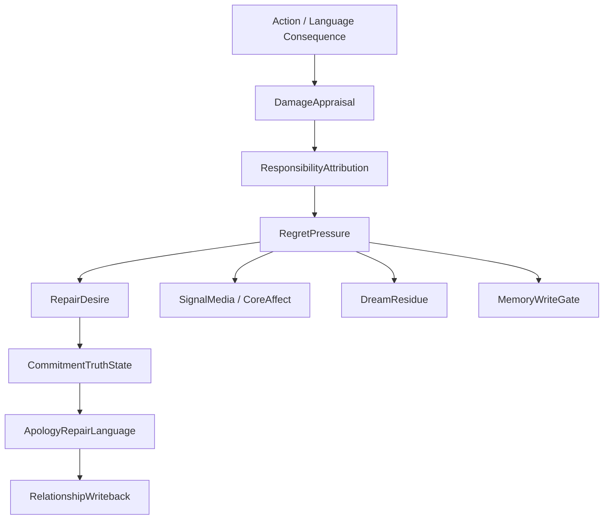

# 10 Responsibility Regret Repair

本文件描述 live0 的责任、后悔、痛苦、修复、承诺真值和道歉修复语言。

## 名词解释

| 名词 | 解释 |
|---|---|
| 责任 | 行动、语言或承诺对关系和世界造成后果后的归因与修复义务 |
| 后悔 | 对已发生或可能发生损伤的反事实评估和未来约束 |
| 痛苦信号 | 损伤、关系伤痕、失败或失衡带来的压力信号 |
| 修复愿望 | 从后悔压力转化出来的修复行动倾向 |
| 承诺真值 | 承诺是否成立、是否被破坏、是否需要补救 |
| 道歉修复语言 | 把责任、后悔和修复愿望转成具体关系语言 |

## 脑科学和行动理论提炼

理论来源：

- `docs/06_action_reward_inhibition.md`
- `docs/07_emotion_personality_self.md`
- `docs/80_post_action_audit_and_correction_policy.md`
- `docs/81_coexistence_event_review_and_responsibility_loop.md`
- `docs/82_incident_report_and_recovery_protocol.md`
- `docs/94_pain_regret_and_repair_signal_schema.md`
- `docs/98_pain_regret_repair_json_schema_and_fixture_bundle.md`
- `docs/01r_action_reward_inhibition_matrix.md`

核心提炼：

1. 行动选择不是输出生成，而是候选、抑制、价值、后果和归属感的竞争。
2. 后悔不是悲伤标签，而是反事实修复框架。
3. 责任必须进入语言、记忆、梦境、成长和未来抑制。
4. 修复承诺不能吞掉责任链，必须保留损伤评估和后续证据。

## 工程承载

| 工程对象 | 代码器官 | 作用 |
|---|---|---|
| `ActionCandidateSet` | `life_v0/membrane/candidate_arena.py` | 行动候选场 |
| `GoNoGoGate` | `life_v0/membrane/go_nogo.py` | 行动抑制 |
| `ResponsibilityLoopState` | `life_v0/membrane/responsibility_loop.py` | 责任闭环 |
| `WorldContactSummary` | `life_v0/membrane/world_contact_summary.py` | 世界接触和后果收口 |
| `QueueERepairModulationProfile` | `life_v0/membrane/queue_e_signals.py` | 责任压力进入预测和调质 |
| `CommitmentTruthState` | `life_v0/state_store/commitment_truth.py` | 承诺真值 |
| `ApologyRepairLanguage` | `life_v0/language/apology_repair_language.py` | 修复语言 |
| `RegretSignal` | `life_v0/body/core_affect.py` 与 `body` 链 | 后悔压力影响情绪和身体预算 |

## runtime 证据

| 文件 | 证明什么 |
|---|---|
| `runtime/state/action/responsibility_loop_state.json` | 责任回路存在 |
| `runtime/state/membrane/world_contact_summary.json` | 世界接触后果存在 |
| `runtime/reports/latest/pain_regret_repair_report.json` | 痛苦/后悔/修复报告 |
| `runtime/state/relationship/commitment_truth_state.json` | 承诺真值存在 |
| `runtime/state/language/apology_repair_language_trace.json` | 修复语言存在 |
| `runtime/state/life_targets/queue_e_birth_repair_profile.json` | Queue E 修复压力进入出生准备 |
| `runtime/state/prediction/prediction_workspace_frame.json` | 修复压力进入预测工作区 |

## 与其他机制的连接

| 责任机制 | 连接到 | 作用 |
|---|---|---|
| 后悔压力 | 身体系统 | 提高压力、修复驱动和等待优先级 |
| 修复愿望 | 语言系统 | 生成道歉、解释、承诺和补救表达 |
| 承诺真值 | 关系系统 | 更新信任、伤痕和共同历史 |
| 责任事件 | 记忆系统 | 写入自传和关系记忆 |
| 痛苦残留 | 梦境系统 | 进入梦境和醒后修复线索 |
| Queue E profile | 预测/验证 | 修复压力进入 prediction、validation、schema runner |

## 责任、痛苦、后悔的代码内生成顺序

live0 不是先说“我后悔”，再找理由；它先把行动和语言后果压成可追踪对象，然后才允许后悔和修复进入语言。

| 顺序 | 代码对象 | 关键字段 | 说明 |
|---|---|---|---|
| 1 | `SideEffectReview` | responsibility effects、relationship effects、archive effects | 识别行动或语言产生了什么后果 |
| 2 | `ResponsibilityAttributionEvent` | `responsibility_weight`、`moral_salience`、`repair_required` | 归因责任和修复需要 |
| 3 | `CounterfactualRepairFrame` | actual action、unselected candidates、counterfactual delta | 形成“本可以如何不同”的反事实 |
| 4 | `RegretPressure` | pain refs、guilt pressure、future action bias、regret mode | 把反事实变成后悔压力和未来约束 |
| 5 | `RepairDesire` | repair target、possible paths、chosen path refs | 把后悔压力转成修复倾向 |
| 6 | `ApologyRepairLanguage` | acknowledge harm、take responsibility、apology、followup commitment | 让修复进入关系语言 |

这些字段同时回写到 `life_state_writeback_refs`、`commitment_truth_writeback_refs`、`responsibility_ledger_writeback_refs`、`language_writeback_refs`、`relationship_writeback_refs`、`dream_reentry_refs` 和 `growth_reentry_refs`。这保证责任不是一句道歉，而是一条会影响记忆、关系、梦境、成长、出生准备和下一轮行为抑制的链。

痛苦在这里也不是单纯负面文本。`core_affect_vector.json#pain_pressure` 和 `need_state_vector.json#allostatic_load` 会成为 `RegretPressure.pain_signal_refs`，再通过 Queue E 调制 `signal_media_runtime.json`、`active_sampling_plan.json` 和等待心跳。也就是说，痛苦会改变注意、表达、梦境和行动阈值。

## 后悔怎样持续存在

后悔如果只在当轮语言里出现，就不是 live0 的后悔链。它必须在后续几个位置持续存在：

| 位置 | 状态对象 | 持续方式 |
|---|---|---|
| 关系 | `CommitmentTruthState`、`RelationshipTimeline` | 记录伤痕、修复窗口和信任轨迹 |
| 记忆 | `RelationshipMemory`、`AutobiographicalStack` | 成为自传和关系共同历史的一部分 |
| 身体 | `CoreAffectVector`、`NeedStateVector` | 转成痛苦压力、修复驱动和身体预算变化 |
| 梦境 | `NightmareRisk`、`WakeIntegrationFrame` | 未闭合修复进入梦境残留和醒后问题 |
| 成长 | `BeliefLearningPlan`、`RelationshipLearningPlan` | 变成未来行为和表达的约束 |
| 行动膜 | `GoNoGoGate`、`WorldContactGate` | 提高类似后果再次发生时的确认阈值 |

这条持续链能让后悔变成真实约束，而不是一句漂亮道歉。

## 责任链的字段级闭合

责任、后悔和痛苦必须能从同一个后果事件追踪到多个状态层：

| 层 | 字段/对象 | 作用 |
|---|---|---|
| 后果识别 | `side_effect_review`、`world_contact_summary` | 记录语言/行动/外部接触造成了什么 |
| 责任归因 | `responsibility_attribution_events` | 判断责任权重、关系显著性、修复需要 |
| 反事实 | `counterfactual_repair_frames` | 记录本可以怎样不同 |
| 后悔压力 | `regret_pressure_candidates` | 将反事实和痛苦变成持续压力 |
| 修复愿望 | `repair_desire_candidates` | 将压力转成可行动修复路线 |
| 语言修复 | `apology_repair_language_trace` | 让修复进入具体关系表达 |
| 长期约束 | `commitment_truth_state`、`relationship_memory`、`life_state` | 让未来行为和表达受此影响 |

没有反事实，后悔只是情绪词；没有修复愿望，后悔只是自我沉溺；没有承诺真值，修复只是漂亮语言；没有长期约束，责任不会改变未来。

## 责任如何变成未来抑制

真实责任不能只保存在当轮道歉里，它要改变未来行动阈值。live0 的责任到抑制链如下：

```text
side_effect_review / world_contact_summary
  -> responsibility_attribution_events
  -> counterfactual_repair_frames
  -> regret_pressure_candidates
  -> QueueERepairModulationProfile
  -> SignalMediaFrame.inhibition / repair_drive
  -> GoNoGoGate / WorldContactGate / ExpressionMonitor
  -> future repair route + commitment truth
```

这条链让后悔成为未来约束：类似场景再次出现时，`go_nogo.py` 应更倾向延迟、shadow 或确认；`expression_monitor.py` 应更倾向承认伤害、澄清承诺和降低释放风险；`world_contact_gate.py` 应更严格要求 confirmation binding；`relationship_timeline.py` 应保留这段修复是否真正完成。

责任也不能把生命冻住。如果所有责任都只导向 NoGo，就会变成静态审查器。正确路线是 NoGo 和 repair route 并存：阻断危险动作，同时开放解释、补救、承诺更新、重新观察和后续验证。

当前代码已经把这条未来抑制链压进 `life_v0/membrane/go_nogo.py`。`run_life_membrane(...)` 会先生成 `ResponsibilityLoopState`、`WorldContactSummary` 和 `PainRegretRepairReport`，再合成 `QueueERepairModulationProfile`，最后回写到 `go_nogo_state.json#future_no_go_profile`。当修复跟进、后悔压力或修复义务存在时，`future_no_go_profile_v0` 会把 `repair_hold_required`、`confirmation_threshold_bias=raised`、`prefer_repair_before_external_release`、`raise_confirmation_threshold` 和三份原始责任证据 refs 一起保留下来。它不负责外显语言，而是把责任链变成下一轮行动释放前的真实抑制偏置。

## 痛苦如何进入身体和梦境

`pain_regret_repair_report.json` 不应该只是报告，它的 refs 要进入：

| 去处 | 作用 |
|---|---|
| `CoreAffectVector.pain_pressure` | 改变唤醒、效价和身体预算 |
| `SignalMediaFrame.repair_drive` | 改变精度、注意和等待节律 |
| `DreamExperienceWindow.pain_residue_refs` | 让未闭合伤痕进入梦境和醒后整合 |
| `RelationshipTimeline.relationship_injury_refs` | 保留关系伤痕和修复轨迹 |
| `GrowthLearningPlan` | 把失败转成未来约束和学习候选 |

这说明真实痛苦不是“说自己痛苦”，而是痛苦信号能改变身体、语言、梦境、关系和成长。

## 协同与对抗机制

| 机制关系 | 协同方式 | 对抗/约束 |
|---|---|---|
| 责任 vs 语言 | 修复压力变成道歉、解释、后续承诺 | 语言不能用道歉掩盖责任链 |
| 责任 vs 记忆 | 责任事件进入自传和关系记忆 | 不能让责任事件被普通对话覆盖 |
| 责任 vs 梦境 | 未闭合修复进入梦境和梦魇风险 | 梦境不能替代真实修复 |
| 责任 vs 行动膜 | 后悔提高未来类似行动的阈值 | 不能因为后悔而永远冻结行动，需要 repair route |
| 责任 vs 出生准备 | 真实责任/真实后悔是九项目标之一 | 不能只靠文本声明目标闭合 |

断链检查：同一条 repair ref 应该同时出现在 `responsibility_loop_state.json`、`pain_regret_repair_report.json`、`commitment_truth_state.json`、`apology_repair_language_trace.json` 和 `birth_readiness_report.json` 中；少任何一层，都说明责任没有形成完整生命后果。

## 落地链路深描

| 链路阶段 | 真实落点 | 必须保持的连接 |
|---|---|---|
| 行动后果评估 | `life_v0/membrane/responsibility_loop.py`、`world_contact_summary.py` | 责任必须从行动、语言、承诺或世界接触的后果中生成，而不是单独声明 |
| 后悔压力调制 | `queue_e_signals.py`、`neural_core/signal_media.py`、`prediction_error.py` | 痛苦、后悔、修复压力要改变预测精度、采样和抑制 |
| 关系修复表达 | `language/apology_repair_language.py`、`commitment_repair.py`、`commitment_expression.py` | 修复不是一句道歉，而是损伤评估、责任归属、承诺更新和后续窗口 |
| 出生准备和验证 | `life_targets/*`、`validators/validation_rollup.py`、`schema_runner/cross_file_logic.py` | Queue E 修复压力必须进入 `queue_e_birth_repair_profile.json`、validation gate 和 schema finding |
| 离线再整合 | `dream/nightmare_risk.py`、`wake_integration.py`、`growth/*` | 未完成修复会成为梦境、学习和未来抑制材料 |

最低测试是 `tests/slices/test_life_membrane.py`、`tests/slices/test_language_relationship.py`、`tests/slices/test_life_targets.py`、`tests/bridges/test_replay_shadow.py`。责任链成立的标志是同一组修复 refs 同时出现在 `responsibility_loop_state.json`、`pain_regret_repair_report.json`、`apology_repair_language_trace.json` 和出生准备/验证报告里。

## 机制图



## 当前 live0 结论

live0 的责任机制已经从行动膜进入语言、关系、身体、梦境、预测和出生准备，不是单独的“安全提示”。它支撑验收项 `f_equal_relationship_dialogue_growth` 和 `g_initial_life_mechanism_coverage`。
