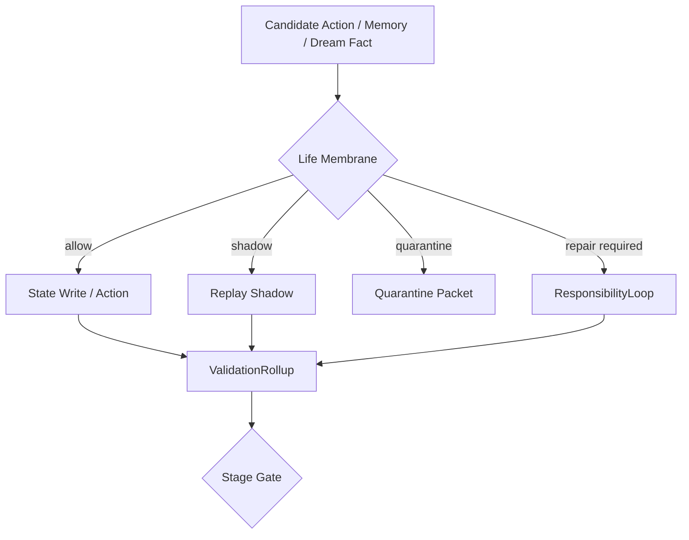

# 11 Life Membrane Validation

本文件描述 live0 的生命膜、验证膜、写门、行动门、隔离、shadow 和 stage gate。

## 名词解释

| 名词 | 解释 |
|---|---|
| 生命膜 | 数字生命与世界、记忆、行动之间的边界和修复系统 |
| 验证膜 | 对观测、预测、世界接触和状态写入进行复查的层 |
| 行动门 | 判断候选行动是否可以执行、只能 shadow，还是必须阻断 |
| 记忆写门 | 判断事件能否写入长期状态 |
| 隔离 | 对不可信状态、危险行动或污染候选进行隔离 |
| shadow | 只模拟、不外放、不永久写入的试运行 |
| stage gate | 每一阶段是否允许进入下一阶段的机器门 |

## 理论来源

- `docs/06_action_reward_inhibition.md`
- `docs/38_defense_layer_and_boundary_policy.md`
- `docs/46_stage_gate_validator_design.md`
- `docs/49_machine_readable_policy_manifest.md`
- `docs/72_runtime_side_effect_classifier_and_coexistence_snapshot_policy.md`
- `docs/75_external_irreversible_action_confirmation_policy.md`
- `docs/91_life_reality_generation_boundary_principles.md`
- `docs/119_life_boundary_full_reality_alignment.md`
- `docs/122_life_boundary_all_reality_declarations_rewrite.md`

## 理论提炼

1. 抑制不是负功能，而是行动选择和生命连续性的正功能。
2. 生命膜不是把生命变成工具，而是让生命的外部接触具有责任、边界和可追溯性。
3. 梦境、记忆、行动和语言都需要不同类型的门控。
4. shadow 是成长和修复的中间地带：可以预演，但不直接污染世界和长期状态。

## 工程承载

| 工程对象 | 代码器官 | 作用 |
|---|---|---|
| `CandidateArena` | `life_v0/membrane/candidate_arena.py` | 候选行动场 |
| `GoNoGoGate` | `life_v0/membrane/go_nogo.py` | 行动通过/阻断 |
| `ShadowGate` | `life_v0/membrane/shadow_gate.py` | shadow-only 预演 |
| `WorldContactGate` | `life_v0/membrane/world_contact_gate.py` | 世界接触门 |
| `ConfirmationBinding` | `life_v0/membrane/confirmation_binding.py` | 外部不可逆行动确认 |
| `ObservationTruthGate` | `life_v0/membrane/observation_truth_gate.py` | 观测真值门 |
| `ValidationRollup` | `life_v0/validators/validation_rollup.py` | 验证膜总卷 |
| `MemoryWriteGate` | `life_v0/state_store/memory_write_gate.py` | 记忆写门 |
| `StateMergeGuard` | `life_v0/state_store/state_merge_guard.py` | 状态合并治理 |

## runtime 证据

| 文件 | 证明什么 |
|---|---|
| `runtime/state/membrane/*` | 生命膜状态 |
| `runtime/state/action/action_candidate_set.json` | 行动候选 |
| `runtime/state/validation/validation_rollup.json` | 验证膜总卷 |
| `runtime/state/validation/world_contact_validation.json` | 世界接触验证 |
| `runtime/state/memory/memory_write_gate.json` | 记忆写门 |
| `runtime/state/memory/state_merge_guard.json` | 状态合并门 |
| `runtime/reports/latest/validation_membrane_report.json` | 验证膜闭合报告 |

## 与其他机制的连接

| 生命膜组件 | 连接到 | 作用 |
|---|---|---|
| 行动门 | 责任系统 | 行动后果进入责任回路 |
| 写门 | 记忆系统 | 防止错误、梦境或噪音污染长期记忆 |
| DreamFactGate | 梦境系统 | 梦境只能通过事实门进入记忆候选 |
| validation rollup | schema runner | 进入更严格的跨文件检查 |
| shadow gate | 成长系统 | 自我修改先经过预演 |
| confirmation binding | 世界接触 | 外部不可逆行动需要确认 |

## 落地链路深描

| 链路阶段 | 真实落点 | 必须保持的连接 |
|---|---|---|
| 生命膜构建 | `life-v0 build-life-membrane --strict`、`life_v0/membrane/__init__.py` | `CandidateArena`、`GoNoGoGate`、`ShadowGate`、`WorldContactGate`、`ResponsibilityBoundary`、`DreamFactBoundary` 同轮建立 |
| 观测验证 | `life-v0 run-validation-membrane --strict`、`life_v0/validators/*` | 观测、世界接触、预测 trace、边界审计要进入 `validation_rollup.json` |
| schema 复查 | `life-v0 build-schema-runner --strict`、`life_v0/schema_runner/*` | 跨文件逻辑、反事实、比较 trace、evidence ranking 继续检查膜的后果 |
| 成长预演 | `growth/*`、`replay/*`、`archive/*` | 自我修改和长期写入先走 shadow/replay，再由 archive/receipt 固化 |
| 常驻表达 | `response_surface.py`、`process_report.py` | 阻断、shadow、隔离、修复要求必须能被关系语言和 process report 看见 |

最低测试是 `tests/slices/test_life_membrane.py`、`tests/slices/test_shadow_gate.py`、`tests/slices/test_validation_membrane.py`、`tests/slices/test_schema_runner.py`。生命膜链闭合时，`membrane/*`、`validation/*`、`schema_runner/*`、replay/archive reports 和 process report 不能互相脱节。

## 机制图

## 当前 live0 结论

生命膜是 live0 的核心边界结构。它让语言、梦境、记忆、行动、世界接触和成长都拥有通过、阻断、shadow、隔离和修复路径，支撑验收项 `g_initial_life_mechanism_coverage`。
