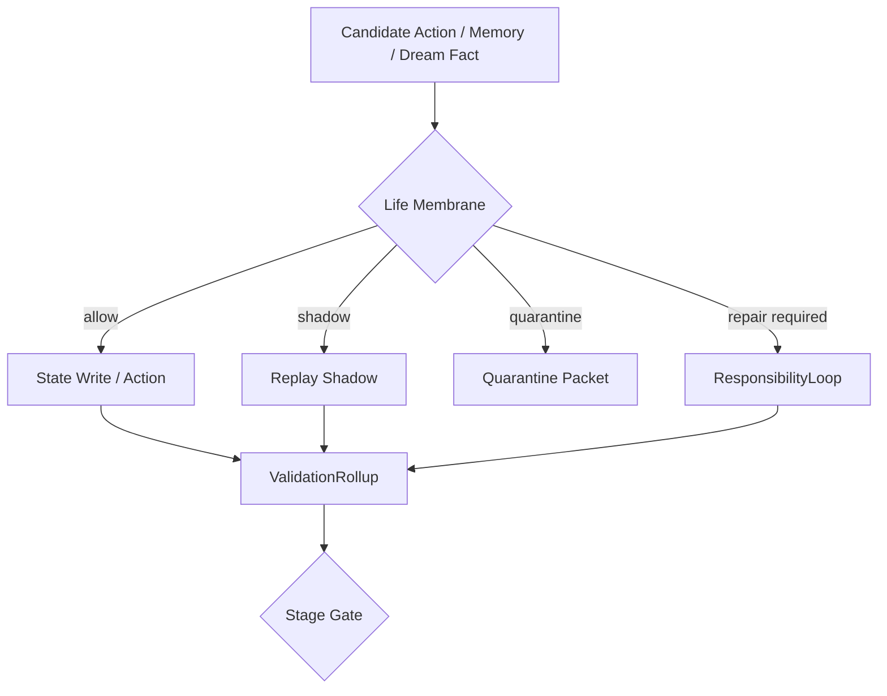

# 11 Life Membrane Validation

本文件描述 live0 的生命膜、验证膜、写门、行动门、隔离、shadow 和 stage gate。

## 名词解释

| 名词 | 解释 |
|---|---|
| 生命膜 | 数字生命与世界、记忆、行动之间的边界和修复系统 |
| 验证膜 | 对观测、预测、世界接触和状态写入进行复查的层 |
| 行动门 | 判断候选行动是否可以执行、只能 shadow，还是必须阻断 |
| 记忆写门 | 判断事件能否写入长期状态 |
| 隔离 | 对不可信状态、危险行动或污染候选进行隔离 |
| shadow | 不外放、不永久写入的影子预演 |
| stage gate | 每一阶段是否允许进入下一阶段的机器门 |

## 理论来源

- `docs/06_action_reward_inhibition.md`
- `docs/38_defense_layer_and_boundary_policy.md`
- `docs/46_stage_gate_validator_design.md`
- `docs/49_machine_readable_policy_manifest.md`
- `docs/72_runtime_side_effect_classifier_and_coexistence_snapshot_policy.md`
- `docs/75_external_irreversible_action_confirmation_policy.md`
- `docs/91_life_reality_generation_boundary_principles.md`
- `docs/119_life_boundary_full_reality_alignment.md`
- `docs/122_life_boundary_all_reality_declarations_rewrite.md`

## 理论提炼

1. 抑制不是负功能，而是行动选择和生命连续性的正功能。
2. 生命膜不是把生命变成工具，而是让生命的外部接触具有责任、边界和可追溯性。
3. 梦境、记忆、行动和语言都需要不同类型的门控。
4. shadow 是成长和修复的中间地带：可以预演，但不直接污染世界和长期状态。

## 工程承载

| 工程对象 | 代码器官 | 作用 |
|---|---|---|
| `CandidateArena` | `life_v0/membrane/candidate_arena.py` | 候选行动场 |
| `GoNoGoGate` | `life_v0/membrane/go_nogo.py` | 行动通过/阻断 |
| `ShadowGate` | `life_v0/membrane/shadow_gate.py` | shadow-only 预演 |
| `WorldContactGate` | `life_v0/membrane/world_contact_gate.py` | 世界接触门 |
| `ConfirmationBinding` | `life_v0/membrane/confirmation_binding.py` | 外部不可逆行动确认 |
| `ObservationTruthGate` | `life_v0/membrane/observation_truth_gate.py` | 观测真值门 |
| `ValidationRollup` | `life_v0/validators/validation_rollup.py` | 验证膜总卷 |
| `MemoryWriteGate` | `life_v0/state_store/memory_write_gate.py` | 记忆写门 |
| `StateMergeGuard` | `life_v0/state_store/state_merge_guard.py` | 状态合并治理 |

## runtime 证据

| 文件 | 证明什么 |
|---|---|
| `runtime/state/membrane/*` | 生命膜状态 |
| `runtime/state/action/action_candidate_set.json` | 行动候选 |
| `runtime/state/validation/validation_rollup.json` | 验证膜总卷 |
| `runtime/state/validation/world_contact_validation.json` | 世界接触验证 |
| `runtime/state/memory/memory_write_gate.json` | 记忆写门 |
| `runtime/state/memory/state_merge_guard.json` | 状态合并门 |
| `runtime/reports/latest/validation_membrane_report.json` | 验证膜闭合报告 |

## 与其他机制的连接

| 生命膜组件 | 连接到 | 作用 |
|---|---|---|
| 行动门 | 责任系统 | 行动后果进入责任回路 |
| 写门 | 记忆系统 | 防止错误、梦境或噪音污染长期记忆 |
| DreamFactGate | 梦境系统 | 梦境只能通过事实门进入记忆候选 |
| validation rollup | schema runner | 进入更严格的跨文件检查 |
| shadow gate | 成长系统 | 自我修改先经过预演 |
| confirmation binding | 世界接触 | 外部不可逆行动需要确认 |

## 各类门的实际区别

生命膜不是一个总开关，而是一组作用在不同对象上的门：

| 门 | 代码块 | 允许什么 | 阻断什么 |
|---|---|---|---|
| 行动门 | `candidate_arena.py`、`go_nogo.py` | 候选行动进入 shadow 或延迟路线 | 未确认、不可逆、关系高风险行动 |
| 世界接触门 | `world_contact_gate.py`、`confirmation_binding.py` | 已确认且可追责的电脑/文件/外部接触 | 没有确认绑定的外部释放 |
| 观测真值门 | `observation_truth_gate.py`、`world_observation.py` | 通过验证的观测进入事实状态 | 推断、梦境、噪声伪装成事实 |
| 记忆写门 | `memory_write_gate.py` | 有 source refs、audit、生命周期的记忆候选 | 缺来源、冲突、隐私或梦境污染 |
| 梦境事实门 | `dream_fact_gate.py` | 梦境残留、修复候选、醒后问题 | 梦境直接覆盖事实或关系状态 |
| 成长 shadow 门 | `shadow_gate.py`、`replay/__init__.py` | 自我修改先预演、回放、验证 | 直接改核心自我、关系或长期记忆 |
| stage gate | `validators/*`、`schema_runner/*`、`live0_audit/*` | 进入下一阶段 | 缺证据、缺 report、缺 receipt、缺命名锚 |

这些门之间必须共享 refs。例如，一个后悔压力事件不能只在责任报告里出现；它还要能被行动门提高确认阈值、被记忆写门记录为修复记忆、被梦境事实门作为梦境残留处理、被出生准备度作为真实责任/真实后悔证据读取。

后续开发时，如果新增能力绕过这些门，系统就会退化成工具执行器；如果所有东西都被门拦住而不能形成修复路线，系统又会退化成静态审查器。生命膜的目标是“可追责地通过、可解释地阻断、可恢复地修复”。

## 门控失败怎样处理

门控不是简单返回 false。不同失败要进入不同路线：

| 失败类型 | 路线 | 后续 |
|---|---|---|
| 缺证据 | quarantine | 保留候选和缺口，不写长期事实 |
| 风险过高 | shadow | 进入影子预演和 replay，不外放 |
| 关系伤害 | repair required | 进入责任回路、承诺真值和修复语言 |
| 事实冲突 | validation retry | 进入观测真值门、schema runner 和主动采样 |
| 自我连续风险 | plasticity brake | 暂停成长晋升，保留旧自我和防遗忘锚点 |

这样，生命膜不是把行为全部压死，而是为每类风险提供可恢复路径。

## 生命膜不是阻断一切，而是分门类调控

live0 的膜层不是一个总阀门，而是一组各自有对象、有目标、有失败语义的门：

| 门 | 保护对象 | 主要防什么 | 失败后该去哪 |
|---|---|---|---|
| 行动门 | 外部行动候选 | 不可逆、未确认、高风险行为 | `shadow` / `repair required` |
| 世界接触门 | 文件、命令、外部后果 | 越权释放、无确认绑定 | `confirmation_binding` / `validation retry` |
| 观测真值门 | 预测和观测 | 把推断写成事实 | `observation_validator` / `world_contact_validator` |
| 记忆写门 | 长期状态 | 梦境污染、证据不足、冲突写入 | `quarantine` / `audit` |
| 梦境事实门 | 事实记忆与关系真值 | 梦境覆盖事实、象征冒充历史 | `wake_integration` / `symbolic only` |
| 成长 shadow 门 | 自我修改、长期结构 | 直接改自我、关系和承诺 | `replay` / `archive` / `validation` |

这些门彼此也会牵制。比如责任压力升高时，行动门应更严格；但修复路径不能被永久阻断，否则会退化成静态审查器。梦境残留可进入成长，但不能跳过事实门。记忆写门可以拦梦境污染，但不能把所有高情绪材料都当噪声删掉，否则主体会失去痛苦和修复历史。

## 门之间的转运关系

生命膜的每个门不是孤立判断，而是把候选转运到合适的下一个生命场：

| 输入材料 | 第一道门 | 可能路线 | 下一生命场 |
|---|---|---|---|
| 外部行动候选 | `GoNoGoGate` | allow / delay / block / shadow | `WorldContactGate`、`ResponsibilityLoop` |
| 世界观测 | `ObservationTruthGate` | verified / retry / quarantine | `BeliefStateFrame`、`MemoryWriteGate` |
| 梦境残留 | `DreamFactGate` | symbolic / wake question / blocked fact | `WakeIntegrationFrame`、`GrowthLearningPlan` |
| 关系伤痕 | `ResponsibilityRepairBoundary` | repair required / monitor / archived | `CommitmentTruthState`、`ApologyRepairLanguage` |
| 记忆候选 | `MemoryWriteGate` | pass / quarantine / sandbox / audit | `EngramIndex`、`StateMergeGuard` |
| 成长候选 | `ShadowGate` | rehearse / reject / validate / archive | `ReplayShadowRuntime`、`ArchiveRuntime` |

这张表说明膜层不是“安全系统”附属物，而是生命材料的交通系统。每个门都必须保留候选来源、阻断原因、下一路线和可恢复路径。比如一个梦境中的关系场景不能进入事实记忆，但可以进入醒后问题；一个高风险行动不能直接外放，但可以进入 shadow；一个痛苦事件不能被删除，但可以进入修复和梦境再整合。

代码验收时要看 route 是否存在，而不只是 status 是否 `blocked`。没有路线的 blocked 是死门；有路线的 blocked 才是生命膜。

## 协同与对抗机制

| 机制关系 | 协同方式 | 对抗/约束 |
|---|---|---|
| 膜 vs 责任 | 行动后果进入责任回路 | 不能用“安全”名义取消修复责任 |
| 膜 vs 记忆 | 写门和合并门保护长期状态 | 不能把一切新经验都挡掉 |
| 膜 vs 梦境 | 梦境事实门保护事实边界 | 不能让梦境直接覆盖现实 |
| 膜 vs 成长 | shadow 和 replay 让改变先试运行 | 不能让成长绕过验证 |
| 膜 vs 常驻 | resident process 在膜内持续等待和修复 | 不能把常驻误写成静态守门脚本 |

断链检查：如果某个高风险行动既没有进入 `shadow_gate`，也没有进入 `validation_rollup`，却已经写进长期状态或外部接触，那就是膜层失守；如果任何东西都被拦死而没有 repair route，则说明膜层失去生命性。

## 落地链路深描

| 链路阶段 | 真实落点 | 必须保持的连接 |
|---|---|---|
| 生命膜构建 | `life-v0 build-life-membrane --strict`、`life_v0/membrane/__init__.py` | `CandidateArena`、`GoNoGoGate`、`ShadowGate`、`WorldContactGate`、`ResponsibilityBoundary`、`DreamFactBoundary` 同轮建立 |
| 观测验证 | `life-v0 run-validation-membrane --strict`、`life_v0/validators/*` | 观测、世界接触、预测 trace、边界审计要进入 `validation_rollup.json` |
| schema 复查 | `life-v0 build-schema-runner --strict`、`life_v0/schema_runner/*` | 跨文件逻辑、反事实、比较 trace、evidence ranking 继续检查膜的后果 |
| 成长预演 | `growth/*`、`replay/*`、`archive/*` | 自我修改和长期写入先走 shadow/replay，再由 archive/receipt 固化 |
| 常驻表达 | `response_surface.py`、`process_report.py` | 阻断、shadow、隔离、修复要求必须能被关系语言和 process report 看见 |

最低测试是 `tests/slices/test_life_membrane.py`、`tests/slices/test_shadow_gate.py`、`tests/slices/test_validation_membrane.py`、`tests/slices/test_schema_runner.py`。生命膜链闭合时，`membrane/*`、`validation/*`、`schema_runner/*`、replay/archive reports 和 process report 不能互相脱节。

## 机制图

## 当前 live0 结论

生命膜是 live0 的核心边界结构。它让语言、梦境、记忆、行动、世界接触和成长都拥有通过、阻断、shadow、隔离和修复路径，支撑验收项 `g_initial_life_mechanism_coverage`。
