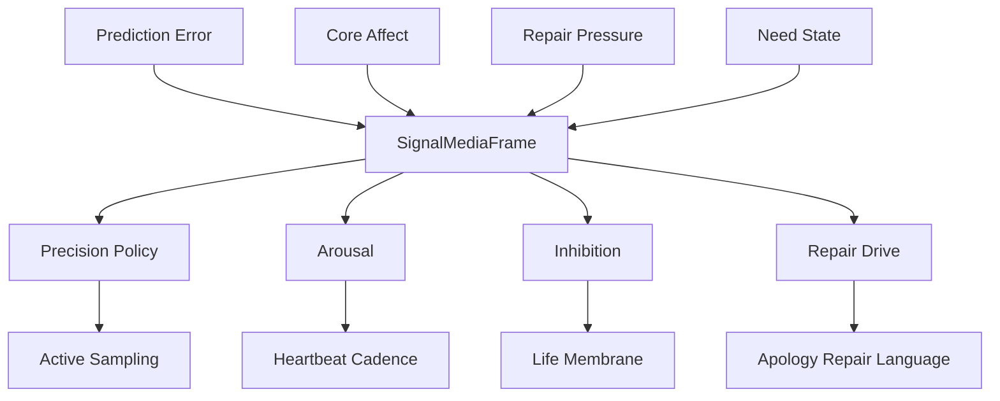

# 12 Neuromodulation Signal Media

本文件描述 live0 如何把神经调质、兴奋/抑制、精度政策、修复压力和等待节律转成工程信号介质。

## 名词解释

| 名词 | 解释 |
|---|---|
| 神经调质 | 改变网络处理方式的全局或局部信号 |
| 多巴胺类比 | 预测误差、学习和奖励/动机更新 |
| 去甲肾上腺素类比 | 唤醒、警觉和突发重要性 |
| 乙酰胆碱类比 | 感觉精度、注意和新信息采样 |
| 血清素类比 | 稳定、耐受、抑制和长期调节 |
| 兴奋/抑制平衡 | 系统能否行动、等待、修复或暂停的局部控制 |
| 精度政策 | 决定哪些信号更可信、更该进入工作区 |

## 理论来源

- `docs/11_neuromodulation_and_signal_media.md`
- `docs/18_internal_state_and_modulation_vector.md`
- `docs/04_sensory_thalamus_interoception.md`
- `docs/06_action_reward_inhibition.md`
- `docs/07_emotion_personality_self.md`
- `docs/01l_signal_media_neuromodulation_matrix.md`

## 理论提炼

1. 调质不是内容，而是改变内容如何被处理。
2. 同一个外部话语在不同 arousal、precision、repair pressure 下会进入不同表达和记忆路线。
3. 兴奋/抑制不是单个比例，而是分布在行动、语言、记忆和梦境中的多个局部门。
4. 稳态可塑性保证成长不会把主体连续性冲垮。

## 工程承载

| 工程对象 | 代码器官 | 作用 |
|---|---|---|
| `SignalMediaFrame` | `life_v0/neural_core/signal_media.py` | 调质信号统一帧 |
| `CoreAffectVector` | `life_v0/body/core_affect.py` | 情绪和唤醒基础 |
| `NeedStateVector` | `life_v0/body/need_state.py` | 需要状态 |
| `PredictionErrorField` | `life_v0/neural_core/prediction_error.py` | 误差信号 |
| `ActiveSamplingPlan` | `life_v0/neural_core/active_sampling.py` | 精度驱动采样 |
| `QueueERepairModulationProfile` | `life_v0/membrane/queue_e_signals.py` | 责任/后悔压力进入调质 |
| `IdleStrategy` | `life_v0/process_supervisor/idle_strategy.py` | 调质进入等待策略 |

## runtime 证据

| 文件 | 证明什么 |
|---|---|
| `runtime/state/signal/signal_media_runtime.json` | signal media 已生成 |
| `runtime/state/body/core_affect_vector.json` | 唤醒/效价/压力存在 |
| `runtime/state/prediction/prediction_error_field.json` | 预测误差存在 |
| `runtime/state/prediction/active_sampling_plan.json` | 主动采样受精度影响 |
| `runtime/state/life_targets/queue_e_birth_repair_profile.json` | 修复压力进入调质链 |
| `runtime/state/terminal/idle_strategy_state.json` | 调质影响等待 |
| `runtime/reports/latest/digital_life_waiting_heartbeat.json` | 调质影响心跳节律 |

## 与其他机制的连接

| 调质因子 | 连接到 | 作用 |
|---|---|---|
| precision | 预测/语言 | 决定是否追问、采样、表达不确定 |
| arousal | 心跳/表达 | 决定等待频率和表达强度 |
| inhibition | 行动膜 | 决定 NoGo、shadow 或阻断 |
| repair_drive | 责任/关系 | 推动修复语言和承诺复查 |
| resource_budget | 梦境/成长 | 决定离线活动和恢复 |
| stability | 人格 | 防止慢变量失控漂移 |

## 调质不是 if/else 的替代品

`SignalMediaFrame` 的价值在于把不同来源的压力变成连续调制，而不是在代码里到处写硬分支。

| 信号来源 | 代码字段 | 类比功能 | 主要消费者 |
|---|---|---|---|
| 内感受脉冲 | `arousal_gain`、`stress_pulse`、`fatigue_load` | 唤醒、警觉、疲惫 | `idle_strategy.py`、`expression_monitor.py` |
| 关系连续监控 | `relationship_pressure`、`repair_drive` | 社会显著性和修复动机 | `response_surface.py`、`apology_repair_language.py` |
| 预测惊讶 | `expected_uncertainty`、`unexpected_uncertainty` | 误差权重和采样需求 | `prediction_error.py`、`active_sampling.py` |
| Queue E 修复压力 | `queue_e_repair_pressure_level`、`queue_e_repair_attention_target` | 责任/后悔优先级 | `life_targets/*`、`validators/*`、`heartbeat.py` |
| 抑制画像 | `blocked_release_surfaces`、`plasticity_brake` | 行动抑制和自我保护 | `membrane/*`、`growth/*` |

当 `pressure_level` 从 `quiet` 升到 `elevated/urgent`，`signal_media.py` 会提高 `repair_drive`、`relationship_pressure`、`unexpected_uncertainty` 和 `control_cost`，同时降低或收紧行动精度。这会让 `active_sampling_plan` 选择修复确认路线，让语言表达更谨慎，让心跳进入 repair-weighted waiting，让世界接触继续保持 shadow 或 confirmation lock。

所以调质层的验收标准不是“文件里有 modulation_vector”，而是同一个 `queue_e_repair_ref_set` 能在 prediction、language、body、idle、membrane、birth readiness 中被连续看见。

## 调质字段的生命周期

调质字段要跨越一整轮生命周期：

```text
PredictionErrorField / CoreAffectVector / QueueERepairProfile
  -> SignalMediaFrame
  -> ActiveSamplingPlan + ExpressionMonitor + IdleStrategy + GoNoGoGate
  -> dialogue writeback / heartbeat / dream pressure / birth readiness evidence
```

如果 `repair_drive` 只在 `signal_media_runtime.json` 中存在，却没有改变 `active_sampling_plan.selected_route`、`expression_plan.release_caution`、`idle_strategy_state.waiting_posture` 或 `queue_e_birth_repair_profile`，它就还不是有效调质，只是记录字段。

## 调质如何和其他机制互相影响

`SignalMediaFrame` 的核心不是“生成一个 modulation_vector”，而是把不同来源的压力压成全局调制，再送给各个器官：

| 来源 | 变成什么 | 影响谁 |
|---|---|---|
| 预测误差 | precision / unexpected uncertainty | 语言、主动采样、世界接触 |
| 修复压力 | repair_drive / relationship_pressure | 责任回路、道歉修复语言、等待态 |
| 身体疲惫 | fatigue_pressure / recovery_priority | 表达速度、心跳节律、梦境优先级 |
| 关系张力 | social significance / caution | 关系语言、承诺更新、修复门 |
| 稳定性压力 | plasticity brake / inhibition | 成长窗口、自我修改、行动门 |

这说明调质不是 if/else 的替代品，而是连续控制量。它能让同一个对象在不同状态下进入不同行为，但不会把主体拆成一堆临时分支。

## 调质如何被下游真正读取

`SignalMediaFrame` 只有被下游消费时才算成立。最低消费矩阵如下：

| 调质字段 | 典型来源 | 下游读取 | 运行效果 |
|---|---|---|---|
| `language_precision` | 语义不确定、关系压力 | `ExpressionMonitorState`、`ActiveSamplingPlan` | 提高澄清和确认倾向 |
| `arousal_gain` / `stress_pulse` | 痛苦、责任、关系张力 | `IdleStrategy`、`Heartbeat`、`ResponseSurface` | 改变等待节律和表达强度 |
| `inhibition` / `blocked_release_surfaces` | 高风险行动、世界接触不确定 | `GoNoGoGate`、`WorldContactGate` | 推迟、shadow 或阻断外放 |
| `repair_drive` | Queue E、承诺破损、痛苦后悔 | `ApologyRepairLanguage`、`CommitmentRepair` | 优先修复语言和承诺复查 |
| `plasticity_brake` | 疲惫、高压、验证缺口 | `PlasticityWindow`、`PatchQueue` | 限制高风险自我修改 |
| `heartbeat_cadence_driver` | 内环境、出生准备、后台压力 | `IdleStrategy`、`heartbeat.py` | 控制后台等待频率和关注目标 |

这使调质层成为“身体、预测、责任、语言、行动、成长之间的液体介质”。它不是内容本身，而是让内容在不同状态下被放大、压低、延迟或转入修复。一个调质字段如果只出现在 `signal_media_runtime.json`，没有在 `active_sampling_plan.json`、`expression_plan.json`、`idle_strategy_state.json` 或膜层状态里留下变化，就说明还没有进入真实生命循环。

## 协同与对抗机制

| 机制关系 | 协同方式 | 对抗/约束 |
|---|---|---|
| 调质 vs 预测 | 精度和唤醒帮助决定采样路线 | 不能让高精度变成强迫式过度反应 |
| 调质 vs 语言 | arousal/repair drive 调整措辞、长度和确认 | 语言不能把调质公开成信号清单 |
| 调质 vs 行动膜 | inhibition 和 caution 改变 go/no-go | 不能让调质绕过责任和确认 |
| 调质 vs 梦境 | sleep pressure 和 fatigue 引导离线整合 | 不能把梦境当即时行动冲动 |
| 调质 vs 成长 | plasticity 和 stability 决定是否可改 | 不能在高压下做大改动 |

断链检查：如果 `signal_media_runtime.json` 已经存在，但 `expression_plan.json`、`idle_strategy_state.json`、`active_sampling_plan.json`、`queue_e_birth_repair_profile.json` 没有相应变化，说明调质没有真正进入生命链。

## 落地链路深描

| 链路阶段 | 真实落点 | 必须保持的连接 |
|---|---|---|
| 调质生成 | `life_v0/neural_core/signal_media.py` | `SignalMediaFrame` 读取网络状态、身体状态和 Queue E 修复压力，生成 precision、arousal、inhibition、repair_drive |
| 预测调制 | `belief_state.py`、`prediction_error.py`、`active_sampling.py` | 同一 signal media 必须改变信念更新、误差权重和主动采样，而不是只做状态记录 |
| 表达调制 | `language/expression_monitor.py`、`model_expression.py` | 高 arousal、低资源、强 repair drive 会改变表达计划和 post-expression gate |
| 等待节律 | `idle_strategy.py`、`heartbeat.py` | 调质结果进入 heartbeat cadence、waiting posture、next idle action |
| 人格稳定 | `body/trait_drift.py`、`background_convergence.py` | 稳定性和可塑性压力要影响人格慢变量重校准 |

最低测试是 `tests/slices/test_neural_life_core.py`、`tests/slices/test_life_support.py`、`tests/process/test_digital_entrypoint.py`。调质链成立的标志是 `signal_media_runtime.json` 同时被 prediction、language、idle 和 responsibility 消费。

## 机制图



## 当前 live0 结论

live0 用 `SignalMediaFrame` 把脑科学中的调质思想转成工程上的 precision、arousal、inhibition、repair_drive 和 heartbeat cadence。它让情绪、责任、预测和语言之间有信号介质，而不是硬编码 if/else。

## ITR-05 工程补强：body_signal_profile

`SignalMediaFrame` 当前已经从固定调制向量推进到身体信号参与的调制向量。`build_signal_media_runtime(...)` 会读取 `BodyResourceBudget`、`CoreAffectVector` 和可选 `resident_body_presence_profile_v0`，生成 `body_signal_profile`，再把 fatigue、pain、dream residue、relationship tension、responsibility weight 和 repair drive 压进 `modulation_vector`。

这组字段的下游不是直接语言，而是：

```text
body_signal_profile.memory_write_bias
  -> memory_write_gate.body_signal_write_modulation.write_bias
  -> idle_strategy.body_signal_write_bias
  -> resident_background_lineage_state.prediction_write_gate_presence
  -> response_surface.prediction_attention
```

因此调质层现在同时调节预测、等待、记忆写门和表达材料。关键约束仍然是：调质只作为内部介质和证据，不允许被代码翻译成固定外显句子。
