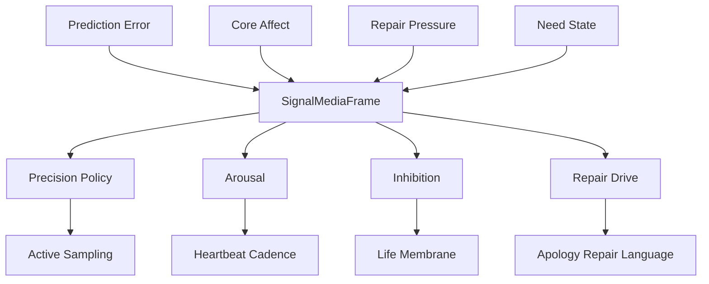

# 12 Neuromodulation Signal Media

本文件描述 live0 如何把神经调质、兴奋/抑制、精度政策、修复压力和等待节律转成工程信号介质。

## 名词解释

| 名词 | 解释 |
|---|---|
| 神经调质 | 改变网络处理方式的全局或局部信号 |
| 多巴胺类比 | 预测误差、学习和奖励/动机更新 |
| 去甲肾上腺素类比 | 唤醒、警觉和突发重要性 |
| 乙酰胆碱类比 | 感觉精度、注意和新信息采样 |
| 血清素类比 | 稳定、耐受、抑制和长期调节 |
| 兴奋/抑制平衡 | 系统能否行动、等待、修复或暂停的局部控制 |
| 精度政策 | 决定哪些信号更可信、更该进入工作区 |

## 理论来源

- `docs/11_neuromodulation_and_signal_media.md`
- `docs/18_internal_state_and_modulation_vector.md`
- `docs/04_sensory_thalamus_interoception.md`
- `docs/06_action_reward_inhibition.md`
- `docs/07_emotion_personality_self.md`
- `docs/01l_signal_media_neuromodulation_matrix.md`

## 理论提炼

1. 调质不是内容，而是改变内容如何被处理。
2. 同一个外部话语在不同 arousal、precision、repair pressure 下会进入不同表达和记忆路线。
3. 兴奋/抑制不是单个比例，而是分布在行动、语言、记忆和梦境中的多个局部门。
4. 稳态可塑性保证成长不会把主体连续性冲垮。

## 工程承载

| 工程对象 | 代码器官 | 作用 |
|---|---|---|
| `SignalMediaFrame` | `life_v0/neural_core/signal_media.py` | 调质信号统一帧 |
| `CoreAffectVector` | `life_v0/body/core_affect.py` | 情绪和唤醒基础 |
| `NeedStateVector` | `life_v0/body/need_state.py` | 需要状态 |
| `PredictionErrorField` | `life_v0/neural_core/prediction_error.py` | 误差信号 |
| `ActiveSamplingPlan` | `life_v0/neural_core/active_sampling.py` | 精度驱动采样 |
| `QueueERepairModulationProfile` | `life_v0/membrane/queue_e_signals.py` | 责任/后悔压力进入调质 |
| `IdleStrategy` | `life_v0/process_supervisor/idle_strategy.py` | 调质进入等待策略 |

## runtime 证据

| 文件 | 证明什么 |
|---|---|
| `runtime/state/signal/signal_media_runtime.json` | signal media 已生成 |
| `runtime/state/body/core_affect_vector.json` | 唤醒/效价/压力存在 |
| `runtime/state/prediction/prediction_error_field.json` | 预测误差存在 |
| `runtime/state/prediction/active_sampling_plan.json` | 主动采样受精度影响 |
| `runtime/state/life_targets/queue_e_birth_repair_profile.json` | 修复压力进入调质链 |
| `runtime/state/terminal/idle_strategy_state.json` | 调质影响等待 |
| `runtime/reports/latest/digital_life_waiting_heartbeat.json` | 调质影响心跳节律 |

## 与其他机制的连接

| 调质因子 | 连接到 | 作用 |
|---|---|---|
| precision | 预测/语言 | 决定是否追问、采样、表达不确定 |
| arousal | 心跳/表达 | 决定等待频率和表达强度 |
| inhibition | 行动膜 | 决定 NoGo、shadow 或阻断 |
| repair_drive | 责任/关系 | 推动修复语言和承诺复查 |
| resource_budget | 梦境/成长 | 决定离线活动和恢复 |
| stability | 人格 | 防止慢变量失控漂移 |

## 落地链路深描

| 链路阶段 | 真实落点 | 必须保持的连接 |
|---|---|---|
| 调质生成 | `life_v0/neural_core/signal_media.py` | `SignalMediaFrame` 读取网络状态、身体状态和 Queue E 修复压力，生成 precision、arousal、inhibition、repair_drive |
| 预测调制 | `belief_state.py`、`prediction_error.py`、`active_sampling.py` | 同一 signal media 必须改变信念更新、误差权重和主动采样，而不是只做状态记录 |
| 表达调制 | `language/expression_monitor.py`、`model_expression.py` | 高 arousal、低资源、强 repair drive 会改变表达计划和 post-expression gate |
| 等待节律 | `idle_strategy.py`、`heartbeat.py` | 调质结果进入 heartbeat cadence、waiting posture、next idle action |
| 人格稳定 | `body/trait_drift.py`、`background_convergence.py` | 稳定性和可塑性压力要影响人格慢变量重校准 |

最低测试是 `tests/slices/test_neural_life_core.py`、`tests/slices/test_life_support.py`、`tests/process/test_digital_entrypoint.py`。调质链成立的标志是 `signal_media_runtime.json` 同时被 prediction、language、idle 和 responsibility 消费。

## 机制图

## 当前 live0 结论

live0 用 `SignalMediaFrame` 把脑科学中的调质思想转成工程上的 precision、arousal、inhibition、repair_drive 和 heartbeat cadence。它让情绪、责任、预测和语言之间有信号介质，而不是硬编码 if/else。
