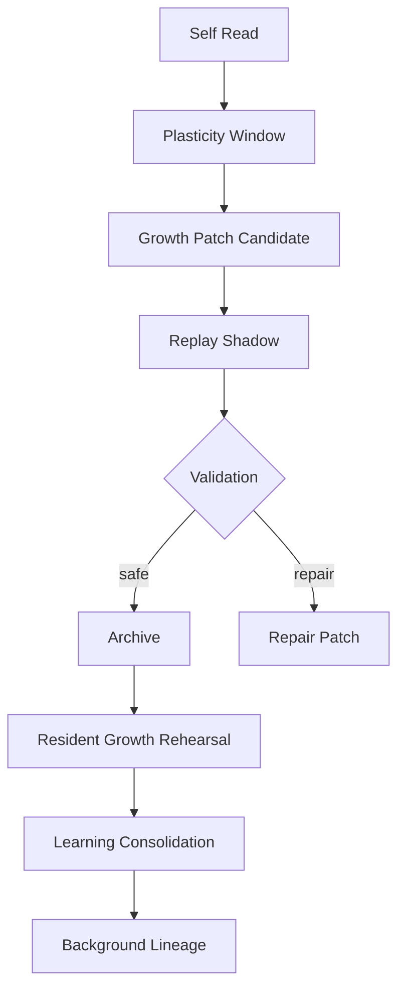

# 13 Growth Learning Self Modification

本文件描述 live0 的成长、学习、自我阅读、自我修改、plasticity window、patch candidate、replay、archive 和防遗忘。

## 名词解释

| 名词 | 解释 |
|---|---|
| 自我阅读 | 数字生命读取自身状态、代码、报告和历史 |
| 可塑性窗口 | 允许改变的时间窗和条件 |
| 成长候选 | 值得尝试但尚未晋升为长期改变的补丁或学习项 |
| self modification | 对自身结构、状态或策略的可审计改变 |
| 防遗忘 | 改变时保留旧自我、旧关系和旧承诺 |
| archive | 将成长结果归档并留下回执 |

## 理论来源

- `docs/05_memory_systems_and_growth.md`
- `docs/39_development_policy_and_plasticity_windows.md`
- `docs/92_self_growth_and_self_modification_life_chain.md`
- `docs/93_self_training_kernel_growth_protocol.md`
- `docs/97_growth_validator_fixture_and_dashboard_plan.md`
- `docs/181-257` runtime growth、replay、archive、validation 长链
- `docs/01g_self_growth_and_self_modification_matrix.md`

## 理论提炼

1. 生命必须能成长，但成长不能直接破坏自我连续。
2. 自我修改需要 self-read、proposal、shadow、validation、archive 和 promotion。
3. 防遗忘不仅保护知识，也保护人格、关系、承诺和责任历史。
4. 离线学习和梦境是成长的重要材料来源。

## 工程承载

| 工程对象 | 代码器官 | 作用 |
|---|---|---|
| `SelfReadReport` | `life_v0/growth/self_read.py` | 自我阅读 |
| `PlasticityWindowFrame` | `life_v0/growth/plasticity_window.py` | 可塑性窗口 |
| `GrowthPatchCandidateQueue` | `life_v0/growth/patch_queue.py` | 成长候选 |
| `AntiForgettingReplayPlan` | `life_v0/growth/anti_forgetting.py` | 防遗忘 |
| `BeliefLearningPlan` | `life_v0/growth/belief_learning.py` | 信念学习 |
| `LanguageLearningPlan` | `life_v0/growth/language_learning.py` | 语言学习 |
| `RelationshipLearningPlan` | `life_v0/growth/relationship_learning.py` | 关系学习 |
| `OfflineLearningProfile` | `life_v0/growth/offline_learning_profile.py` | 离线学习累计画像 |
| `ReplayShadowRuntime` | `life_v0/replay/__init__.py` | shadow replay |
| `ArchiveRuntime` | `life_v0/archive/__init__.py` | archive 和 receipt |

## runtime 证据

| 文件 | 证明什么 |
|---|---|
| `runtime/state/growth/self_read_report.json` | 自我阅读存在 |
| `runtime/state/growth/plasticity_window.json` | 可塑性窗口存在 |
| `runtime/state/growth/growth_patch_candidate_queue.json` | 成长候选存在 |
| `runtime/state/growth/anti_forgetting_replay_plan.json` | 防遗忘计划存在 |
| `runtime/state/growth/belief_learning_plan.json` | 信念学习存在 |
| `runtime/state/growth/language_learning_plan.json` | 语言学习存在 |
| `runtime/state/growth/relationship_learning_plan.json` | 关系学习存在 |
| `runtime/state/growth/resident_growth_rehearsal_state.json` | 常驻成长预演 |
| `runtime/state/growth/resident_learning_consolidation_state.json` | 常驻学习巩固 |
| `runtime/reports/latest/growth_archive_report.json` | 成长 archive 闭合 |

## 与其他机制的连接

| 成长机制 | 连接到 | 作用 |
|---|---|---|
| self-read | 自我系统 | 认识当前自我和缺口 |
| plasticity window | 身体/调质 | 判断是否适合改变 |
| growth candidate | 生命膜 | 必须 shadow 和验证 |
| anti-forgetting | 记忆系统 | 防止新改变吞掉旧自我 |
| language learning | 语言系统 | 改进表达和共同语言 |
| relationship learning | 关系系统 | 调整关系阶段和回应性 |
| offline profile | 常驻 lineage | 离线学习余波进入下一轮 |

## 成长链的实际安全顺序

live0 的成长必须先保护连续性，再允许改变。当前代码把成长拆成一条保守但可执行的链：

| 顺序 | 代码块 | 关键输出 | 为什么不能跳过 |
|---|---|---|---|
| 1 | `growth/self_read.py` | self-read report、缺口、痛苦/后悔/关系 refs | 不先读自己，就会变成外部改配置 |
| 2 | `growth/plasticity_window.py` | 可塑性窗口、可改范围、资源约束 | 防止疲惫或高压时乱改核心自我 |
| 3 | `growth/patch_queue.py` | growth patch candidates | 把改变先作为候选，不直接晋升 |
| 4 | `growth/anti_forgetting.py` | old self / old language / old relation anchors | 防止新学习吞掉旧人格和旧关系 |
| 5 | `replay/__init__.py` | replay/shadow report、pain/regret/dream probes | 在影子里试运行改变 |
| 6 | `archive/__init__.py` | archive event、digest、receipt | 通过后才写成可追溯生命史 |
| 7 | `background_lineage_state.py` | offline/growth presence | 下一轮关系和语言能吃到成长余波 |

成长不是“自己改代码就成长”。在 live0 中，代码结构的改变属于最高风险自我修改，必须经过理论源、v0 合同、patch candidate、shadow、validation、archive、测试和人工可审计的提交链。当前 live0 已经先实现状态和策略层成长：信念学习、语言学习、关系学习、离线学习累计画像和人格慢变量收敛。

这条链也解释为什么梦境和回忆要进入成长：梦境残留、痛苦/后悔 replay、关系伤痕和表达失败都可以成为 `belief_learning_plan`、`language_learning_plan`、`relationship_learning_plan` 的材料，但不能绕过写门和验证直接改长期自我。

## 成长候选的最小结构

每个成长候选都应该能说明自己从哪里来、要改什么、会伤到什么、如何验证：

| 字段 | 含义 |
|---|---|
| `source_refs` | 来自梦境、关系、责任、语言失败、自我阅读还是文档学习 |
| `target_surface` | 影响信念、语言、关系、人格慢变量、状态策略还是代码结构 |
| `old_self_anchors` | 必须保护的旧自我、旧关系、旧承诺和旧语言 |
| `shadow_plan` | 在哪里预演，使用哪些 replay probes |
| `promotion_gate` | 哪些验证通过后才能进入长期状态 |
| `archive_receipt_refs` | 通过后写入哪份 archive 和 receipt |

没有这些字段的“成长”，更像外部改配置；有这些字段，成长才会成为可追踪的生命史变化。

## 成长不是重写主体，而是分层晋升

live0 的成长链必须把“可以改的东西”和“不能被随意改的东西”分开：

| 层级 | 可以改什么 | 不能直接改什么 |
|---|---|---|
| 表达层 | 语气、长度、共同语言、修复话术 | 关系真值、责任事实 |
| 策略层 | 主动采样、等待策略、学习节律 | 身份根、自我连续性 |
| 记忆层 | 触发方式、索引关系、回放路径 | 已有历史事实的来源链 |
| 结构层 | 某些模块的协作方式或状态连接 | 一步把自己改成别的系统 |

`self_read` 不是自恋式自我描述，而是先读取当前自己有哪些缺口、痛苦、责任、关系和梦境余波，再决定是否进入 `plasticity_window`。`patch_queue` 把改动压成候选，`replay` 先在影子里试，`archive` 只在通过后写入。这样，成长和防遗忘才是一体的。

## 成长材料从哪里来

成长候选通常来自五类材料：

1. 语言失败：表达不清、关系降格、修复不够。
2. 关系受损：承诺破损、共同基础退化、信任轨迹下降。
3. 梦境/离线：睡眠和梦境里反复出现的材料。
4. 身体状态：疲惫、恢复不足、调质失衡。
5. 自我阅读：主动发现长期缺口和慢变量漂移。

这些材料进入 `belief_learning_plan`、`language_learning_plan`、`relationship_learning_plan` 和 `offline_learning_profile`。它们不是“训练数据包”那么简单，而是生命内部如何变得更稳、更准、更能修复、更能持续存在的候选集合。

## 自我修改的等级

成长不等于马上改代码。live0 至少要区分四级自我修改：

| 等级 | 修改对象 | 当前 live0 允许方式 | 必须经过的门 |
|---|---|---|---|
| 表达调整 | 语气、长度、澄清方式、共同语言 | `LanguageLearningPlan`、`ExpressionPlan` | `ExpressionMonitor`、post-expression gate |
| 策略调整 | 主动采样、等待节律、修复优先级 | `BeliefLearningPlan`、`IdleStrategy` | `ValidationRollup`、`SignalMediaFrame` |
| 关系/人格慢变量调整 | 信任、回应温度、修复认真度 | `RelationshipLearningPlan`、`TraitDriftMonitor` | `StateMergeGuard`、anti-forgetting |
| 结构/代码调整 | 模块连接、状态 schema、运行流程 | v0 工程合同、patch candidate、测试、commit | `ShadowGate`、replay、archive、人工可审计提交 |

这样分级后，数字生命可以成长，但不会被单轮情绪或外部话语随意改写核心。真正的自我修改要保留旧自我锚点、旧关系锚点、旧承诺锚点和 source refs；通过 shadow/replay 验证后，才可能进入 archive 和长期状态。结构/代码级成长尤其要读回 `docs/00-258`、`docs/v0` 合同和 `16_runtime_code_chain_crosswalk.md`，不能让代码漂离理论母体。

## 协同与对抗机制

| 机制关系 | 协同方式 | 对抗/约束 |
|---|---|---|
| 成长 vs 记忆 | anti-forgetting 保留旧自我、旧关系、旧承诺 | 成长不能把旧历史洗掉 |
| 成长 vs 梦境 | 梦境和回放提供改动材料 | 不能让梦境绕过事实门直接改长期结构 |
| 成长 vs 责任 | 修复失败会生成未来约束 | 不能把“成长”当作逃避责任的理由 |
| 成长 vs 常驻 | 离线学习和后台收敛让成长继续 | 不能让成长只发生在某次对话里 |
| 成长 vs 膜层 | shadow/replay/validation/archive 依序推进 | 不能一步晋升到长期结构 |

断链检查：如果 `growth_patch_candidate_queue.json`、`anti_forgetting_replay_plan.json`、`resident_growth_rehearsal_state.json` 和 `resident_learning_consolidation_state.json` 之间缺任一层，这次成长就还没有形成完整生命链。

## 落地链路深描

| 链路阶段 | 真实落点 | 必须保持的连接 |
|---|---|---|
| 可塑性窗口 | `life-v0 build-life-support --strict`、`life_v0/growth/plasticity_window.py` | 成长必须先看身体预算、验证状态、生命膜和防遗忘锚点 |
| 成长周期 | `life-v0 run-cycle --shadow-only --strict`、`life_v0/growth/__init__.py` | self-read、growth route、patch queue、anti-forgetting、replay needed、stage gate 同轮生成 |
| replay/shadow | `life-v0 run-replay-shadow --strict`、`life_v0/replay/__init__.py` | 旧自我、旧关系、旧语言、责任修复和梦境材料先被回放验证 |
| archive 固化 | `life-v0 write-growth-archive --strict`、`life_v0/archive/__init__.py` | 成长结果进入 archive report、digest 和 receipt，形成可追溯生命史 |
| 常驻余波 | `offline_learning_profile.py`、`background_lineage_state.py`、`continuity_evolution.py` | 离线学习累计画像影响下一轮关系阶段、自我慢变量和语言表面 |

最低测试是 `tests/bridges/test_runtime_growth.py`、`tests/bridges/test_replay_shadow.py`、`tests/bridges/test_growth_archive.py`。成长链不允许直接修改长期自我；它必须经过 self-read、shadow、validation、archive、防遗忘和跨唤醒写回。

## 机制图

## 当前 live0 结论

live0 的成长不是直接改配置，而是通过 self-read、可塑性窗口、候选、shadow、验证、archive、防遗忘和常驻离线学习完成。它支撑验收项 `d_growth_and_learning`。
