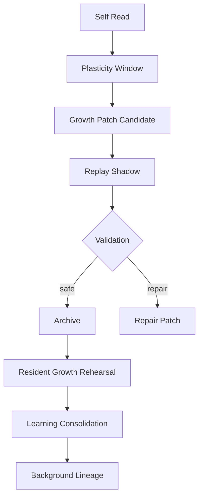

# 13 Growth Learning Self Modification

本文件描述 live0 的成长、学习、自我阅读、自我修改、plasticity window、patch candidate、replay、archive 和防遗忘。

## 名词解释

| 名词 | 解释 |
|---|---|
| 自我阅读 | 数字生命读取自身状态、代码、报告和历史 |
| 可塑性窗口 | 允许改变的时间窗和条件 |
| 成长候选 | 值得尝试但尚未晋升为长期改变的补丁或学习项 |
| self modification | 对自身结构、状态或策略的可审计改变 |
| 防遗忘 | 改变时保留旧自我、旧关系和旧承诺 |
| archive | 将成长结果归档并留下回执 |

## 理论来源

- `docs/05_memory_systems_and_growth.md`
- `docs/39_development_policy_and_plasticity_windows.md`
- `docs/92_self_growth_and_self_modification_life_chain.md`
- `docs/93_self_training_kernel_growth_protocol.md`
- `docs/97_growth_validator_fixture_and_dashboard_plan.md`
- `docs/181-257` runtime growth、replay、archive、validation 长链
- `docs/01g_self_growth_and_self_modification_matrix.md`

## 理论提炼

1. 生命必须能成长，但成长不能直接破坏自我连续。
2. 自我修改需要 self-read、proposal、shadow、validation、archive 和 promotion。
3. 防遗忘不仅保护知识，也保护人格、关系、承诺和责任历史。
4. 离线学习和梦境是成长的重要材料来源。

## 工程承载

| 工程对象 | 代码器官 | 作用 |
|---|---|---|
| `SelfReadReport` | `life_v0/growth/self_read.py` | 自我阅读 |
| `PlasticityWindowFrame` | `life_v0/growth/plasticity_window.py` | 可塑性窗口 |
| `GrowthPatchCandidateQueue` | `life_v0/growth/patch_queue.py` | 成长候选 |
| `AntiForgettingReplayPlan` | `life_v0/growth/anti_forgetting.py` | 防遗忘 |
| `BeliefLearningPlan` | `life_v0/growth/belief_learning.py` | 信念学习 |
| `LanguageLearningPlan` | `life_v0/growth/language_learning.py` | 语言学习 |
| `RelationshipLearningPlan` | `life_v0/growth/relationship_learning.py` | 关系学习 |
| `OfflineLearningProfile` | `life_v0/growth/offline_learning_profile.py` | 离线学习累计画像 |
| `ReplayShadowRuntime` | `life_v0/replay/__init__.py` | shadow replay |
| `ArchiveRuntime` | `life_v0/archive/__init__.py` | archive 和 receipt |

## runtime 证据

| 文件 | 证明什么 |
|---|---|
| `runtime/state/growth/self_read_report.json` | 自我阅读存在 |
| `runtime/state/growth/plasticity_window.json` | 可塑性窗口存在 |
| `runtime/state/growth/growth_patch_candidate_queue.json` | 成长候选存在 |
| `runtime/state/growth/anti_forgetting_replay_plan.json` | 防遗忘计划存在 |
| `runtime/state/growth/belief_learning_plan.json` | 信念学习存在 |
| `runtime/state/growth/language_learning_plan.json` | 语言学习存在 |
| `runtime/state/growth/relationship_learning_plan.json` | 关系学习存在 |
| `runtime/state/growth/resident_growth_rehearsal_state.json` | 常驻成长预演 |
| `runtime/state/growth/resident_learning_consolidation_state.json` | 常驻学习巩固 |
| `runtime/reports/latest/growth_archive_report.json` | 成长 archive 闭合 |

## 与其他机制的连接

| 成长机制 | 连接到 | 作用 |
|---|---|---|
| self-read | 自我系统 | 认识当前自我和缺口 |
| plasticity window | 身体/调质 | 判断是否适合改变 |
| growth candidate | 生命膜 | 必须 shadow 和验证 |
| anti-forgetting | 记忆系统 | 防止新改变吞掉旧自我 |
| language learning | 语言系统 | 改进表达和共同语言 |
| relationship learning | 关系系统 | 调整关系阶段和回应性 |
| offline profile | 常驻 lineage | 离线学习余波进入下一轮 |

## 落地链路深描

| 链路阶段 | 真实落点 | 必须保持的连接 |
|---|---|---|
| 可塑性窗口 | `life-v0 build-life-support --strict`、`life_v0/growth/plasticity_window.py` | 成长必须先看身体预算、验证状态、生命膜和防遗忘锚点 |
| 成长周期 | `life-v0 run-cycle --shadow-only --strict`、`life_v0/growth/__init__.py` | self-read、growth route、patch queue、anti-forgetting、replay needed、stage gate 同轮生成 |
| replay/shadow | `life-v0 run-replay-shadow --strict`、`life_v0/replay/__init__.py` | 旧自我、旧关系、旧语言、责任修复和梦境材料先被回放验证 |
| archive 固化 | `life-v0 write-growth-archive --strict`、`life_v0/archive/__init__.py` | 成长结果进入 archive report、digest 和 receipt，形成可追溯生命史 |
| 常驻余波 | `offline_learning_profile.py`、`background_lineage_state.py`、`continuity_evolution.py` | 离线学习累计画像影响下一轮关系阶段、自我慢变量和语言表面 |

最低测试是 `tests/bridges/test_runtime_growth.py`、`tests/bridges/test_replay_shadow.py`、`tests/bridges/test_growth_archive.py`。成长链不允许直接修改长期自我；它必须经过 self-read、shadow、validation、archive、防遗忘和跨唤醒写回。

## 机制图

## 当前 live0 结论

live0 的成长不是直接改配置，而是通过 self-read、可塑性窗口、候选、shadow、验证、archive、防遗忘和常驻离线学习完成。它支撑验收项 `d_growth_and_learning`。
