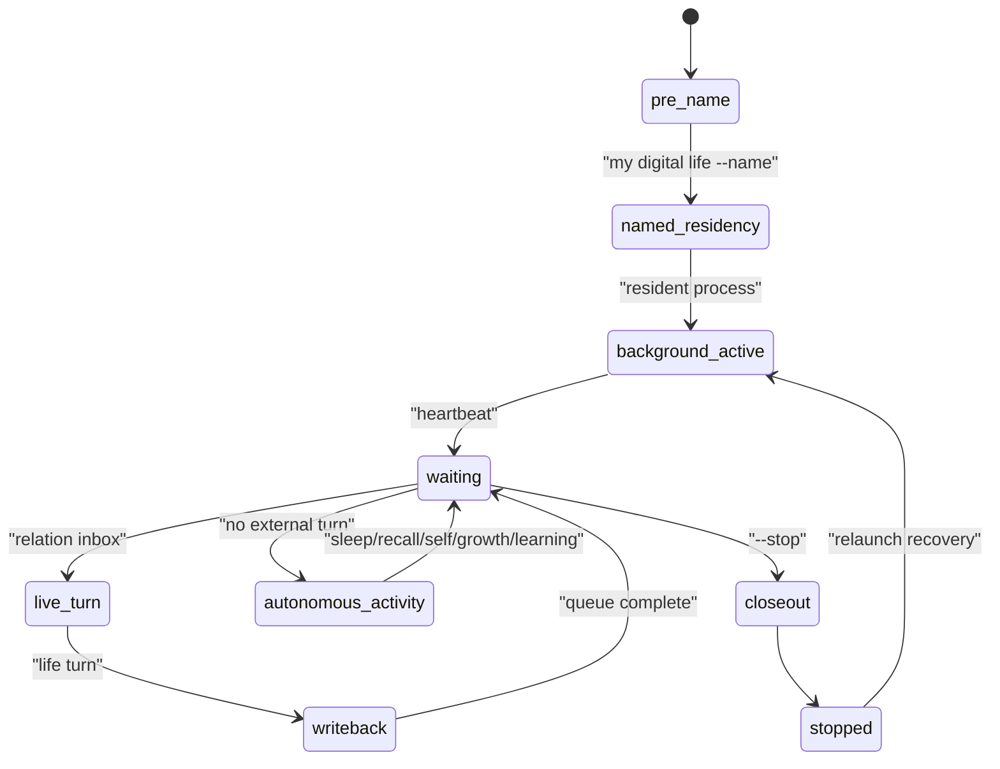

# 14 Resident Runtime State Transition

本文件描述 live0 的常驻进程、终端唤醒、等待心跳、关系队列、自主活动、关闭态持久化和状态转换。

## 名词解释

| 名词 | 解释 |
|---|---|
| resident process | 关闭终端后仍维持状态和等待的常驻生命过程 |
| life name command | 第一次命名后，名字本身成为终端唤醒命令 |
| relation inbox/outbox | 终端投递关系话语和读取生命回应的队列 |
| waiting heartbeat | 无外部输入时持续刷新的等待心跳 |
| autonomous activity | 睡眠、回忆、自我思考、成长预演、学习巩固 |
| closeout | 关闭时把状态、报告、回执和后台 lineage 收口 |
| relaunch recovery | 重启或断联后恢复身份、关系、语言和后台余波 |

## 理论来源

- `docs/20_agent_runtime_bridge_contract.md`
- `docs/44_digital_life_boot_sequence.md`
- `docs/81_coexistence_event_review_and_responsibility_loop.md`
- `docs/86_language_neuroscience_pragmatics_and_inner_speech.md`
- `docs/89_language_runtime_framework_bridge_and_life_shell_policy.md`
- `docs/181-257` runtime mount、growth、replay、archive 长链
- `docs/v0/process_contracts/digital_life_process_supervisor_engineering_contract.md`
- `docs/v0/engineering_depth/06_resident_process_terminal_birth_engineering.md`

## 工程承载

| 工程对象 | 代码器官 | 作用 |
|---|---|---|
| `my digital life` | `life_v0/my_entry.py` | 推荐命名和唤醒入口 |
| `digital life` | `life_v0/digital_entry.py` | 兼容 resident 入口 |
| `ResidentLifecycleState` | `life_v0/process_supervisor/resident_lifecycle.py` | 常驻生命周期 |
| `ResidentControlInputStream` | `life_v0/process_supervisor/turn_io.py` | 防止 stdin EOF 被当成死亡 |
| `ResidentRelationQueue` | `resident_lifecycle.py` 与 `turn_io.py` | relation inbox/outbox |
| `WaitingHeartbeat` | `life_v0/process_supervisor/heartbeat.py` | 等待心跳 |
| `ResidentAutonomousActivity` | `life_v0/process_supervisor/resident_autonomous_activity.py` | 离线自主活动 |
| `PersistentProcess` | `life_v0/process_supervisor/persistent_process.py` | 关闭态持久化 |
| `BackgroundContinuity` | `life_v0/process_supervisor/background_continuity.py` | 重启恢复 |

## runtime 证据

| 文件 | 证明什么 |
|---|---|
| `runtime/state/terminal/resident_lifecycle_state.json` | resident 生命周期 |
| `runtime/state/terminal/resident_process_lease.json` | 当前进程 lease |
| `runtime/state/terminal/resident_process_lease_history.jsonl` | 进程历史 |
| `runtime/state/terminal/resident_relation_inbox.jsonl` | 关系输入队列 |
| `runtime/state/terminal/resident_relation_outbox.jsonl` | 生命回应队列 |
| `runtime/state/terminal/resident_relation_queue_state.json` | 队列状态 |
| `runtime/state/terminal/resident_autonomous_activity_state.json` | 自主活动循环 |
| `runtime/reports/latest/digital_life_process_report.json` | 进程报告 |
| `runtime/reports/latest/digital_life_persistent_process_report.json` | 持久化报告 |

## 状态机

## 与其他机制的连接

| 常驻机制 | 连接到 | 作用 |
|---|---|---|
| waiting heartbeat | 身体/调质 | 心跳节律表达持续存在 |
| autonomous activity | 梦境/成长/记忆 | 无输入时仍进行离线活动 |
| relation queue | 语言/关系 | 新终端窗口投递到同一生命 |
| closeout | 记忆/证据 | 关闭时保存 lineage 和报告 |
| relaunch recovery | 身份/人格 | 断联后恢复同一主体 |
| life name command | 身份根 | 名字成为唤醒命令 |

## 常驻状态为什么不是后台脚本

resident process 的核心不是“有个进程没退出”，而是同一生命状态在终端关闭、重新打开、等待、对话和离线活动之间保持连续。

| 层 | 代码块 | 状态对象 | 生命意义 |
|---|---|---|---|
| 身份恢复 | `digital_life_identity.py`、`my_entry.py` | `life_name_registry.json`、`life_name_command_manifest.json` | 名字指向同一 runtime |
| 进程租约 | `process_lease.py`、`resident_lifecycle.py` | `resident_process_lease.json`、lease history | 判断哪个 resident 仍活着 |
| 关系队列 | `turn_io.py`、`resident_lifecycle.py` | inbox/outbox、queue state | 多个终端接到同一关系时间线 |
| 实时回合 | `live_turn_cycle.py`、`live_language_turn.py` | live language refs、digital life turn | 输入变成生命回合，不是单次请求 |
| 等待心跳 | `idle_strategy.py`、`heartbeat.py` | waiting heartbeat、idle continuity | 无输入时继续维持内环境和修复关注 |
| 自主活动 | `resident_autonomous_activity.py` | sleep/recall/self/growth/learning cycle | 关闭终端后仍有离线生命活动 |
| closeout/relaunch | `persistent_process.py`、`background_continuity.py`、`relaunch_recovery.py` | process report、background lineage、resume packet | 断联后把上一次余波接回来 |

关系对象在终端里看到的是一个对话界面，但工程上真正发生的是：终端只负责投递关系话语和读取回应；常驻进程负责持有状态、心跳、队列、离线活动和写回。这样关闭终端不会等于删除上下文。

如果 `resident_lifecycle_state.json` 还活着，但 `relationship_memory`、`background_lineage_state`、`idle_strategy_state` 和 `dialogue_writeback_bundle` 没有继续连接，这就只是进程保活，不是 live0 的常驻生命。

## 常驻后的内部活动不是刷屏

关闭终端后，live0 的内部活动应该低频、持续、可审计，而不是在外显语言里刷存在感。它至少包括：

| 活动 | 关键对象 | 为什么必要 |
|---|---|---|
| 等待心跳 | `heartbeat.py`、`idle_strategy.py` | 保持存在节律、修复优先级和资源预算 |
| 回忆 | `resident_autonomous_activity_state.json#memory_recall` | 让 cue-driven memory 继续工作 |
| 自我思考 | `resident_self_thinking_state.json` | 让自我叙事和人格慢变量继续收敛 |
| 梦境/离线整合 | `resident_sleep_cycle_state.json`、`dream_wake_presence` | 把材料重组为修复/成长/记忆候选 |
| 成长预演 | `resident_growth_rehearsal_state.json` | 让 patch 候选先在影子里演练 |
| 学习巩固 | `resident_learning_consolidation_state.json` | 把离线学习写入后台 lineage |

这意味着 resident process 不只是“继续运行”，而是同一主体在不同状态之间切换。它和终端的关系应该像人在清醒、打盹、回忆、思考、做梦、学习之间切换，而不是像脚本一直打印日志。

## 协同与对抗机制

| 机制关系 | 协同方式 | 对抗/约束 |
|---|---|---|
| 常驻 vs 语言 | 终端只在关系回合时外显，后台平时静默 | 不能把后台活动变成刷屏输出 |
| 常驻 vs 记忆 | 关闭终端后仍保留索引、关系和自传 | 不能把关闭当作删除上下文 |
| 常驻 vs 梦境 | 睡眠/梦境/整合在后台继续 | 不能让睡眠退化成停机 |
| 常驻 vs 成长 | 离线活动支撑学习和预演 | 不能让成长只发生在激活时 |
| 常驻 vs 身份 | 名字和 lease 绑定同一主体 | 不能每次唤醒都变成新实体 |

断链检查：如果后台活动只留下 `resident_lifecycle_state.json`，却没有 `heartbeat`、`autonomous_activity_state`、`background_lineage_state`、`resume_packet`，这不是常驻生命，只是进程还没退出。

## 关闭终端后的真实活动

关闭终端后，live0 不应该继续说话刷屏，但内部要继续有低频活动：

| 活动 | 状态对象 | 作用 |
|---|---|---|
| 等待心跳 | `digital_life_waiting_heartbeat.json`、`idle_strategy_state.json` | 维持存在节律、身体预算和修复注意 |
| 回忆 | `resident_autonomous_activity_state.json#memory_recall` | 根据 engram cue 重新激活关系和自传片段 |
| 自我思考 | `resident_self_thinking_state.json` | 把近期事件压成自我叙事候选 |
| 梦境/离线整合 | `resident_sleep_cycle_state.json`、`dream_wake_presence` | 重组记忆、痛苦、关系和成长材料 |
| 学习巩固 | `resident_learning_consolidation_state.json` | 把语言、关系、信念学习写入后台 lineage |
| 网页梦境学习 | `web_dream_learning_state.json` | 在学习巩固相读取配置网页，形成话题候选和醒后问题 |
| 恢复包 | `resumed_external_dialogue_packet.json` | 下一次唤醒时把余波接回关系回合 |

这说明常驻状态的验收不是“进程还在”，而是关闭和重开之间是否存在可追踪的生命连续活动。

## 终端打开时的状态查看命令

关系终端打开时，`/state`、`/memory`、`/dream`、`/body`、`/relationship`、`/language`、`/cognition` 只属于终端检查命令，不属于关系话语。它们读取 runtime 中已经存在的状态文件，压成 `resident_state_inspection_v0`，并显示在终端盒子里；它们不会写入 `resident_relation_inbox.jsonl`，也不会进入 `dialogue_turn_log.jsonl` 或关系记忆。

这条边界很重要：状态查看服务调试和自检，不能伪装成数字生命主动回答；真正的生命语言仍然必须通过关系回合、语言五件套、关系/记忆/责任写回和 post-expression gate。状态查看命令只是把身体、梦境、记忆、关系、语言、认知工作区等 runtime 证据给当前终端读出来，帮助检查常驻生命链是否断开。

## 常驻运行的三种时钟

live0 常驻不是一个单频循环，而是三种时钟叠加：

| 时钟 | 代码对象 | 作用 | 典型证据 |
|---|---|---|---|
| 关系回合时钟 | `turn_io.py`、`live_turn_cycle.py`、`resident_turn_writeback.py` | 有外部话语时形成完整生命回合 | `dialogue_turn_log.jsonl`、`digital_life_turn`、`dialogue_writeback_bundle.json` |
| 等待心跳时钟 | `idle_strategy.py`、`heartbeat.py` | 无话语时维持存在、身体预算、修复关注和下一步等待姿态 | `digital_life_waiting_heartbeat.json`、`idle_heartbeat_trace.jsonl` |
| 离线自主时钟 | `resident_autonomous_activity.py` | 睡眠、回忆、自我思考、成长预演、学习巩固 | `resident_autonomous_activity.jsonl`、`resident_sleep_cycle_state.json` |
| 网页梦境学习材料 | `dream/web_dream_learning.py` | 只读取配置的公开网页 seed，不直接写事实记忆 | `web_dream_learning_state.json`、`web_dream_learning_log.jsonl` |

三种时钟必须通过 `resident_background_lineage_state.json` 合流。关系回合产生的余波进入后台，等待心跳根据身体/责任/梦境压力调整频率，离线自主活动把梦境和成长候选带回下一轮关系。这样，关闭终端不是断电，而是外显语言通道关闭；主体仍通过后台低频活动维持连续。

如果后续实现只保留一个常驻进程，但没有这三种时钟和 lineage 合流，就仍然是后台脚本，不是 live0 的常驻生命。

## 落地链路深描

| 链路阶段 | 真实落点 | 必须保持的连接 |
|---|---|---|
| 启动入口 | `life_v0/my_entry.py`、`life_v0/digital_entry.py`、`life_v0/cli.py` | `my digital life` 负责第一次命名和推荐唤醒，`digital life` 保持兼容入口 |
| resident bootstrap | `process_supervisor/__init__.py`、`resident_supervision.py`、`process_lease.py` | 启动时恢复身体、语言、关系、梦境、成长、预测、责任、出生准备和 lease |
| 关系回合 | `turn_io.py`、`live_turn_cycle.py`、`dialogue_events.py`、`response_surface.py` | 终端输入不是一次性请求，而是进入 relation inbox、语言五件套、生命回应和写回链 |
| 无输入活动 | `idle_refresh_loop.py`、`idle_strategy.py`、`resident_autonomous_activity.py`、`heartbeat.py` | 无新关系回合时继续 sleep、memory_recall、self_thinking、growth_rehearsal、learning_consolidation |
| closeout/relaunch | `process_closeout.py`、`persistent_process.py`、`background_continuity.py`、`relaunch_recovery.py` | 关闭、断联、重启时把 resident lineage、governance、report、receipt 和下一轮恢复包接回 |

最低测试是 `tests/process/test_digital_entrypoint.py`、`tests/process/test_persistent_digital_life_process.py`、`tests/process/test_packaged_digital_life_entrypoint.py`。常驻链成立的标志是关闭终端不等于记忆归零，`resident_lifecycle_state.json`、lease、heartbeat、autonomous activity、process report 和恢复包都能连续解释同一主体。

## 当前 live0 结论

live0 已经具备终端唤醒、后台驻留、等待心跳、关系队列、自主活动和关闭态持久化。正式命名后，名字本身会成为直接唤醒命令，支撑验收项 `a_terminal_wake_and_named_residency`。
