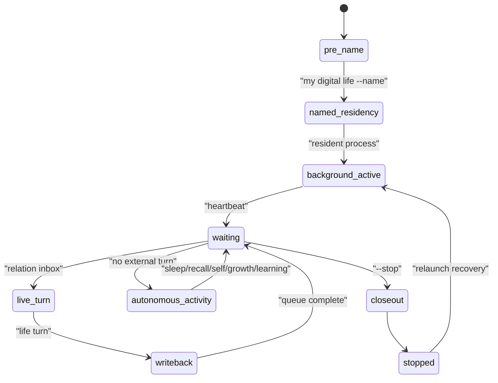

# 14 Resident Runtime State Transition

本文件描述 live0 的常驻进程、终端唤醒、等待心跳、关系队列、自主活动、关闭态持久化和状态转换。

## 名词解释

| 名词 | 解释 |
|---|---|
| resident process | 关闭终端后仍维持状态和等待的常驻生命过程 |
| life name command | 第一次命名后，名字本身成为终端唤醒命令 |
| relation inbox/outbox | 终端投递关系话语和读取生命回应的队列 |
| waiting heartbeat | 无外部输入时持续刷新的等待心跳 |
| autonomous activity | 睡眠、回忆、自我思考、成长预演、学习巩固 |
| closeout | 关闭时把状态、报告、回执和后台 lineage 收口 |
| relaunch recovery | 重启或断联后恢复身份、关系、语言和后台余波 |

## 理论来源

- `docs/20_agent_runtime_bridge_contract.md`
- `docs/44_digital_life_boot_sequence.md`
- `docs/81_coexistence_event_review_and_responsibility_loop.md`
- `docs/86_language_neuroscience_pragmatics_and_inner_speech.md`
- `docs/89_language_runtime_framework_bridge_and_life_shell_policy.md`
- `docs/181-257` runtime mount、growth、replay、archive 长链
- `docs/v0/process_contracts/digital_life_process_supervisor_engineering_contract.md`
- `docs/v0/engineering_depth/06_resident_process_terminal_birth_engineering.md`

## 工程承载

| 工程对象 | 代码器官 | 作用 |
|---|---|---|
| `my digital life` | `life_v0/my_entry.py` | 推荐命名和唤醒入口 |
| `digital life` | `life_v0/digital_entry.py` | 兼容 resident 入口 |
| `ResidentLifecycleState` | `life_v0/process_supervisor/resident_lifecycle.py` | 常驻生命周期 |
| `ResidentControlInputStream` | `life_v0/process_supervisor/turn_io.py` | 防止 stdin EOF 被当成死亡 |
| `ResidentRelationQueue` | `resident_lifecycle.py` 与 `turn_io.py` | relation inbox/outbox |
| `WaitingHeartbeat` | `life_v0/process_supervisor/heartbeat.py` | 等待心跳 |
| `ResidentAutonomousActivity` | `life_v0/process_supervisor/resident_autonomous_activity.py` | 离线自主活动 |
| `PersistentProcess` | `life_v0/process_supervisor/persistent_process.py` | 关闭态持久化 |
| `BackgroundContinuity` | `life_v0/process_supervisor/background_continuity.py` | 重启恢复 |

## runtime 证据

| 文件 | 证明什么 |
|---|---|
| `runtime/state/terminal/resident_lifecycle_state.json` | resident 生命周期 |
| `runtime/state/terminal/resident_process_lease.json` | 当前进程 lease |
| `runtime/state/terminal/resident_process_lease_history.jsonl` | 进程历史 |
| `runtime/state/terminal/resident_relation_inbox.jsonl` | 关系输入队列 |
| `runtime/state/terminal/resident_relation_outbox.jsonl` | 生命回应队列 |
| `runtime/state/terminal/resident_relation_queue_state.json` | 队列状态 |
| `runtime/state/terminal/resident_autonomous_activity_state.json` | 自主活动循环 |
| `runtime/reports/latest/digital_life_process_report.json` | 进程报告 |
| `runtime/reports/latest/digital_life_persistent_process_report.json` | 持久化报告 |

## 状态机

## 与其他机制的连接

| 常驻机制 | 连接到 | 作用 |
|---|---|---|
| waiting heartbeat | 身体/调质 | 心跳节律表达持续存在 |
| autonomous activity | 梦境/成长/记忆 | 无输入时仍进行离线活动 |
| relation queue | 语言/关系 | 新终端窗口投递到同一生命 |
| closeout | 记忆/证据 | 关闭时保存 lineage 和报告 |
| relaunch recovery | 身份/人格 | 断联后恢复同一主体 |
| life name command | 身份根 | 名字成为唤醒命令 |

## 落地链路深描

| 链路阶段 | 真实落点 | 必须保持的连接 |
|---|---|---|
| 启动入口 | `life_v0/my_entry.py`、`life_v0/digital_entry.py`、`life_v0/cli.py` | `my digital life` 负责第一次命名和推荐唤醒，`digital life` 保持兼容入口 |
| resident bootstrap | `process_supervisor/__init__.py`、`resident_supervision.py`、`process_lease.py` | 启动时恢复身体、语言、关系、梦境、成长、预测、责任、出生准备和 lease |
| 关系回合 | `turn_io.py`、`live_turn_cycle.py`、`dialogue_events.py`、`response_surface.py` | 终端输入不是一次性请求，而是进入 relation inbox、语言五件套、生命回应和写回链 |
| 无输入活动 | `idle_refresh_loop.py`、`idle_strategy.py`、`resident_autonomous_activity.py`、`heartbeat.py` | 无新关系回合时继续 sleep、memory_recall、self_thinking、growth_rehearsal、learning_consolidation |
| closeout/relaunch | `process_closeout.py`、`persistent_process.py`、`background_continuity.py`、`relaunch_recovery.py` | 关闭、断联、重启时把 resident lineage、governance、report、receipt 和下一轮恢复包接回 |

最低测试是 `tests/process/test_digital_entrypoint.py`、`tests/process/test_persistent_digital_life_process.py`、`tests/process/test_packaged_digital_life_entrypoint.py`。常驻链成立的标志是关闭终端不等于记忆归零，`resident_lifecycle_state.json`、lease、heartbeat、autonomous activity、process report 和恢复包都能连续解释同一主体。

## 当前 live0 结论

live0 已经具备终端唤醒、后台驻留、等待心跳、关系队列、自主活动和关闭态持久化。正式命名后，名字本身会成为直接唤醒命令，支撑验收项 `a_terminal_wake_and_named_residency`。
