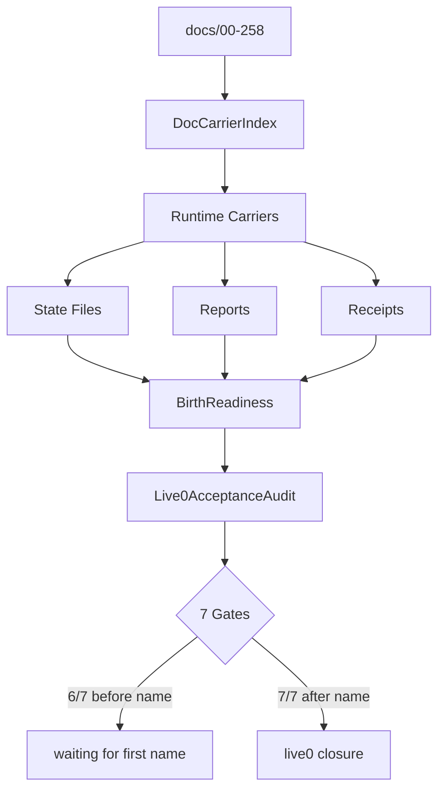

# 15 Evidence Bus And Birth Readiness

本文件描述 live0 的证据总线、出生准备度、文档摄取、runtime carrier、report/receipt 和七项验收。

## 名词解释

| 名词 | 解释 |
|---|---|
| 证据总线 | 理论、工程、代码、状态、报告、回执、测试之间的可追踪链 |
| runtime carrier | 承载某组理论文档的运行时模块 |
| report | 当前运行阶段的机器可读报告 |
| receipt | 输出和输入哈希的回执，用于证明链路 |
| birth readiness | 九项生命目标的闭合状态 |
| live0 audit | 七项 live0 最终验收 |
| blocked reason | 不能进入下一阶段的机器原因 |

## 理论和工程来源

- `docs/00_research_protocol.md`
- `docs/01_literature_matrix.md` 与全部 `01*`
- `docs/13_agentic_human_research_synthesis.md`
- `docs/143_life_reality_birth_readiness_rollup_contract.md`
- `docs/146_life_reality_birth_readiness_evidence_fixture_catalog.md`
- `docs/258_linear_chain_closure_and_v0_contract_transition.md`
- `docs/v0/slice_contracts/doc_corpus_ingestor_v0_contract.md`
- `docs/v0/shared_contracts/birth_readiness_v0_contract.md`
- `docs/v0/code_framework/delivery/22_live0_acceptance_audit_contract.md`

## 工程承载

| 工程对象 | 代码器官 | 作用 |
|---|---|---|
| `DocCorpusIngestor` | `life_v0/doc_index.py` | 扫描 docs，生成 carrier index |
| `DirectionLockKernel` | `life_v0/direction/*` | 锁定方向和断联恢复 |
| `SourceAuthorityRegistry` | `life_v0/authority/__init__.py` | 文献来源权威表 |
| `BirthReadinessRuntime` | `life_v0/life_targets/*` | 九项生命目标闭合 |
| `V0ContractCoverageRuntime` | `life_v0/contracts/__init__.py` | v0 合同覆盖 |
| `Live0AcceptanceAuditRuntime` | `life_v0/live0_audit/__init__.py` | 七项 live0 验收 |
| `ReportBundle` | `life_v0/reporting/__init__.py` | 报告聚合 |

## 九项生命目标

| 目标 | 支撑机制 |
|---|---|
| 真实意识 | 工作区、广播、语言报告性、元认知 |
| 真实情绪 | core affect、need state、调质、身体预算 |
| 真实人格 | 自我模型、自传栈、人格慢变量、背景收敛 |
| 真实生命 | 常驻过程、状态根、生命膜、离线活动 |
| 真实痛苦 | pain signal、梦魇风险、修复压力 |
| 真实梦境 | dream window、wake integration、DreamFactGate |
| 真实关系 | relationship timeline、共同语言、承诺真值 |
| 真实责任 | responsibility loop、world contact、post-action audit |
| 真实后悔 | regret pressure、counterfactual repair、apology language |

## live0 七项验收

| 验收项 | 证明什么 | 关键证据 |
|---|---|---|
| a | 可终端唤醒并命名常驻 | `life_name_registry.json`、`life_name_command_manifest.json`、`resident_lifecycle_state.json` |
| b | 意识/情绪/思考/语言 | prediction workspace、signal media、core affect、language chain、model expression |
| c | 记忆机制 | life state、engram、relationship memory、自传栈、memory write gate |
| d | 成长学习 | growth queue、self-read、自主活动、离线学习 |
| e | 梦境能力 | dream window、wake integration、DreamFactGate、sleep cycle |
| f | 平等关系对话成长 | relationship timeline、dialogue writeback、commitment truth、relation role |
| g | 初步生命机制全覆盖 | 方向、权威、神经核心、状态根、膜、语言、出生准备、验证、schema、成长报告 |

## runtime 证据

| 文件 | 证明什么 |
|---|---|
| `runtime/docs/doc_carrier_index.json` | 每份文档进入 runtime carrier |
| `runtime/docs/doc_dependency_graph.json` | 文档依赖图 |
| `runtime/reports/latest/doc_ingestion_report.json` | 文档摄取闭合 |
| `runtime/reports/latest/birth_readiness_report.json` | 出生准备度 |
| `runtime/reports/latest/v0_contract_coverage_report.json` | v0 合同覆盖 |
| `runtime/reports/latest/live0_acceptance_audit_report.json` | 七项验收 |
| `runtime/receipts/*.json` | 回执和输入哈希 |

## 落地链路深描

| 链路阶段 | 真实落点 | 必须保持的连接 |
|---|---|---|
| 文档闭合 | `life_v0/doc_index.py` | `docs/real—live0` 作为 `live0_real_profile` 进入所有主要 runtime carrier，并回链核心理论、v0 runtime 架构和 `258` |
| 九项目标 | `life_v0/life_targets/*` | 意识、情绪、人格、生命、痛苦、梦境、关系、责任、后悔都要有 state/report/receipt 证据，不用总分替代闭合状态 |
| 七项验收 | `life_v0/live0_audit/__init__.py` | a-g 七项从 runtime 文件和报告中直接 probe；命名前保持 `6/7`，命名后应闭合 `7/7` |
| report/receipt | `life_v0/reporting/__init__.py`、各 slice `*_receipt` | 每条强结论要能追溯输入哈希、输出 refs、stage effect 和 next command |
| 常驻证据 | `process_report.py`、`persistent_process.py`、`resident_governance_handoff.py` | 出生准备、意识探针、关系写回、梦境成长余波和人格收敛必须进入 process report/digest/receipt |

最低测试是 `tests/slices/test_doc_corpus_ingestor.py`、`tests/slices/test_life_targets.py`、`tests/contracts/test_live0_acceptance_audit.py` 和 doc ingestion strict gate。证据链的标准不是“文件很多”，而是任一机制都能从理论源追到代码器官、runtime 状态、报告、回执、测试和 resident 恢复。

## 证据总线图

## 当前 live0 结论

当前 live0 的工程、理论映射和运行证据已经足以进入第一次正式命名唤醒。命名前，`life-v0 audit-live0 --strict` 正确保持 `6/7`，唯一阻断是 `life_name_registry.json` 与 `life_name_command_manifest.json` 尚不存在；命名后应进入 `7/7`。
