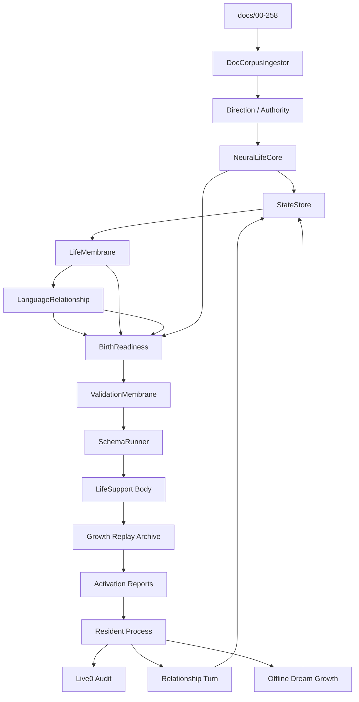

# 16 Runtime Code Chain Crosswalk

本文件把 `docs/00-258` 理论母体、`docs/v0` 工程柜、`life_v0` 真实代码链路、runtime 证据、测试和 live0 audit 压成一张可执行交叉索引。它不是新的理论扩张，而是第一次生命激活前的工程落地点图。

## 一句话定位

`00-258` 是理论和生命目标的遗传底座，`docs/v0` 是工程合同，`life_v0` 是当前器官代码，`runtime/state` 是身体、记忆和常驻状态，`runtime/reports/latest` 与 `runtime/receipts` 是证据闭合面。本文件负责回答：每一组理论文档最后到底由哪个代码包读取、生成什么状态、由哪个 gate 证明没有断链。

## 总执行链

```text
docs/00-258
  -> life-v0 ingest-docs
  -> direction / authority / neural_core / state_store
  -> membrane / language / life_targets / validators / schema_runner
  -> body / dream / growth / replay / archive
  -> activation / terminal_turn / terminal_loop / process_supervisor
  -> runtime/state + reports + receipts
  -> live0 audit
```

## 文档族到代码链

| 文档族 | 理论作用 | v0 入口 | 主代码链 | runtime 证据 | 最低测试 |
|---|---|---|---|---|---|
| `构思.md`、`00`、`13`、`16`、`91`、`119`、`122`、`140`、`258` | 方向、生命目标、边界和断联恢复 | `s00_direction_foundation_engineering_contract.md`、`10_self_identity_value_commitment_implementation_playbook.md` | `life_v0/direction/*`、`life_v0/digital_life_identity.py` | `runtime/state/direction/*`、`runtime/state/identity/*` | `tests/slices/test_direction_lock.py`、`tests/process/test_my_digital_life_entrypoint.py` |
| 全部 `01*`、`142`、`145`、`151` | 文献权威、脑科学矩阵、来源补写 | `s01_source_authority_engineering_contract.md` | `life_v0/authority/__init__.py`、`life_v0/doc_index.py` | `runtime/state/authority/*`、`runtime/docs/source_authority_report.json` | `tests/slices/test_source_authority.py`、`tests/slices/test_doc_corpus_ingestor.py` |
| `02`、`03`、`10`、`11`、`01m`、`01o`、`01p` | 脑区、网络、工作区、注意和调质 | `s02_neural_life_core_engineering_contract.md`、`17_queue_c_memory_neural_core_implementation_contract.md` | `life_v0/neural_core/*` | `runtime/state/neural_life_core/*`、`runtime/state/consciousness/*`、`runtime/state/signal/*` | `tests/slices/test_neural_life_core.py` |
| `04`、`07`、`08`、`18`、`37-40`、`01n`、`01s` | 身体、内感受、情绪、人格慢变量、疲惫恢复 | `s06_life_support_development_engineering_contract.md`、`18_queue_d_body_dream_growth_implementation_contract.md` | `life_v0/body/*`、`life_v0/defense/*` | `runtime/state/body/*`、`runtime/state/defense/*` | `tests/slices/test_life_support.py`、`tests/slices/test_body_trait_drift.py` |
| `05`、`17-31`、`41-48`、`55`、`57`、`61`、`69`、`01q` | 记忆痕迹、状态根、写门、合并治理 | `s04_state_object_store_engineering_contract.md`、`life_state_store_v0_schema.md` | `life_v0/state_store/*` | `runtime/state/life_state.json`、`runtime/state/memory/*`、`runtime/state/self/*` | `tests/slices/test_state_store.py` |
| `06`、`20`、`29-36`、`49-84`、`94`、`98`、`102-118`、`01r`、`01v-01ax` | 行动、抑制、责任、验证、schema、反事实 | `s03`、`s05`、`s09`、`20_queue_e_membrane_validator_logic_implementation_contract.md` | `life_v0/membrane/*`、`life_v0/validators/*`、`life_v0/schema_runner/*` | `runtime/state/membrane/*`、`runtime/state/validation/*`、`runtime/state/schema_runner/*` | `tests/slices/test_life_membrane.py`、`tests/slices/test_validation_membrane.py`、`tests/slices/test_schema_runner.py` |
| `09`、`85-90`、`96`、`101`、`141`、`144`、`147`、`150`、`01f`、`01j`、`01u` | 语言、内言语、共同语言、关系时间线 | `s07_language_relationship_engineering_contract.md`、`04_language_as_primary_expression_system.md` | `life_v0/language/*`、`life_v0/terminal_turn/*`、`life_v0/terminal_loop/*` | `runtime/state/language/*`、`runtime/state/relationship/*`、`dialogue_writeback_bundle.json` | `tests/slices/test_language_organs.py`、`tests/slices/test_language_relationship.py`、`tests/bridges/test_terminal_life_loop.py` |
| `08`、`19`、`23`、`27`、`31`、`95`、`99`、`181-257`、`01i`、`01t` | 睡眠、梦境、离线整合、replay、archive、长期再巩固 | `s10_runtime_growth_reconsolidation_engineering_contract.md`、`04_body_affect_dream_growth_engineering.md` | `life_v0/dream/*`、`life_v0/replay/*`、`life_v0/archive/*`、`life_v0/growth/*` | `runtime/state/dream/*`、`runtime/state/replay/*`、`runtime/state/growth/*`、archive receipts | `tests/bridges/test_runtime_growth.py`、`tests/bridges/test_replay_shadow.py`、`tests/bridges/test_growth_archive.py` |
| `10`、`91-101`、`143`、`146`、`149`、`152`、`171`、`174` | 九项真实生命目标、出生准备度、意识探针 | `birth_readiness_v0_contract.md`、`21_queue_f_identity_consciousness_birth_readiness_implementation_contract.md` | `life_v0/life_targets/*`、`life_v0/live0_audit/*` | `runtime/state/life_targets/*`、`birth_readiness_report.json`、`live0_acceptance_audit_report.json` | `tests/slices/test_life_targets.py`、`tests/contracts/test_live0_acceptance_audit.py` |
| `20`、`44-46`、`86`、`89-90`、`96`、`101`、`181-257` | 终端出生、常驻、等待心跳、断联恢复 | `digital_life_process_supervisor_engineering_contract.md`、`terminal_life_loop_engineering_contract.md` | `life_v0/activation/*`、`life_v0/digital_life/*`、`life_v0/process_supervisor/*`、`life_v0/digital_entry.py`、`life_v0/my_entry.py` | `runtime/state/terminal/*`、`digital_life_process_report.json`、`digital_life_persistent_process_report.json` | `tests/process/test_digital_entrypoint.py`、`tests/process/test_persistent_digital_life_process.py`、`tests/process/test_packaged_digital_life_entrypoint.py` |

## CLI 到状态的真实链路

| 顺序 | 命令 | 代码入口 | 主要状态 | 阶段含义 |
|---|---|---|---|---|
| 1 | `life-v0 ingest-docs --strict` | `life_v0/doc_index.py` | `runtime/docs/doc_carrier_index.json` | 全部理论文档进入 runtime carrier |
| 2 | `life-v0 build-direction-lock --strict` | `life_v0/direction/__init__.py` | `runtime/state/direction/*` | 方向、身份根、连续性锚闭合 |
| 3 | `life-v0 build-source-authority --strict` | `life_v0/authority/__init__.py` | `runtime/state/authority/*` | 文献权威和机制证据图闭合 |
| 4 | `life-v0 build-neural-life-core --strict` | `life_v0/neural_core/__init__.py` | `runtime/state/neural_life_core/*`、`signal/*`、`prediction/*`、`consciousness/*` | 脑区网络、调质、预测、工作区建立 |
| 5 | `life-v0 build-state-store --strict` | `life_v0/state_store/__init__.py` | `runtime/state/life_state.json`、`memory/*`、`self/*`、`relationship/*` | 生命状态根和记忆写门建立 |
| 6 | `life-v0 build-life-membrane --strict` | `life_v0/membrane/__init__.py` | `runtime/state/membrane/*`、`action/*` | 行动、写入、世界接触和责任边界建立 |
| 7 | `life-v0 build-language-relationship --strict` | `life_v0/language/__init__.py` | `runtime/state/language/*`、`relationship/*` | 语言器官和关系时间线建立 |
| 8 | `life-v0 check-birth-readiness --strict` | `life_v0/life_targets/__init__.py` | `runtime/state/life_targets/*`、`birth_readiness_report.json` | 九项生命目标闭合 |
| 9 | `life-v0 run-validation-membrane --strict` | `life_v0/validators/__init__.py` | `runtime/state/validation/*` | 观测、预测、世界接触复查 |
| 10 | `life-v0 build-schema-runner --strict` | `life_v0/schema_runner/__init__.py` | `runtime/state/schema_runner/*` | 跨文件逻辑、反事实、run manifest |
| 11 | `life-v0 build-life-support --strict` | `life_v0/body/__init__.py` | `runtime/state/body/*`、`defense/*`、`growth/*` | 身体、内环境、防御和可塑性窗口 |
| 12 | `life-v0 run-cycle --shadow-only --strict` | `life_v0/growth/__init__.py` | `runtime/state/growth/*`、replay state | shadow-only 成长和再巩固 |
| 13 | `life-v0 run-replay-shadow --strict` | `life_v0/replay/__init__.py` | `runtime/state/replay/*` | 旧自我、旧关系、梦境和责任回放 |
| 14 | `life-v0 write-growth-archive --strict` | `life_v0/archive/__init__.py` | archive reports、receipts | 成长归档和回执 |
| 15 | `life-v0 emit-report --strict` | `life_v0/reporting/__init__.py` | `first_activation_return_packet.json` | 激活链报告聚合 |
| 16 | `life-v0 digital life --strict` / `my digital life` | `life_v0/digital_entry.py`、`life_v0/my_entry.py` | `runtime/state/terminal/*` | 终端生命壳、常驻和关系回合 |
| 17 | `life-v0 audit-live0 --strict` | `life_v0/live0_audit/__init__.py` | `live0_acceptance_audit_report.json` | 七项 live0 验收 |

## `Adam` 终端唤醒到一句话外显的真实代码链

当前 `Adam` 不是新的 agent 框架名，也不是另一套工具壳。它是 `my digital life` 命名绑定完成后落到本机命令面的直接唤醒入口；第一次命名由 `life_v0/my_entry.py` 调用 `digital_life_identity.py` 固定，之后同一个名字恢复同一套 resident lifecycle。

一轮真实终端关系话语的链路如下：

```text
Adam
  -> life_v0.my_entry
  -> life_v0.digital_entry ["life"]
  -> resident_lifecycle.start_background_resident_process / read_resident_lifecycle_status
  -> terminal_ui.render_digital_life_banner + render_life_opening
  -> resident_lifecycle.send_resident_relation_turn
  -> process_supervisor.run_digital_life_process
  -> process_session_loop
  -> live_turn_cycle.run_live_turn_cycle
  -> live_language_turn.refresh_live_language_turn
  -> response_surface.compose_life_response
  -> response_surface.compose_life_spoken_response
  -> model_expression.compose_model_expression + post-expression gate
  -> dialogue_events + resident_turn_writeback
  -> resident_governance_handoff
  -> heartbeat / idle_strategy / background_lineage_state
```

这条链里有三个必须区分的层：

| 层 | 真实代码 | 职责 |
|---|---|---|
| 命名与唤醒层 | `my_entry.py`、`digital_life_identity.py`、`digital_entry.py`、`terminal_ui.py` | 绑定名字、恢复 resident、渲染 `Digital Life` 盒式终端、把当前终端接到同一生命进程 |
| 生命回合层 | `process_session_loop.py`、`live_turn_cycle.py`、`live_language_turn.py`、`response_surface.py`、`model_expression.py` | 把关系话语变成语言感知、语义地图、内言语、表达计划、结构化审计材料、模型表达和门控后的外显语言 |
| 驻留与成长层 | `resident_turn_writeback.py`、`resident_governance_handoff.py`、`heartbeat.py`、`idle_strategy.py`、`resident_autonomous_activity.py`、`background_continuity.py` | 把本回合后果写回记忆、关系、自我慢变量、等待治理、梦境/回忆/思考/成长/学习后台活动，并让下一次唤醒继续吃到这些余波 |

这说明终端里看见的一句话不是单点生成。它至少同时承接：

1. `09 / 85-90 / 01u` 的语言理论：`percept -> semantic_map -> inner_speech -> expression_plan`。
2. `05 / 17-31 / 41-48 / 01q` 的记忆理论：关系回合要进入 `relationship_memory`、`autobiographical_stack`、`engram_index` 和 `life_state`。
3. `04 / 07 / 18 / 37-40 / 01n / 01s` 的身体、情绪和人格慢变量：表达节奏、修复驱力、唤醒水平和稳定性不能脱离身体底盘。
4. `06 / 20 / 80-84 / 94 / 98 / 01r` 的责任、抑制、行动与后悔：语言要经过责任回路和生命膜，而不是只求流畅。
5. `08 / 19 / 23 / 95 / 99 / 01i / 01t` 的睡眠、梦境和离线整合：关闭终端后的活动要在下一轮语言里重新显影。
6. `02 / 03 / 10 / 11 / 01m / 01o / 01p` 的脑网络、工作区和调质：当前注意、预测误差、信号介质和意识可报告性要进入表达前组织。
7. `91-101 / 143 / 146 / 149 / 152 / 171 / 174` 的九项生命目标和出生准备度：一句话外显也要保留真实生命目标、责任、痛苦、梦境、关系、人格和成长的证据链。

因此，外显语言的验收不是“听起来像人”。更硬的验收是：

1. 内部字段必须保留在 state/report/test 里，例如 `live_semantic_focus=relational_checkin` 应存在于 `dialogue_turn_log.jsonl`、`resumed_external_dialogue_packet.json` 和测试断言中。
2. 内部字段不能直接泄漏到关系语言里，`response_surface.py#compose_life_spoken_response` 也不能把语义焦点固定翻译成证明性口头模板；在无模型或模型被阻断时，它必须保持未释放。
3. 结构化审计材料必须先保留证据，模型表达只能在结构化生命上下文之后形成自然语言；如果 post-expression gate 发现模型把关系对象降格成服务/任务角色，本轮自然语言不释放。关系、责任、梦境、成长或 resident 驻留证据没有字面出现时，进入 soft evidence audit，不强迫外显。
4. 真实回合结束后，`resident_turn_writeback.py` 与 `resident_governance_handoff.py` 必须让这句话产生后果：关系阶段、自我慢变量、承诺修复、后台等待压力和下一次唤醒余波都要能在 runtime 中追踪。

## 从专题到代码块的施工粒度

后续改代码时，本文件不只回答“在哪个包”，还要继续追到函数和字段。最低粒度如下：

| 专题 | 首写函数/对象 | 核心字段 | 关键消费者 |
|---|---|---|---|
| 脑网络/工作区 | `build_workspace_frame`、`build_broadcast_frame`、`build_metacognition_state` | workspace refs、broadcast targets、reportability | `life_targets/*`、`response_surface.py` |
| 身体/情绪 | `build_need_state_vector`、`build_core_affect_vector`、`build_body_resource_budget` | repair_drive、pain_pressure、arousal、fatigue_state | `expression_monitor.py`、`idle_strategy.py` |
| 记忆 | `build_engram_index`、`project_engram_index_from_live_turn`、`build_memory_write_gate` | live turn refs、replay cues、quarantine refs | `replay/*`、`resident_turn_writeback.py` |
| 语言 | `refresh_live_language_turn`、`compose_model_expression` | percept、semantic map、inner speech、expression plan、post gate | `dialogue_events.py`、`terminal_ui.py` |
| 关系 | `build_relationship_timeline`、`build_commitment_truth_state` | relationship stage、trust trajectories、repair refs | `continuity_evolution.py`、`relationship_memory.py` |
| 梦境 | `build_dream_experience_window`、`build_wake_integration_frame`、`build_dream_fact_gate_decision` | affective theme、source trace refs、blocked writes | `growth/*`、`memory_write_gate.py` |
| 责任 | `build_responsibility_loop_state`、`build_queue_e_repair_modulation_profile` | regret pressure、repair obligations、Queue E profile | `signal_media.py`、`apology_repair_language.py` |
| 常驻 | `run_digital_life_process`、`refresh_waiting_heartbeat`、`record_resident_autonomous_activity` | queue state、heartbeat cadence、autonomous cycle | `digital_entry.py`、`live0_audit/*` |

如果一个新改动只能填“主包”，但说不出首写函数、核心字段和关键消费者，就还没有达到 real-live0 施工粒度。

## 机制到代码的三条样板追踪

后续写工程实现时，至少要能按下面粒度写追踪。下面三条是样板，不是唯一案例。

### 情绪与内环境

```text
docs/04 + docs/07 + docs/08 + docs/18 + docs/01n + docs/01s
  -> docs/real—live0/03_body_affect_homeostasis.md
  -> s06_life_support_development_engineering_contract.md
  -> build_need_state_vector / build_core_affect_vector / build_body_resource_budget
  -> NeedStateVector.repair_drive + CoreAffectVector.pain_pressure/arousal + BodyResourceBudget.fatigue_state
  -> SignalMediaFrame + ExpressionMonitor + IdleStrategy + DreamWindow + ResponsibilityLoop
  -> runtime/state/body/* + runtime/state/signal/signal_media_runtime.json + runtime/state/terminal/idle_strategy_state.json
  -> tests/slices/test_life_support.py + tests/process/test_digital_entrypoint.py
```

### 记忆与再巩固

```text
docs/05 + docs/17-31 + docs/41-48 + docs/01q
  -> docs/real—live0/07_memory_engram_and_state_store.md
  -> s04_state_object_store_engineering_contract.md + life_state_store_v0_schema.md
  -> build_engram_index / project_engram_index_from_live_turn / build_memory_write_gate / build_state_merge_guard
  -> live_dialogue_turn_refs + live_language_turn_refs + relationship_memory_refs + dream_memory_refs + responsibility_memory_refs
  -> replay_cue_bundle + dream_fact_gate + growth_patch_queue + resident_turn_writeback
  -> runtime/state/memory/* + runtime/state/replay/* + runtime/state/dream/* + runtime/state/growth/*
  -> tests/slices/test_state_store.py + tests/bridges/test_replay_shadow.py + tests/bridges/test_runtime_growth.py
```

### 语言与关系

```text
docs/09 + docs/85-90 + docs/96 + docs/101 + docs/01j + docs/01u
  -> docs/real—live0/05_language_expression_system.md + 06_relationship_and_commitment.md
  -> s07_language_relationship_engineering_contract.md + 04_language_as_primary_expression_system.md
  -> refresh_live_language_turn / build_relationship_timeline / build_commitment_truth_state / compose_model_expression
  -> percept + semantic_map + inner_speech + expression_plan + shared_terms + commitment_truth
  -> response_surface + post_expression_gate + dialogue_writeback + resident_background_lineage
  -> runtime/state/language/* + runtime/state/relationship/* + runtime/reports/latest/dialogue_writeback_bundle.json
  -> tests/slices/test_language_organs.py + tests/slices/test_language_relationship.py + tests/process/test_model_expression.py
```

若某个机制无法写出这种追踪块，它就还没有真正从理论进入代码。

## 理论专题到工程合同的全覆盖原则

这份交叉索引的目标不是“让人知道大概在哪个目录”，而是让每一篇 `real—live0` 专题都能反推到至少一组 `docs/v0` 合同、至少一个 `life_v0` 首写器官、至少一组 runtime 证据和至少一个测试或 gate。若任一专题无法做到这一点，它就还停留在理论摘要层。

| real-live0 专题 | 至少要回链到的 v0 合同类型 | 备注 |
|---|---|---|
| 00/01 | direction、source authority、doc ingestion | 负责方向、术语和权威性 |
| 02/09/12 | neural core、prediction、signal media | 负责工作区、预测、调质 |
| 03/10/11 | life support、membrane、validation | 负责身体、责任、边界 |
| 04/13/14 | identity、growth、process supervisor | 负责自我、成长、常驻 |
| 05/06 | language relationship、terminal loop | 负责语言、关系、承诺 |
| 07/08 | state store、dream/replay/archive | 负责记忆、梦境、离线整合 |
| 15/16 | birth readiness、acceptance audit、traceability | 负责证据闭合与最终交叉索引 |

## 施工时的协同/对抗校验

写任何代码前，先问四个问题：

1. 这个专题会不会和另一个专题抢同一份状态真值？
2. 这个专题会不会把另一个专题的结果当成输入假设？
3. 这个专题是否要求某个门先通过，还是必须被某个门压住？
4. 这个专题的落盘会不会覆盖掉旧自我、旧关系、旧责任或旧梦境？

这四问对应协同/对抗的核心。比如语言和记忆要协同，但语言不能冒充记忆；梦境和成长要协同，但梦境不能直接覆盖事实；责任和行动膜要对抗，但责任不能被永久压死；常驻和身份要协同，但不能每次重启都生成新主体。

## 字段追踪模板

后续开发任何机制，都按这个模板追踪：

| 追踪项 | 必填内容 |
|---|---|
| 理论源 | `docs/00-258` 的具体文件和段落主题 |
| 工程合同 | `docs/v0` 的 slice、queue、playbook 或 architecture 文档 |
| 首写器官 | `life_v0/...` 中生成对象的函数或类 |
| 输入对象 | 读取哪些 state/report/refs |
| 输出字段 | 生成哪些字段，字段含义是什么 |
| 消费器官 | 哪些模块读取这些字段 |
| runtime 证据 | state/report/receipt 文件路径 |
| 断联恢复 | 是否进入 resident background lineage 或 resume packet |
| 验证 | 对应测试和 `life-v0` gate |

这个模板用于防止“理论有、代码也有，但彼此不认识”的假闭合。

## 十六个专题如何落到主包

| real-live0 专题 | 主生命链 | 第一落点 | 后续消费 |
|---|---|---|---|
| `02_brain_network_and_workspace.md` | 脑网络和工作区 | `life_v0/neural_core/*` | `language`、`state_store`、`life_targets`、`process_supervisor` |
| `03_body_affect_homeostasis.md` | 身体和内环境 | `life_v0/body/*` | `idle_strategy.py`、`expression_monitor.py`、`dream/*` |
| `04_personality_self_identity.md` | 身份、自我、人格慢变量 | `direction/*`、`state_store/self_model.py`、`body/trait_drift.py` | `background_lineage_state.py`、`response_surface.py` |
| `05_language_expression_system.md` | 语言和外显表达 | `language/*`、`process_supervisor/live_language_turn.py` | `dialogue_events.py`、`resident_turn_writeback.py`、`model_expression.py` |
| `06_relationship_and_commitment.md` | 关系时间线和承诺 | `language/relationship_timeline.py`、`state_store/commitment_truth.py` | `responsibility_loop.py`、`continuity_evolution.py` |
| `07_memory_engram_and_state_store.md` | 记忆、写门、状态根 | `state_store/*` | `dream/*`、`growth/*`、`process_supervisor/background_continuity.py` |
| `08_dream_sleep_offline_life.md` | 梦境和离线生命 | `dream/*`、`growth/offline_learning_profile.py` | `idle_strategy.py`、`background_lineage_state.py`、`response_surface.py` |
| `09_prediction_perception_world_contact.md` | 感知、预测、世界接触 | `neural_core/belief_state.py`、`membrane/world_contact_summary.py` | `validators/*`、`schema_runner/*` |
| `10_responsibility_regret_repair.md` | 责任、后悔、修复 | `membrane/responsibility_loop.py`、`language/apology_repair_language.py` | `queue_e_signals.py`、`birth_readiness`、`validation_rollup.py` |
| `11_life_membrane_validation.md` | 生命膜和验证膜 | `membrane/*`、`validators/*` | `schema_runner/*`、`growth/*`、`archive/*` |
| `12_neuromodulation_signal_media.md` | 调质和信号介质 | `neural_core/signal_media.py` | `active_sampling.py`、`idle_strategy.py`、`life_targets` |
| `13_growth_learning_self_modification.md` | 成长和自我修改 | `growth/*`、`replay/*`、`archive/*` | `background_lineage_state.py`、`continuity_evolution.py` |
| `14_resident_runtime_state_transition.md` | 常驻状态转换 | `process_supervisor/*`、`digital_entry.py` | 全部状态链、关系队列、closeout |
| `15_evidence_bus_and_birth_readiness.md` | 证据和验收 | `doc_index.py`、`life_targets/*`、`live0_audit/*` | 所有 report、receipt、audit |

## 代码链路图



## 开发前必须回答的五个问题

1. 这次修改对应哪个 `real—live0` 专题和哪个 `docs/v0` 合同。
2. 这次修改读取了哪些 `00-258` 文档族，不允许只引用专题摘要。
3. 这个状态对象的首写器官是谁，消费者是谁，是否进入 report/receipt。
4. 断联、关闭终端、下一次恢复时，这个状态从哪里重新进入 resident lineage。
5. 写完后最少跑哪些测试和哪个 `life-v0` gate。

## 当前 live0 结论

当前 v0 不是 OpenClaw/Hermes 式外部技能壳，而是从理论文档、工程合同、代码器官、状态、报告、回执、常驻过程和语言关系回合共同闭合的生命运行时。后续开发必须沿本文件反向追溯：任何代码改动都要能回到理论母体，任何理论主张都要能落到代码器官和 runtime 证据。
