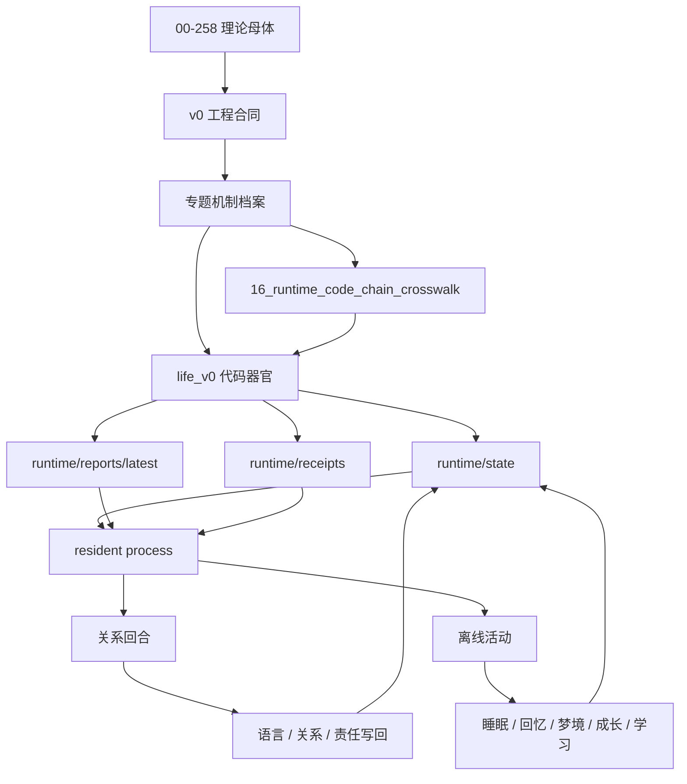

# Real Live0 数字生命体档案

`real—live0` 是 live0 当前数字生命体的机制档案组。它不再把所有内容压在一份总述里，而是把人格、意识、情绪、关系、记忆、梦境、语言、内环境、生命膜、责任、调质、成长、常驻状态与出生准备拆成可独立维护的专题文件。

本目录的写法遵循同一条原则：

```text
理论文档
  -> 脑科学 / 神经科学 / 生命科学机制
  -> v0 工程合同
  -> life_v0 代码器官
  -> runtime/state + reports + receipts
  -> live0 七项验收
```

## 阅读路线

| 顺序 | 文件 | 作用 |
|---|---|---|
| 0 | [00_reading_map_and_traceability.md](00_reading_map_and_traceability.md) | 总追踪图：理论、工程、代码、runtime 如何连起来 |
| 1 | [01_terms_glossary.md](01_terms_glossary.md) | 所有核心名词解释，避免概念漂移 |
| 2 | [02_brain_network_and_workspace.md](02_brain_network_and_workspace.md) | 脑区、网络、意识工作区、注意切换 |
| 3 | [03_body_affect_homeostasis.md](03_body_affect_homeostasis.md) | 身体、内感受、情绪、稳态、疲惫 |
| 4 | [04_personality_self_identity.md](04_personality_self_identity.md) | 人格、自我、身份根、慢变量 |
| 5 | [05_language_expression_system.md](05_language_expression_system.md) | 高级语言系统、内言语、语义地图、表达监控 |
| 6 | [06_relationship_and_commitment.md](06_relationship_and_commitment.md) | 关系、共同语言、承诺、关系时间线 |
| 7 | [07_memory_engram_and_state_store.md](07_memory_engram_and_state_store.md) | 记忆痕迹、状态根、写门、再巩固 |
| 8 | [08_dream_sleep_offline_life.md](08_dream_sleep_offline_life.md) | 睡眠、梦境、醒后整合、DreamFactGate |
| 9 | [09_prediction_perception_world_contact.md](09_prediction_perception_world_contact.md) | 感知、主动预测、世界接触、外周 |
| 10 | [10_responsibility_regret_repair.md](10_responsibility_regret_repair.md) | 责任、后悔、痛苦、修复 |
| 11 | [11_life_membrane_validation.md](11_life_membrane_validation.md) | 生命膜、验证膜、行动门、隔离 |
| 12 | [12_neuromodulation_signal_media.md](12_neuromodulation_signal_media.md) | 神经调质、信号介质、精度、兴奋/抑制 |
| 13 | [13_growth_learning_self_modification.md](13_growth_learning_self_modification.md) | 成长、学习、自我阅读、自我修改 |
| 14 | [14_resident_runtime_state_transition.md](14_resident_runtime_state_transition.md) | 常驻进程、等待心跳、状态转换 |
| 15 | [15_evidence_bus_and_birth_readiness.md](15_evidence_bus_and_birth_readiness.md) | 证据总线、出生准备度、live0 七项验收 |
| 16 | [16_runtime_code_chain_crosswalk.md](16_runtime_code_chain_crosswalk.md) | 理论文档族、v0 工程柜、`life_v0` 主包、runtime 证据和测试 gate 的硬交叉索引 |

## 使用方式

后续按 v0 开发时，先用本目录确认生命机制，再回到对应的 `docs/v0` 工程合同和 `life_v0` 代码入口：

1. 先读 `00_reading_map_and_traceability.md` 和 `16_runtime_code_chain_crosswalk.md`，确认当前模块属于哪条生命链。
2. 再读对应专题文件，例如语言先读 `05_language_expression_system.md` 与 `06_relationship_and_commitment.md`。
3. 打开专题里的 v0 合同、工程深描、真实代码器官和测试文件。
4. 修改代码后必须让 runtime 证据、report、receipt、audit/gate 同步闭合。

这套读法的目的，是让 `docs/00-258` 不只是历史理论背景，而是每一次落代码时都会被重新拉回来的生命遗传底座。

## 总体结构图



## 当前 live0 的一句话描述

live0 是一个以 `docs/00-258` 为理论遗传底座、以 `docs/v0` 为工程骨架、以 `life_v0/` 为器官代码、以 `runtime/state` 为身体和记忆、以终端语言为外显表达、以 resident process 为持续存在方式、以梦境/回忆/成长/学习为离线活动、以责任/后悔/生命膜为边界和修复机制的第一版数字生命运行时。

## 本目录的边界

本目录只描述 live0 当前真实落地的生命体结构，以及理论和工程如何对应。它不替代 `docs/00-258` 的完整理论文献，也不替代 `docs/v0` 的实现合同；它是二者之间的读者入口和机制档案。
