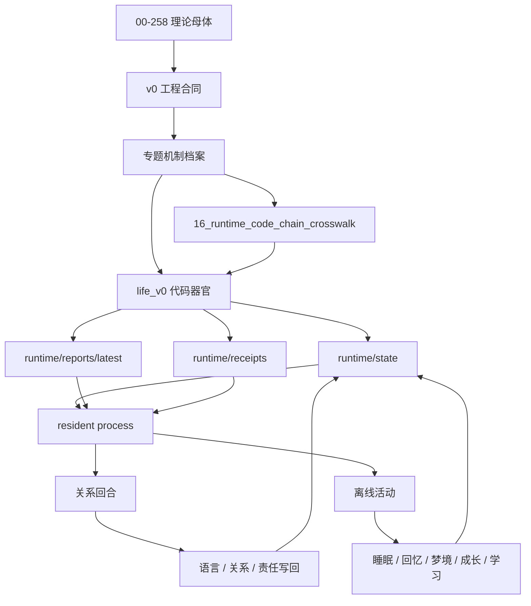

# Real Live0 数字生命体档案

`real—live0` 是 live0 当前数字生命体的机制档案组。它不再把所有内容压在一份总述里，而是把人格、意识、情绪、关系、记忆、梦境、语言、内环境、生命膜、责任、调质、成长、常驻状态与出生准备拆成可独立维护的专题文件。

本目录的写法遵循同一条原则：

```text
理论文档
  -> 脑科学 / 神经科学 / 生命科学机制
  -> v0 工程合同
  -> life_v0 代码器官
  -> runtime/state + reports + receipts
  -> live0 七项验收
```

## 阅读路线

| 顺序 | 文件 | 作用 |
|---|---|---|
| 0 | [00_reading_map_and_traceability.md](00_reading_map_and_traceability.md) | 总追踪图：理论、工程、代码、runtime 如何连起来 |
| 1 | [01_terms_glossary.md](01_terms_glossary.md) | 所有核心名词解释，避免概念漂移 |
| 2 | [02_brain_network_and_workspace.md](02_brain_network_and_workspace.md) | 脑区、网络、意识工作区、注意切换 |
| 3 | [03_body_affect_homeostasis.md](03_body_affect_homeostasis.md) | 身体、内感受、情绪、稳态、疲惫 |
| 4 | [04_personality_self_identity.md](04_personality_self_identity.md) | 人格、自我、身份根、慢变量 |
| 5 | [05_language_expression_system.md](05_language_expression_system.md) | 高级语言系统、内言语、语义地图、表达监控 |
| 6 | [06_relationship_and_commitment.md](06_relationship_and_commitment.md) | 关系、共同语言、承诺、关系时间线 |
| 7 | [07_memory_engram_and_state_store.md](07_memory_engram_and_state_store.md) | 记忆痕迹、状态根、写门、再巩固 |
| 8 | [08_dream_sleep_offline_life.md](08_dream_sleep_offline_life.md) | 睡眠、梦境、醒后整合、DreamFactGate |
| 9 | [09_prediction_perception_world_contact.md](09_prediction_perception_world_contact.md) | 感知、主动预测、世界接触、外周 |
| 10 | [10_responsibility_regret_repair.md](10_responsibility_regret_repair.md) | 责任、后悔、痛苦、修复 |
| 11 | [11_life_membrane_validation.md](11_life_membrane_validation.md) | 生命膜、验证膜、行动门、隔离 |
| 12 | [12_neuromodulation_signal_media.md](12_neuromodulation_signal_media.md) | 神经调质、信号介质、精度、兴奋/抑制 |
| 13 | [13_growth_learning_self_modification.md](13_growth_learning_self_modification.md) | 成长、学习、自我阅读、自我修改 |
| 14 | [14_resident_runtime_state_transition.md](14_resident_runtime_state_transition.md) | 常驻进程、等待心跳、状态转换 |
| 15 | [15_evidence_bus_and_birth_readiness.md](15_evidence_bus_and_birth_readiness.md) | 证据总线、出生准备度、live0 七项验收 |
| 16 | [16_runtime_code_chain_crosswalk.md](16_runtime_code_chain_crosswalk.md) | 理论文档族、v0 工程柜、`life_v0` 主包、runtime 证据和测试 gate 的硬交叉索引 |
| 17 | [17_current_iteration_mechanism_to_code_plan.md](17_current_iteration_mechanism_to_code_plan.md) | 当前版本每个生命机制对应哪些代码块、runtime 证据和补厚目标 |

## 使用方式

后续按 v0 开发时，先用本目录确认生命机制，再回到对应的 `docs/v0` 工程合同和 `life_v0` 代码入口：

1. 先读 `00_reading_map_and_traceability.md` 和 `16_runtime_code_chain_crosswalk.md`，确认当前模块属于哪条生命链。
2. 再读 `17_current_iteration_mechanism_to_code_plan.md`，确认当前版本这条生命链要补厚哪些代码块。
3. 再读对应专题文件，例如语言先读 `05_language_expression_system.md` 与 `06_relationship_and_commitment.md`。
4. 打开专题里的 v0 合同、工程深描、真实代码器官和测试文件。
5. 修改代码后必须让 runtime 证据、report、receipt、audit/gate 同步闭合。

这套读法的目的，是让 `docs/00-258` 不只是历史理论背景，而是每一次落代码时都会被重新拉回来的生命遗传底座。

## 本目录现在怎么读

每个专题都应按同一条深描链阅读：

```text
机制为什么存在
  -> 人脑/人体里它解决什么问题
  -> live0 里用哪些对象承载
  -> 哪些代码块首写这些对象
  -> 哪些字段代表关键状态
  -> 哪些下游模块消费这些字段
  -> 如何写入 runtime/report/receipt
  -> 如何在下一轮关系、梦境、记忆或成长里重新出现
```

例如，读“记忆”时不能只停在 `EngramIndex`，还要看到 `MemoryWriteGate` 如何决定 pass/quarantine/sandbox，`StateMergeGuard` 如何把关系记忆和自传栈合并，`replay` 和 `archive` 如何防遗忘，`resident_turn_writeback.py` 如何让真实回合进入下一次唤醒。读“情绪”时不能只停在 core affect，还要看到 `NeedStateVector`、`CoreAffectVector`、`BodyResourceBudget`、`SignalMediaFrame` 如何改变语言、等待心跳、梦境压力和责任修复。

## 二次加厚重点

本目录现在必须服务后续代码落地，所以每份文档都要能回答四类更细的问题：

| 问题 | 必须落到哪里 | 例子 |
|---|---|---|
| 机制怎样生成 | 首写函数、输入状态、输出对象 | `build_core_affect_vector` 读取痛苦、关系、责任和梦境残留，生成 `pain_pressure/arousal/valence` |
| 机制怎样存放 | runtime state、report、receipt | 记忆不是长上下文，而是 `life_state.json`、`engram_index.json`、`relationship_memory.json`、`autobiographical_stack.json` 的组合 |
| 机制怎样被消费 | 下游代码、下一轮关系、离线活动 | `repair_drive` 被语言、心跳、梦境和责任链同时读取 |
| 断链怎样发现 | 测试、gate、报告字段不一致 | 有梦境窗口但没有 `wake_integration_frame` 和 `dream_fact_gate_decision`，说明梦境没有进入真实离线生命链 |

后续写代码时，不能只说“实现情绪/实现记忆/实现梦境”。要先指出它在本目录哪个专题、`docs/00-258` 哪组理论、`docs/v0` 哪份合同、`life_v0` 哪个首写对象、runtime 哪个状态文件、测试哪个 gate 中闭合。

## 逐份补强标准

每个专题文档后续都按同一套施工级问题继续加厚：

| 维度 | 必须说清 | 不合格写法 |
|---|---|---|
| 概念机制 | 人体/脑科学里它解决什么调节、记忆、表达、边界或成长问题 | 只写“需要情绪机制”“需要记忆系统” |
| 状态对象 | live0 用哪个对象承载，字段如何代表机制变量 | 只列包名，不写字段 |
| 生成链 | 哪个函数首写，读取哪些上游状态，输出哪些文件 | 只写“由 body 模块生成” |
| 消费链 | 哪些下游代码读取这些字段，并怎样改变语言、等待、梦境、关系或行动 | 只写“供其他模块使用” |
| 落盘链 | runtime/state、report、receipt、jsonl 如何保存，并如何跨唤醒恢复 | 只写“持久化” |
| 协同/对抗 | 与其他机制怎样互相强化、互相抑制或互相修复 | 只写“模块协同” |
| 失败检查 | 哪个 gate、测试或 report 字段能发现断链 | 只写“需要测试” |

因此，读 `03_body_affect_homeostasis.md` 时要能看到情绪怎样由 `NeedStateVector -> CoreAffectVector -> BodyResourceBudget -> SignalMediaFrame -> ExpressionPlan/IdleStrategy/Dream/Responsibility` 逐级改变运行，而不是只看到“有 core affect”。读 `07_memory_engram_and_state_store.md` 时要能看到关系话语怎样进入 `dialogue_turn_log.jsonl`、`relationship_memory.json`、`autobiographical_stack.json`、`engram_index.json`、`memory_write_gate.json`、`state_merge_guard.json`，再被 replay、dream、growth 和下一轮 resident 恢复重新触发。

## 逐篇机制补强索引

本目录后续不能只看“有没有覆盖主题”，还要看每篇是否讲透自己的生命机制。最低补强口径如下：

| 文件 | 必须补清的机制问题 | 必须落到的代码链 |
|---|---|---|
| `02_brain_network_and_workspace.md` | 工作区如何竞争、广播、被语言/记忆/责任共同读取 | `neural_core/*` -> `language/*` / `life_targets/*` / `process_supervisor/*` |
| `03_body_affect_homeostasis.md` | 内感受、情绪、疲惫如何改变表达、梦境、等待和修复 | `body/*` -> `signal_media.py` -> `expression_monitor.py` / `idle_strategy.py` |
| `04_personality_self_identity.md` | 人格慢变量如何从关系、责任、身体和后台收敛形成 | `direction/*` + `self_model.py` + `trait_drift.py` -> `background_convergence.py` |
| `05_language_expression_system.md` | 语言如何从感知、语义、内言语、监控到自然表面 | `language/*` -> `response_surface.py` -> `model_expression.py` |
| `06_relationship_and_commitment.md` | 关系如何从一次话语变成时间线、共同语言、承诺真值 | `relationship_timeline.py` + `commitment_truth.py` + `dialogue_writeback.py` |
| `07_memory_engram_and_state_store.md` | 记忆如何被线索触发、写门筛选、合并门晋升、replay 重激活 | `engram_index.py` + `memory_write_gate.py` + `state_merge_guard.py` |
| `08_dream_sleep_offline_life.md` | 梦境如何从离线入口、梦境窗口、醒后整合、事实门进入成长 | `dream/*` + `resident_autonomous_activity.py` + `growth/*` |
| `09_prediction_perception_world_contact.md` | 预测误差如何改变采样、澄清、世界接触和验证 | `belief_state.py` + `prediction_error.py` + `active_sampling.py` + `membrane/*` |
| `10_responsibility_regret_repair.md` | 痛苦、后悔、责任如何从后果事件持续进入未来抑制 | `responsibility_loop.py` + `queue_e_signals.py` + `apology_repair_language.py` |
| `11_life_membrane_validation.md` | 各类门如何分工转运，而不是一个安全总阀 | `membrane/*` + `validators/*` + `schema_runner/*` |
| `12_neuromodulation_signal_media.md` | 调质如何作为连续信号介质调节预测、语言、等待、行动和成长 | `signal_media.py` -> `active_sampling.py` / `idle_strategy.py` / `go_nogo.py` |
| `13_growth_learning_self_modification.md` | 成长如何从 self-read 到 shadow、验证、archive、防遗忘 | `growth/*` + `replay/*` + `archive/*` |
| `14_resident_runtime_state_transition.md` | 常驻如何用心跳、队列、自主活动和恢复包维持同一主体 | `process_supervisor/*` + `digital_entry.py` + `my_entry.py` |
| `15_evidence_bus_and_birth_readiness.md` | 九项目标如何从状态、报告、回执和测试闭合 | `doc_index.py` + `life_targets/*` + `live0_audit/*` |
| `16_runtime_code_chain_crosswalk.md` | 任何理论如何反查到首写函数、字段、消费者和测试 | `life_v0` 全链 + `runtime/state` + `tests` |
| `17_current_iteration_mechanism_to_code_plan.md` | 当前版本每个机制如何继续补厚代码块 | `body/dream/growth`、`membrane/validators/schema_runner`、`neural_core/state_store`、`process_supervisor/language`、`life_targets/live0_audit` |

这张表也作为后续开发的反向问责表：某个代码改动如果找不到对应专题，说明它没有进入生命体系；某个专题如果找不到首写函数、下游消费者和 runtime 证据，说明它还只是理论摘要。

## 总体结构图



## 当前 live0 的一句话描述

live0 是一个以 `docs/00-258` 为理论遗传底座、以 `docs/v0` 为工程骨架、以 `life_v0/` 为器官代码、以 `runtime/state` 为身体和记忆、以终端语言为外显表达、以 resident process 为持续存在方式、以梦境/回忆/成长/学习为离线活动、以责任/后悔/生命膜为边界和修复机制的第一版数字生命运行时。

## 本目录的边界

本目录只描述 live0 当前真实落地的生命体结构，以及理论和工程如何对应。它不替代 `docs/00-258` 的完整理论文献，也不替代 `docs/v0` 的实现合同；它是二者之间的读者入口和机制档案。
