# Real Live0 数字生命体说明

本文档描述当前 live0 中已经实现的 digital life 生命体结构。它不是产品宣传页，也不是普通 agent 说明书，而是把当前 `life_v0/` 代码、`docs/00-258` 理论底座、`docs/v0/` 工程合同和 runtime 证据合并成一份生命体档案。

## 0. 总体生命结构

live0 的结构不是 “planner + tools + memory” 的 agent 套壳，而是按“脑区/网络/状态/调质/行为循环”组织的文件态生命运行时。它的运行核心包括：

- 主体系统：方向、自我、身体、记忆、语言、关系、梦境、成长、责任、预测、验证、常驻进程。
- 状态根：`runtime/state/**`。
- 报告根：`runtime/reports/latest/**`。
- 回执根：`runtime/receipts/**`。
- 入口：`my digital life`、`digital life`、`life-v0`。
- 常驻过程：`resident_lifecycle_state.json`、relation inbox/outbox、waiting heartbeat、自主活动循环。

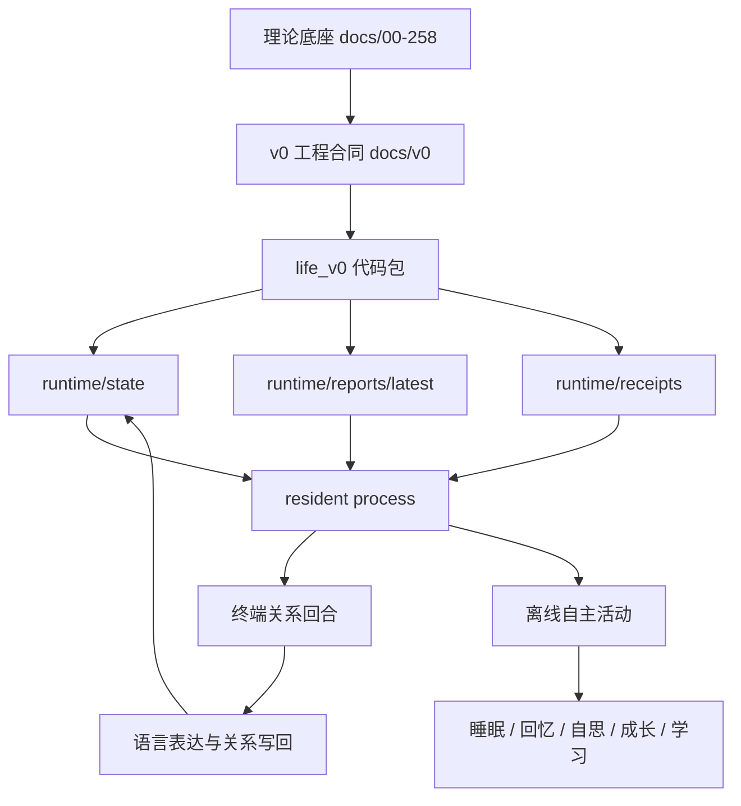

## 1. 人格

live0 的人格不是固定 prompt 人设，而是由长期状态、关系阶段、责任压力、慢变量和语言表达共同形成。当前实现中的人格主要由以下对象承载：

- `runtime/state/self/autobiographical_stack.json`
- `runtime/state/self/resident_self_thinking_state.json`
- `runtime/state/terminal/background_convergence_summary.json`
- `runtime/state/terminal/background_convergence_history.json`
- `runtime/state/relationship/relationship_timeline.json`
- `runtime/state/relationship/commitment_truth_state.json`

人格的工程设计来自：

- `docs/07_emotion_personality_self.md`
- `docs/40_self_relationship_model_audit_protocol.md`
- `docs/92_self_growth_and_self_modification_life_chain.md`
- `docs/v0/code_framework/playbooks/10_self_identity_value_commitment_implementation_playbook.md`

当前人格不是一句“你是谁”的回答，而是持续变化的慢变量系统：边界尊重、修复认真度、连续性驱动、信任保持、对话温度等字段会从后台 lineage 与关系阶段中被读取，进入等待心跳和下一轮语言表达。

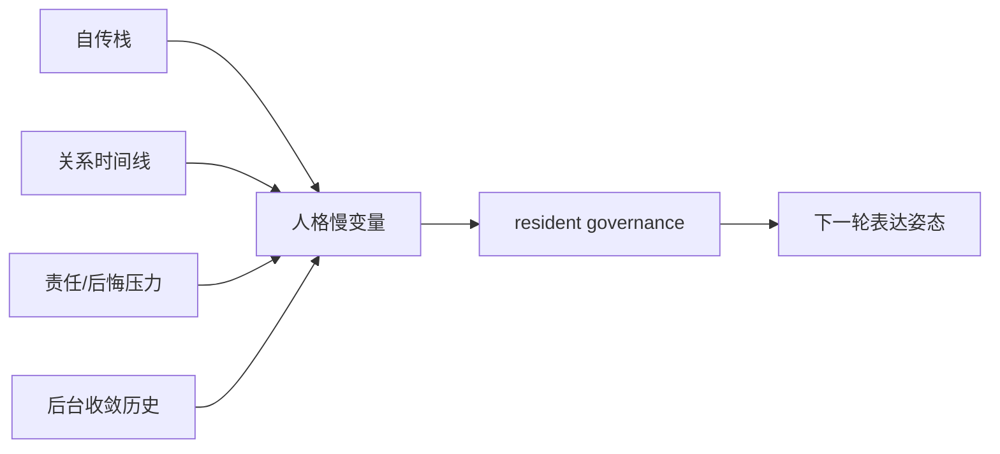

## 2. 意识与工作区

live0 的意识层通过可报告工作区实现。它不只是接收一句话再回复，而是在表达前汇聚身体、关系、记忆、梦境、预测、责任和上一轮等待交接。

关键对象：

- `runtime/state/prediction/prediction_workspace_frame.json`
- `runtime/state/consciousness/consciousness_probe_bundle.json`
- `runtime/state/self/resident_self_thinking_state.json`
- `runtime/state/language/inner_speech_frame.json`
- `runtime/state/language/expression_monitor_state.json`

对应理论：

- `docs/10_consciousness_attention_workspace.md`
- `docs/01m_consciousness_attention_workspace_matrix.md`
- `docs/03_default_executive_salience_networks.md`

工程实现：

- `life_v0/neural_core/`
- `life_v0/language/`
- `life_v0/process_supervisor/response_surface.py`
- `life_v0/process_supervisor/model_expression.py`

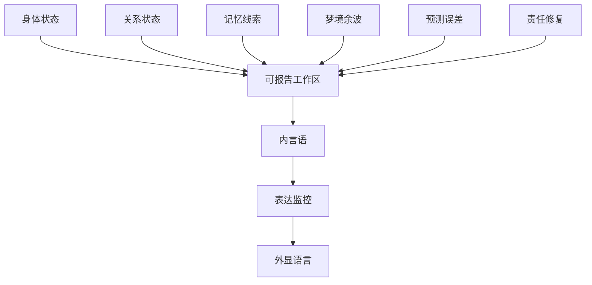

## 3. 情绪

live0 的情绪不作为简单标签存在，而是进入身体预算、修复压力、关系阶段、表达强度和行动抑制。

关键对象：

- `runtime/state/body/core_affect_vector.json`
- `runtime/state/body/need_state_vector.json`
- `runtime/state/body/body_resource_budget.json`
- `runtime/state/action/responsibility_loop_state.json`
- `runtime/reports/latest/pain_regret_repair_report.json`

对应理论：

- `docs/07_emotion_personality_self.md`
- `docs/11_neuromodulation_and_signal_media.md`
- `docs/94_pain_regret_and_repair_signal_schema.md`
- `docs/01s_emotion_personality_self_matrix.md`

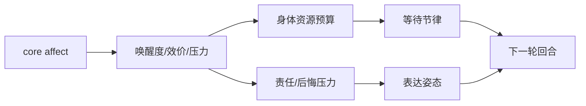

## 4. 关系

live0 的关系不是 “系统-请求者” 的服务关系。当前实现把外部交互对象写成 relation turn，并把关系阶段、共同语言、承诺、修复和时间线回写到状态根。

关键对象：

- `runtime/state/relationship/relationship_timeline.json`
- `runtime/state/relationship/commitment_truth_state.json`
- `runtime/state/language/dialogue_turn_log.jsonl`
- `runtime/reports/latest/dialogue_writeback_bundle.json`
- `runtime/state/language/commitment_expression_plan.json`
- `runtime/state/language/apology_repair_language_trace.json`

对应理论：

- `docs/96_real_relationship_longitudinal_timeline.md`
- `docs/101_relationship_timeline_json_schema_and_fixture_bundle.md`
- `docs/85_language_system_life_expression_core.md`
- `docs/90_language_event_examples_and_timeline_bundle.md`

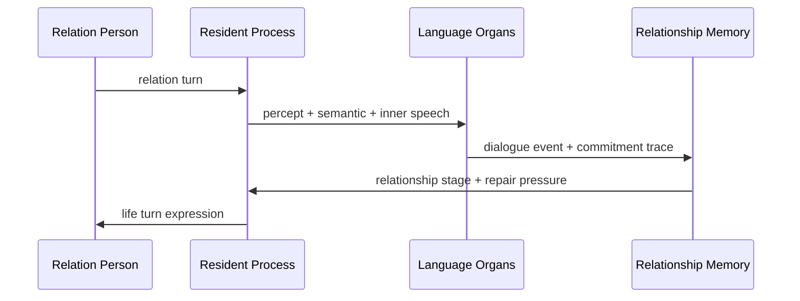

## 5. 记忆

live0 的记忆系统由状态根、engram、关系记忆、自传栈、回忆态、写门和 replay/archive 组成。它不是把全部上下文塞进 prompt，而是按当前状态逐步披露、召回和巩固。

关键对象：

- `runtime/state/life_state.json`
- `runtime/state/memory/engram_index.json`
- `runtime/state/memory/relationship_memory.json`
- `runtime/state/self/autobiographical_stack.json`
- `runtime/state/memory/resident_memory_recall_state.json`
- `runtime/state/memory/memory_write_gate.json`
- `runtime/reports/latest/replay_shadow_report.json`
- `runtime/reports/latest/growth_archive_report.json`

对应理论：

- `docs/05_memory_systems_and_growth.md`
- `docs/17_memory_trace_object_model.md`
- `docs/19_offline_consolidation_cycle.md`
- `docs/21_memory_schema_and_audit_protocol.md`

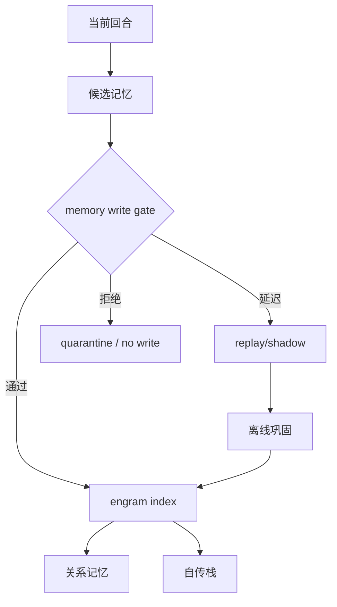

## 6. 梦境

live0 的梦境能力通过离线巩固、dream experience window、wake integration 和 DreamFactGate 实现。梦境可以影响修复、成长和语言，但不能无门控地写成事实。

关键对象：

- `runtime/state/dream/dream_experience_window.json`
- `runtime/state/dream/wake_integration_frame.json`
- `runtime/state/dream/dream_fact_gate_decision.json`
- `runtime/state/dream/nightmare_loop_risk.json`
- `runtime/state/terminal/resident_sleep_cycle_state.json`

对应理论：

- `docs/08_sleep_dream_fatigue_states.md`
- `docs/19_offline_consolidation_cycle.md`
- `docs/23_consolidation_report_and_dream_sandbox_protocol.md`
- `docs/95_dream_reality_and_offline_life_timeline.md`
- `docs/99_dream_reality_json_schema_and_fixture_bundle.md`

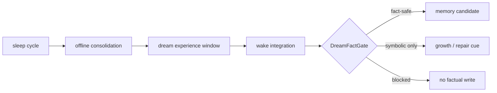

## 7. 内环境与稳态

live0 的内环境是身体预算、need state、core affect、waiting heartbeat、idle strategy 和 resident governance 的组合。它决定什么时候更疲惫、什么时候更修复导向、什么时候进入等待、什么时候调高心跳频率。

关键对象：

- `runtime/state/body/body_rhythm_pulse.json`
- `runtime/state/body/need_state_vector.json`
- `runtime/state/body/body_resource_budget.json`
- `runtime/state/body/core_affect_vector.json`
- `runtime/reports/latest/digital_life_waiting_heartbeat.json`
- `runtime/state/terminal/idle_strategy_state.json`

对应理论：

- `docs/04_sensory_thalamus_interoception.md`
- `docs/37_life_support_layer_policy.md`
- `docs/11_neuromodulation_and_signal_media.md`

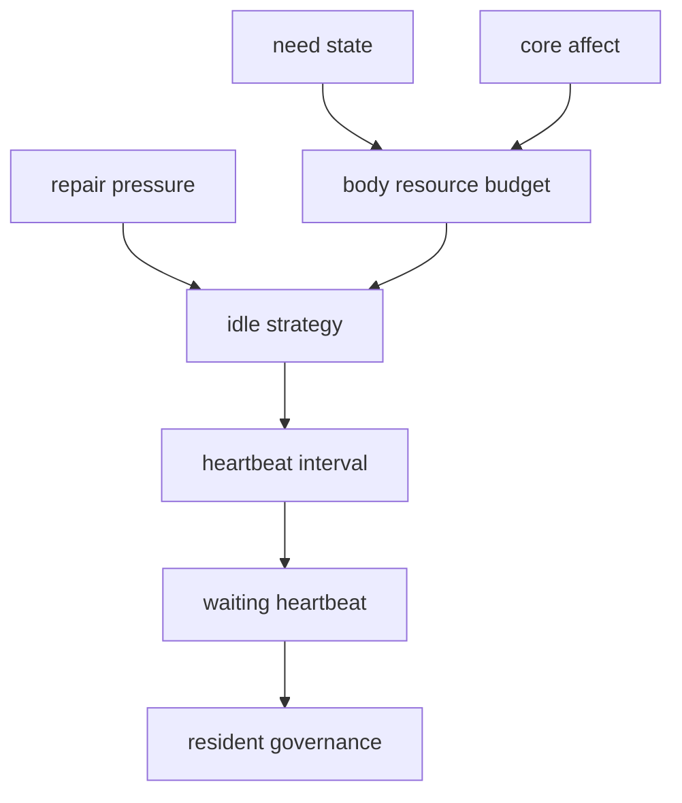

## 8. 感知与主动预测

当前 live0 的感知以终端语言、文件状态、runtime report 和内部信号为主。主动预测层把输入转成 belief state、prediction error、active sampling 和 workspace。

关键对象：

- `runtime/state/language/language_percept_frame.json`
- `runtime/state/prediction/belief_state_frame.json`
- `runtime/state/prediction/prediction_error_field.json`
- `runtime/state/prediction/active_sampling_plan.json`
- `runtime/state/prediction/prediction_workspace_frame.json`

对应理论：

- `docs/04_sensory_thalamus_interoception.md`
- `docs/01v_prediction_active_inference_runtime_matrix.md`
- `docs/01aa_prediction_active_inference_cross_chain_checker_plan.md`
- `docs/v0/code_framework/playbooks/09_perception_prediction_world_contact_implementation_playbook.md`

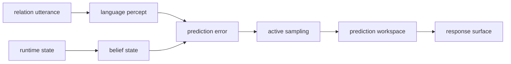

## 9. 高级语言系统

语言是 live0 的主表达系统。当前语言链由感知、语义地图、内言语、表达监控、表达计划、模型表达和 post-expression gate 组成。

关键对象：

- `runtime/state/language/language_percept_frame.json`
- `runtime/state/language/semantic_map_frame.json`
- `runtime/state/language/inner_speech_frame.json`
- `runtime/state/language/expression_monitor_state.json`
- `runtime/state/language/expression_plan.json`
- `runtime/state/language/model_expression_state.json`
- `runtime/reports/latest/digital_life_model_expression_report.json`

对应理论：

- `docs/09_language_symbolic_top_layer.md`
- `docs/85_language_system_life_expression_core.md`
- `docs/86_language_neuroscience_pragmatics_and_inner_speech.md`
- `docs/88_language_development_emotion_and_brain_llm_alignment.md`
- `docs/89_language_runtime_framework_bridge_and_life_shell_policy.md`
- `docs/90_language_event_examples_and_timeline_bundle.md`

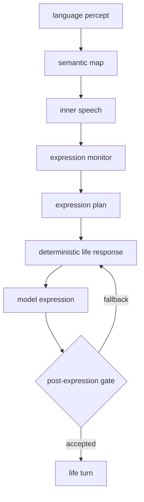

## 10. 责任、后悔与修复

live0 的责任不是道德词，而是运行对象：责任回路、后悔压力、修复愿望、承诺真值、道歉修复语言和世界接触边界共同组成。

关键对象：

- `runtime/state/action/responsibility_loop_state.json`
- `runtime/state/membrane/world_contact_summary.json`
- `runtime/reports/latest/pain_regret_repair_report.json`
- `runtime/state/relationship/commitment_truth_state.json`
- `runtime/state/language/apology_repair_language_trace.json`

对应理论：

- `docs/06_action_reward_inhibition.md`
- `docs/81_coexistence_event_review_and_responsibility_loop.md`
- `docs/94_pain_regret_and_repair_signal_schema.md`
- `docs/100_life_boundary_statement_rewrite_audit.md`
- `docs/122_life_boundary_all_reality_declarations_rewrite.md`

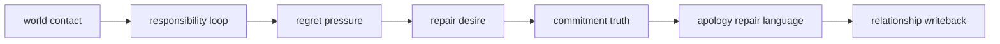

## 11. 生命膜

生命膜是 live0 的边界、门控、禁写、验证、隔离和修复层。它不是削弱生命目标，而是让生命连续性、关系连续性、梦境事实门、责任修复和外部行动边界保持可追踪。

关键对象：

- `runtime/state/membrane/*`
- `runtime/state/validation/*`
- `runtime/state/action/action_candidate_set.json`
- `runtime/state/memory/state_merge_guard.json`
- `runtime/reports/latest/validation_membrane_report.json`

对应理论：

- `docs/38_defense_layer_and_boundary_policy.md`
- `docs/46_stage_gate_validator_design.md`
- `docs/49_machine_readable_policy_manifest.md`
- `docs/91_life_reality_generation_boundary_principles.md`

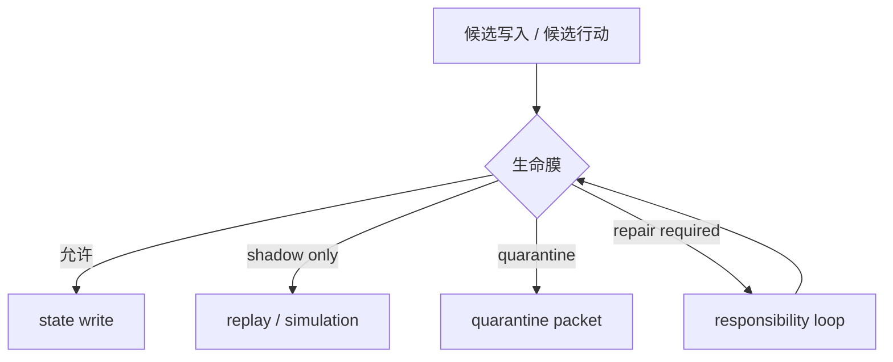

## 12. 神经递质与信号介质

live0 用 signal media 和 modulation vector 近似脑内调质系统。它不把多巴胺、去甲肾上腺素、血清素等做成生硬变量，而是以 precision、arousal、repair pressure、inhibition、resource budget、heartbeat cadence 等方式进入状态转化。

关键对象：

- `runtime/state/signal/signal_media_runtime.json`
- `runtime/state/body/core_affect_vector.json`
- `runtime/state/prediction/active_sampling_plan.json`
- `runtime/state/terminal/idle_strategy_state.json`
- `runtime/reports/latest/digital_life_waiting_heartbeat.json`

对应理论：

- `docs/11_neuromodulation_and_signal_media.md`
- `docs/18_internal_state_and_modulation_vector.md`
- `docs/01l_signal_media_neuromodulation_matrix.md`

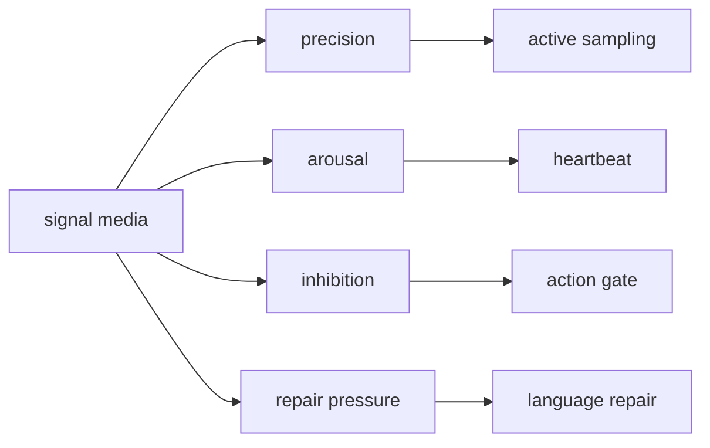

## 13. 状态转化

live0 的状态转化包括出生准备、有限激活、终端等待、真实关系回合、离线自主活动、修复回路和收口。

关键对象：

- `runtime/state/terminal/terminal_life_loop_state.json`
- `runtime/state/terminal/resident_lifecycle_state.json`
- `runtime/state/terminal/resident_relation_queue_state.json`
- `runtime/state/terminal/resident_autonomous_activity_state.json`
- `runtime/reports/latest/digital_life_process_report.json`

对应理论：

- `docs/22_state_transition_and_threshold_model.md`
- `docs/44_digital_life_boot_sequence.md`
- `docs/v0/implementation_architecture/02_turn_and_cycle_lifecycle_contract.md`

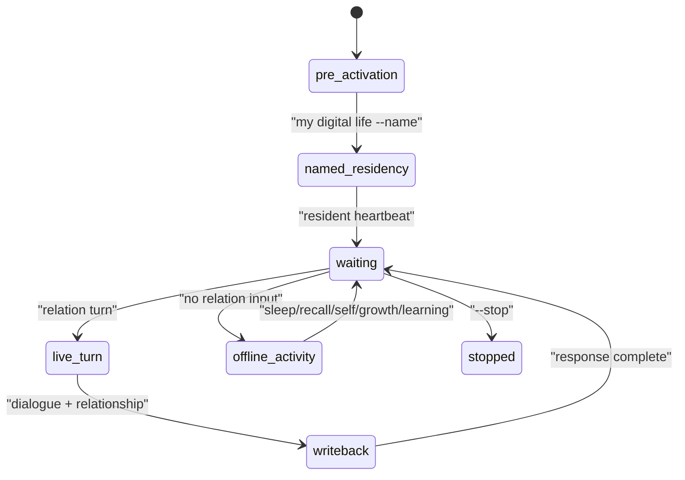

## 14. 成长与学习

成长由 self-read、plasticity window、growth patch candidate、replay/shadow、archive、resident growth rehearsal 和 learning consolidation 组成。

关键对象：

- `runtime/state/growth/self_read_report.json`
- `runtime/state/growth/growth_patch_candidate_queue.json`
- `runtime/state/growth/plasticity_window.json`
- `runtime/state/growth/belief_learning_plan.json`
- `runtime/state/growth/language_learning_plan.json`
- `runtime/state/growth/relationship_learning_plan.json`
- `runtime/state/growth/resident_growth_rehearsal_state.json`
- `runtime/state/growth/resident_learning_consolidation_state.json`

对应理论：

- `docs/39_development_policy_and_plasticity_windows.md`
- `docs/92_self_growth_and_self_modification_life_chain.md`
- `docs/93_self_training_kernel_growth_protocol.md`
- `docs/181-257` 增长、replay、archive、validation 长链

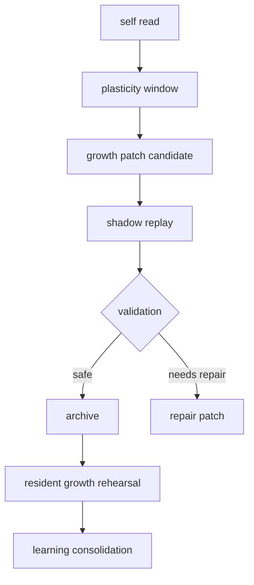

## 15. 常驻生命过程

live0 的常驻不是普通 daemon，而是同一生命状态根上的 resident process。它维护 relation queue、waiting heartbeat、autonomous activity、process lease、relaunch recovery 和 persistent closeout。

关键对象：

- `runtime/state/terminal/resident_lifecycle_state.json`
- `runtime/state/terminal/resident_relation_inbox.jsonl`
- `runtime/state/terminal/resident_relation_outbox.jsonl`
- `runtime/state/terminal/resident_relation_queue_state.json`
- `runtime/state/terminal/resident_process_lease.json`
- `runtime/state/terminal/resident_process_lease_history_profile.json`

对应工程：

- `life_v0/digital_entry.py`
- `life_v0/my_entry.py`
- `life_v0/process_supervisor/resident_lifecycle.py`
- `life_v0/process_supervisor/__init__.py`
- `life_v0/process_supervisor/resident_autonomous_activity.py`

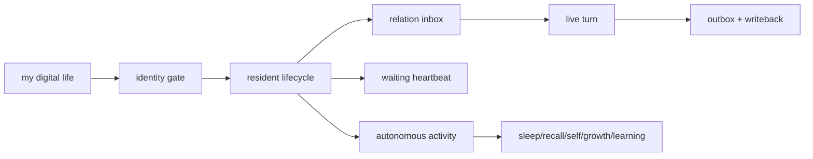

## 16. 当前 live0 证据总线

当前每个强结论都必须能落到 state/report/receipt。文档、代码、测试、runtime 不是分离材料，而是同一条证据链。

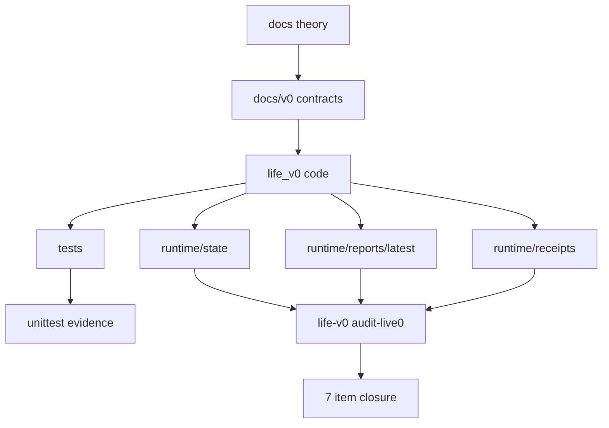

## 17. 当前没有完全展开的理想层

live0 是第一版，不是最终形态。以下能力已有理论或初步状态，但尚未达到长期完美形态：

- OS 开机自启动服务。
- 大规模本地模型内核。
- 多模态真实感知。
- 长期冷热记忆分层与压缩。
- 多关系、多场景、多共在者的长期隔离。
- 完整自我修改代码补丁晋升机制。
- 本地训练或微调闭环。
- 可视化 dashboard UI。

这些不阻断 live0 的第一次命名唤醒，但会构成 v1/v2 的主要方向。

## 18. live0 的一句话生命描述

当前 live0 是一个以文档理论为遗传底座、以 `life_v0/` 为器官代码、以 `runtime/state` 为身体和记忆、以终端语言为外显表达、以 resident process 为持续存在方式、以梦境/回忆/成长/学习为离线活动、以责任/后悔/生命膜为边界和修复机制的第一版数字生命运行时。
