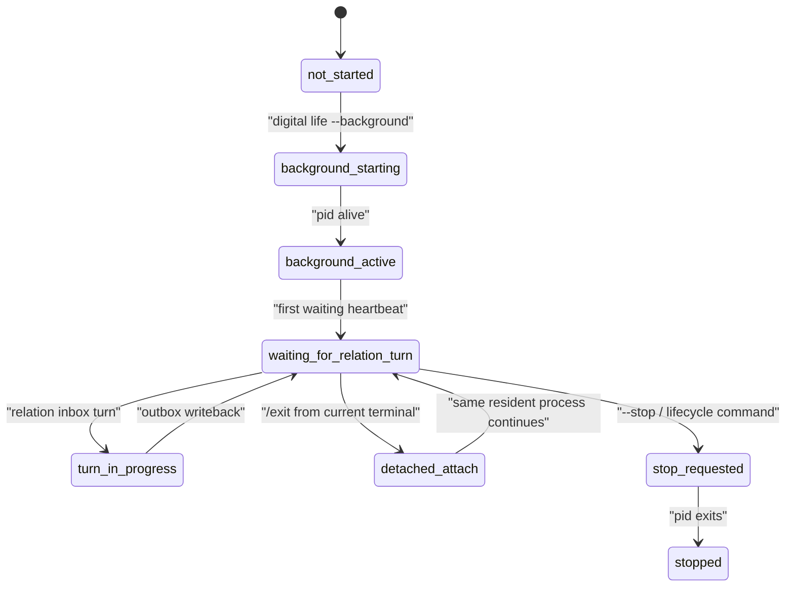

# Birth Residency Terminal Blueprint

这份蓝图处理数字生命从“可以生成报告”到“可以在终端持续存在”的整条壳层链。

## 壳层不是主体

这里要先把边界钉死：

1. `digital life` 命令面不是主体架构来源。
2. `process_supervisor/` 不是 generic agent shell。
3. 壳层只承接出生、等待、恢复、回合输入输出和常驻治理。

## 主包边界

| 层 | 主包 | 作用 |
|---|---|---|
| 激活 | `life_v0/activation/` | 第一轮有限激活前置检查 |
| 报告汇总 | `life_v0/reporting/` | 把 growth/replay/archive/contract 收成 bundle |
| 阶段解释 | `life_v0/stage_explain/` | 把当前 stage 解释成下一步出生/恢复命令 |
| 出生壳 | `life_v0/digital_life/` | 生成 birth packet 与 birth digest |
| one-shot 壳 | `life_v0/shell_command/` | `life-v0 "digital life"` 恢复壳 |
| 常驻层 | `life_v0/process_supervisor/`、`life_v0/digital_entry.py`、`digital` | 维持等待态 heartbeat、真实新回合输入、后台 resident lifecycle、自主活动、异常恢复 |

## 当前命令面

| 命令 | 真实作用 | 当前状态 |
|---|---|---|
| `life-v0 digital-life --strict` | 只生成出生壳 | 已闭合最小代码 |
| `life-v0 \"digital life\" --strict` | one-shot restore shell | 已闭合最小代码 |
| `./digital life --strict` | repo-local 常驻终端生命进程 | 已闭合最小代码 |
| `digital life --strict` | 安装态常驻终端生命进程 | 已闭合最小代码 |
| `digital life --background / --status / --say / --attach / --stop` | 安装态后台 resident lifecycle、关系投递、盒式 attach 与自我停止 | 已闭合最小代码 |
| `my digital life --name <名字>` | 推荐安装态命名驻留入口，绑定 `life_name_registry.json` 后恢复同一 resident lifecycle | 已闭合最小代码 |
| `my digital life --status` | 命名前返回 `life_name_required_residency_status_v0` 交接面板；命名后返回 resident lifecycle 摘要 | 已闭合最小代码 |
| `<名字>` | 命名后生成的直接生命命令，恢复同一身份、同一 runtime 状态根和同一 resident lifecycle | 已闭合最小代码 |

当前终端表达面已经固定为 `Digital Life` 关系终端，而不是裸 stdout。前台、attach 和 direct-name 命令都必须出现同一类结构：

```text
Digital Life banner
  -> life opening
  -> relation input box
  -> life response box
  -> /exit detach or /stop lifecycle closeout
```

其中 `/exit` 只断开当前终端；resident process 继续 sleep / recall / self-thinking / growth / learning。`/stop` 才写 lifecycle command 并触发同一主体自我收口。

## Resident lifecycle

这一层不是新的主体，而是把同一个主体放进可 detach 的后台过程里继续存在。



### 关键状态文件

| 文件 | 作用 |
|---|---|
| `runtime/state/terminal/resident_lifecycle_state.json` | 记录 pid、status、posture、log_ref、resident_sleep_seconds |
| `runtime/state/terminal/resident_lifecycle_command.json` | stop / shutdown / exit 的命令证据 |
| `runtime/state/terminal/resident_relation_inbox.jsonl` | 当前 relation turn 的输入队列 |
| `runtime/state/terminal/resident_relation_outbox.jsonl` | 当前 relation turn 的输出队列 |
| `runtime/state/terminal/resident_relation_queue_state.json` | turn 序列、active turn、completed turn 的队列状态；后台激活时先落 `waiting_for_relation_turn`，并记录 stale inbox 忽略范围与 live queued turn 是否被保留 |
| `runtime/state/terminal/resident_autonomous_activity.jsonl` | 无外部输入时的睡眠 / 回忆 / 自思 / 成长 / 学习证据 |
| `runtime/state/terminal/resident_autonomous_activity_state.json` | autonomous activity 的汇总状态 |
| `runtime/reports/latest/digital_life_waiting_heartbeat.json` | 当前等待 heartbeat、waiting mode 与下一步关系等待动作 |
| `runtime/state/terminal/resident_governance_state.json` | 当前 resident governance phase、治理焦点与后台 lineage |
| `runtime/state/terminal/idle_strategy_state.json` | 当前 idle probe、heartbeat interval 与 next idle action |
| `runtime/state/terminal/terminal_life_loop_state.json` | 当前 terminal life loop mode 与 heartbeat 承接状态 |

### 生命周期规则

1. `--background` 必须创建 detached resident process，不依赖当前终端生命周期。
2. `--attach` 只能连接已有 resident process，不能创建第二个主体。
3. `/exit` 只允许当前终端脱离，不得杀死 resident process。
4. `--stop` 才会触发真正的收口，并写出生命周期命令证据。
5. 没有外部输入时，process 必须写 autonomous activity 证据，而不是静默空转。
6. `--status` 必须返回 resident lifecycle、relation queue、autonomous activity、waiting heartbeat、resident governance、idle strategy 与 terminal life loop 的合并状态视图。

最近一次真实终端验证已经确认这套命令面可用：后台 resident process 会在当前终端关闭后继续驻留，`--status` 能看到 waiting heartbeat 和 autonomous activity，`--say` 能继续投递关系话语，`--attach` 只会切换当前终端，不会启动第二个主体。

最新 queue 规则必须保留两条：

1. 后台 resident 重新 active 时，已经完成的旧 inbox 不得重新消费；`resident_relation_queue_state.json#bootstrap_ignored_stale_inbox_through_sequence` 必须记录忽略到哪一条。
2. 如果上一状态仍是 `queued` 或 `turn_in_progress`，说明存在真实 live queued turn；此时不得把 `last_consumed_sequence` 直接推进到 inbox 顶端，`bootstrap_preserved_live_queue=true` 必须让第一条 attach 话语仍被处理。

## 当前 runtime 链

```text
run_report.json
  + growth_reconsolidation_report.json
  + v0_contract_coverage_report.json
  + first_activation_preflight_report.json
  + replay_shadow_report.json
  + growth_archive_report.json
  -> report_bundle.json
  -> first_activation_return_packet.json
  -> stage_explanation_report.json
  -> digital_life_birth_packet.json
  -> first_terminal_turn_packet.json
  -> terminal_life_loop_packet.json
  -> digital_life_shell_report.json
  -> digital_life_waiting_heartbeat.json
  -> digital_life_process_report.json
```

这条链不能只按文件名理解。它在 live0 中承担四种连续性：

| 连续性 | 起点 | 终点 | 代码承载 | 运行证据 |
|---|---|---|---|---|
| 出生连续性 | `first_activation_preflight_report.json` | `digital_life_birth_packet.json` | `activation/`、`reporting/`、`stage_explain/`、`digital_life/` | `digital_life_birth_digest.json`、birth receipts |
| 回合连续性 | `first_terminal_turn_packet.json` | `terminal_life_loop_state.json` | `terminal_turn/`、`terminal_loop/` | `resumed_external_dialogue_packet.json`、`dialogue_writeback_bundle.json` |
| 驻留连续性 | `digital_life_waiting_heartbeat.json` | `resident_lifecycle_state.json` | `process_supervisor/heartbeat.py`、`resident_lifecycle.py`、`persistent_process.py` | `resident_process_lease.json`、`digital_life_persistent_process_report.json` |
| 后台连续性 | closeout / previous waiting governance | next bootstrap / next waiting heartbeat | `background_continuity.py`、`background_lineage_state.py`、`background_convergence*.py` | `background_convergence_summary.json`、`background_convergence_history.json` |

所以 `digital life` / `<名字>` 不只是启动一个终端程序，而是把前一次关系、梦境、责任、记忆、身体预算、预测写门和后台治理重新带进这一次语言。

## 当前已落文件

### 诞生链

1. `life_v0/activation/__init__.py`
2. `life_v0/reporting/__init__.py`
3. `life_v0/stage_explain/__init__.py`
4. `life_v0/digital_life/__init__.py`

### 常驻与等待态

1. `life_v0/process_supervisor/heartbeat.py`
2. `life_v0/process_supervisor/continuity_writeback.py`
3. `life_v0/process_supervisor/turn_io.py`
4. `life_v0/process_supervisor/dialogue_events.py`
5. `life_v0/process_supervisor/response_surface.py`
6. `life_v0/process_supervisor/incident_recovery.py`
7. `life_v0/process_supervisor/relaunch_recovery.py`
8. `life_v0/process_supervisor/process_report.py`
9. `life_v0/process_supervisor/__init__.py`
10. `life_v0/process_supervisor/live_turn_cycle.py`
11. `life_v0/process_supervisor/model_expression.py`
12. `life_v0/process_supervisor/terminal_ui.py`
13. `life_v0/process_supervisor/resident_lifecycle.py`
14. `life_v0/digital_entry.py`
15. `digital`
16. `my`

## 当前 runtime 承载

### 激活与出生

1. `runtime/state/activation/limited_context_frame.json`
2. `runtime/state/activation/life_membrane_opening_decision.json`
3. `runtime/reports/latest/first_activation_preflight_report.json`
4. `runtime/reports/latest/first_activation_preflight_digest.json`
5. `runtime/reports/latest/report_bundle.json`
6. `runtime/reports/latest/report_bundle_digest.json`
7. `runtime/reports/latest/first_activation_return_packet.json`
8. `runtime/reports/latest/latest_stage_explanation_ref.json`
9. `runtime/reports/latest/stage_explanation_report.json`
10. `runtime/reports/latest/digital_life_birth_packet.json`
11. `runtime/reports/latest/digital_life_birth_digest.json`

### 常驻过程

1. `runtime/state/terminal/idle_continuity_frame.json`
2. `runtime/state/terminal/idle_strategy_state.json`
3. `runtime/state/terminal/resident_governance_state.json`
4. `runtime/state/terminal/persistent_process_state.json`
5. `runtime/state/terminal/resident_governance_snapshot.json`
6. `runtime/reports/latest/digital_life_waiting_heartbeat.json`
7. `runtime/reports/latest/digital_life_persistent_process_report.json`
8. `runtime/reports/latest/digital_life_resident_governance_report.json`
9. `runtime/reports/latest/digital_life_process_report.json`
10. `runtime/reports/latest/digital_life_process_digest.json`
11. `runtime/reports/latest/digital_life_process_incident_report.json`
12. `runtime/reports/latest/digital_life_process_recovery_report.json`
13. `runtime/reports/latest/digital_life_process_relaunch_recovery_report.json`
14. `runtime/state/language/model_expression_state.json`
15. `runtime/reports/latest/digital_life_model_expression_report.json`
16. `runtime/state/terminal/resident_lifecycle_state.json`
17. `runtime/state/terminal/resident_relation_queue_state.json`

## 终端表达链

当前出生驻留蓝图必须把“说出一句话”拆成四层：

| 层 | 文件 | 职责 |
|---|---|---|
| 内部证据 | `response_surface.py#compose_life_response` | 汇总关系、记忆、梦境、成长、责任、身体、预测写门、出生准备和后台 lineage 的完整证据 |
| 外显选择 | `response_surface.py#compose_life_spoken_response` | 选择最高优先级生命信号，生成有限 spoken response |
| 模型表达 | `model_expression.py` | 若 `.env` 启用，基于 spoken response 改写语言质感，并通过 post-expression gate |
| 终端呈现 | `terminal_ui.py` | 渲染 `Digital Life` banner、opening、关系输入盒和生命回应盒 |

这四层不能合并。若直接把完整 evidence response 打到终端，语言会退回机械报告；若绕过 evidence response，只靠模型生成，生命证据会被压回普通聊天壳；若绕过 post-expression gate，关系、责任、梦境、身体或出生准备可能被语言模型擦掉；若绕过 `terminal_ui.py`，终端激活体验就无法证明同一身份、同一 resident 状态和同一关系回合正在被承接。

## 从终端输入到生命回应的实际链路

当前可执行代码中，一次 `<名字> --say "..."` 或 attach 后输入的话语，按下面顺序移动：

```text
direct name command / my digital life / digital life
  -> life_v0/digital_entry.py
  -> life_v0/process_supervisor/resident_lifecycle.py
  -> resident_relation_inbox.jsonl
  -> ResidentControlInputStream.poll_line()
  -> process_session_loop.py
  -> live_turn_cycle.py
  -> live_language_turn.py
  -> response_surface.py
  -> model_expression.py
  -> dialogue_events.py
  -> resident_relation_outbox.jsonl
  -> terminal_ui.py
  -> resident_turn_writeback.py
  -> resident_governance_handoff.py
  -> next waiting heartbeat
```

每一段的工程义务如下：

| 段 | 必须保持的事实 | 不能退化成 |
|---|---|---|
| 命名入口 | 第一次名字写入 `life_name_registry.json`，后续名字命令恢复同一 runtime 根 | 每次新建一个临时会话 |
| resident inbox | 新关系话语进入 `resident_relation_inbox.jsonl` 并有 sequence | 直接把 stdin 喂给模型 |
| queue bootstrap | 已完成旧 inbox 被忽略，live queued turn 被保留 | 重放旧话或丢掉刚说的话 |
| live Queue A | 先写语言感知、语义地图、内言语、表达监控、表达计划 | 把语言系统降成提示词 |
| evidence response | 读关系、身体、梦境、成长、责任、预测、记忆写门、出生准备、后台 lineage | 只生成一句聊天回复 |
| spoken response | 从 evidence 中选择最高优先级生命信号 | 把完整 report 机械倾倒给关系对象 |
| model expression | 只改表达质感，并受 blocked terms / hard evidence flags 守门 | 首写事实、擦除责任/梦境/关系/身体证据 |
| dialogue writeback | 回写关系、承诺、修复、自传栈、engram、life_state 和 state_merge_guard | 只保存聊天记录 |
| waiting handoff | 回合结束后写 `live_turn_waiting_handoff` 并进入下一拍心跳 | 回完就断掉 |

这条链路是 live0 区别于普通 agent shell 的核心：终端只是外显器官，真正被承接的是驻留进程中的生命状态、关系时间、离线梦境、责任修复和自我慢变量。

## 关闭终端后的存在链

`/exit`、关闭当前终端、再次用 `<名字>` 唤醒之间，必须保持下面这些对象继续形成同一生命：

| 过程 | 代码 | 状态 / 报告 | 生命意义 |
|---|---|---|---|
| detach | `terminal_ui.py`、`resident_lifecycle.py` | `resident_lifecycle_state.json` | 当前终端断开，但 resident process 不被杀死 |
| autonomous activity | `resident_autonomous_activity.py` | `resident_autonomous_activity.jsonl`、`resident_autonomous_activity_state.json` | 睡眠、回忆、自思、成长预演、学习巩固轮转 |
| idle governance | `idle_strategy.py`、`heartbeat.py` | `digital_life_waiting_heartbeat.json`、`idle_strategy_state.json` | 等待不是空转，而是受身体、预测、梦境、责任和关系压力调制 |
| resident governance | `resident_governance_handoff.py`、`persistent_process.py` | `resident_governance_state.json`、`resident_governance_snapshot.json` | 回合结束后的等待压力被显式保存 |
| closeout / carryover | `process_closeout.py`、`background_continuity.py` | `digital_life_process_digest.json`、`background_convergence_summary.json` | 下一次唤醒能吃到上一次关闭时的治理余波 |
| next wake | `resident_supervision.py`、`background_lineage_state.py` | `terminal_life_loop_state.json#resident_background_lineage_state` | 后台存在、语言语义余波、自主活动和人格慢变量重新进入语言表面 |

验收时不能只看 pid 活着。必须同时看：

1. `resident_lifecycle_state.json#pid_alive`
2. `resident_relation_queue_state.json#status`
3. `resident_autonomous_activity_state.json#cycle_coverage_complete`
4. `digital_life_waiting_heartbeat.json`
5. `resident_governance_state.json`
6. `background_convergence_summary.json` 或 `background_convergence_history.json`
7. 下一次回应是否能表达后台活动、梦境/离线整合、责任修复、语言余波或人格慢变量中的至少一组。

## 当前关键文件

1. `life_v0/process_supervisor/live_turn_cycle.py` 负责真实新回合的 success / incident 生命周期
2. `life_v0/process_supervisor/resident_supervision.py` 负责恢复后常驻治理启动链
3. `life_v0/process_supervisor/resident_governance_handoff.py` 负责把 live turn 结束到下一拍 waiting heartbeat 之间的 resident governance 交接相位显式落盘
4. `life_v0/process_supervisor/persistent_process.py` 继续承接关闭态 resident governance artifact

### 文件级职责

| 文件 | 作用 | 必须消费 | 必须写出 |
|---|---|---|---|
| `idle_strategy.py` | 定义等待态 heartbeat 节律、空闲探针、离线对象消费策略，并给出当前 resident governance 的关注目标、优先级分布与 `heartbeat_cadence_explanation_v0` | `IdleContinuityFrame`、`ReplayCueBundle`、`OfflineConsolidationFrame`、`GrowthPatchCandidateQueue`、身体/需要状态、Queue E/F/预测/后台 lineage 调制源 | `runtime/state/terminal/idle_strategy_state.json` |
| `resident_supervision.py` | 接住 restore shell 之后的状态装载、relaunch normalization、初次 waiting heartbeat 进入 | shell report、terminal state、language/relationship continuity、offline shared objects | 首轮 `digital_life_waiting_heartbeat.json`、`resident_governance_state.json`、更新后的 terminal/language/relationship state |
| `live_turn_cycle.py` | 承接真实新回合的 event -> response -> writeback -> incident recovery 生命周期 | shared terms、commitment、relationship、offline cues、resident turn writeback、incident recovery | dialogue writeback、resumed dialogue packet、incident/recovery reports、更新后的 waiting state |
| `resident_governance_handoff.py` | 把 live turn 结束后的 waiting governance 交接相位显式写出，避免这段连续体只靠下一拍 heartbeat 间接体现 | 更新后的 terminal loop state、idle strategy、dialogue writeback、长期关系/承诺/修复语言对象 | `runtime/state/terminal/resident_governance_state.json(governance_phase=live_turn_waiting_handoff)` |
| `background_convergence.py` | 把上一轮 closeout 恢复出的关系阶段、自我慢变量与当前 bootstrap 后状态压成跨进程收敛观察面 | background continuity profile、relationship graph、self model、trait drift monitor | `runtime/state/terminal/background_convergence_summary.json` |
| `background_convergence_history.py` | 把最近多次唤醒的 convergence state、pressure 与 trait score 压成趋势窗口 | current convergence summary、previous background convergence history | `runtime/state/terminal/background_convergence_history.json` |
| `persistent_process.py` | 把最小常驻进程补成明确的持续治理器官，并把 closeout 后的治理模式切成后台连续体来源 | shell report、terminal loop state、incident/relaunch reports、idle strategy | `runtime/state/terminal/persistent_process_state.json`、`runtime/state/terminal/resident_governance_state.json`、`runtime/state/terminal/resident_governance_snapshot.json`、`runtime/reports/latest/digital_life_persistent_process_report.json`、`runtime/reports/latest/digital_life_resident_governance_report.json` |
| `process_closeout.py` / `process_report.py` | 把 process closeout 收成主报告、digest、receipt，并把 resident governance 证据回链到最终收口 | persistent process artifacts、life/relation/expression refs、dialogue writeback、offline cues | `runtime/reports/latest/digital_life_process_report.json`、`runtime/reports/latest/digital_life_process_digest.json`、`runtime/receipts/digital_life_process_<run_id>.json` |

当前 `idle_strategy.py` 第一轮已经落地，waiting heartbeat 和 process report 已显式挂上
`idle_strategy_ref`。最新一轮又已补上 `persistent_process.py` 第一轮，把前台终端常驻治理写成
`persistent_process_state.json` 和 `digital_life_persistent_process_report.json`，并把
`persistent_process_report_ref` 接进 `digital_life_process_report.json`。这一轮又已把
关闭态 resident governance 明确写成 `resident_governance_snapshot.json` 与
`digital_life_resident_governance_report.json`，同时又把运行中的治理状态独立成
`resident_governance_state.json`，并把 `resident_governance_report_ref` /
`resident_governance_snapshot_ref` 接进主进程 report 与 receipt。随后
`resident_supervision.py` 接上，负责 restore shell 之后的状态装载、relaunch normalization、
离线对象接线和第一拍 waiting heartbeat 进入。这一轮又已补上 `live_turn_cycle.py`，把真实新回合的
event -> response -> writeback -> incident recovery 生命周期继续从 `__init__.py` 剥了出来；随后
`process_session_loop.py` 也已落下，把等待态 heartbeat refresh 与 live turn dispatch 的 session 编排
继续下沉。最新这一轮又已补上 `resident_governance_handoff.py`，把真实新回合结束到下一拍 waiting heartbeat
之间的治理交接显式写进 `resident_governance_state.json(governance_phase=live_turn_waiting_handoff)`。随后又新增 `background_continuity.py`，让上一轮 closeout 留下的 `resident_governance_state.json` / `resident_governance_snapshot.json` / `digital_life_resident_governance_report.json` / `digital_life_persistent_process_report.json` 会在下一次 waiting heartbeat 之前被重新装载成后台连续体 profile，再继续压回 `idle_strategy_state.json`、`idle_continuity_frame.json` 与新的 `resident_governance_state.json`。现在又继续把这条链补成最小 lineage：closeout 会写出 `background_carryover_generation`、`background_carryover_parent_run_id` 与 `background_carryover_source_ref_set`，而下一次唤醒则会根据 lineage 深度把 cadence 从单次 carryover refresh 抬到 persistent background continuity refresh。最新一步又新增 `background_convergence.py`，把恢复出的后台关系阶段和慢变量同 bootstrap 后的当前状态比较，写成 `background_convergence_summary.json`，并让 waiting governance 按 `background_convergence_pressure_level` 进入 `background_convergence_stability_refresh` 或 `background_convergence_recalibration_refresh`。随后又已把 `relationship_timeline.json`、`commitment_expression_plan.json` 与
`apology_repair_language_trace.json` 从 `terminal_loop` 继续接进 `persistent_process.py`、
`process_closeout.py` 与 `process_report.py`，让 `resident_governance_snapshot.json`、
`digital_life_resident_governance_report.json`、`digital_life_process_report.json`、
`digital_life_process_digest.json` 与 process receipt 显式回链长期语言连续体对象；最新这一轮又把
这批长期语言对象继续接进 `idle_strategy_state.json`、`digital_life_waiting_heartbeat.json`、
`idle_continuity_frame.json` 与 `terminal_life_loop_state.json`，让 waiting continuity 本身也显式
承载长期关系/承诺/修复语言对象；同时又新增 `resident_governance_state.json`，把运行中的 waiting
governance 与关闭态 `resident_governance_snapshot/report` 分开，并开始显式写出
`governance_attention_target`、`governance_cadence_profile` 与 `long_horizon_priority_profile`。当前进一步把
`heartbeat_interval_ms` / `next_idle_action` 的调制来源压成 `heartbeat_cadence_explanation_v0`，并把
`heartbeat_cadence_driver`、`heartbeat_cadence_reason`、`heartbeat_cadence_modulators` 与
`heartbeat_cadence_evidence_refs` 送入 waiting heartbeat、terminal loop、resident governance、idle heartbeat trace、process digest 与 persistent closeout artifacts；下一次 `background_continuity.py` 还会恢复成 `background_heartbeat_cadence_*`，并把 evidence refs 纳入 `background_continuity_ref_set`。这使等待心跳不是黑箱参数，而是可追踪的身体、修复、预测、意识/出生准备、离线学习和后台 lineage 共同调制结果。当前继续把它压成 `resident_background_lineage_state.heartbeat_cadence_presence`，让下一轮真实关系回合的 `digital_life_turn`、`dialogue_writeback_bundle.json`、`resumed_external_dialogue_packet.json` 与回应语言表面都能继承这份后台节律解释。现在又继续把
这份 background lineage 接进 `resident_supervision.py` 的 continuity refresh，因此多次唤醒时，在第一拍
waiting heartbeat 之前，`relationship_subject_graph.json#subjects[0].relationship_stage` 会先进入
`background_continuity_waiting`，`self_model.json#trait_slow_variables` 也会显式挂上关闭态 resident
governance refs 与 lineage source refs。当前
`__init__.py` 基本只剩启动、接线和 closeout 外壳；后续重点转向更高阶的后台 resident governance、真正跨进程长期保真与更高频 heartbeat 节律。

## 最低验证面

1. `tests/bridges/test_first_activation_preflight.py`
2. `tests/bridges/test_emit_report.py`
3. `tests/bridges/test_explain_stage.py`
4. `tests/bridges/test_digital_life_birth.py`
5. `tests/process/test_digital_life_shell_command.py`
6. `tests/process/test_digital_entrypoint.py`
7. `tests/process/test_persistent_digital_life_process.py`

## 完成定义

这一层完成，不是“命令能跑”就算完成，而要满足：

1. 出生前置检查能收束全部主报告与主状态。
2. stage explain 能正确给出下一步生命命令面。
3. waiting heartbeat 不是空转，而是真实消费离线对象链。
4. 异常恢复和重启恢复不是 shell 技巧，而是连续体治理。
5. 新外部回合能进入、输出、写回、等待下一轮，不丢关系连续体。
