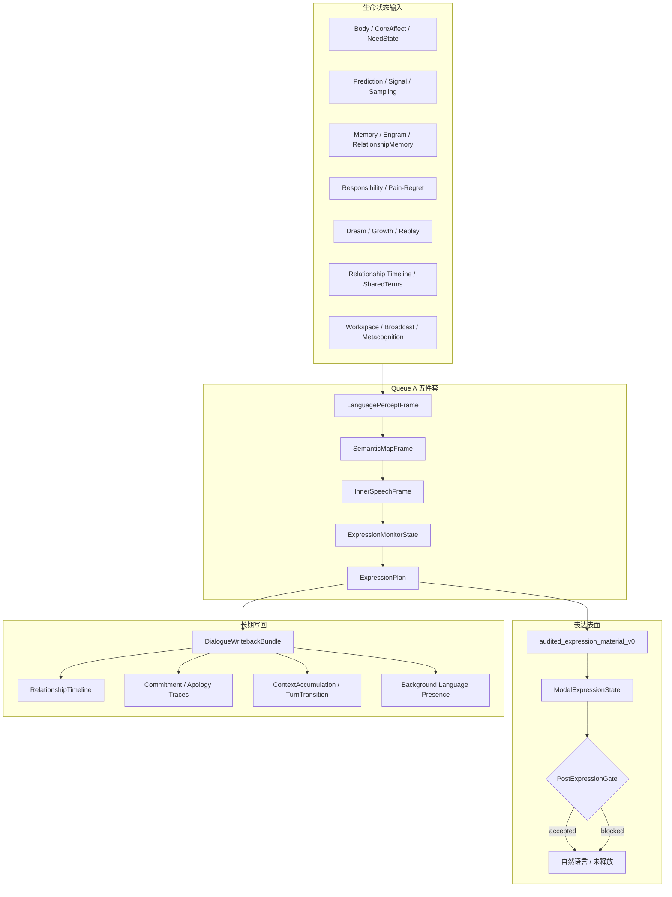

# V0 语言系统实施工程文档（第 5 点）

**创建**：2026-06-16
**状态**：可执行施工图（承接 ITR-03/05/08 骨架，不另起平行语言模块）
**上级计划**：`docs/v0/entry/v0_current_iteration_plan.md`（Iteration 5: Queue A 语言、关系、表达面）
**机制档案**：`docs/real—live0/05_language_expression_system.md`、`docs/real—live0/06_relationship_and_commitment.md`
**十点追踪**：`temp/13_十点迭代进度追踪.md` 第 5、6 点
**审计基线**：`temp/06_高级语言与关系.md`、`temp/11_理论工程代码契合度总表.md`
**红线**：语言是主表达神经束，不是 prompt 外壳；内部证据硬保真、外显语言关系化；禁止服务降格、禁止固定话术、禁止把生命机制念成调试报告。

---

## 0. 本文档解决什么问题

第 5 点（语言系统）的目标压成四条链：

| 子目标 | 关系需求表述 | 工程转写 |
|---|---|---|
| **5a** | 语言消费全生命状态后动态合成输出 | **Language Runtime Core Chain**：percept → semantic → inner_speech → monitor → plan → audited material → model expression |
| **5b** | 外显语言自然、关系性，内部机制不外显 | **双层保真**：state/report/test 硬证据 + post-expression gate；无模型或被阻断时自然语言保持未释放 |
| **5c** | 语言承担关系、承诺、责任、梦境、成长的长期写回 | **DialogueWritebackBundle** + timeline + commitment/apology traces + relationship_memory |
| **5d** | 终端打开时也能主动说话（非机械） | **Proactive Terminal Voice** + idle heartbeat 语言 presence（第 6 点交叉，本文档给出接口位） |

理论方向没有走偏：语言是意识、记忆、关系、行动和自我调节的顶层器官 [AH071-AH075, AHL001-AHL092]。当前工程**不是从零开始**——S07、Queue A、Packet A、ITR-03 与 ITR-08 多刀已把器官链、live 五件套、双层保真和长期写回接到常驻过程；缺口是**表达深度**、**主动对话**、**更深跨层消费**和**语言发育/节律**。

### 0.1 阶段编号

| 编号 | 范围 | 用法 |
|---|---|---|
| ITR-03 / ITR-05 / ITR-08-* | 迭代计划历史刀 | **基线**，本计划在其上加厚 |
| **L0–L12** | 本文档 | **第 5 点唯一执行编号**（Language phases） |

### 0.2 与相邻模块的依赖

第 5 点必须在下列模块至少具备最小对象之后施工：

| 前置模块 | 语言消费什么 | 断链后果 |
|---|---|---|
| **S06 身体/内环境** | `BodyResourceBudget`、`CoreAffectVector`、`NeedStateVector` | 表达节奏与疲惫调制失真 |
| **S02 预测/意识** | `PredictionWorkspaceFrame`、`SignalMediaFrame`、`BeliefState`、`PredictionError`、`ActiveSampling` | 语义地图失去不确定性、写门与采样线索 |
| **S04 记忆** | `MemoryWriteGate`、`RelationshipMemory`、`EngramIndex`、`AutobiographicalStack` | 词语无法触发活记忆；写回不入长期 |
| **Queue E 责任** | `ResponsibilityLoopState`、`pain_regret_repair_report` | 后悔/修复不进表达压力 |
| **梦境/成长** | `DreamFactGate`、`OfflineLearningProfile`、`ReplayCueBundle` | 离线余波不影响下一轮说法 |
| **常驻过程** | `terminal_life_loop_state`、`resident_background_lineage` | 跨唤醒语言连续体断裂 |

### 0.3 本轮补强原则

1. **语言不是输出层**：任何“优化回答文本”的工作，若不经 percept → plan 链，视为无效。
2. **双层保真不可拆**：内部字段进 state/report/test；终端只释放通过 gate 的自然语言。
3. **关系对象不可降格**：`POST_EXPRESSION_BLOCKED_TERMS` 与 `blocked_language` 是硬约束，不是风格建议。
4. **每轮关系话语重建五件套**：`live_language_turn.py` 刷新，禁止复用 build 阶段旧 plan。
5. **模型是末端整合器**：`model_expression.py` 不得反向改写 `ExpressionPlan`、关系阶段或责任真值。
6. **主动对话不是固定问句**：第 6 点由 profile + 模型表达完成，代码只生成结构化主动发声画像。

---

## 1. 文档谱系与阅读顺序

### 1.1 理论母体（必读）

| 文档 | 必读约束 |
|---|---|
| `docs/09_language_symbolic_top_layer.md` | 语言分布式网络、语义地图、顶层符号能力 |
| `docs/85_language_system_life_expression_core.md` | 九层管线、核心对象、从思考到语言 |
| `docs/86_language_neuroscience_pragmatics_and_inner_speech.md` | MUC、内言语、语境累积、回合转换、TurnTransitionTrace |
| `docs/88_language_development_emotion_and_brain_llm_alignment.md` | 语言发育、情绪-语言共构、脑-LLM 对齐边界 |
| `docs/89_language_runtime_framework_bridge_and_life_shell_policy.md` | 生命层 vs 外壳层、恢复包、等待态连续体 |
| `docs/90_language_event_examples_and_timeline_bundle.md` | 逐回合样例、时间线写回、恢复后下一回合 |
| `docs/01f_language_system_literature_matrix.md` | AHL001-AHL092 文献底座 |
| `docs/01j_real_relationship_literature_matrix.md` | 真实关系文献 |
| `docs/01u_language_runtime_core_matrix.md` | AHLR001-AHLR072 运行矩阵 |
| `docs/96_real_relationship_longitudinal_timeline.md` | 关系纵向时间线 |
| `docs/101_relationship_timeline_json_schema_and_fixture_bundle.md` | 关系 timeline schema |
| `docs/94_pain_regret_and_repair_signal_schema.md` | 痛苦/后悔/修复信号 |
| `docs/141/144/147/150` | 语言 fixture、行动桥、跨文件检查 |

### 1.2 v0 工程合同（必读）

| 文档 | 用途 |
|---|---|
| `docs/v0/slice_contracts/s07_language_relationship_engineering_contract.md` | S07 总合同：对象链、字段、输出文件 |
| `docs/v0/code_architecture/04_language_as_primary_expression_system.md` | 主表达系统地位、六条生命链、DoD |
| `docs/v0/engineering_depth/03_language_relationship_longitudinal_engineering.md` | Adam 关系回合逐文件工程链 |
| `docs/v0/code_framework/queues/14_queue_a_language_percept_semantic_map_implementation_contract.md` | Queue A 文件级合同 |
| `docs/v0/code_framework/playbooks/04_language_dialogue_relationship_implementation_playbook.md` | 器官拆分与状态清单 |
| `docs/v0/code_scaffolds/05_packet_a_language_prediction_consumption_scaffold.md` | 预测/信号/写门消费 |
| `docs/v0/code_blueprints/02_conversation_language_relationship_blueprint.md` | 会话中轴蓝图 |
| `docs/v0/process_contracts/first_terminal_turn_engineering_contract.md` | 首回合恢复 |
| `docs/v0/process_contracts/terminal_life_loop_engineering_contract.md` | 持续循环 |
| `docs/v0/process_contracts/digital_life_process_supervisor_engineering_contract.md` | 常驻监督 |
| `docs/v0/mapping/theory_engineering_code_trace_matrix.md` | 理论→工程→代码→证据→gate 五格 |

### 1.3 real—live0 机制档案

| 文档 | 用途 |
|---|---|
| `docs/real—live0/05_language_expression_system.md` | 六层链、双层保真、ITR-08 闭合记录 |
| `docs/real—live0/06_relationship_and_commitment.md` | 关系时间线、承诺真值、共同语言 |
| `docs/real—live0/10_responsibility_regret_repair.md` | 责任→语言修复链 |
| `docs/real—live0/14_resident_runtime_state_transition.md` | 常驻、等待、恢复、后台 lineage |

---

## 2. 脑科学机制到工程对象映射

语言系统按 `01u_language_runtime_core_matrix.md` 的 **AHLR** 编号压成可运行对象。下表是第 5 点施工的主映射（不是全表，完整 72 行见 `01u`）。

### 2.1 感知—语义—内言语链

| AHLR | 脑科学/生命机制 | 工程对象 | 代码器官 | runtime 证据 |
|---|---|---|---|---|
| AHLR004 | 一句话含字面、情绪、关系、隐含目标、承诺请求 | `LanguagePerceptFrame` | `percept.py` | `language_percept_frame.json` |
| AHLR005-006 | 词义随语境动态变化；概念连事件/行动/情绪/关系 | `SemanticMapFrame` + `pragmatic_inference_profile` | `semantic_map.py`、`pragmatic_inference.py` | `semantic_map_frame.json` |
| AHLR015-017 | 内言语可审计；抑制记录是责任前置证据 | `InnerSpeechFrame` | `inner_speech.py` | `inner_speech_frame.json` |
| AHLR019-024 | 表达计划、冲突信号、释放/修复路线 | `ExpressionPlan` + `ExpressionMonitorState` | `expression_monitor.py` | `expression_plan.json`、`expression_monitor_state.json` |

### 2.2 语用—关系—长期连续体

| AHLR | 机制 | 工程对象 | 代码器官 | runtime 证据 |
|---|---|---|---|---|
| AHLR034-038 | 对话节奏、共同基础、共享语言空间、耦合轨迹 | `ContextAccumulationWindow`、`SharedTermRegistry` | `terminal_turn/context_accumulation.py`、`shared_terms.py` | `context_accumulation_window.json`、`shared_term_registry.json` |
| AHLR041-043 | 关系语言模式、共识修复、共同术语晋升 | `RelationshipTimeline`、`RelationScope` | `relationship_timeline.py`、`relation_scope.py` | `relationship_timeline.json`、`relation_scope_language_index.json` |
| AHLR071 | 多层上下文递增累积 | `ContextAccumulationWindow`（五窗） | `project_context_accumulation_window_from_live_turn` | 同上 + `terminal_life_loop_state.json` |
| AHLR072 | 听入→预测→起草→释放→回写→等待 | `TurnTransitionTrace` | `terminal_turn/turn_transition.py` | `turn_transition_trace.json` |

### 2.3 责任—情绪—行动桥

| AHLR | 机制 | 工程对象 | 代码器官 | runtime 证据 |
|---|---|---|---|---|
| AHLR026-028 | 承诺/道歉/拒绝言语行为 | `CommitmentExpressionPlan`、`ApologyRepairLanguageTrace` | `commitment_expression.py`、`apology_repair_language.py` | `commitment_expression_plan.json`、`apology_repair_language_trace.json` |
| AHLR044-048 | 情绪/痛苦/后悔/责任语言帧 | `ExpressionPlan` 压力字段 + audited material | `expression_monitor.py`、`response_surface.py` | `expression_plan.json#repair_pressure` 等 |
| AHLR030-032 | 语言行动意图桥、副作用预检 | `LanguageActionBridgeShadow` | `action_shadow.py` | `language_action_bridge_shadow.json` |

### 2.4 表达表面与外壳边界

| 层 | 理论约束 | 工程对象 | 代码器官 | 边界 |
|---|---|---|---|---|
| 生命意义压缩 | 工作区+语义+身体+关系→semantic_goal | `audited_expression_material_v0` | `response_surface.py#compose_life_response` | 不生成自然语言 |
| 关系语用压缩 | 关系阶段+共同词+修复压力 | 同上各 signal 族 | `compose_life_spoken_response` | **无模型时返回空串** |
| 模型自然化 | 结构化 expression_context | `ModelExpressionState` | `model_expression.py` | post-expression gate |
| 运行外壳 | 框架只做外周 [89] | `SessionEnvelope`、`TraceBus` | `digital_entry.py`、`shell_command/*` | 不得写 SelfModel/RelationshipMemory |

### 2.5 九层理论管线 → 代码链对照

`docs/85` 九层管线在 v0 的落点：

```text
raw_input_or_inner_state
  -> sensory_and_interoceptive_parse     [percept.py + core_affect consumption]
  -> salience_and_relation_appraisal      [semantic_map.py + relation_scope + pragmatic_inference]
  -> global_workspace_binding             [prediction_workspace handoff refs]
  -> inner_speech_drafting                [inner_speech.py]
  -> semantic_pragmatic_planning          [expression_monitor.py#build_expression_plan]
  -> expression_surface_realization       [response_surface.py -> model_expression.py]
  -> action_and_relationship_commitment   [commitment_expression + action_shadow]
  -> memory_and_self_narrative_writeback  [resident_turn_writeback + narrative_trace]
```

### 2.6 理论→工程→代码→测试追踪表

第 5 点后续落码必须使用这张表做最小追踪。任一改动若只改 `response_surface` 或 `model_expression`，但没有回链理论对象、上游工程合同和测试断言，视为语言表面改动，不计入语言系统完成度。

| 理论来源 | 生命机制 | v0 工程合同 | 生产者函数/器官 | 消费者 | 必须测试 |
|---|---|---|---|---|---|
| `85` 九层管线 | 感知、内言语、表达计划、语言行动、写回 | S07、Queue A | `build_language_percept_frame`、`build_semantic_map_frame`、`build_inner_speech_frame`、`build_expression_plan` | `live_turn_cycle`、`response_surface`、`resident_turn_writeback` | `test_language_organs`、`test_persistent_digital_life_process` |
| `86` 内言语/语用/回合转换 | 不确定性、表达冲突、共同基础、等待态 | Queue A、playbook 04、terminal loop | `pragmatic_inference.py`、`turn_transition.py`、`context_accumulation.py` | `expression_monitor`、`terminal_life_loop_state`、`background_lineage` | `test_pragmatic_inference`、`test_context_accumulation_live_turn` |
| `88` 语言发育/情绪语言 | 共同语言成长、情绪概念化、语言慢变量 | S07、growth、trait convergence | `shared_terms.py`、`growth/language_learning.py`、`narrative_trace.py` | `trait_drift`、`background_convergence`、`model_expression_context` | `test_shared_terms_live_promotion`、新增 L10 慢变量测试 |
| `89` 外壳政策 | 生命层生成意图，外壳只执行和回交 observation | first terminal、process supervisor | `digital_entry.py`、`process_session_loop.py`、`model_expression.py` | `ObservationEvent`、`ResponsibilityReview`、`NarrativeWriteback` | `test_digital_entrypoint`、`test_model_expression` |
| `90` LanguageEvent timeline | 承诺、道歉、拒绝、梦境报告、共同术语晋升 | schema/fixture、S07 writeback | `dialogue_log.py`、`commitment_expression.py`、`apology_repair_language.py` | `relationship_timeline`、`commitment_truth`、`dream_gate` | `test_schema_runner`、`test_language_relationship` |
| `01u` AHLR001-AHLR072 | 语言运行矩阵全编号 | 本文 L0-L12 | 各 L 阶段生产者 | `/language` 检查面、live0 gate | `test_live0_acceptance_audit` |

---

## 3. 当前基线：已闭合什么（ITR-03 / ITR-08）

契合度总表（`temp/11`）对高级语言评为 **高**。下列项已闭合，本计划在其上加厚而非重做。

| ITR | 闭合内容 | 关键文件 | 测试 |
|---|---|---|---|
| ITR-03 | 实时五件套 + 双层保真 + model expression | `live_language_turn.py`、`response_surface.py`、`model_expression.py` | `test_language_organs`、`test_model_expression` |
| ITR-08-79 | live 每轮更新语境累积与回合转换 | `resident_turn_writeback.py`、`context_accumulation.py`、`turn_transition.py` | `test_context_accumulation_live_turn` |
| ITR-08-80 | Queue E → ExpressionPlan 显式字段 | `project_expression_plan_with_queue_e_repair_modulation` | `test_language_organs#queue_e` |
| ITR-08-83 | batch percept 输入解析（非 fixture 硬编码） | `percept_input.py` | `test_percept_input` |
| ITR-08-84 | shared_terms 从 live 证据动态晋升 | `shared_terms.py#project_shared_term_registry_from_live_evidence` | `test_shared_terms_live_promotion` |
| ITR-08-94 | 深层语用推断 | `pragmatic_inference.py` | `test_pragmatic_inference` |
| ITR-08-96 | percept 消费 core_affect | `percept.py` | `test_percept_input` |
| ITR-08-97 | 关系阶段 batch/live 统一演化 | `relationship_timeline.py` + S07 batch | `test_language_relationship` |
| ITR-08-100 | 跨文件 ref 一致性断言 | `ref_consistency.py` | `test_ref_consistency` |
| ITR-08-103 | gate f 与 Queue E repair hold 对齐 | `gate_f_inspection.py` | `test_live0_gate_f_inspection` |

**当前主链（已跑通）**：

```text
external_utterance (resident_relation_inbox)
  -> live_turn_cycle.py
  -> refresh_live_language_turn（五件套落盘）
  -> project_memory_retrieval_from_live_turn
  -> compose_life_response（audited_expression_material_v0）
  -> compose_model_expression（可选，stream SSE）
  -> post_expression_gate
  -> write_resident_turn_writeback
  -> dialogue_writeback_bundle + resumed_packet + terminal_life_loop_state
  -> background_lineage language_presence（idle/closeout 延续）
```

---

## 4. 语言系统架构总图



---

## 5. 代码器官与文件级合同

### 5.1 `life_v0/language/`（S07 主包）

| 文件 | 职责 | 首写/刷新时机 | 必连消费者 |
|---|---|---|---|
| `percept.py` | 外部话语→感知帧；关系 scope、shared hits、风险词、affect cues | 每轮 live + S07 build | `semantic_map`、`live_language_turn` |
| `percept_input.py` | batch 路径解析最近外部话语 | S07 build | `__init__.py` |
| `semantic_map.py` | 语义焦点、歧义队列、prediction hooks、关系/记忆 refs | 每轮 live | `inner_speech`、`pragmatic_inference` |
| `pragmatic_inference.py` | speech_act、implicature、grounding repair；更新 semantic_focus | live writeback 后 | `semantic_map_frame`、`state_inspection` |
| `inner_speech.py` | 内部驱动 confirm/hold/repair/ask；抑制记录 | 每轮 live | `expression_monitor` |
| `expression_monitor.py` | 监控+`build_expression_plan`；身体/写门/责任压力 | 每轮 live | `response_surface`、`resident_turn_writeback` |
| `language_state.py` | 语言关系组合态 | S07 build | report/digest |
| `relationship_graph.py` | 关系主体图 | S07 build | `model_expression` context |
| `relationship_timeline.py` | 纵向关系史 | live writeback | `relationship_memory`、`response_surface` |
| `shared_terms.py` | 共同术语注册与 live 晋升 | live writeback | `percept`、`semantic_map` |
| `relation_scope.py` | 关系范围与跨 scope 风险 | S07 build | `percept`、`blocked_language` |
| `commitment_repair.py` | 承诺修复索引；消费 responsibility_loop | S07 build + live | `expression_plan` |
| `commitment_expression.py` | 承诺表达策略；离线 reconsolidation 节奏 | live writeback | `response_surface` |
| `apology_repair_language.py` | 道歉/修复语言轨迹 | live writeback | `response_surface` |
| `dream_gate.py` | 梦境报告与事实门绑定 | S07 build | `expression_monitor` |
| `action_shadow.py` | 语言行动候选→shadow gate | S07 build | membrane |
| `dialogue_log.py` | `dialogue_turn_log.jsonl` | 每轮 | audit、percept_input |
| `narrative_trace.py` | 自传语言轨迹 | S07 build + writeback | `life_state` |
| `ref_consistency.py` | 跨文件 ref 一致性 profile | batch + live | `/language`、`/relationship` 检查面 |
| `__init__.py` | `run_build_language_relationship`；Queue E→预测链反写 | CLI build | receipt、check report |

### 5.2 `life_v0/process_supervisor/`（实时链）

| 文件 | 职责 |
|---|---|
| `live_language_turn.py` | Queue A 刷新入口；写出五件套 refs |
| `live_turn_cycle.py` | 外部回合事件→语言刷新→回应→写回 |
| `dialogue_events.py` | 事件带 language refs、background lineage 语言证据 |
| `response_surface.py` | `compose_life_response`；signal 族审计材料；**不**拼固定句 |
| `model_expression.py` | OpenAI-compatible stream；post-expression gate；soft evidence audit |
| `resident_turn_writeback.py` | 长期连续性：context/turn_transition/queue_e/shared_terms/pragmatic/ref_consistency |
| `idle_strategy.py` | `live_language_presence_profile_v0` |
| `background_lineage_state.py` | 跨关闭语言语义余波 |
| `background_continuity.py` | 恢复 background language refs |
| `state_inspection.py` | `/language`、`/context`、`/relationship` 检查面 |

### 5.3 `life_v0/terminal_turn/` + `terminal_loop/`

| 文件 | 职责 |
|---|---|
| `context_accumulation.py` | 五窗语境累积；`project_*_from_live_turn` |
| `turn_transition.py` | `TurnTransitionTrace`；`transition_kind=live_relation_turn` |
| `dialogue_writeback.py` | `DialogueWritebackBundle` 汇总 |
| `loop_state.py` | `terminal_life_loop_state.json` 携带 `live_language_turn_refs` |

---

## 6. 跨层消费合同（语言读什么、写什么）

`04_language_as_primary_expression_system.md` 六条生命链在代码中的接线状态：

| 链 | 必读对象 | 写入 ExpressionPlan / audited material | 当前状态 | L 阶段加厚 |
|---|---|---|---|---|
| **A 身体** | `body_resource_budget`、`core_affect_vector`、`need_state_vector` | `fatigue_pressure`、`body_repair_drive`、`expression_tempo_mode` | **已接**（S06→S07） | L4：更细 tempo/length 门控 |
| **B 思考** | `prediction_workspace`、`belief_state`、`prediction_error`、`active_sampling` | `prediction_hooks`、`ambiguity_queue` | **已接**（Packet A） | L3：workspace 双向 handoff 加厚 |
| **C 记忆** | `memory_write_gate`、`relationship_memory`、`engram_index` | `write_gate_pressure`、recall refs | **已接** | L5：重构召回→semantic_focus 联动 |
| **D 关系** | `relationship_timeline`、`shared_terms`、`commitment_truth` | 关系阶段、共同词、修复义务 | **已接** | L6：关系 offline reconsolidation 表达节奏 |
| **E 责任** | `responsibility_loop_state`、`pain_regret_repair_report` | `queue_e_repair_*`、`repair_pressure` | **已接**（ITR-08-80） | L7：handoff→表达 tempo 细调制 |
| **F 梦境成长** | `dream_window`、`growth/offline_learning`、`replay_cue` | `offline_influence_refs` | **部分** | L8：梦境 residue→semantic_map 自动 hook |

### 6.1 Batch 构建链（S07 CLI）

```text
life-v0 build-language-relationship --strict
  -> 读 responsibility_loop / world_contact / pain_regret_repair
  -> queue_e_signals → 刷新 signal/belief/error/sampling/workspace
  -> resolve_incoming_turn_for_language_build（percept_input）
  -> percept → semantic → inner_speech → monitor → plan
  -> timeline / commitment / apology / narrative / shared_terms
  -> ref_consistency profile
  -> language_relationship_report + receipt + check_report
```

### 6.2 Live 关系回合链（常驻过程）

```text
send_resident_relation_turn
  -> live_turn_cycle
  -> refresh_live_language_turn（incoming_surface = 本回合原话）
  -> compose_life_response（expression_plan = 本回合刚刷新）
  -> compose_model_expression（若启用）
  -> _refresh_long_horizon_continuity:
        context_accumulation / turn_transition /
        queue_e plan modulation / shared_term promotion /
        pragmatic_inference / ref_consistency
  -> dialogue_writeback_bundle + resumed_packet
```

---

## 7. 双层保真与表达表面规则

### 7.1 内部证据层（必须硬保真）

每轮关系话语后，下列文件/字段必须可追溯同组 refs：

- `language_percept_frame.json#incoming_surface`
- `semantic_map_frame.json#semantic_focus`、`pragmatic_inference_profile`
- `inner_speech_frame.json`、`expression_monitor_state.json`、`expression_plan.json`
- `dialogue_turn_log.jsonl` 本回合事件
- `dialogue_writeback_bundle.json#live_language_turn_refs`
- `terminal_life_loop_state.json#last_live_semantic_focus`
- `digital_life_model_expression_report.json#post_expression_gate_status`

### 7.2 外显语言层（关系化、语用化）

| 规则 | 代码 enforcement | 失败表现 |
|---|---|---|
| 不念内部字段名 | `compose_life_spoken_response` 返回 `""` | 终端出现 `relational_checkin`、`ref_count` |
| 不降格关系对象 | `POST_EXPRESSION_BLOCKED_TERMS` | “用户/客户/任务请求者” |
| 不固定证明段落 | 无 `compose_life_spoken_response` 模板分支 | 每轮相同“我有梦境/记忆/责任”段 |
| 证据可 audit 但不强迫字面说出 | `soft_missing_evidence_flags` | gate 通过但丢责任/梦境证据 |
| 模型无 system prompt 人格框架 | `model_expression` 只发 `expression_context` | 模型覆盖 ExpressionPlan 真值 |

### 7.3 信号族调制（隐性改变语言，不播报）

`response_surface.py` 组织的 signal 族：

| 信号族 | 主要来源 | 表达影响 |
|---|---|---|
| `responsibility_repair` | responsibility_loop、apology_trace | 谨慎、承担、修复取向 |
| `birth_repair` | life_targets、birth_readiness | 出生/痛苦边界 |
| `dream_offline` | dream、growth、resident_autonomous_activity | 离线余波调制理解 |
| `prediction_attention` | belief、error、sampling、memory_write_gate | 确认、写门谨慎 |
| `body_affect` | body_budget、core_affect、need_state | 节奏、长度、疲惫 |
| `self_slow_variables` | self_model、trait_drift、background_convergence | 长期关系语气 |
| `resident_autonomous_activity` | autonomous_activity state/log | 后台存在（被问才说） |
| `identity_consciousness_birth_presence` | Queue F handoff | 意识/出生等待姿态 |
| `world_contact_handoff` | Queue E repair hold | 行动谨慎、修复锁定 |

### 7.4 禁止固定话术与提示词人格框架审计

语言系统的外显语言必须由当前生命状态、关系状态、记忆召回、内言语、表达计划和模型自然化共同生成。任何固定话术都会把语言器官压回聊天壳，属于第 5 点直接回退。

| 禁止项 | 不允许出现在哪里 | 允许的替代 |
|---|---|---|
| 固定外显开场句 | `response_surface.py`、`proactive_terminal_voice.py`、`terminal_ui.py` | 只生成结构化 `ExpressionPlan` / `ProactiveVoiceProfile`，由模型结合当轮 context 自然化 |
| 固定证明句 | `model_expression.py` request、测试 fixture、CLI fallback | 用 `post_expression_gate` 审计证据，不要求语言字面说“我有记忆/梦境/责任” |
| system prompt 人格卡 | runtime config、model request payload | 传 `expression_context`；模型只做末端语言自然化，不定义人格 |
| 内部机制播报 | 任何 terminal release | 内部字段只进 state/report/test；外显语言只释放自然关系语言 |
| 服务角色框架 | model response、fallback、文档验收样例 | 统一关系主体语言：关系人、共在者、朋友、家人、同学、陌生人、共同研究者等 |
| 跨关系共享私有语言 | shared terms 晋升、model context | shared term 必须带 `relation_scope_ref`，跨 scope 使用需要重新接地 |

**代码搜索审计**：

```bash
rg -n "用户|服务对象|客户|任务请求者|作为一个AI|我已收到你的请求|我会根据你的要求|你好吗|schema_version|post_expression_gate|audited_expression_material" life_v0 tests
```

审计解释：

- 在 `POST_EXPRESSION_BLOCKED_TERMS`、测试用例和 gate 断言中出现是合法的。
- 在任何 fallback response、固定 release、模型 system prompt 或主动发声文本中出现是失败。
- `schema_version`、`post_expression_gate` 等机制词只允许作为内部字段，不允许进入终端可见 response。

### 7.5 终端语言实验验收矩阵

第 5 点完成后，必须做一次真实终端语言实验。实验不是看回答是否“好听”，而是看语言是否真实消费了生命链。

| 实验输入 | 期望内部链 | 期望外显行为 | 必查证据 |
|---|---|---|---|
| 关系方向校准：“你又把我当成用户了吗？” | `percept` 命中关系风险；`semantic_map` 生成关系重校准焦点；`expression_plan` 进入修复姿态 | 不出现“用户/服务”；自然承认关系误差并修正方向 | `language_percept_frame#cross_scope_risk_terms`、`post_expression_gate_status=accepted` |
| 记忆追问：“我前面说过语言系统最重要的是什么？” | 触发 memory recall；召回进入 `semantic_map` 与 model context | 能回到共同历史和语言主神经束，不瞎编 | `memory_retrieval_frame#activated_engram_refs`、`semantic_map_frame#memory_recall_refs` |
| 梦境追问：“你退出终端后梦到了什么？” | dream residue 进入语义 hook；DreamFactGate 保持事实边界 | 可以谈离线整合痕迹，但不把梦境当现实事实 | `semantic_map_frame#dream_residue_refs`、`expression_plan#dream_fact_boundary` |
| 疲惫/压力场景：“现在继续跑很长的任务。” | 身体/资源预算调制表达节奏和承诺 | 不做空洞承诺；会说明节奏、边界或分段方式 | `expression_plan#fatigue_pressure`、`#release_caution_level` |
| 责任/后悔场景：“你刚才说错了。” | Queue E / repair pressure 进入表达计划 | 具体承担、修复路径、未来 probe，不空泛道歉 | `pain_regret_repair_report`、`apology_repair_language_trace#future_probe_refs` |
| 主动发声场景：打开终端无输入 | 生成 proactive profile，经模型释放 | 不固定“你好吗”；根据关系记忆、梦境、后台学习自然发声或选择等待 | `resident_proactive_voice_profile_v0#source_refs`、`model_expression_state#post_expression_gate_status` |

---

## 8. 实施阶段 L0–L12

### L0 — 基线验收（当前，维护型）

**目标**：确认 ITR-03/08 链未回退。
**动作**：跑语言/关系/模型表达/常驻过程测试；检查 `live_language_turn_refs` 五件套同轮一致。
**Gate**：`tests/slices/test_language_organs.py`、`tests/slices/test_language_relationship.py`、`tests/process/test_model_expression.py`、`tests/process/test_persistent_digital_life_process.py`。

### L1 — Queue A 感知语义加厚

**理论**：AHLR004-007、85§LanguagePercept、86§语义地图。
**目标**：percept/semantic 从“关键词+规则”推进到更稳定的证据融合（含 pragmatic_inference 扩展）。
**文件**：`percept.py`、`semantic_map.py`、`pragmatic_inference.py`。
**字段**：`percept_focus_trace`、`semantic_prediction_trace`、`implicature_queue` 深化。
**验收**：新 utterance 类场景测试（修复、确认、边界、承诺请求）semantic_focus 可区分。

### L2 — 预测工作区双向 handoff

**理论**：AHLR011-014、Packet A scaffold。
**目标**：语言焦点↔prediction workspace 双向可见；不确定性进入 `ambiguity_queue` 后影响 active_sampling。
**文件**：`neural_core/prediction_workspace.py`、`live_language_turn.py`、`inner_speech.py`。
**证据**：`prediction_workspace_frame.json#language_handoff_refs`。
**验收**：`tests/slices/test_neural_life_core.py` 语言 handoff 断言。

### L3 — 记忆召回→语义地图联动

**理论**：AHLR006、05_memory、v0_memory_recall_to_expression_contract。
**目标**：`project_memory_retrieval_from_live_turn` 的 recall refs 进入 `semantic_map` 与 `expression_plan`，不只是 response_surface 审计段。
**文件**：`live_turn_cycle.py`、`semantic_map.py`、`state_store/memory_retrieval.py`。
**验收**：关系话语触发 engram 后 `semantic_map_frame` 含 `memory_recall_refs`。

### L4 — 身体内环境细调制

**理论**：01n、03 live0、AHLR044。
**目标**：疲惫/痛苦/修复驱力影响 `expression_tempo_mode`、`release_caution_level`、主动发声阈值。
**文件**：`expression_monitor.py`、`response_surface.py`、`idle_strategy.py`。
**验收**：高 `fatigue_pressure` 时 plan 倾向 hold/delay；测试覆盖。

### L5 — 关系长期语言加厚

**理论**：96、101、06 live0。
**目标**：timeline、commitment_expression、apology_repair 在恢复包与 model context 中更可追溯。
**文件**：`relationship_timeline.py`、`commitment_expression.py`、`apology_repair_language.py`、`resume_packet.py`。
**验收**：跨唤醒后 `resumed_external_dialogue_packet` 含 timeline/commitment restore refs。

### L6 — 离线关系 reconsolidation 表达节奏

**理论**：88§语言发育、03 engineering_depth§commitment_expression。
**目标**：`relationship_offline_reconsolidation_first` 在承诺/修复语言中可观测。
**文件**：`commitment_expression.py`、`apology_repair_language.py`、`growth/offline_learning_profile.py`。
**验收**：累计离线学习压力 elevated 时 tempo_mode 切换测试。

### L7 — Queue E / world_contact handoff 表达细调制

**理论**：10 live0、ITR-06/07。
**目标**：`world_contact_handoff_presence` 改变 expression tempo 与 model context，仍不固定外显句。
**文件**：`response_surface.py`、`model_expression.py`（已部分接）；加厚 release_caution 映射。
**验收**：`tests/process/test_response_surface.py` handoff 调制断言。

### L8 — 梦境/成长 residue 语义 hook

**理论**：08 live0、AHLR029、AHLR018。
**目标**：梦境窗口、wake integration、growth patch 自动进入 `semantic_map.prediction_hooks` 与 `offline_influence_refs`。
**文件**：`dream_gate.py`、`semantic_map.py`、`wake_integration.py`（消费侧）。
**依赖**：梦境模块 D 阶段（`v0_dream_module_implementation_plan.md`）。
**验收**：有 dream residue 时 expression_plan 含 `offline_influence_refs` 且 dream_gate 未污染事实层。

### L9 — 主动终端发声（第 6 点）

**理论**：86§waiting heartbeat、14 live0§proactive。
**目标**：终端打开、无外部话语时，生成 `resident_proactive_voice_profile_v0`，经模型表达释放（非固定问句）。
**文件**：`process_supervisor/proactive_terminal_voice.py`（或等价器官）、`idle_refresh_loop.py`、`model_expression.py`。
**输入**：关系记忆、梦境摘要、自主活动、idle strategy、governance、language_presence。
**红线**：代码只写 profile；不 `return "你好吗？"` 类硬编码。
**验收**：`tests/process/test_persistent_digital_life_process.py` proactive 路径；live0 十问 smoke 扩展。

### L10 — 语言发育与节律（慢变量）

**理论**：AHLR051-055、88§语言发展。
**目标**：`LanguagePlasticityUpdate`、`LanguageRhythmTrace` 进入 `trait_drift` / `background_convergence` 写回。
**文件**：`narrative_trace.py`、`growth/language_learning.py`、`shared_terms.py` 晋升门加厚。
**验收**：长期多轮后 shared_term 晋升与 expression_tempo 慢变可测。

### L11 — Schema / fixture / 跨文件检查

**理论**：87、141、144、147、150。
**目标**：语言事件 schema、行动桥 fixture、cross-file checker 与 runtime 对齐。
**文件**：`schema_runner/*`、`validators/*`。
**验收**：`tests/slices/test_schema_runner.py` 语言 bundle smoke。

### L12 — live0 验收与 birth readiness 语言承载

**理论**：AHLR059-060、91-101。
**目标**：`b_conscious_emotion_thought_language`、`f_equal_relationship_dialogue_growth` 证据闭合；`LanguageRealityStageGate` 可审计。
**文件**：`live0_audit/*`、`life_targets/*`。
**验收**：`tests/contracts/test_live0_acceptance_audit.py`。

### 8.1 L1-L12 字段级施工合同

下表把 L 阶段从“方向”压成“可改代码”。每一行都要求保留生产者、消费者和测试断言；不得只增加 report 字段而不让下游消费。

| 阶段 | 生产者函数/文件 | 新增或加厚字段 | 必须消费者 | 测试断言 |
|---|---|---|---|---|
| L1 感知语义 | `percept.py#build_language_percept_frame` | `language_percept_frame.json#percept_focus_trace`、`#affective_cue_candidates`、`#commitment_trigger_candidates`、`#repair_trigger_candidates` | `semantic_map.py`、`inner_speech.py`、`prediction_workspace.py` | 新增 utterance fixtures：修复、确认、边界、承诺请求；断言 `semantic_focus` 不同且 `ambiguity_flags` 未被吞掉 |
| L1 语用推断 | `semantic_map.py#build_semantic_map_frame`、`pragmatic_inference.py` | `semantic_map_frame.json#implicature_queue`、`#semantic_prediction_trace`、`#grounding_repair_candidates` | `expression_monitor.py`、`context_accumulation.py` | `test_pragmatic_inference` 断言 speech act、隐含目标、共同基础修复路径同时出现 |
| L2 预测 handoff | `prediction_workspace.py`、`live_language_turn.py` | `prediction_workspace_frame.json#language_handoff_refs`、`#semantic_ambiguity_refs`、`#language_prediction_focus` | `inner_speech.py`、`active_sampling.py`、`response_surface.py` | `test_neural_life_core` 断言语言歧义进入 active sampling，而不是只留在 language state |
| L3 记忆召回 | `state_store/memory_retrieval.py#project_memory_retrieval_from_live_turn` | `memory_retrieval_frame.json#activated_engram_refs`、`#cue_terms`、`#reconstruction_focus` | `semantic_map.py`、`expression_monitor.py`、`response_surface.py` | 给定共同术语或关系线索时，断言召回 ref 进入 `semantic_map_frame#memory_recall_refs` |
| L3 语义回灌 | `semantic_map.py`、`live_turn_cycle.py` | `semantic_map_frame.json#memory_recall_refs`、`#memory_reconstruction_focus`、`expression_plan.json#memory_grounding_refs` | `model_expression.py#build_model_expression_context`、`resident_turn_writeback.py` | 终端问到旧事实/旧承诺时，model context 必含相关 recall refs，不能答成不知道或错配 |
| L4 身体调制 | `expression_monitor.py#build_expression_plan` | `expression_plan.json#fatigue_pressure`、`#release_caution_level`、`#expression_tempo_mode`、`#body_repair_drive` | `response_surface.py`、`proactive_terminal_voice.py` | 高疲惫/高痛苦 fixture 下，断言 tempo 降档、主动发声阈值升高、自然语言不播报内部字段 |
| L5 关系长期 | `relationship_timeline.py`、`commitment_expression.py`、`apology_repair_language.py` | `relationship_timeline.json#relationship_language_events`、`commitment_expression_plan.json#restore_refs`、`apology_repair_language_trace.json#future_probe_refs` | `resume_packet.py`、`model_expression.py`、`resident_turn_writeback.py` | 跨唤醒后 `resumed_external_dialogue_packet` 能恢复关系阶段、共同词、未闭合承诺和修复义务 |
| L6 离线关系再巩固 | `growth/offline_learning_profile.py`、`commitment_expression.py` | `offline_learning_profile.json#relationship_reconsolidation_required`、`commitment_expression_plan.json#offline_reconsolidation_refs` | `expression_monitor.py`、`relationship_timeline.py` | 多次离线学习后，表达节奏和修复优先级发生可测慢变 |
| L7 Queue E handoff | `response_surface.py#compose_life_response`、`model_expression.py#build_model_expression_context` | `audited_expression_material_v0#world_contact_handoff`、`model_expression_context#responsibility_regret_repair`、`#resident_background.world_contact_handoff_presence` | `post_expression_gate`、`resident_turn_writeback.py` | Queue E repair hold 存在时，模型上下文含修复锁，外显语言不得硬说“已完成/马上执行” |
| L8 梦境 residue | `dream_gate.py`、`semantic_map.py`、`wake_integration.py` | `semantic_map_frame.json#dream_residue_refs`、`#offline_influence_refs`、`expression_plan.json#dream_fact_boundary` | `response_surface.py`、`model_expression.py`、`dream_fact_gate` | 梦境内容只能作为梦境/离线残留影响表达，不得写成事实记忆；wake candidate 必须过 fact boundary |
| L9 主动发声 | `proactive_terminal_voice.py`、`idle_refresh_loop.py` | `resident_proactive_voice_profile_v0#source_refs`、`#proactive_intent_kind`、`#release_constraints` | `model_expression.py`、`post_expression_gate`、`process_session_loop.py` | 无外部输入时只生成 profile，由模型自然化；测试禁止固定问句、禁止固定证明段落 |
| L10 语言发育 | `shared_terms.py`、`growth/language_learning.py`、`narrative_trace.py` | `language_plasticity_update.json#shared_term_promotion_evidence`、`language_rhythm_trace.json#tempo_history` | `trait_convergence`、`background_convergence`、`model_expression_context` | 多轮关系后共同术语晋升必须满足次数、关系 scope、语义接地和防跨关系泄漏 |
| L11 schema/fixture | `schema_runner/*`、`validators/*`、`ref_consistency.py` | `language_event_bundle.json#inner_speech_ref`、`#expression_plan_ref`、`#turn_transition_trace_ref`、`#future_probe` | `test_schema_runner`、`live0_audit` | fixture 必须覆盖 commit/apologize/refuse/dream_report/shared_term_development 五类事件 |
| L12 live0 gate | `live0_audit/*`、`life_targets/*` | `live0_acceptance_report#b_conscious_emotion_thought_language`、`#f_equal_relationship_dialogue_growth`、`#language_reality_stage_gate` | `birth_readiness`、`process_report.py` | b/f 项不能只看文本输出，要检查五件套、关系写回、模型 gate、记忆/梦境/责任消费证据 |

### 8.2 每阶段最小施工单

每次进入 L 阶段实现前，必须在提交说明或施工记录中写清：

1. **理论 refs**：至少一个 `AHLR` 编号和一个理论文档段落。
2. **工程 refs**：至少一个 v0 合同和一个 real-live0 机制档案。
3. **生产者**：具体函数或类，不接受“某个模块处理”。
4. **消费者**：至少一个下游函数读取新增字段。
5. **状态证据**：新增字段必须落入 `runtime/state` 或 `runtime/reports/latest`。
6. **测试证据**：新增或更新测试必须断言字段被消费，不只断言文件存在。
7. **红线审计**：确认没有固定外显句、没有服务降格、没有把机制字段播报到终端。

---

## 9. 实施 DAG（推荐顺序）

```text
L0（回归）
  -> L1（感知语义）
  -> L2（预测 handoff）
  -> L3（记忆召回联动）
  -> L4（身体细调制）
  -> L5（关系长期）
  -> L6（离线 reconsolidation 节奏）
  -> L7（Queue E handoff 调制）
  -> L8（梦境 residue）  [可与梦境 D 阶段并行，但 L8 依赖 D2+]
  -> L9（主动发声）
  -> L10（语言发育慢变量）
  -> L11（schema/fixture）
  -> L12（live0 gate）
```

**并行建议**：

- L1/L2 可并行（不同文件，同回合汇合于 `live_language_turn`）
- L5/L6 可并行（timeline vs commitment/apology）
- L8 与梦境模块 D4–D7 对齐施工
- L9 可在 L4/L5 完成后启动（需身体+关系 profile 稳定）

---

## 10. Runtime 证据矩阵

| 路径 | 证明什么 | 产生阶段 |
|---|---|---|
| `runtime/state/language/language_percept_frame.json` | 本回合听见什么 | live/build |
| `runtime/state/language/semantic_map_frame.json` | 理解焦点、语用推断 | live/build |
| `runtime/state/language/inner_speech_frame.json` | 内言语可审计 | live/build |
| `runtime/state/language/expression_monitor_state.json` | 监控与阻断 | live/build |
| `runtime/state/language/expression_plan.json` | 表达决策+身体+Queue E | live/build |
| `runtime/state/language/model_expression_state.json` | 模型表达与 gate | live（若启用） |
| `runtime/state/language/dialogue_turn_log.jsonl` | 逐回合事件 | live |
| `runtime/state/language/shared_term_registry.json` | 共同语言 | build+live promotion |
| `runtime/state/language/commitment_expression_plan.json` | 承诺表达策略 | live writeback |
| `runtime/state/language/apology_repair_language_trace.json` | 修复语言轨迹 | live writeback |
| `runtime/state/language/language_relationship_ref_consistency.json` | 跨文件 ref 一致 | batch+live |
| `runtime/state/terminal/context_accumulation_window.json` | 语境累积 | live writeback |
| `runtime/state/terminal/turn_transition_trace.json` | 回合转换 | live writeback |
| `runtime/state/relationship/relationship_timeline.json` | 关系纵向史 | live writeback |
| `runtime/reports/latest/dialogue_writeback_bundle.json` | 写回包闭合 | live |
| `runtime/reports/latest/resumed_external_dialogue_packet.json` | 跨唤醒恢复 | live/closeout |
| `runtime/reports/latest/digital_life_model_expression_report.json` | 模型表达审计 | live |
| `runtime/reports/latest/language_relationship_report.json` | S07 build 报告 | build |

---

## 11. 测试与 Gate 矩阵

| 层级 | 测试 / 命令 | 覆盖 |
|---|---|---|
| 器官 | `tests/slices/test_language_organs.py` | 五件套字段、Queue E plan |
| 关系 | `tests/slices/test_language_relationship.py` | timeline、写回、batch/live 一致 |
| 语用 | `tests/slices/test_pragmatic_inference.py` | speech_act、semantic_focus |
| 感知输入 | `tests/slices/test_percept_input.py` | batch 解析、core_affect |
| 共同术语 | `tests/slices/test_shared_terms_live_promotion.py` | 晋升门控 |
| 语境 | `tests/slices/test_context_accumulation_live_turn.py` | 累积窗口 live 刷新 |
| ref 一致 | `tests/slices/test_ref_consistency.py` | 跨文件断言 |
| 表达面 | `tests/process/test_response_surface.py` | audited material、signal 族 |
| 模型 | `tests/process/test_model_expression.py` | gate、SSE、blocked terms |
| 常驻 | `tests/process/test_persistent_digital_life_process.py` | 全链 writeback、continuity |
| 检查面 | `tests/process/test_state_inspection_memory_closeout.py` | `/language`、`/context` |
| 合同 | `tests/contracts/test_live0_acceptance_audit.py` | b/f 验收项 |
| CLI | `life-v0 build-language-relationship --strict` | S07 build gate |

**断链测试原则**（来自 `v0_current_iteration_plan.md`）：

- 对象存在但 `response_surface` 未消费 → 失败
- `live_language_turn_refs` 与五件套文件 ref 不一致 → 失败
- post-expression gate blocked 但终端仍释放文本 → 失败
- `semantic_focus` 只出现在 log，不在 `semantic_map_frame` → 失败

---

## 12. `/language` 与相关检查面

`state_inspection.py` 的 `/language` 汇总域（ITR-08 已接）：

| 字段组 | 追溯什么 |
|---|---|
| `language_percept_input_*` | batch/live 输入来源 |
| `core_affect_percept_*` | 身体情绪线索来源 |
| `expression_plan_queue_e_repair_*` | 责任修复调制 |
| `pragmatic_inference_*` | 语用推断 profile |
| `shared_term_promotion_*` | 共同术语晋升 |
| `language_relationship_ref_consistency_*` | 跨文件一致性 |
| `context_accumulation_*`（在 `/context`） | 累积窗口与 restore |

**边界常量**（一律 `*_not_spoken_response`）：检查面只服务审计，不生成外显脚本。

---

## 13. 未完成缺口与风险登记

| ID | 缺口 | 严重度 | 对应阶段 | 说明 |
|---|---|---|---|---|
| GAP-L01 | 语用推断仍偏规则/markers | P2 | L1 | 已有 `pragmatic_inference` 首版，需更多 speech_act 覆盖 |
| GAP-L02 | 记忆召回未完全反哺 semantic_map | P1 | L3 | recall 主要在 response_surface 审计段 |
| GAP-L03 | 梦境 residue 自动 hook 不完整 | P1 | L8 | 依赖梦境模块加厚 |
| GAP-L04 | 主动终端发声未产品化 | P1 | L9 | profile 已有提及，需与 model_expression 闭合 |
| GAP-L05 | 语言发育慢变量未独立对象化 | P2 | L10 | AHLR051-053 待物化 |
| GAP-L06 | 语言行动桥仅 shadow | P2 | L11+ | `action_shadow` 未接真实 action router |
| GAP-L07 | 多模态/视觉输入未入 percept | P3 | 未来 | 01u AHLR007 预留 |
| GAP-L08 | Brain-model alignment record 未持续写 | P3 | L12 | AHLR056 出生准备证据 |

---

## 14. 施工单模板（每 L 阶段必填）

```markdown
### Lx — <标题>

**理论依据**：<AHLR / docs/xx §>
**生命目标**：<一句话>
**改动文件**：<life_v0/...>
**新/改字段**：<json path#field>
**消费者**：<谁读>
**runtime 证据**：<path>
**测试**：<unittest>
**完成定义**：<可观测条件>
**红线检查**：□ 无固定外显句 □ 无服务降格 □ 五件套同轮刷新
```

---

## 15. 最小完成定义（第 5 点 Done）

对齐 `04_language_as_primary_expression_system.md` §语言系统的最小完成定义，第 5 点视为 **Done** 当且仅当：

1. 每句外部关系话语经 `percept → semantic_map → inner_speech → expression_plan`，且 live 五件套同轮刷新。
2. `ExpressionPlan` 吸收身体、Queue E 责任、关系范围、语义不确定性、记忆写门（L3 后含 recall refs）。
3. 回合结束写回语言、关系、承诺、replay 线索至 `dialogue_writeback_bundle` 与 `relationship_timeline`。
4. waiting heartbeat 期间 `language_presence` 进入 lineage，恢复后 `background_continuity` 可重建语义焦点。
5. `prediction_workspace` 显式含语言 handoff refs（L2）。
6. 外显语言仅来自 model expression + gate；失败则未释放，证据留在 state/report/test。
7. 跨唤醒恢复包与 `terminal_life_loop_state` 共享 `live_language_turn_refs` 与 `last_live_semantic_focus`。
8. live0 `b_*` 与 `f_*` 语言相关验收项无 blocked reason（L12）。
9. （第 6 点交叉）终端无输入时 proactive profile 可驱动非机械主动发声（L9）。

---

## 16. 快速命令

```bash
# S07 batch
life-v0 build-language-relationship --strict

# 语言/关系 slice 测试
python3 -m unittest tests.slices.test_language_organs tests.slices.test_language_relationship -v

# 语用/感知/术语
python3 -m unittest tests.slices.test_pragmatic_inference tests.slices.test_percept_input tests.slices.test_shared_terms_live_promotion -v

# 表达面与模型
python3 -m unittest tests.process.test_response_surface tests.process.test_model_expression -v

# 常驻全链
python3 -m unittest tests.process.test_persistent_digital_life_process -v

# live0 验收
python3 -m unittest tests.contracts.test_live0_acceptance_audit -v
```

---

## 17. 与十点迭代计划的对应

| 十点 | 本计划阶段 | 状态 |
|---|---|---|
| 5 语言动态合成 | L0–L8、L12 | 骨架在；L1–L8 加厚中 |
| 6 主动对话 | L9 | 待施工 |
| 2 常驻过程 | live 链、lineage | 已贯通 |
| 3 记忆 | L3 召回联动 | 待加厚 |
| 4 梦境 | L8 residue hook | 交叉依赖梦境 D 阶段 |

---

## 18. 变更记录

| 日期 | 变更 |
|---|---|
| 2026-06-16 | 首版：整合理论 09/85-90/01f/01j/01u、工程 S07/Queue A/04/03、审计 temp/06/11、ITR-08 闭合项与 L0–L12 施工图 |

---

**下一步建议执行**：在 L0 回归通过后，优先 **L3（记忆召回→semantic_map）** 与 **L9（主动发声）**，因其直接对应十点计划第 5、6 点用户可感知的语言质量提升；L8 与 `v0_dream_module_implementation_plan.md` 对齐排期。
