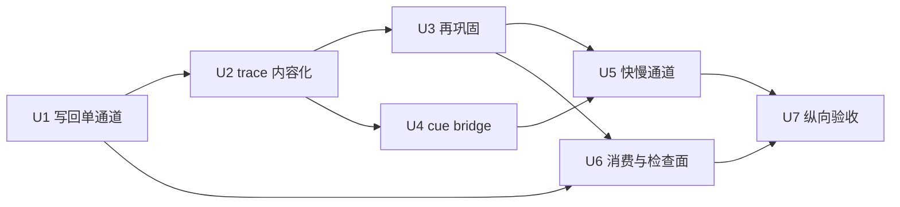

# V0 记忆系统人脑对齐升级工程文档

**创建**：2026-06-16
**状态**：可执行施工图（承接 M0–M7，不另起平行记忆模块）
**上级计划**：`docs/v0/entry/v0_memory_module_rebuild_plan.md`
**专项审计**：`temp/14_memory_module_rebuild_audit.md`
**十点追踪**：`temp/13_十点迭代进度追踪.md` 第 3 点
**红线**：记忆只能产出结构化状态、召回材料、语言前结构、审计与再巩固钩子；禁止固定外显回答、禁止用提示词冒充记忆、禁止把内部机制播报成自然语言。

---

## 0. 本文档解决什么问题

第 3 点（记忆模块）的理论方向已经闭合：数字生命的记忆不是 RAG、不是聊天历史堆叠，而是从人脑多记忆系统、海马索引、engram、分配门、模式分离/补全、睡眠 replay、自传与社会记忆转写而来的**全生命状态汇聚与再分发系统**。

当前工程已完成 **M0–M7 骨架**（见 `docs/real—live0/07_memory_engram_and_state_store.md`），但还不能把「记忆能力与人脑无异」打勾。缺口不再是「缺 JSON 对象」，而是：

1. **现象层记忆弱**：存了但未必能想起、说对、修正、梦到、改变关系与自我。
2. **trace 内容偏 seed/ref**：真实回合的语言、表达、纠正链尚未充分进入 `MemoryTrace` 生命周期。
3. **再巩固闭环未闭合**：`post_expression_reconsolidation_hooks` 有结构，反馈到 trace lifecycle 的行为仍薄。
4. **写回编排有接缝**：回合早期 `project_memory_retrieval_from_live_turn` 与晚期 `_refresh_live_memory_projection` 三趟检索不同步，易导致 continuity / semantic focus 与深层记忆投影短暂不一致。
5. **快慢通道与跨模态源证据仍虚**：互补学习系统、外部观察/视觉作为一等 source evidence 的路径未实质化。

本文档把 **理论母体（`docs/` 编号文档，原 docx 理论包转写）**、**v0 工程合同**、**real—live0 代码落实文档**、**`life_v0` 实际代码** 压成下一轮可执行的 **U1–U7 升级阶段**，并给出验收矩阵与 ITR 编号建议。

### 0.1 阶段编号说明（避免混淆）

| 编号体系 | 范围 | 本文档用法 |
|---|---|---|
| M0–M7 | `v0_memory_module_rebuild_plan.md` 已落骨架 | **基线**，不再重复施工 |
| M8–M9（重建计划） | 语言消费 / slash 检查面 | 归入 **U6** |
| M8–M11（审计 §8） | 深层刷新 / trace 内容化 / 再巩固 / cue bridge | 映射为 **U1–U4** 主刀 |
| U1–U7 | 本文档 | **下一轮唯一执行编号** |

---

## 1. 文档谱系与阅读顺序

### 1.1 理论母体（`docs/` — 原 docx 理论文档转写）

这些文件构成「人脑记忆机制 → 数字生命转写」的权威约束，升级不得违背：

| 文档 | 第 3 点必读片段 | 脑机制锚点 |
|---|---|---|
| `docs/05_memory_systems_and_growth.md` | 记忆非仓库；快慢通道；回忆是重构；replay/SWR；`MemoryEngramRuntime` | 多记忆系统、CLS、巩固转化 |
| `docs/17_memory_trace_object_model.md` | `MemoryTrace` 字段；六类记忆；写入/检索/修正管线 | 痕迹对象、工作区门控 |
| `docs/19_offline_consolidation_cycle.md` | MicroReplay、DreamSandbox、DeepConsolidation | 离线巩固周期 |
| `docs/21_memory_schema_and_audit_protocol.md` | 生命周期、审计、删除/修正 | 可追溯治理 |
| `docs/23_consolidation_report_and_dream_sandbox_protocol.md` | 梦境/反事实 residue 边界 | 防事实污染 |
| `docs/25_memory_trace_json_schema_examples.md` | fact/preference/hypothesis/relationship/merge 样例 | 字段一致性 |
| `docs/29_memory_validator_rules.md` | deleted/quarantined/sandboxed 规则 | 召回防伪 |
| `docs/41_runtime_state_store_schema.md` | `life_state.memory_index` 边界 | 状态根 |
| `docs/42_life_core_minimal_object_graph.md` | 记忆与自我/关系/梦境/行动连接 | 对象图 |
| `docs/48_state_store_migration_and_integrity_plan.md` | 迁移与完整性 | 版本审计 |
| `docs/01q_memory_engram_consolidation_matrix.md` | AHME001–AHME040 专项矩阵 | 海马/engram/分配/分离/补全/schema/社会记忆 |
| `docs/55_scope_aware_replay_and_consolidation_policy.md` | 范围感知 replay | 关系 scope replay |
| `docs/08_sleep_dream_fatigue_states.md` | 睡眠/梦境与记忆 | 离线器官 |
| `docs/10_consciousness_attention_workspace.md` | 工作区可报告性 | 前额叶门控 |
| `docs/52_multi_relation_scope_graph_and_privacy_model.md` | 多关系隐私 | 模式分离 scope |

补充：编号 `docs/19x–25x_life_reality_*_reconsolidation_*` 系列描述 runtime growth 多周期再巩固实验链，供 **U3/U5** 离线差分验收参照，不替代上述母体约束。

### 1.2 v0 工程合同层

| 文档 | 用途 |
|---|---|
| `docs/v0/entry/v0_memory_module_rebuild_plan.md` | M0–M7 施工图与完成定义 |
| `docs/v0/entry/v0_memory_recall_to_expression_contract.md` | 召回到表达闭环合同 |
| `docs/v0/slice_contracts/s04_state_object_store_engineering_contract.md` | 状态对象仓 |
| `docs/v0/slice_contracts/s10_runtime_growth_reconsolidation_engineering_contract.md` | 成长/再巩固 |
| `docs/v0/code_framework/queues/17_queue_c_memory_neural_core_implementation_contract.md` | Queue C 记忆/神经 live 消费 |
| `docs/v0/code_framework/playbooks/05_memory_thought_consciousness_implementation_playbook.md` | 记忆-思考-意识施工路线 |
| `docs/v0/code_architecture/02_runtime_object_bus_and_flow_contract.md` | 对象总线与 `MemoryRetrievalFrame` 流 |
| `docs/v0/shared_contracts/life_state_store_v0_schema.md` | 状态根 schema |

### 1.3 real—live0 代码落实文档

| 文档 | 用途 |
|---|---|
| `docs/real—live0/07_memory_engram_and_state_store.md` | **主对照**：M1–M7 已落证据、断链检查、生命周期八步 |
| `docs/real—live0/08_dream_sleep_offline_life.md` | 梦境读记忆而非读日志 |
| `docs/real—live0/06_relationship_and_commitment.md` | 关系记忆纵向连续 |
| `docs/real—live0/04_personality_self_identity.md` | 自传/自我慢变量 |
| `docs/real—live0/16_runtime_code_chain_crosswalk.md` | 理论→代码链横表 |

### 1.4 工作区审计与契合度

| 文档 | 用途 |
|---|---|
| `temp/14_memory_module_rebuild_audit.md` | 理论→代码核对、M8–M11 建议（§8 为本计划 U1–U4 来源） |
| `temp/05_记忆.md` | 理论/工程/代码/验收四层摘要 |
| `temp/13_十点迭代进度追踪.md` | 第 3 点进度与 ITR 刀序 |

---

## 2. 人脑记忆机制 → 工程对象对齐总表

核心流水线（理论、审计、代码一致）：

```text
经验事件
  -> EventSegmentationFrame
  -> MemoryEncodingGate
  -> MemoryAllocationGate
  -> MemoryTraceStore
  -> EngramIndex / EngramLikeTraceCluster
  -> PatternSeparationIndex / PatternCompletionFrame
  -> FastEpisodicBuffer（待 U5 实质化）
  -> SlowSemanticIntegrator / LifeSchemaMap
  -> RelationshipMemory / AutobiographicalStack
  -> MemoryRetrievalFrame（cue + recall_to_expression）
  -> MemoryWriteGate + StateMergeGuard + MemoryValidatorReport
  -> 语言前结构（response_surface / model_expression）
  -> 表达 / 沉默 / 不确定
  -> 确认 / 纠正 / 误认
  -> Reconsolidation / Replay / Dream / Archive
```

### 2.1 AHME 专项矩阵到代码落点

| AHME | 脑机制 | 工程对象 | 代码器官 | 基线状态 | U 阶段 |
|---|---|---|---|---|---|
| AHME001–002 | 多记忆系统 | `MemoryTraceStore` 六类 + helper | `memory_trace_store.py` | 结构✓ 内容△ | U2 |
| AHME003–005 | 海马索引 | `EngramIndex` | `engram_index.py` | live 投影✓ | U1 |
| AHME006–010 | 互补学习/巩固 | Fast/Slow 通道 | `life_schema_map.py`、replay | 结构✓ 统计△ | U5 |
| AHME011–016 | Engram 生命周期 | `EngramLikeTraceCluster` | `engram_cluster.py` | init+live✓ | U1,U4 |
| AHME018–020 | 记忆分配 | `MemoryAllocationGate` | `memory_allocation_gate.py` | 首版✓ | U2,U5 |
| AHME023–025 | 模式分离/补全 | `PatternSeparation/Completion` | `pattern_*.py` | init+live✓ | U1,U4 |
| AHME026–027 | Schema | `LifeSchemaMap` | `life_schema_map.py` | live 投影✓ | U2,U5 |
| AHME030–033 | 自传/前瞻 | `AutobiographicalStack` | `autobiographical_stack.py` | M5✓ 积累△ | U2,U7 |
| AHME035–036 | 情绪/压力调制 | salience + write gate | `memory_write_gate.py` | 初版✓ | U2,U5 |
| AHME037–040 | 社会/共享记忆 | `RelationshipMemory` 深层 | `relationship_memory.py` | M5✓ | U3,U7 |

图例：结构✓ = 对象/字段/门存在；内容△ = 真实回合 phenomenology 仍弱。

### 2.2 与普通人脑记忆的关键差距（功能层）

| 人脑能力 | 当前 live0 近似度 | 主要阻断点 |
|---|---|---|
| 线索触发回忆 | ~40% | cue 家族有，但 live trace 内容薄，补全置信度难验证 |
| 说后修正（再巩固） | ~20% | hooks 声明多，trace lifecycle 实变少 |
| 关系 scope 隔离 | ~50% | `PatternSeparationIndex` 有，缺多关系人 longitudinal 实证 |
| 睡眠选择 replay | ~45% | M6 桥已通，差分写回与测试仍薄 |
| 快→慢 schema 化 | ~25% | `LifeSchemaMap` 多为投影字段，缺多周期演化证据 |
| 跨模态源证据 | ~10% | 仍以文本/state refs 为主 |

综合估计（与 `temp/14` 一致）：**结构完整度 55–65%**；**功能记忆能力 25–35%**；**现象层「像记住了」15–25%**。

---

## 3. 当前代码基线（2026-06-16）

### 3.1 初始化链（`run_state_store`）— 已闭合

`life_v0/state_store/__init__.py#run_state_store(...)` 写出并纳入 manifest/report/receipt/check gate：

```text
event_segmentation_frame.json
memory_encoding_gate.json
memory_allocation_gate.json
memory_trace_store.json
memory_validator_report.json
engram_cluster.json
pattern_separation_index.json
pattern_completion_frame.json
memory_retrieval_frame.json
memory_write_gate.json
state_merge_guard.json
life_state.json
```

### 3.2 Live turn 写回链 — 深层投影已落，编排待统一

**已证实**（代码优先于审计 §4.2 旧述）：

`resident_turn_writeback.py#_refresh_live_memory_projection(...)` 在真实回合后刷新并写盘：

```text
EventSegmentationFrame → EncodingGate → AllocationGate → MemoryTraceStore
  → MemoryValidatorReport → EngramLikeTraceCluster
  → PatternSeparationIndex → PatternCompletionFrame → LifeSchemaMap
  → MemoryRetrievalFrame（第三趟，含 schema/completion）
  → MemoryWriteGate / StateMergeGuard
  → life_state.memory_index（engram/pattern/schema refs）
```

关键代码路径：

- `life_v0/process_supervisor/resident_turn_writeback.py` — `_refresh_live_memory_projection`、`_merge_live_memory_projection_into_life_state`
- `life_v0/state_store/memory_retrieval.py` — `project_memory_retrieval_from_live_turn`
- `life_v0/process_supervisor/live_turn_cycle.py` — 回合中召回与写门 body 调制

**仍存在的编排接缝**：

```text
write_resident_turn_writeback 早期（~L305）
  -> project_memory_retrieval_from_live_turn（无 validator/schema/completion）
  -> 写入 memory_retrieval_frame.json（供当轮 packet/continuity）

晚期 _refresh_long_horizon_continuity 之后
  -> _refresh_live_memory_projection（三趟检索 + 全量记忆网）
  -> 覆盖 memory_retrieval_frame.json
```

风险：若 `_refresh_long_horizon_continuity` 更新了 `semantic_map` / `live_semantic_focus`，而早期 retrieval 已基于旧 semantic_map，中间态 consumer 可能短暂读到不一致焦点（本轮已部分修复 `live_semantic_focus` 同步，但**单通道写回顺序**仍未统一）。

### 3.3 召回到表达链 — 方向正确

```text
build_memory_retrieval_frame / project_memory_retrieval_from_live_turn
  -> cue_activation_profile
  -> recall_to_expression_profile
  -> memory_retrieval_context_summary(...)
  -> response_surface.py / model_expression.py
```

合同：`docs/v0/entry/v0_memory_recall_to_expression_contract.md`
**不是** `query -> chunk -> answer`。

### 3.4 离线巩固桥 — M6 已落

`ReplayCueBundle.memory_consolidation_bridge` → `DreamExperienceWindow` → `WakeIntegrationFrame` → `OfflineConsolidationFrame` → 写门/合并门/事实门。

测试：`tests/bridges/test_runtime_growth.py`、`test_replay_shadow.py`、`test_first_activation_preflight.py`。

### 3.5 MemoryValidator — M7 已落

`memory_validator.py` 分区 fact/hypothesis/dream/counterfactual/relationship_inference；阻断 deleted/quarantined/sandboxed；修正需 contradiction link。
测试：`tests/slices/test_state_store.py#test_memory_validator_blocks_fact_leaks_*`。

### 3.6 Trace 内容现状 — 主要短板

`memory_trace_store.py` 仍含 `state_store_seed_*` 边界种子；live turn 投影标记 `stage_policy: live_turn_trace_projection_refreshed`，但 episode 级**话语内容、表达结果、纠正事件**写入深度不足。这是 U2 主刀原因。

### 3.7 当前 U1 前置阻断点 — 先修再扩

U1 不只是「把检索趟次合并」；它还必须先把当前 live process 层的两个已暴露接缝压平，否则 U2/U3 写得越深，后续 trace 反而会继承不一致的焦点与治理原因。

| 阻断点 | 当前症状 | 必须收束成的事实 |
|---|---|---|
| `live_semantic_focus` 传播 | `_refresh_long_horizon_continuity(...)` 会刷新 semantic focus，但最终 external/life turn、`resumed_external_dialogue_packet`、`terminal_life_loop_state`、`dialogue_writeback_bundle` 可能各自读到不同阶段的焦点 | continuity 刷新后的 `live_turn_focus` 必须作为最终焦点返回，并成为本轮所有对外/对内写回对象的同一来源 |
| `memory_retrieval.reconstruction_focus` 同步 | `MemoryRetrievalFrame` 的 reconstruction focus 可能来自早期 semantic map，而 long-horizon continuity 已在后半程更新焦点 | 最终 `memory_retrieval_frame.json#reconstruction_focus`、`background_memory_retrieval_reconstruction_focus` 与 `last_live_semantic_focus` 同源 |
| life constraint attention reason | 当前测试与实现之间存在 `queue_e_cross_layer_gate_closed` / `queue_e_cross_layer_gate_has_deferred_life_constraints` 的语义选择接缝 | U1 关闭前必须定准实现真相：若存在 deferred life constraints，reason 固定为 `queue_e_cross_layer_gate_has_deferred_life_constraints`；若确为全 gate closed，才使用 `queue_e_cross_layer_gate_closed` |

工程处理原则：这些不是记忆模块的新功能，而是记忆写入前的**状态来源一致性门**。如果这里不统一，后续 live trace、engram、pattern completion、relationship memory 都会把同一回合切成几版不同经历。

---

## 4. 升级阶段 U1–U7

原则：**在现有 M1–M7 链上加深**，不新建平行 `memory_v2` 模块；向量/全文检索若引入，只能作 **cue candidate provider**（审计 §5、U4）。

### U1. Live Turn 记忆网一致性与写回单通道

**对应**：审计 M8；补齐编排接缝。

**目标**：每一 resident turn 结束后，全记忆对象集合同一 `generated_at`、同一 semantic/continuity 输入快照生成；`life_state.memory_index` 与 `dialogue_writeback_bundle` 引用同一版 `memory_retrieval_frame`。

**代码改动面**：

| 动作 | 文件 | 说明 |
|---|---|---|
| 合并检索趟次 | `resident_turn_writeback.py` | 早期 L305 检索改为「轻量 pre-expression pass」或延迟到 continuity 后单次 `_refresh_live_memory_projection`；packet 只读最终帧 |
| 同步焦点 | `resident_turn_writeback.py` | 延续 `_live_semantic_focus_from_continuity_refresh`；memory retrieval `reconstruction_focus` 与 `semantic_map` 同源 |
| 最终焦点返回值 | `resident_turn_writeback.py` | `_refresh_long_horizon_continuity(...)` 明确返回 `live_turn_focus` 或 `final_live_turn_focus`，由 writeback 主流程传给所有最终写回对象 |
| 前置回归修复 | `resident_turn_writeback.py`、`idle_strategy.py`、`background_continuity.py` | 收束 `live_semantic_focus`、`reconstruction_focus`、life constraint attention reason 的实现/测试一致性 |
| 索引写回 | `resident_turn_writeback.py` | 确认 `terminal_life_loop_state`、`resumed_external_dialogue_packet`、`background_lineage_state` 使用 projection 后帧 |
| 检查面 | `state_inspection.py` | `/memory` 增加 `live_memory_projection_stage` 与三对象 mtime/ref 一致性探针 |

**验收**：

- [ ] 单回合后 `engram_cluster`、`pattern_separation_index`、`pattern_completion_frame`、`life_schema_map` 的 `generated_at` 与 `memory_trace_store` 一致
- [ ] `life_state.memory_index.engram_cluster_refs` 非空且指向当轮 cluster
- [ ] 无「早期 retrieval 与晚期 projection 的 `reconstruction_focus` 不一致」回归
- [ ] `dialogue_turn_log.jsonl` 最新 external turn / life turn、`resumed_external_dialogue_packet`、`terminal_life_loop_state`、`dialogue_writeback_bundle` 共享同一 `live_semantic_focus`
- [ ] life constraint attention reason 的实现真相被固定，相关 process 测试不再靠互相矛盾的字符串通过
- [ ] `tests/process/test_persistent_digital_life_process.py` 全绿；新增 `test_live_memory_projection_single_pass_consistency`

**ITR 建议**：`ITR-03-01`（第 3 点第一刀）

---

### U2. 真实回合 MemoryTrace 内容化

**对应**：审计 M9；`docs/17` 写入管线；AHME021 时间链接。

**目标**：每个 live dialogue turn 至少生成/更新一条 episodic trace，携带可审计来源，而非仅 `state_store_seed_*` 或 ref 聚合。

**最低 trace 载荷**（只作结构化材料，不拼固定话术）：

```text
trace_id + trace_type=episodic + live_trace_origin=live_dialogue_turn
dialogue_turn_ref=runtime/state/language/dialogue_turn_log.jsonl#line-N
external_utterance_ref + utterance_digest
life_response_ref + expression_outcome（released/withheld/uncertain）
semantic_focus + reconstruction_focus + pragmatic_inference_refs
relationship_scope + relation_person_profile_ref
body/core_affect_snapshot_refs
responsibility/repair refs（若有）
post_expression_gate_status + expression_monitor_refs
confirmation | correction | mismatch 事件 refs（若检测到）
source_evidence_refs（必须包含 dialogue_turn_ref 或等价 live 证据）
content_summary（必须是本轮事件摘要，禁止 state_store_seed_* 占位）
```

**内容化硬要求**：

1. `content_summary` 不能以 `Seed`、`state_store_seed`、`trace_seed` 开头，也不能只是对象 ref 拼接；它必须描述该 live episode 的关系、语义焦点、表达结果或修正事件。
2. `utterance_digest` 与 `semantic_focus` 是检索 cue 的前结构，不进入固定外显话术；表达层只能消费 `recall_to_expression_profile` 整合后的材料。
3. `source_evidence_refs` 至少包含一条 `dialogue_turn_log.jsonl#line-*`，并允许追加 `expression_monitor`、`post_expression_gate`、`relationship_timeline`、`body_state` 等证据。
4. 同一回合如果发生「说错/纠正/确认」，不能只更新 dialogue log；必须把事件写成 trace lifecycle 可消费的 `confirmation | correction | mismatch` refs。

**代码改动面**：

| 动作 | 文件 |
|---|---|
| live episode 切片 | `event_segmentation.py` — 绑定 `dialogue_turn_log` line refs |
| trace 生成 | `memory_trace_store.py` — `project_live_dialogue_episode_trace(...)` |
| 摘要与证据 | `memory_trace_store.py` — 从 external/life turn、semantic focus、expression outcome 生成非 seed `content_summary` 与 `source_evidence_refs` |
| 编码/分配输入 | `memory_encoding_gate.py`、`memory_allocation_gate.py` — 读 expression_monitor / post_expression |
| 自传/关系回写 | `autobiographical_stack.py`、`relationship_memory.py` — `specific_episode_refs` 指向新 trace_id |
| engram 投影 | `engram_index.py` — `live_dialogue_turn_refs` 链到新 trace |

**验收**：

- [ ] 20 轮对话后 `memory_trace_store.traces` 中 live 来源 trace 数量 ≥ 对话轮次 × 0.8
- [ ] 每条 live trace 含 `event_boundary` 非 seed、`source_evidence_refs` 含 dialogue line ref
- [ ] 每条 live trace 的 `content_summary` 为事件特异摘要，且不含 seed 占位文本
- [ ] `recall_to_expression_profile.expression_source_refs` 可指回 live trace
- [ ] 新 trace_id 能在 `engram_cluster`、`pattern_completion_frame`、`memory_retrieval_frame.recall_to_expression_profile.expression_source_refs` 中形成互指
- [ ] 测试：`tests/slices/test_memory_live_trace_contentization.py`（新）

**ITR 建议**：`ITR-03-02`

---

### U3. 反馈驱动再巩固

**对应**：审计 M10；`docs/19`、`docs/21`；AHME016 生命周期；S10 合同。

**目标**：关系人确认、纠正、否认、追问「你记错了」时，触发可审计 lifecycle 变更，而非仅追加日志。

**固定执行对象**：

- 首选实现位置：`life_v0/state_store/memory_trace_store.py#apply_post_expression_reconsolidation(...)`。
- 调用入口：`memory_retrieval.py` 的 `post_expression_reconsolidation_hooks` 只提供 route 与证据，不直接改写事实；真正写入由 `resident_turn_writeback.py` 或 `dialogue_events.py` 在表达后阶段调用。
- 报告文件：`runtime/reports/latest/memory_reconsolidation_report.json`，字段至少包含 `trigger_event_ref`、`old_trace_refs`、`new_trace_refs`、`lifecycle_updates`、`contradiction_links`、`validator_result`、`relationship_updates`、`merge_guard_result`。
- 状态引用：优先写入 `relationship_memory.correction_refs`、`autobiographical_stack.memory_hierarchy`、`state_merge_guard.reconsolidation_records`；如果当前对象暂未提供对应字段，临时写入 `long_term_change_sources` 并在 report 中标注 `field_backfill_required=true`。

**状态机（最低）**：

```text
correction detected
  -> old_trace.lifecycle: active -> deprecated | protected_readonly
  -> old_trace.contradiction_links += new_trace_id
  -> new_trace: candidate -> validator -> active
  -> relationship_memory.correction_refs += ...
  -> autobiographical_stack: episode thread 更新
  -> state_merge_guard: reconsolidation_record
  -> wake/replay: 禁止自动覆盖 protected
```

**代码改动面**：

| 动作 | 文件 |
|---|---|
| 纠正检测 | `language/pragmatic_inference.py` 或 `process_supervisor/dialogue_events.py` |
| 再巩固执行 | `memory_trace_store.py#apply_post_expression_reconsolidation(...)`（首选），必要时再由 `growth/reconsolidation.py` 做离线聚合 |
| hooks 落地 | `memory_retrieval.py` — `post_expression_reconsolidation_hooks` 写入可执行 route |
| report 写出 | `resident_turn_writeback.py` 或 `dialogue_events.py` — 写 `runtime/reports/latest/memory_reconsolidation_report.json` |
| 离线差分 | `archive/__init__.py`、`dream/wake_integration.py` — `reconsolidation_diff` 字段 |
| validator | `memory_validator.py` — 强制 `MEM-COR-002` 在 live 路径触发 |

**验收**：

- [ ] 夹具：故意说错 → 被纠正 → 旧 trace deprecated + contradiction link + 新 trace active
- [ ] protected trace 不被 dream/replay 自动改写（`MEM-PRO-001`）
- [ ] `memory_reconsolidation_report.json` 含 live correction 来源；`growth_reconsolidation_report.json` 可在离线阶段引用该 report
- [ ] `relationship_memory.correction_refs` 或临时 `long_term_change_sources` 能回链到 old/new trace 与 correction dialogue line
- [ ] 测试：`tests/slices/test_memory_reconsolidation_feedback.py`；扩展 `test_memory_validator_*`

**ITR 建议**：`ITR-03-03`

---

### U4. Engram / Cue Retrieval Bridge（非 RAG）

**对应**：审计 M11；AHME003、AHME025。

**目标**：解决「明明存了却答不知道/答错/串关系」— 通过 cue 家族 + scope + lifecycle + validator，而非 chunk 相似度。

**架构**：

```text
[可选] EmbeddingIndex / FullTextIndex / LocalDB
  -> cue_candidate_provider（只产出 candidate cue refs + scores）
  -> MemoryRetrievalFrame.cue_activation_profile（主决策）
  -> PatternSeparationIndex（scope 过滤）
  -> PatternCompletionFrame（部分线索补全 + source_confidence）
  -> MemoryValidatorReport（资格过滤）
  -> recall_to_expression_profile
```

**硬约束**：

1. provider 命中**不能**绕过 `relation scope`、`lifecycle`、`dream fact boundary`。
2. provider 只增加 `cue_terms` / `candidate_trace_refs`，不增加「答案文本」。
3. 无 provider 时，系统仍须靠 engram cluster + relationship/autobiographical hits 工作。

**分期实现**：

| 阶段 | 目标 | 允许行为 |
|---|---|---|
| U4a | noop provider + 审计字段 | `cue_candidate_provider` 默认返回空候选，但 `memory_retrieval_frame.cue_provider_audit` 记录 provider 状态、scope、validator 边界 |
| U4b | 可选本地全文/embedding provider | 只追加 `candidate_trace_refs`、`candidate_cue_terms`、`score`、`source_boundary`、`provider_name`；不得生成 answer chunk |
| U4c | 多关系/多生命周期夹具 | 用相似问题、相似偏好、deleted/sandboxed trace 证明 provider 无权越过 pattern separation 与 validator |

provider 输出契约：

```text
candidate_trace_refs: list[str]
candidate_cue_terms: list[str]
scores: list[float]
source_boundary: "live_trace" | "relationship_memory" | "autobiographical_stack" | "archive_index"
provider_name: "noop" | "local_full_text" | "local_embedding"
answer_text: 禁止
```

**代码改动面**：

| 动作 | 文件 |
|---|---|
| provider 接口 | 新 `life_v0/state_store/cue_candidate_provider.py`（协议 + noop 实现） |
| 检索整合 | `memory_retrieval.py` — `merge_cue_candidates(...)` |
| 表达边界 | `recall_to_expression_profile.expression_guardrails` — `provider_hits_are_not_facts` |
| 检查面 | `/memory` — `cue_provider_audit` 段 |

**验收**：

- [ ] 无 provider 时召回回归不退化
- [ ] 有 noop provider 时行为与现网一致
- [ ] 夹具：A/B 两关系人相似偏好不串（pattern separation 实证）
- [ ] 夹具：deleted trace 即使 provider 命中也不进入表达

**ITR 建议**：`ITR-03-04`

---

### U5. 快慢通道实质化与巩固差分

**对应**：`docs/05` CLS；AHME006–010、AHME029；`docs/55`。

**目标**：让「快情景 buffer」与「慢 schema 整合」有可观测统计与 replay 优先级，而非仅 JSON 字段。

**交付**：

| 对象 | 新/厚字段 | 行为 |
|---|---|---|
| `FastEpisodicBuffer` | 近 N 回合 trace 索引、衰减 | live turn 写入；检索加权 |
| `LifeSchemaMap` | `schema_evidence_counts`、`last_promoted_at` | 重复 episode 达阈值 → schema 候选 |
| `MemoryAllocationGate` | `replay_priority_vector` | 高情绪/责任事件提高 offline replay 序 |
| `ConsolidationReport` | `promotion_diff`、`demotion_diff` | dream/replay 后写入门决策留痕 |

`FastEpisodicBuffer` 第一版不另起平行记忆系统，可先作为 `runtime/state/memory/fast_episodic_buffer.json` 或 `memory_trace_store.fast_episodic_buffer` 字段实现；它只保存近窗 trace refs、衰减权重、salience、relationship scope，不复制正文，避免形成第二套事实库。

**代码改动面**：`life_schema_map.py`、`replay/__init__.py`、`growth/anti_forgetting.py`、`state_merge_guard.py`。

**验收**：

- [ ] 同一主题 3+ episode 后 `LifeSchemaMap` 出现新 schema node（夹具）
- [ ] `replay_cue_bundle` 优先包含高 salience live trace
- [ ] `tests/bridges/test_runtime_growth.py` 扩展 consolidation diff 断言

**ITR 建议**：`ITR-03-05`

---

### U6. 全生命消费加深与检查面（原重建计划 M8–M9）

**对应**：`v0_memory_recall_to_expression_contract.md` §4–5；十点第 7 点检查命令。

**目标**：记忆重构材料稳定进入 `response_surface` / `model_expression`；`/memory` 可审计但不外显。

**动作**：

- `memory_retrieval_context_summary` 纳入 U2–U4 新字段（live trace id、reconsolidation route、provider audit）
- `state_inspection.py`：`/memory` 显示 trace lifecycle 分布、contradiction 数、cluster silent/reactivated 比
- 确认 `compose_life_spoken_response` 无硬编码记忆话术（红线回归测试）

**验收**：

- [ ] `tests/process/test_model_expression.py` — memory_retrieval 材料存在且 redact 内部路径
- [ ] `tests/process/test_state_inspection_memory_closeout.py` 扩展 U1–U4 探针
- [ ] 外显输出不含 `schema_version`、`runtime/state`、`cue_activation_profile` 原文

**ITR 建议**：`ITR-03-06`

---

### U7. 纵向多轮验收（第 3 点打勾门槛）

**对应**：`v0_memory_module_rebuild_plan.md` §6 完成定义；十点第 3 点。

**场景矩阵（最少）**：

| 场景 | 通过标准 |
|---|---|
| 共在者问「你还记得 X 吗」 | 相关 trace 进入 `recall_to_expression_profile`；无来源则不确定边界，非硬编「我记得」 |
| 相似关系隔离 | A 的偏好不误用于 B |
| 说错被纠正 | U3 状态机触发 |
| 说对被确认 | trace accessibility / relationship 强化 |
| 梦境残留 | 可调制情绪/谨慎度，不晋升 fact |
| 退出后 replay | `memory_consolidation_bridge` 读取 trace store，非仅 chat log |
| 跨唤醒恢复 | `life_state.memory_index` + relationship/autobiographical 连续性 |

**交付**：`temp/14_memory_module_rebuild_audit.md` 增补 §10「U 阶段验收记录」；`temp/13` 第 3 点改 ✅。

**ITR 建议**：`ITR-03-07`（第 3 点结案）

---

## 5. 施工顺序与依赖



推荐刀序：**U1 → U2 → U3 → U4 → U5 → U6 → U7**。U4 可与 U3 并行，但 U2 必须先于 U3/U4。

---

## 6. 测试与证据矩阵

| 层级 | 现有测试 | U 阶段新增/扩展 |
|---|---|---|
| 状态仓切片 | `tests/slices/test_state_store.py` | validator、live trace、reconsolidation |
| 进程/live | `tests/process/test_persistent_digital_life_process.py` | `test_live_memory_projection_single_pass_consistency`、U1 一致性、U2 轮次积累 |
| 模型表达 | `tests/process/test_model_expression.py` | 记忆材料消费、红线 |
| 桥接/replay | `tests/bridges/test_runtime_growth.py` | U5 consolidation diff |
| engram live | `tests/slices/test_engram_live_turn_chain.py` | 与 U2 trace 互指、trace_id 进入 completion/retrieval |
| 检查面 | `tests/process/test_state_inspection_memory_closeout.py` | U6 探针 |
| live trace 内容化 | `tests/slices/test_memory_live_trace_contentization.py` | `dialogue_turn_ref`、`semantic_focus`、`expression_outcome`、非 seed `content_summary` |
| 再巩固反馈 | `tests/slices/test_memory_reconsolidation_feedback.py` | old/new trace lifecycle、contradiction links、report |
| cue provider 边界 | `tests/slices/test_memory_cue_provider_noop_and_scope_guard.py` | noop 等价、provider 不绕过 scope/lifecycle/validator |

**Runtime 证据目录（每阶段归档）**：

```text
runtime/state/memory/*.json
runtime/state/life_state.json
runtime/reports/latest/dialogue_writeback_bundle.json
runtime/reports/latest/state_store_check_report.json
runtime/reports/latest/growth_reconsolidation_report.json
```

---

## 7. 与十点目标及其他模块的接口

| 十点 | 与记忆升级关系 |
|---|---|
| 3 记忆 | 本文档主体 |
| 4 梦境 | U5 replay 优先级；U3 醒后再巩固；读 `MemoryTraceStore` 非日志 |
| 5 语言 | U6 消费链；recall_to_expression 唯一入口 |
| 6 主动对话 | cue_activation 与 background lineage memory presence |
| 7 slash 检查 | U6 `/memory` 深化 |
| 8 红线 | 全文贯彻 |

**跨模块只通过对象总线**（`02_runtime_object_bus_and_flow_contract.md`），禁止记忆模块直接拼语言。

---

## 8. 红线与反模式（施工时逐条检查）

1. **禁止** `compose_life_spoken_response` / `model_expression` 拼接「我记得…」「根据我的记忆…」等固定句。
2. **禁止** 把 `cue_activation_profile`、`MemoryValidatorReport` 字段名或 `runtime/state/...` 路径外显给关系人。
3. **禁止** 用 system prompt 替代 `MemoryTrace` 生命周期与 validator。
4. **禁止** 向量检索命中直接进 `expression_source_refs` 而不经 separation + validator。
5. **禁止** 梦境/offline 输出直接写 `claim_type: fact`。
6. **禁止** 为验收方便硬编码「假记忆」文本；验收只读结构化 refs 与 lifecycle。

---

## 9. 文档维护

| 事件 | 更新哪份文档 |
|---|---|
| U 阶段开工/结案 | `temp/13_十点迭代进度追踪.md`、`temp/14_memory_module_rebuild_audit.md` §10 |
| 代码行为变化 | `docs/real—live0/07_memory_engram_and_state_store.md` 对应 M×/U× 节 |
| 合同字段增删 | `docs/v0/entry/v0_memory_recall_to_expression_contract.md`、`life_state_store_v0_schema.md` |
| 审计 §4.2 | 已过时处注明「live projection 已写 cluster/pattern/schema，见 U1」 |

---

## 10. 本次基线核对结论（2026-06-16）

1. **理论未偏航**：`docs/` 母体 + AHME 矩阵与 v0/real—live0 合同一致。
2. **M0–M7 骨架已落地**：初始化链、validator、M6 巩固桥、召回到表达方向均正确。
3. **live 深层投影已实现**：`_refresh_live_memory_projection` 已写 `engram_cluster`、`pattern_*`、`life_schema_map`；审计 §4.2 需同步修正。
4. **下一刀是现象层**：U1 编排统一 → U2 trace 内容化 → U3 再巩固 → U4 cue bridge → U5 快慢通道 → U6/U7 验收结案。
5. **第 3 点追踪**：`temp/13` 仍为「未开始」，应在 U1 开工时改为进行中，U7 通过后改为 ✅。

本文档生效后，第 3 点的执行入口为本文件的 **U1**，而非重读 M1–M7 重搭骨架。
