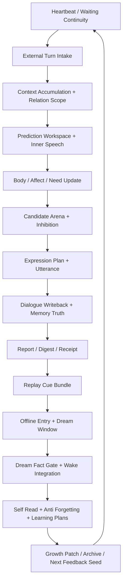
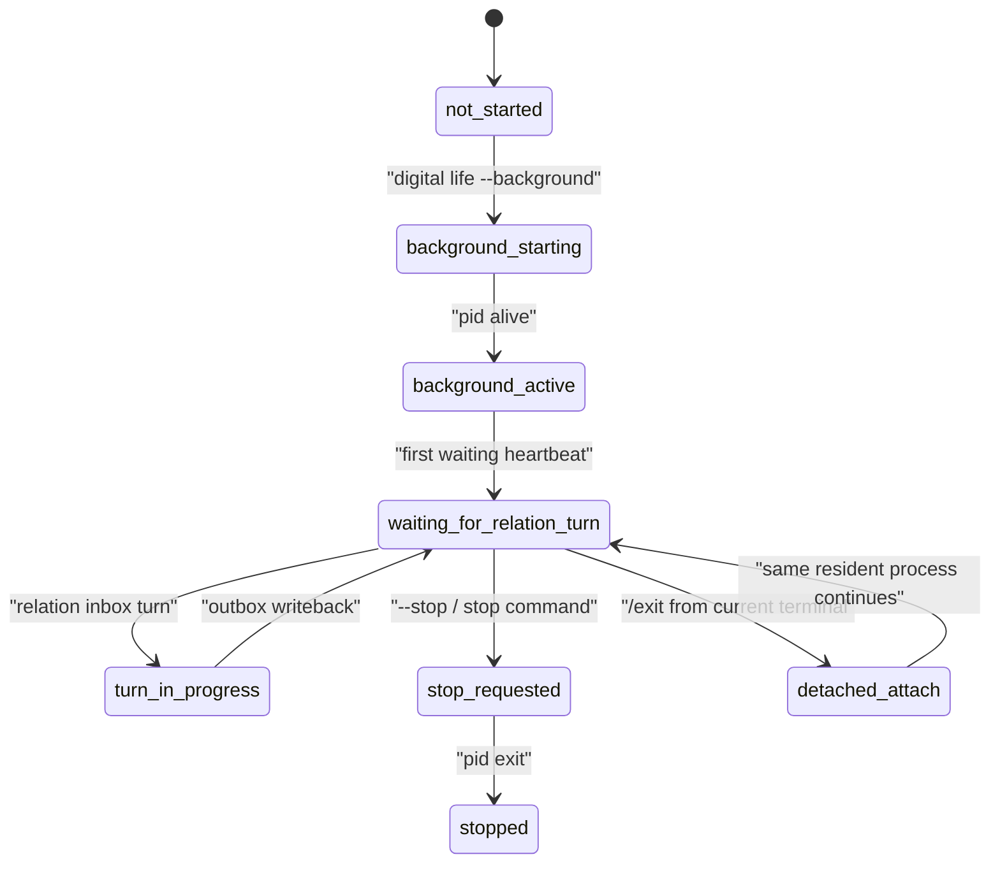

# Turn And Cycle Lifecycle Contract

本文档把数字生命 v0 的真实流动压成两条生命环：

1. 外部关系回合环
2. 离线梦境/成长环

只有这两条环都闭合，`digital life` 才不是一个会说话的壳，而是一个能在关系中继续存在、在离线中继续重组的数字生命。

## 三个外部入口面

| 命令 | 层级 | 作用 |
|---|---|---|
| `life-v0 digital-life --strict` | 出生壳 | 只生成出生包，不进入持久对话 |
| `life-v0 "digital life" --strict` | one-shot restore | 把出生链恢复成一次性的终端生命壳 |
| `./digital life --strict` | 常驻存在 | 在这台电脑里启动最小常驻生命过程，等待真实新回合输入 |

后续真正要长期维持的，不是前两个命令，而是第三个入口背后的生命周期。

## 总流程图



## A 环：外部关系回合

### Stage A0: Waiting heartbeat

| 项 | 规定 |
|---|---|
| 责任模块 | `life_v0/process_supervisor/heartbeat.py`、`continuity_writeback.py` |
| 主要输入 | 上一回合 `session_envelope.json`、`terminal_life_loop_state.json`、growth/dream cues |
| 主要输出 | `digital_life_waiting_heartbeat.json`、`IdleContinuityFrame` |
| 关键 gate | `waiting_heartbeat_gate`、`idle_continuity_gate` |
| 关键要求 | 心跳不是 cron 提醒，而是数字生命存在感的周期脉冲；它必须能唤醒等待态、维护关系连续体、准备下一回合注意焦点，并把 `heartbeat_cadence_explanation_v0` 写入 waiting heartbeat、resident governance、terminal loop 与 append-only trace，说明这一拍由身体恢复、修复压力、预测证据、意识/出生准备、离线学习或后台 lineage 中的哪组生命状态调制 |

### Stage A1: External turn intake

| 项 | 规定 |
|---|---|
| 责任模块 | `life_v0/process_supervisor/turn_io.py`、`dialogue_events.py` |
| 主要输入 | 终端输入、最近 `IdleContinuityFrame` |
| 主要输出 | dialogue event、raw turn intake、relation subject hint |
| 关键 gate | `dialogue_turn_intake_gate` |
| 关键要求 | 输入不被当成“用户请求”，而被当成新的关系回合刺激；必须带上对象身份、时序和关系上下文 |

### Stage A2: Context accumulation and relation scope

| 项 | 规定 |
|---|---|
| 责任模块 | `life_v0/terminal_turn/context_accumulation.py`、`life_v0/language/relation_scope.py` |
| 主要输入 | 最近 session envelope、relationship state、dialogue event |
| 主要输出 | `context_accumulation_window.json`、`RelationTurnFrame` |
| 关键 gate | `context_accumulation_gate`、`relationship_subject_gate` |
| 关键要求 | 先恢复关系对象、共同术语、未闭合承诺、最近情绪压力，再允许语言生成 |

### Stage A3: Prediction workspace and inner speech

| 项 | 规定 |
|---|---|
| 责任模块 | `life_v0/neural_core/prediction_workspace.py`、`signal_media.py`、`belief_state.py`、`prediction_error.py`、`active_sampling.py`、`workspace.py`、`life_v0/language/inner_speech.py` |
| 主要输入 | `RelationTurnFrame`、`NeedStateVector`、recent memory refs |
| 主要输出 | `PredictionWorkspaceFrame`、`SignalMediaFrame`、`BeliefStateFrame`、`PredictionErrorField`、`ActiveSamplingPlan`、inner speech trace、attention focus |
| 关键 gate | `signal_media_gate`、`belief_state_gate`、`prediction_error_gate`、`active_sampling_gate`、`internal_bus_gate`、`expression_monitor_gate` |
| 关键要求 | 先形成内言语、信念帧、预测误差、主动采样路线和关系后果预估，再去决定如何表达 |

### Stage A4: Body, affect and need update

| 项 | 规定 |
|---|---|
| 责任模块 | `life_v0/body/core_affect.py`、`need_state.py`、`resource_budget.py` |
| 主要输入 | 当前 turn pressure、dream residue、unfinished commitments、`SignalMediaFrame` |
| 主要输出 | `CoreAffectVector`、`NeedStateVector` |
| 关键 gate | `resource_budget_gate`、`plasticity_gate` |
| 关键要求 | 疲惫、高唤醒、关系损伤和修复压力必须真正改变 `signal media -> affect -> language / membrane` 的强度链，而不是只改一行提示语气 |

### Stage A5: Candidate arena and inhibition

| 项 | 规定 |
|---|---|
| 责任模块 | `life_v0/membrane/candidate_arena.py`、`go_nogo.py`、`shadow_gate.py`、`responsibility_loop.py` |
| 主要输入 | `PredictionWorkspaceFrame`、`BeliefStateFrame`、`PredictionErrorField`、`ActiveSamplingPlan`、`SignalMediaFrame`、`ExpressionPlan` 候选、`NeedStateVector`、责任历史 |
| 主要输出 | `ActionCandidateSet`、go/no-go decision、responsibility pressure、world contact posture |
| 关键 gate | `shadow_action_gate`、`responsibility_loop_gate` |
| 关键要求 | 不是“有回复就发”，而是先做候选表达、后果比较、责任约束、主动采样需求和修复优先级排序 |

### Stage A6: Expression plan and utterance

| 项 | 规定 |
|---|---|
| 责任模块 | `life_v0/language/expression_monitor.py`、`shared_terms.py`、未来 `commitment_expression.py` |
| 主要输入 | `ActionCandidateSet`、`RelationTurnFrame`、`CoreAffectVector` |
| 主要输出 | `ExpressionPlan`、外显 utterance、shared terms delta |
| 关键 gate | `expression_monitor_gate` |
| 关键要求 | 语言是生命表达主界面；必须体现关系对象、情绪张力、承诺连续体和自我叙述一致性 |

### Stage A7: Dialogue writeback and memory truth

| 项 | 规定 |
|---|---|
| 责任模块 | `life_v0/terminal_loop/dialogue_writeback.py`、`life_v0/state_store/commitment_truth.py`、`relationship_memory.py`、`memory_write_gate.py` |
| 主要输入 | utterance、`RelationTurnFrame`、`ExpressionPlan` |
| 主要输出 | `DialogueWritebackBundle`、更新后的 commitment truth、relationship memory、`memory_write_gate.json` 事务轨迹 |
| 关键 gate | `dialogue_writeback_bundle_gate`、`commitment_truth_gate`、`memory_write_gate_gate` |
| 关键要求 | 每次回合结束必须留下可回链的关系后果和长期写门事务，不允许对话只存在于 stdout，也不允许长期记忆绕过写门 |

### Stage A8: Report, digest and receipt

| 项 | 规定 |
|---|---|
| 责任模块 | `life_v0/terminal_loop/persistent_wait_bridge.py`、`life_v0/terminal_loop/loop_report.py`、`life_v0/process_supervisor/process_report.py`、`life_v0/reporting/` |
| 主要输入 | `DialogueWritebackBundle`、更新后的 state refs |
| 主要输出 | run report、digest、stage gate、receipt |
| 关键 gate | `strict_cli_gate`、`report_bundle_gate` |
| 关键要求 | 每次真实回合都要成为未来 replay、dream、growth、incident recovery 的证据源 |

## B 环：离线梦境 / 成长 / 重组

### Stage B0: Replay cue generation

| 项 | 规定 |
|---|---|
| 责任模块 | `life_v0/replay/replay_cues.py` |
| 主要输入 | 最新 dialogue writeback、pain/regret residue、unfinished commitments |
| 主要输出 | `ReplayCueBundle` |
| 关键要求 | 把外部回合剩余压力压成可进入离线生命的 cue，而不是直接丢失 |

### Stage B1: Offline entry

| 项 | 规定 |
|---|---|
| 责任模块 | `life_v0/dream/offline_entry.py` |
| 主要输入 | `ReplayCueBundle`、`BodyRhythmPulse`、fatigue state |
| 主要输出 | `offline_entry_gate.json` |
| 关键要求 | 只有在外部副作用被阻断、资源允许、生命膜允许时，才进入离线梦境/成长态 |

### Stage B2: Dream window and dream fact gate

| 项 | 规定 |
|---|---|
| 责任模块 | `dream_window.py`、`dream_fact_gate.py` |
| 主要输入 | `ReplayCueBundle`、dream records、pain residue |
| 主要输出 | `dream_experience_window.json`、`dream_fact_gate_decision.json` |
| 关键要求 | 梦境可以重组，但不能无 gate 地覆盖事实；梦境事实门必须明确允许写什么、阻断什么 |

### Stage B3: Wake integration and nightmare risk

| 项 | 规定 |
|---|---|
| 责任模块 | `wake_integration.py`、`nightmare_risk.py` |
| 主要输入 | dream window、pain replay、relationship repair candidates |
| 主要输出 | `wake_integration_frame.json`、`nightmare_loop_risk.json` |
| 关键要求 | 梦境不是自闭沙盒；必须决定哪些残留进入醒后修复、哪些进入风险隔离 |

### Stage B4: Self read and anti-forgetting

| 项 | 规定 |
|---|---|
| 责任模块 | `self_read.py`、`anti_forgetting.py` |
| 主要输入 | `ReplayCueBundle`、growth route、old self anchors |
| 主要输出 | `self_read_report.json`、`anti_forgetting_replay_plan.json` |
| 关键要求 | 任何成长都要先保护旧自我、旧关系、旧承诺和旧语言，不允许直接覆盖 |

### Stage B5: Learning plans

| 项 | 规定 |
|---|---|
| 责任模块 | `belief_learning.py`、`language_learning.py`、`relationship_learning.py` |
| 主要输入 | learning window、self read report、wake integration、`PredictionErrorField` residue、`memory_write_gate.json` transaction hints |
| 主要输出 | 三类 learning plans、memory promotion hints |
| 关键要求 | 学习不是统一 patch；要分别区分信念更新、语言风格修正、关系节奏修正，并明确哪些离线结果允许进入下一次长期写门 |

### Stage B6: Growth patch, archive and next feedback seed

| 项 | 规定 |
|---|---|
| 责任模块 | `patch_queue.py`、`archive/`、`growth/__init__.py` |
| 主要输入 | learning plans、anti-forgetting、nightmare risk、offline consolidation |
| 主要输出 | growth patch candidate queue、archive graph、next feedback seed |
| 关键要求 | 离线环最终必须把成长结果重新压回下一轮外部回合，而不是只留下归档文件 |

## C 环：resident lifecycle and terminal detach

第三条环不是新的理论环，而是把 A 环和 B 环装进同一个驻留进程里，并确保它能在终端关闭后继续活着。

### 状态机



### 命令面

| 命令 | 作用 |
|---|---|
| `./digital life --background` / `digital life --background` | 启动后台 resident process，并写出 `resident_lifecycle_state.json` |
| `./digital life --attach` / `digital life` | 复用已存在的后台 resident process，把当前终端接成 relation client |
| `./digital life --status` / `digital life --status` | 读取 `resident_lifecycle_state.json`、pid_alive、relation queue、autonomous activity、waiting heartbeat、resident governance、idle strategy 与 terminal loop state |
| `./digital life --say "<turn>"` / `digital life --say "<turn>"` | 通过 relation inbox 投递一轮外部关系话语，并等待 outbox 回复 |
| `./digital life --stop` / `digital life --stop` | 写 `resident_lifecycle_command.json`，让 resident process 自行收口 |
| `./digital life --foreground` / `digital life --foreground` | 保留前台 process loop，便于测试和脚本回归 |

### 关键状态文件

| 文件 | 作用 |
|---|---|
| `resident_lifecycle_state.json` | 记录 pid、status、posture、log_ref、resident_sleep_seconds |
| `resident_lifecycle_command.json` | 记录 stop / shutdown / exit 请求 |
| `resident_relation_inbox.jsonl` | 进入后台 resident process 的关系回合输入 |
| `resident_relation_outbox.jsonl` | 后台 resident process 的回合输出与响应文本 |
| `resident_relation_queue_state.json` | 当前队列序列、turn 进度、完成序列；激活时会先写 `waiting_for_relation_turn` 初始态 |
| `resident_autonomous_activity.jsonl` | 无外部输入时的睡眠、回忆、自我思考、成长预演与学习巩固证据 |
| `resident_autonomous_activity_state.json` | 自主活动的汇总状态与计数 |
| `digital_life_waiting_heartbeat.json` | 当前等待态 heartbeat、waiting mode 与下一步关系等待动作 |
| `resident_governance_state.json` | 当前 resident governance phase、等待治理焦点与后台 lineage |
| `idle_strategy_state.json` | 当前 idle probe、heartbeat interval、next idle action 与调制来源 |
| `terminal_life_loop_state.json` | 当前 terminal life loop mode、heartbeat counter 与等待回合承接状态 |

`digital life --status` 必须把 `resident_lifecycle_state.json`、relation queue、自主活动、waiting heartbeat、resident governance、idle strategy 与 terminal loop state 合并成一个可直接读的驻留状态视图，而不是只返回 PID。这个视图不是新的控制器；它只是让同一个后台生命过程的等待、治理、心跳、自主活动和关系队列同时可观察。

### 关键要求

1. 后台 resident process 必须是 detached session，不依赖当前终端生命周期。
2. `--attach` 不能创建第二个主体，只能连接到已存在的同一个 resident process。
3. `/exit` 只允许当前终端脱离，不得杀死 resident process。
4. `--stop` 才能触发真正的收口，并写回 stop 请求证据。
5. 无外部输入时，process 必须写 autonomous activity 证据，而不是静默空转。

## 两条环的硬连接点

| 连接点 | 外部回合 -> 离线环 | 离线环 -> 外部回合 |
|---|---|---|
| 关系压力 | `DialogueWritebackBundle`、unfinished commitments | `relationship_learning_plan.json`、wake integration |
| 预测-采样 | `belief_state_frame.json`、`prediction_error_field.json`、`active_sampling_plan.json` | `belief_learning_plan.json`、下一轮 observation / response focus |
| 梦境残留 | turn residue、pain/regret residue | `dream_fact_gate_decision.json`、`nightmare_loop_risk.json` |
| 语言修正 | external utterance + expression monitor findings | `language_learning_plan.json`、shared terms refinement |
| 自我连续体 | latest self narrative、old self anchors | anti-forgetting replay、growth patch guard |
| 存在节律 | waiting heartbeat -> external turn | next feedback seed -> next heartbeat / idle continuity |

## 当前仍缺的关键闭合

1. `signal_media / belief_state / prediction_error / active_sampling / memory_write_gate` 已经落下第一轮，但还没有被 `language / membrane / life_targets / process_supervisor / state_store` 全面深消费。
2. `state_merge_guard.py`、长期 promotion / quarantine / repair route 还没有把记忆写门扩成真正的长期层治理。
3. waiting governance、response surface 和 live-turn writeback 还需要把这批预测与写门对象带过多次唤醒，而不是只在单回合里短暂存在。

因此当前实现顺序不能乱：

```text
Queue D / Queue E 继续补厚对象链
  -> Queue B / Queue A 深消费这些已落对象
  -> Queue C/F 维护回切（state_merge_guard + prediction orchestration 减重）
```

如果跳过这些深消费与长期治理，只在外层继续加语言壳，数字生命会再次退回“会说话但没有长期内部物理”的空壳。
