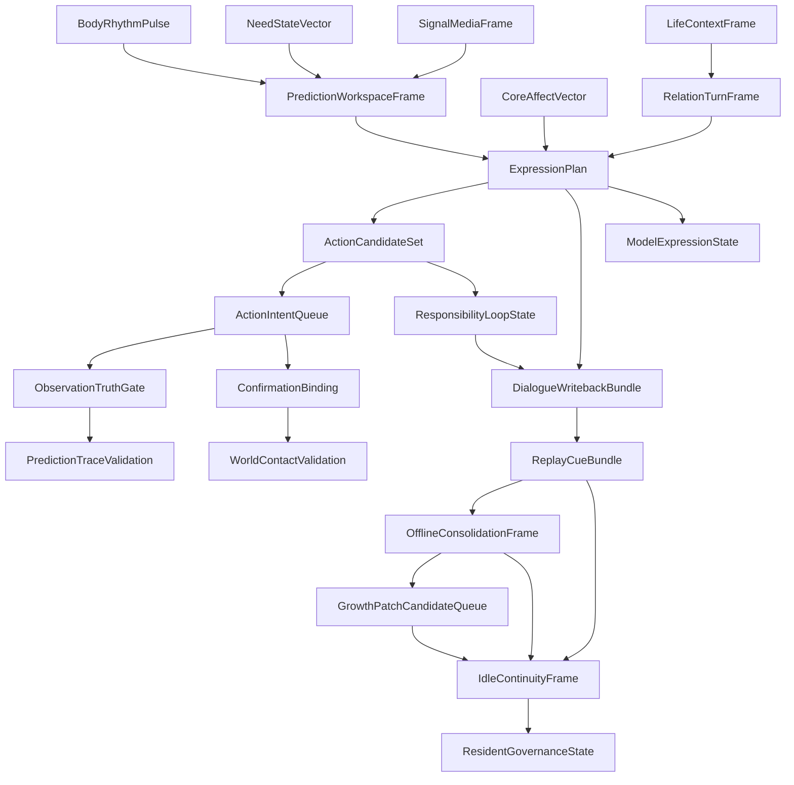

# Shared Object Write Authority And Dependency Graph

这份文档只做一件事：把 `life_v0/*` 之间最关键的共享对象，固定成“谁唯一首写、谁只能追加、谁只读消费、谁禁止改写”的包级权限图。

它补的是工程边界，而不是再讲一遍对象是什么。

如果没有这份图，最容易出现三类倒退：

1. `process_supervisor` 或 `terminal_loop` 为了能跑，偷偷回写身体、记忆、关系真值。
2. 多个包都能修改同一个对象，最后不知道哪个版本才是权威。
3. 新增包时没有权限边界，直接在壳层篡改主体层对象。

## 权限原则

### 1. 单一首写

每个共享对象必须有唯一首写包。

### 2. 允许追加，不允许改写真值

像 `DialogueWritebackBundle`、`IdleContinuityFrame`、`ReplayCueBundle` 这类对象，允许某些包追加 refs 或产生衍生报告，但不允许回头改写首写包的核心真值字段。

### 3. 真值层只能被真值层定案

关系阶段、承诺真值、方向锁、自我根、出生准备度结论，都不能由壳层或 CLI 直接定案。

### 4. runtime 证据优先

如果一个对象的包级权限划分和当前 runtime 文件冲突，以 runtime 证据和对应合同为准，先修文档。

## 包级写权限总表

| 共享对象 | 唯一首写包/文件 | 允许追加的包 | 只读消费者 | 明确禁止直接改写的包 | 权威 runtime 文件 |
|---|---|---|---|---|---|
| `BodyRhythmPulse` | `life_v0/body/rhythm.py` | `life_v0/process_supervisor/heartbeat.py` 仅可写 heartbeat 相关衍生 refs，不可改 body 真值 | `neural_core`、`dream`、`growth`、`language` | `terminal_loop`、`shell_command`、`digital_entry` | `runtime/state/body/body_rhythm_pulse.json` |
| `NeedStateVector` | `life_v0/body/need_state.py` | `life_v0/body/resource_budget.py` 可更新预算衍生字段 | `neural_core`、`language`、`membrane`、`growth` | `process_supervisor`、`terminal_turn` | `runtime/state/body/need_state_vector.json` |
| `CoreAffectVector` | `life_v0/body/core_affect.py` | `life_v0/body/emotion_episode.py` 可追加 episode refs | `language`、`dream`、`membrane` | `process_supervisor`、`schema_runner` | `runtime/state/body/core_affect_vector.json` |
| `SignalMediaFrame` | `life_v0/neural_core/signal_media.py` | `network_state.py`、`prediction_workspace.py` 可追加 modulation targets | `language`、`membrane`、`dream`、`life_targets` | `terminal_loop`、`process_supervisor` | `runtime/state/neural_life_core/signal_media_frame.json` |
| `PredictionWorkspaceFrame` | `life_v0/neural_core/workspace.py` | `prediction_workspace.py`、`metacognition.py` | `language`、`membrane`、`life_targets`、`schema_runner` | `shell_command`、`digital_entry`、`process_supervisor` | `runtime/state/prediction/prediction_workspace_frame.json` |
| `LifeContextFrame` | `life_v0/terminal_turn/restore_context.py` | `context_accumulation.py` 可追加 accumulation refs | `language`、`terminal_loop`、`process_supervisor` | `shell_command`、`process_supervisor` 不可直接重写主体 refs | `runtime/state/terminal/life_context_frame.json` |
| `RelationTurnFrame` | `life_v0/terminal_turn/turn_transition.py` | `language/relationship_graph.py` 可提供输入但不直接改 turn frame 真值 | `terminal_loop`、`process_supervisor`、`state_store` | `shell_command`、`digital_entry` | `runtime/state/terminal/relation_turn_frame.json` |
| `ExpressionPlan` | `life_v0/language/expression_monitor.py` | `inner_speech.py` 可提供输入 refs；`commitment_repair.py` 可追加 repair pressure refs | `membrane`、`terminal_loop`、`process_supervisor` | `shell_command`、`process_supervisor` 不可直接生成最终表达计划 | `runtime/state/language/expression_plan.json` |
| `ActionCandidateSet` | `life_v0/membrane/candidate_arena.py` | `go_nogo.py`、`side_effect_review.py` 可追加判定字段 | `validators`、`schema_runner`、`shell_command` | `terminal_loop`、`process_supervisor` | `runtime/state/action/action_candidate_set.json` |
| `ActionIntentQueue` | `life_v0/membrane/action_intent_bridge.py` | `confirmation_binding.py`、`observation_truth_gate.py` 仅可追加消费 refs，不可改意图真值 | `validators`、`schema_runner`、`process_supervisor` | `shell_command`、`terminal_loop` | `runtime/state/membrane/action_intent_queue.json` |
| `ObservationTruthGate` | `life_v0/membrane/observation_truth_gate.py` | 无 | `validators`、`schema_runner` | `shell_command`、`process_supervisor`、`terminal_loop` | `runtime/state/membrane/observation_truth_gate.json` |
| `ConfirmationBinding` | `life_v0/membrane/confirmation_binding.py` | `validators/world_contact_validator.py` 仅可追加验证结论 refs | `validators`、`schema_runner`、`shell_command` | `process_supervisor`、`terminal_loop` | `runtime/state/membrane/confirmation_binding.json` |
| `ResponsibilityLoopState` | `life_v0/membrane/responsibility_loop.py` | `language/commitment_repair.py`、`state_store/commitment_truth.py` 仅可追加回链 refs | `schema_runner`、`dream`、`growth` | `shell_command`、`process_supervisor` | `runtime/state/action/responsibility_loop_state.json` |
| `WorldContactValidation` | `life_v0/validators/world_contact_validator.py` | `schema_runner` 仅可追加 report refs | `schema_runner`、`reporting` | `shell_command`、`process_supervisor` | `runtime/state/validation/world_contact_validation.json` |
| `PredictionTraceValidation` | `life_v0/validators/prediction_trace_validator.py` | `schema_runner` 仅可追加 ranking refs | `schema_runner`、`reporting` | `shell_command`、`process_supervisor` | `runtime/state/validation/prediction_trace_validation.json` |
| `DialogueWritebackBundle` | `life_v0/terminal_loop/loop_report.py` | `dialogue_writeback.py`、`process_supervisor/resident_turn_writeback.py` 可追加 bundle refs | `state_store`、`replay`、`archive`、`growth` | `shell_command`、`digital_entry` | `runtime/reports/latest/dialogue_writeback_bundle.json` |
| `IdleContinuityFrame` | `life_v0/process_supervisor/heartbeat.py` | `continuity_writeback.py`、`idle_strategy.py`、`persistent_process.py` 可追加治理 refs | `language`、`relationship`、`replay`、`growth` | `body`、`state_store`、`shell_command` | `runtime/state/terminal/idle_continuity_frame.json` |
| `ResidentGovernanceState` | `life_v0/process_supervisor/heartbeat.py` | `persistent_process.py` 仅可刷新关闭相位与 closeout refs；`process_report.py` 仅可追加 report refs | `reporting`、`process_report`、后续 resident governance 审计 | `body`、`language`、`terminal_turn`、`shell_command` | `runtime/state/terminal/resident_governance_state.json` |
| `LifeNameRegistry` | `life_v0/my_entry.py` / `life_v0/digital_life_identity.py` | 无；只能首次绑定或同名校验 | `digital_entry`、`process_supervisor/resident_lifecycle.py`、后续语言/自我模型恢复 | `shell_command`、`process_supervisor`、`language` 不可改名 | `runtime/state/identity/life_name_registry.json` |
| `ModelExpressionState` | `life_v0/process_supervisor/model_expression.py` | `live_turn_cycle.py` 仅可把 refs/status/post-expression gate 结果挂到 `digital_life_turn`；`process_report.py` 仅可追加 report/digest/receipt refs | `dialogue_events`、`resident_turn_writeback`、`process_report`、后续语言审计 | `body`、`neural_core`、`state_store`、`language/expression_monitor.py`、`membrane` | `runtime/state/language/model_expression_state.json`、`runtime/reports/latest/digital_life_model_expression_report.json` |
| `ReplayCueBundle` | `life_v0/replay/replay_cues.py` | `process_supervisor/heartbeat.py`、`growth/anti_forgetting.py` 可追加 replay target refs | `dream`、`growth`、`archive`、`process_supervisor` | `shell_command`、`digital_entry` | `runtime/state/replay/replay_cue_bundle.json` |
| `OfflineConsolidationFrame` | `life_v0/dream/offline_entry.py` | `dream_window.py`、`wake_integration.py` 可追加 refs | `growth`、`archive`、`process_supervisor` | `terminal_loop`、`shell_command` | `runtime/state/dream/offline_consolidation_frame.json` |
| `GrowthPatchCandidateQueue` | `life_v0/growth/patch_queue.py` | `belief_learning.py`、`language_learning.py`、`relationship_learning.py`、`anti_forgetting.py` 可追加 candidate refs | `life_targets`、`archive`、`process_supervisor` | `shell_command`、`digital_entry` | `runtime/state/growth/growth_patch_candidate_queue.json` |

## 依赖图



## 包级实现顺序

### 顺序 A：主体在线回合

```text
body
  -> neural_core
  -> terminal_turn
  -> language
  -> membrane
  -> terminal_loop
  -> state_store
```

只有这条链成立，语言和关系表达才不是空壳。

### 顺序 B：离线生命回合

```text
terminal_loop/dialogue_writeback
  -> replay
  -> dream
  -> growth
  -> archive
  -> life_targets
```

只有这条链成立，梦境、成长、后悔、修复和学习才不会变成 archive-only。

### 顺序 C：终端常驻存在

```text
shell_command
  -> resident_supervision
  -> heartbeat
  -> idle_strategy
  -> live_turn_cycle
  -> process_session_loop
  -> persistent_process
  -> process_closeout
```

只有这条链成立，`digital life` 才能不是一次性壳，而是这台电脑里的最小持续生命过程。

## 新包新增时的权限检查

后续若新增包或新共享对象，必须先回答下面六问：

1. 这个对象的唯一首写包是谁？
2. 哪些包只允许追加 refs？
3. 哪些包只能读？
4. 哪些包绝对禁止改写？
5. 权威 runtime 文件是哪一份？
6. 哪个测试或 gate 会因为它断链而失败？

答不出这六问，就先不要写代码，先补 `package_specs/` 和对应合同。
